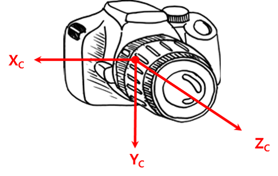

#
## Local Featrue
### Local Image Features
- 이미지의 interesting 한 부분
- 많은 computer vision 알고리즘의 시작

 
 

### Local Image Feature 들의 활용
- Image representation
    - local feature들을 모아 image-level descriptor 생성
    - Object appearance modeling
        - Pose 변화에 민감하지 않고, 부분적인 occlusion에 강함
- Multiple views 사이의 matching을 찾음
    - Stereo matching
    - 3D reconstruction
    - Image stitching

 
 

### Good Local Featue
- Texture less 한 영역이나 line만 존재하는 영역보다 corner나 boundary 영역이 명확한 부분이 더 좋음
- 좋은 local visual feature가 되기 위한 조건
    1. Saliency
        - Feature는 이미지의 interesting 한 부분이 포함되어야 함
    2. Locality
        - 

 
 

## Model Fitting

## Coordinate System (좌표계)
영상 geometry에서는 크게 4가지 좌표계 존재

 
 

 

<a href="https://darkpgmr.tistory.com/77?category=460965">출처</a>

 

### 1. 월드 좌표계 (World Coordinate System)
- 우리가 살고 있는 공간의 한 지점을 기준으로 한 좌표계
    - 문제에 따라서 임의로 잡아 사용할 수 있는 좌표계
    - 방의 모서리 한 쪽을 원점으로 잡고 한쪽 벽면을 X축, 다른 쪽 벽면을 Y축, 또 다른 하늘을 바라보는 방향을 Z축이라고 정하면 한 점이 어떤 위치인지는 그 정의 내에서는 유일하게 결정

 

$$P=(X,Y,Z)$$

 
 

### 2. 카메라 좌표계 (Camera Coordinate System)
- 카메라를 기준으로 한 좌표계
- 카메라의 초점(렌즈의 중심)을 원점, 광학축 방향을 Z축, 카메라의 아래쪽 방향을 Y, 오른쪽방향을 X축으로 잡음

 

 

$$P_{C}=(X_{C},Y_{C},Z_{C})$$

 
 

### 3. 영상 좌표계 (Image Coordinate System)
- 위의 그림에서 편의상 픽셀 좌표계 (Pixel Image Coordinate System) 라고 부름
- 위의 좌표계 그림과 같이 이미지 왼쪽 상단을 원점, 오른쪽 방향을 x 축 증가, 아래쪽 방향을 y축 증가 방향으로 설정
- 영상 좌표계의 x축, y축에 의해 결정되는 평면을 이미지 평면이라 함

 

$$p_{img}=(x,y)$$

 

- 3D 공간상의 한 점 $P=(X,Y,Z)$는 카메라의 초점 (또는 렌즈의 초점)을 지나서 이미지 평면의 한 점 $p_{img}=(x,y)$에 투영
- 점 $P$와 점 $p_{img}$를 잇는 선상에 있는 모든 3D 점들은 모두 $p_{img}$로 투영
- 3D 점 $P$로부터 $p_{img}$은 유일하게 결정할 수 있지만, 영상 픽셀 $p_{img}$로부터 $P$를 구하는 것은 부가 정보 없이 불가능

 
 

### 4. 정규 이미지 좌표계 (Normalized Image Coordinate System)
- 1~3 좌표계는 모두 매우 직관적인 좌표계이지만 정규 좌표계는 편의상 도입된 가상의 좌표계
- 카메라 내부 파라미터에 대한 영향을 제거한 이미지 좌표계
- 좌표계의 단위를 없애 정규화 된 좌표계이며 **카메라 초점과의 거리가 1**인 가상의 이미지 평면을 정의하는 좌표계
    - 원래 이미지 평면을 평행이동하여 카메라 초점과의 거리가 1인 지점으로 옮겨놓은 이미지 평면
 

$$p'=(u,v)$$

- 정규 이미지 좌표계의 원점은 정규 이미지 평면의 중점($Z_{C}$와의 교점)

 
 

## Homogeneous Coordinates
- n차원 사영 공간을 n+1개의 좌표로 나타내는 좌표계
- 임의의 0이 아닌 상수 $w$에 대하여 $(x, y)$를 $(wx, wy, w)$ 로 표현한 것  
    - 쉽게 말하자면 $(x, y)$를 $(x, y, 1)$로 표현한 것
- Homogeneous 좌표계에서 scale은 무시되며 $(x, y)$에 대한 homogeneous 좌표 표현은 무한히 많이 존재 
- Homogeneous 좌표계에서 원래의 좌표를 구하려면 끝 자리가 1이 되도록 scale을 바꾼 후 1 제거
    - $(x, y, \alpha) \rightarrow (\frac{x}{\alpha}, \frac{y}{\alpha}, 1) \rightarrow (\frac{x}{\alpha}, \frac{y}{\alpha})$
- 컴퓨터 그래픽스, 3D vision에서 많이 사용
    - Affine 변환이나 perspective (projective) 변환을 단일 행렬로 표현 가능하기 때문
- 우리가 흔하게 사용하는 기하학은 Euclidean geometry이고 Cartesian coordinate system (직교 좌표계) 사용
- Projective geometry (사영, 투영 기하학)에서 사용하는 좌표가 Homogeneous 좌표계
    - 다른 말로 Projective 좌표계라고도 함
    - 우리가 카메라로 얻은 영상이나 이미지는 3차원 공간에 있는 점들을 이미지 평면에 projection 시킨 것!
    - 카메라 초점과 투영된 점을 연결하면 하나의 킨 투영선(projection ray) 가 나오는데 이 선 상의 모든 점들은 모두 동일한 한 점으로 투영
    - 즉, 이미지 평면상의 한 점에 대한 homogeneous 좌표라는 것은 이 점으로 투영되는 (ray 상의) 모든 점들을 한꺼번에 표현하는 방법
- $w$가 0인 경우는 벡터, $w$가 1인 경우는 점 