## Basic
### AI acceleration

 

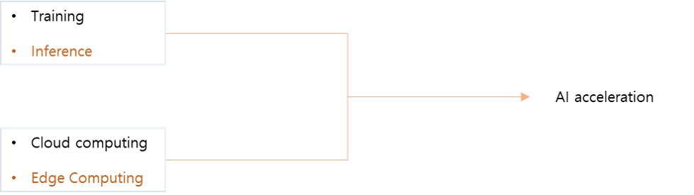

 

- 예전에는 학습과 이를 위한 clouding computing에 대한 연구가 주로 이루어짐
- 2년전부터 학습시킨 모델을 적용을 잘 시키기 위한 Inference와 이를 위한 edge computing에 대한 연구가 활발하게 진행
- Inference와 Edge computing에 초점을 맞춰 AI의 실행 속도를 가속화 시킬 것인지에 대한 연구가 AI acceleration
- AI acceleration
    - Compression
    - Quantization
    - 등등..

 
 

### Floating Point Number vs. Fixed Point Number
Fixed Point (고정 소수점)
-  정수를 표현하는 비트와 소수를 표현하는 비트수를 미리 정하고 해당 비트만을 활용하여 실수 표현

 

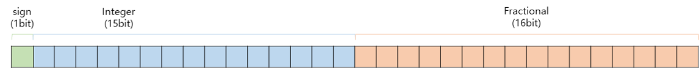

 

- 예시

 

$${7.625}_{10}={111.101}_{2}$$

 

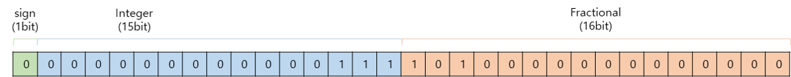

 

Floating Point (부동 소수점)
- 고정 소수점 방식과 비트를 사용하는 체계가 다르며 이를 표현하는 다양한 체계 존재
    - 일반적으로 IEEE 754 방식을 많이 사용 

 

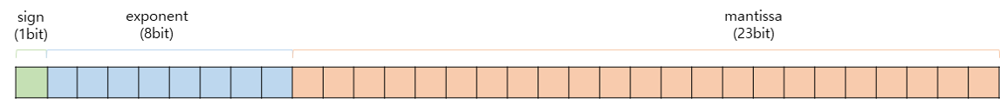

 

- 예시
    - 이진수 변환 : ${7.625}_{10}={111.101}_{2} $
    - 정규화 : ${1.11101}_{2}\times2^{2} $
    - Exponent : $2_{10}+127_{10} (bias)=129_{10}=10000001_{2}$
    - Mantissa : $11101_{2}$

 

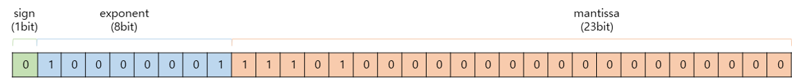

 
 

### Quantization (양자화)
- 양자화 기법은 32bit floating point 기반의 학습 파라미터들을 이보다 낮은 비트 폭(비트 너비, 비트 수)로 표현하기 위해 사용
- 보통 deep learning에서 양자화는 32bit floating point 에서 8bit integer로 맵핑하는 것을 의미 

 

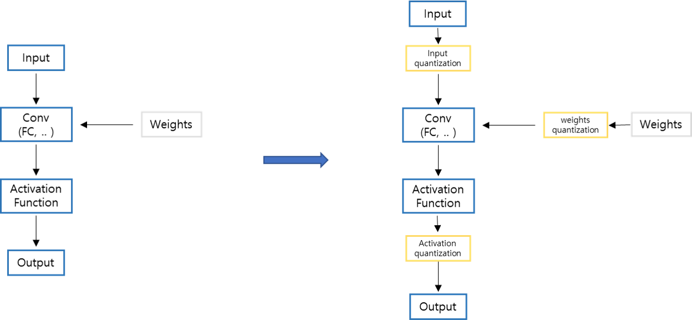

 

- 양자화를 수행하는 대상은 모델의 가중치(weight), 활성화 출력(activation), 그리고 기울기(gradient) 모두가 해당 가능
- 기울기의 경우 분포가 매우 극단적일 수 있고 양자화 오류로 인해 학습 중 파라미터의 값들이 수렴이 안되는 문제로 양자화 대상으로 크게 고려되고 있지는 않음 

Dynamic Range
-  숫자의 표현 범위를 의미

Precision / Resolution
- 범위 내에서 얼마나 세밀하게 숫자를 나눠서 표현하는지 

 
 

# A Survey of Quantization Methods for Efficient Neural Network Inference
## Ⅲ Basic Conceopts of Quantization
### A. Problem Setup and Notations

 
 

### B. Uniform Quantization

 

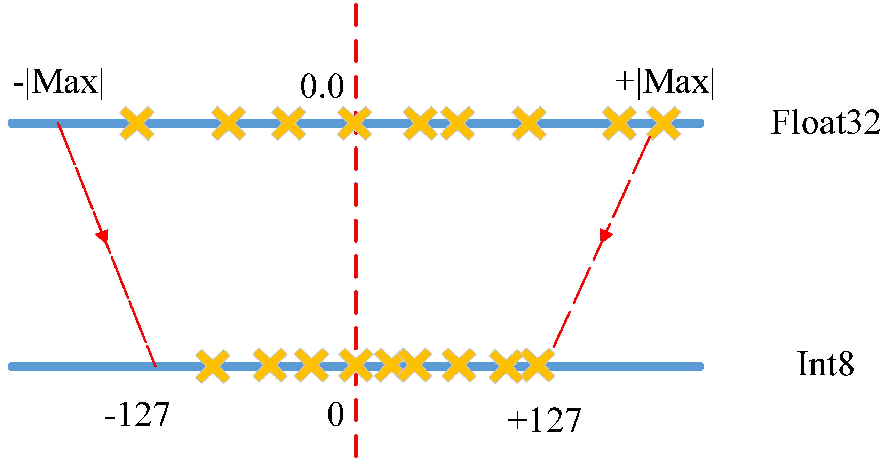

 

- NN (Neural Network)의 가중치와 활성화 출력인 floating point 값을 작은 precision 범위로 맵핑시키는 함수를 정의하는 것이 우선
- 가장 보편적인 quantization 식은 아래와 같음 

 

$$Q(r)=Int(r/S)-Z$$
$$Q : Quantization \ operator$$
$$r : real \ valued \ input \ (weights \ or \ activations)$$
$$S : scaling \ factor$$
$$X : integer \ zero \ point$$

 

- $Int$ 함수는 rounding operation을 통해 실수 값을 정수값으로 변환
    - 가장 가까운 정수의 값으로 할당 또는 truncation, ... 
- $Z$는 영점(0)을 의미하는데 실수 0에 맵핑이 되는 정수의 값

 

*cf*
- 논문에 나와있지는 않지만 위의 과정을 거친 후 $Clip$ 과정이 필요한 경우도 존재

 

$$Q(r)=Clip(Int(r/S)-Z)$$

 

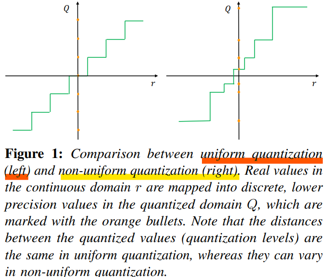

 

- 이 방법은 **uniform quantization**
    - 실수와 정수간의 맵핑을 만들 때 각 구간, 즉 양자화 레벨을 균등하게 나눔
- 비 균등하게 나누는 방법을 **non-uniform quantization**이라고 함
- 이 방법은 양자화 된 값 $Q(r)$에서 실수값 $r$로 값을 다시 변환 가능하고 이를 **dequantization** 이라 함

 

$$\widetilde{r}=S\left (Q(r)+Z\right )$$

 

- $\widetilde{r}$ 은 rounding operation 때문에 $r$과 같지 않을 수도 있음

 
 

### C. Symmetric and Asymmetric Quantization
- Uniform quantization의 가장 중요한 요소는 scaling factor인 $S$를 선택하는 것

 

$$S=\frac{\beta-\alpha}{2^{b}-1}$$

$$[\alpha, \beta] : clipping \ range$$

$$b : quantization \ bit \ width$$

 

$$Z=-round(\frac{\alpha}{S})-2^{b-1}$$

 

- 가장 먼저 $[\alpha, \beta]$ 의 범위를 결정해야 하는데 이 과정을 **calibration** 이라고 하기도 함

 

- $[\alpha, \beta]$은 칩이 ARM인지 Intel 계열인지에 따라 다름
    - ARM : MinMax 이용
    - Intel : Histogram 이용 
- MinMax에서 $[\alpha, \beta]=[r_{min}, r_{max}]$ 이고 이는 **asymmetric quantization** 영역
    - **Asymmetric quantization**는 $-\alpha\neq\beta$ 인 경우
    - **Symmetric quantization**은 $-\alpha=\beta$ 인 경우

 

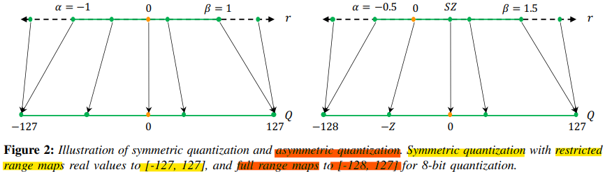

 

- MinMax 에시
    - FP32 -> INT8로 변환

     

    
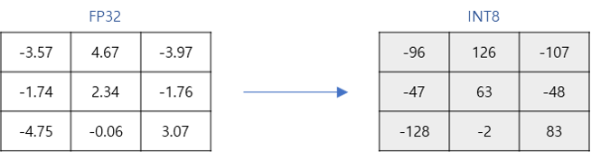

     

    - Min = -4.75, Max = 4.67

    $$S=\frac{\beta-\alpha}{2^{b}-1}=\frac{4.67-(-4.75)}{256-1}=\frac{9.42}{255}=0.037$$

    $$Z=-round(\frac{\alpha}{S})-2^{b-1}=-round(\frac{-4.75}{0.037})-2^{7}=-round(-128.38)-128=128-128=0$$

    $$Q(-3.57)=Int(-3.57/0.037)-0=-96$$

 

- MinMax를 이용하여 symmetric quantization 적용 가능
    - $-\alpha=\beta=\max(\left| r_{max}\right|, \left| r_{min}\right|)$ 
- Asymmetric quantization은 symmetric 과 비교하여 더 타이트한 clipping range를 가지게 됨
- 이는 양자화하고자 하는 가중치나 activation들이 불균형 할 때 중요함
    - activation ReLU를 통과한 값은 언제나 양수의 값을 가짐 
- 하지만 $Z=0$가 되므로 symmetric을 이용할 때는 식이 간단해 질 수 있음

 

$$Q(r)=Int(\frac{r}{S})$$

 

- Scaling factor를 결정하는 2가지 선택
    - **Full range** 
        - floor rounding mode : $S=\frac{2max(|r|)}{2^{n}-1}$
        - INT8 range  : $[-128, 127]$

    - **Restricted range**
        - $S=\frac{max(|r)}{2^{n-1}-1}$
        - INT8 range : $[-127, 127]$

- Full range가 더 정확

 

- Symmetric quantization가 실제로 더 많이 사용됨
    - $Z=0$이 되어서 추론하는 동안 계산 비용이 줄어듦
    - 더 직관적으로 적용이 가능

 

- MinMax를 이용하여 symmetric, asymmetric quantization을 진행하는 것은 매우 많이 사용하는 방법
- 하지만 이는 데이터의 이상치에 매우 민감
    - 불필요하게 범위를 늘리고 그 결과로 quantization의 resolution이 감소
- 이를 해결할 방법은 MinMax 대신 percentile을 사용하는 것 
    - 즉, 가장 큰 수 대신 i번째로 큰/작은 수를 $\beta, \alpha$ 로 사용 
- 또는 실수 값과 양자화된 값 사이의 information loss 등의 KL divergence를 최소화하는 $\alpha$와 $\beta$를 선택하는 방법 이용

 

**Summary (Symmetric vs Asymmetric Quantization)**
- Symmetric quantization은 symmetric range를 사용하여 clipping 분할
- $Z=0$ 이기 때문에 쉽게 계산과 적용 가능
- 범위가 왜곡되거나 symmetric 하지 않은 경우에서는 좋은 성능을 내지 못함
- 이런 경우에는 asymmetric quantization 사용

 
 

### D. Range Calibration Algorithms : Static vs Dynamic Quantization
- Quantization 방법을 나누는 다른 방법은 **언제** clipping range를 결정하는지
    - **Static quantization**
        - 모델의 가중치와 활성화 출력 모두 양자화 사전에 진행
        - 즉, clipping range가 사전에 미리 계산이 되어있고 추론 시에 고정된 값으로 사용되는 방법
        - 샘플 입력 데이터를 준비하여 clipping range를 정함
    - **Dynamic quantization**
        - 모델의 가중치값들은 pretrained 되어 정해진 값
        - 모델의 가중치에 대해서만 양자화 진행
        - 활성화 출력은 추론할 때 동적으로 양자화
            - 활성화 출력은 메모리에 32bit floating point로 read, write
            - 추론할 때
- 이 range는 가중치에 대해서는 정적으로 계산이 되고 파라미터들은 추론하는 동안 보통 고정됨

 

 

- Dynamic quantization에서 런타임동안 각 activation map의 clipping range는 
- 이 방식은 실시간 신호 통계의 계산이 필요하며 이는 매우 큰 오버헤드를 가짐 
- 하지만 dynamic quantization은 각 input마다 정확한 signal range를 계산하므로 더 높은 정확도를

 

- d이

 

**Summary (Dynamic vs Static Quantization)**
- Dynamic quantization은 동적으로 각 activation의 clipping range를 계산하여 대체로 높은 정확도를 얻음
- 하지만 신호를 동적으로 계산하는 것은 매우 비용이 비싸기 때문에 주로 clipping range가 모든 입력에서 고정된 static quantization을 사용 

 
 

### E. Quantization Granularity
- 대부분의 computer vision에서, 하나의 layer로 들어가는 activation input은 많은 다양한 필터들과 convolution 연산을 진행

 

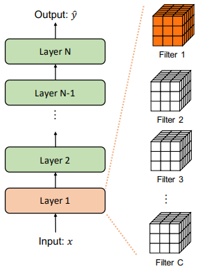

 

- 각 convolution filter 다른 범위의 값들을 가지고 있음
- 가중치 (weights)에 대해 clipping 범위를 계산을 어느 세부 수준에서 계산할 것인가에 대하여 quantization 방법을 나눌 수 있음
    - **Layerwise Quantization** 
    - **Groupwise Quantization**

 

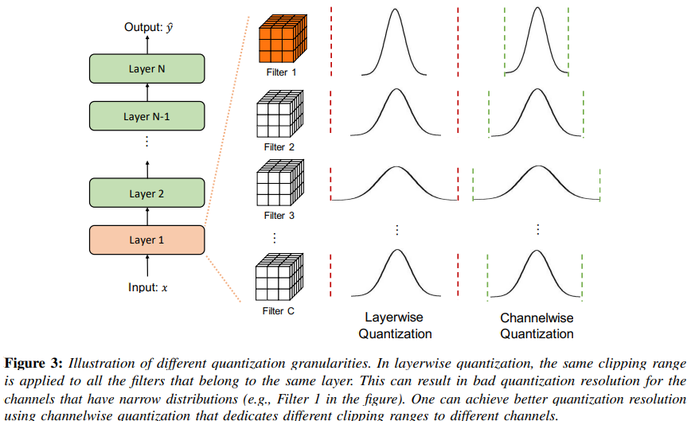

 

#### a) Layerwise Quantization
- 한 layer의 모든 convolution filter들의 가중치를 고려하여 clipping range를 고려
- 한 layer의 모든 filter들에 같은 clipping range 적용
- 이 방법은 적용하기에는 매우 쉽지만, 각 filter들의 분포가 다양하기 때문에 정확도가 높지 않음
- 한 convolution filter가 상대적으로 작은 범위의 파라미터를 가진다면, quantization resolution을 손실 할 수 있음 (다른 filter는 상대적으로 큰 값을 가짐)

 

#### b) Groupwise Quantization
- 한 layer 안에서 여러 개의 서로 다른 channel들을 그룹화하여 clipping range를 계산 가능 
- 이 방법은 하나의 convolution/activation에 걸쳐 파라미터의 분포가 많이 달라지는 경우에 유용
- 하지만 다른 scaling factor를 계산해야 한다는 단점 존재

 

#### c) Channelwise Quantization
- 보편적으로 가장 많이 사용하는 방법
- 다른 채널들에 독립적으로 각 convolution filter가 고정된 clipping range를 가짐
    - 즉, 각 channel이 섬세한 scaling factor를 가지게 됨
- 이로 인해 quantization resolution이 더 좋아지고 높은 정확도 얻는 것이 가능

 

#### d) Sub-channelwise Quantization
- 이전 방법들은 convolution 또는 fully-connected layer의 파라미터들의 그룹 단위로 clipping range가 정해짐
- 하나의 convolution 이나 fully-connected layer들을 처리할 때 다른 scaling factor들을 고려해야하므로 상당한 오버헤드 존재
- 그러므로 groupwise 가 quantization resolution과 computation overhead 사이의 좋은 타협점을 제시함

 

**Summary(Quantization Granularity)**
- Channelwise Quantization는 convolution filter에 가장 많이 사용되는 표준 방법
- 이는 각 convolution filter 마다 다른 clipping range를 가지는데 이 때 발생하는 overhead는 무시할 만 함
- Sub-channelwise quantization은 상당히 많은 overhead가 발생하기 때문에 이는 표준의 방법이라고 볼 수 없음 

 

#### F. Non-Uniform Quantization

 

 

- Quantization step이나 quantization level이 균등하지 않게 존재

 

$$Q(r)=X_{i}, \ \  if \ r \in [\Delta_{i}, \Delta_{i+1})$$

$$r : 실수$$

$$X_{i} : discrete\ quantization \ level$$

$$\Delta_{i} : quantization \ steps$$

$$Q : quantizer$$

 

- $X_{i}$와 $\Delta_{i}$ 둘 다 일정하지 않은 간격으로 존재

 

- Non-uniform quantization은 고정된 bit 길이에서 더 좋은 정확도를 얻음 
    - 중요한 가치가 있는 영역에 집중하거나 적절한 동적 범위를 찾아 더 좋은 분포를 찾게 해줌 
- 전형적인 규칙기반의 non-uniform quantization은 logarithmic 분포를 이용 
    - Quantization step과 level이 선형적이 아닌 지수적으로 증가 
- 또다른 방법은 binary-code-base quantization  

**Summary (Uniform vs Non-uniform Quantization)**
- 일반적으로 non-uniform quantizatoin이 많은 신호 정보를 알 수 있음 
- 하지만 non-uniform quantization을 GPU와 CPU와 같은 하드웨어에 효과적으로 적용 할 수 없음
- Uniform quantization이 간단하고 효과적으로 하드웨어에 맵핑되기 때문에 현재 훨씬 더 잘 사용됨

 

#### G.Fine-tuning Method
- NN의 파라미터들을 quantization 한 후 조정한는 경우도 존재
    - **QAT(Quantization Aware Training)**
        - 모델 재학습
    - **PTQ(Post-Training Quantization)**
        - 모델 재학습 없음

 

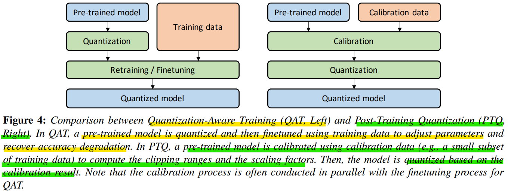

 

**1) Quantization-Aware Training**
- 학습된 모델이 있을 때, 양자화를 시키면 학습된 모델의 파라미터에 변화가 생길 수 있음 
- 그러면 floating point precision으로 학습된 모델이 수렴되었을 때의 결과와 달라질 수 있음
- 즉, floating point precision으로 최적으로 학습한 결과보다 양자화를 한 경우 성능이 떨어질 수 있음
- 이 문제점은 양자화된 NN의 파라미터들을 재학습하며 loss를 줄여주면 됨
- 그 중 가장 유명한 방법은 QAT(Quantization-Aware Training)
- Floating point에서 양자화 한 모델에 forward, backward pass가 진행
- 모델의 parameter는 각 기울기 업데이트 후에 양자화 
- 특히 가중치 업데이트가 부동 소수점 정밀도로 수행된 후 projection을 수행하는 것이 중요
    - 양자회된 precision으로 기울기를 계속 구하다보면 기울기가 0이 되거나 높은 error를 가지게 됨

 

- Backpropagation을 진행할 때 가장 중요한 문제는 어떻게 미분 불가능한 양자화 함수를 처리할 것인지
    - 양자화를 거치면, 대부분의 기울기가 0을 가지게 됨
- 이 문제를 해결하기 위해 기울기를 근사화하는 방법을 사용하는데 가장 보편적으로 사용하는 함수가 STE (Straight Through Estimator)
- STE는 밑의 그림처럼 roudning 연산을 무시하고 identity function으로 근사화

 

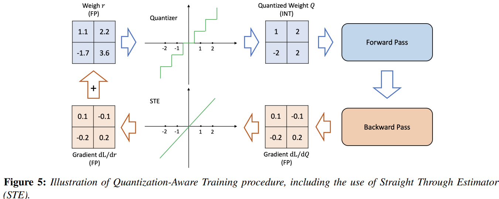

 

- STE를 주로 사용하지만 대신하는 다른 방식 존재
    - Stochastic neuron, combinatorial optimization, target propagation, Gumbel softmax를 이용하는 방법 등
- Non-STE 방식
    - 가중치를 양자화하기 위해 regularization operator 사용
        - 미분 불가능한 quantiation 연산자 제거
    - ProQuant
        - 양자화 공식에서 rounding 연산자 제거하고 W-shape라는 non-smooth regularization 함수를 이용하여 가중치를 양자화
    - AdaRound, 
    - 등등..
- 많은 연구들이 진행되고 있지만 많은 튜닝 과정이 필요하므로 아직까지 STE가 가장 많이 보편적으로 사용되는 방법

 

- QAT 동안 양자화 파라미터들을 효과적으로 학습하는 방법 존재
- PACT
    - Uniform Quantization을 하는 동안 활성화 출력의 clipping range를 학습
- QIT
    - Non-uniform quantization 설정을 확장하며 양자화 레벨과 스텝을 학습 가능
- LSQ
    - QAT를 진행하는 동안 ReLU와 같은 non-negative 활성화 함수의 scaling factor를 학습하기 위한 새로운 기울기 측정법
- LSQ+
    - LSQ의 아이디어를 swish, h-swish와 이 음수의 값을 만드는 활성화 함수에도 사용할 수 있도록 일반화 한 방법

 

**Summary (QAT)**
- QAT는 STE의 근사화가 꼼꼼하게 이뤄지지 않지만 잘 작동을 함
- 하지만 QAT의 가장 큰 단점은 NN 모델을 재학습시키는데 드는 계산 비용
- 양자화를 적용하기 전의 정확도를 얻기 위해서는 수백번의 epoch를 반복해야 함
- 만약 양자화 된 모델이 긴 기간동안 사용되고, 효율성과 정확도가 중요하다면 QAT를 수행하는 가치가 있지만 모든 모델이 그런 것은 아님

 

**2) Post-Training Quantization**
- 계산 비용이 비싼 QAT 대안으로 사용할 수 있는 방법은 PTQ (Post-Training Quantization)
- PTQ는 fine-tuning 없이 가중치를 조절하는 방법
- PTQ의 계산에 대한 오버헤드는 아주 작거나 무시할만함
- 재학습을 하기 위해 충분히 많은 학습 데이터가 필요한 QAT와 다르게, PTQ는 데이터가 제한되어있거나 라벨링이 되지 않은 경우에 사용 가능
- 하지만 QAT에 비하면 낮은 정확도를 가짐
    - 특히 low-precision으로 양자화를 진행하는 경우

 

- PTQ의 정확도를 개선하기 위하여 다양한 방법들이 제시
    - 양자화 후 가중치의 평균과 분산의 내재된 편향을 관찰하고 편향된 값을 보정하는 방법
    - 서로 다른 layer 또는 channel의 가중치의 범위 (활성화 출력의 범위) 등을 동일하게 만들어 양자화 오류를 줄이는 방법
    - ACIQ
        - 분석적으로 PTQ를 위한 최적의 clippinjg range와 channel-wise bitwidth를 설정
        - 이 방법은 정확도가 감소하는 문제는 해결했지만, channel-wise quantization은 하드웨어에 효과적으로 적용하기 어려움
    - OMSE
        - 활성화에 channel-wise quantization을 제거
        - 양자화 된 tensor값과 floating point tensor 값 사이의 L2 distance를 최적화하면서 PTQ를 수행하는 방법 제시
    - 그 외 다양한 방법존재

 

**Summary (PTQ)**
- PTQ는 모든 가중치과 활성화 출력에 대한 양자화 파라미터들이 재학습 없이 결정 
- 하지만 QAT와 비교하면 낮은 정확도 획득

 

**3) Zero-shot Quantization**
- 양자화 후 정확도가 떨어지는 것을 최소화하려면 학습 데이터 중 일부를 사용해야 함
1. 활성화의 범위를 알아야 함 
    - Clipping range와 scaling factor를 결정하기 위해, 즉 calibration 하기 위해 
2. 양자화된 모델은 모델의 파라미터를 결정하고 정확도가 떨어지는 것을 막기 위해 재학습이 필요할 수 있음
- 하지만 많은 경우 양자화를 진행하는 도중에 학습 데이터에 접근하는 것은 불가능
    - 학습 데이터의 크기가 매우 커서 배포할 수 없거나, 보안과 사생활 문제로 독점적이거나 민감하기 때문
- 이 문제를 해결하기 위해서 zero-shot quantization 제시
- ZSQ는 finetuning의 여부에 따라 2단게로 나뉨
    - **Level 1 : ZSQ + PTQ**
        - 데이터 없음 + finetuning 안함
    - **Level 2 : ZSQ + QAT**
        - 데이터 없음 + finetuning 필요
- Level 1
    - Finetuning이 필요하지 않기 때문에 빠르고 쉽게 양자화 가능
    - Finetuning은 보통 시간이 오래 걸리고, 적절한 hyperparameter를 찾는 과정이 필요
- Level 2
    - Finetuning의 과정을 거치기 때문에 더 높은 정확도를 얻을 수 있음 
    - 하지만 이 방법은 선형 활성화 함수의 scale-equivariance 라는 특징을 기반으로 하기 때문에 비선형 활성화 함수를 사용하는 모델에 적용하면 성능이 떨어짐

 

- ZSQ의 연구 방향 중 하나는 pre-trained 된 모델이 학습 할 때 사용하는 실제 데이터와 유사한 가상 데이터를 생성하는 것
- 생성된 데이터는 calibration을 하거나 경량화 된 모델을 finetuning할 때 사용됨
- 초기에는 가상 데이터를 생성할 때 GAN 이용
    - 모델의 최종 output을 이용하여 데이터가 생성되므로 중간 계층의 활성화 출력의 분포와 같은 내부 통계에 대한 정보를 포함하지 못함
    - 실제 데이터의 분포를 적절하게 만들 수 없음
- Batch 정규화에 저장된 통계 사용하는 방법 사용

 

**Summary (ZSQ)**
- 전체 양자화 과정에서 학습/검증 데이터를 사용하지 않고 이루어짐
- 머신 러닝 서비스를 제공하는데 고객의 데이터에 접근할 필요 없이 배포할 때 필요
- 학습 데이터에 대한 사용이 조안 또는 개인 정보 보호 문제 때문에 힘들 때 필요

#### H. Stochastic Quantization
- 가중치의 변화가 아주 작으면 가중치를 업데이트 시키는 경우 rounding 연산 때문에 가중치가 변하지 않는 현상 발생 

 

$$
Int(x)=\left\{\begin{matrix}
 \left \lfloor x\right \rfloor \ \ \  with \ probability \ \ \left \lceil x\right \rceil-x
 \\ \left \lceil x\right \rceil  \ \ \  with \ probability \ \ x-\left \lfloor x \right \rfloor
\end{matrix}\right.
$$

 

- $Int$ 연산자를 위와 같이 정의한다면 binary quantization에서는 사용 할 수 없음 

 

$$
Binary(x)=\left\{\begin{matrix}
 -1 \ \ \  with \ probability \ \ 1-\sigma(x)
 \\ +1  \ \ \  with \ probability \ \ \sigma(x)
\end{matrix}\right.
$$

 

- 최근 QuantNoise라는 새로운 방법도 적용 

 

## Ⅳ Advanced Concept : Quantization below 8 bits 
### A. Simulated and Integer-only Quantization
- 딥러닝 양자화에는 크게 2가지 접근법 존재
    - **Simulated quantization (fake quantization)**
    - **Integer-only quantization (fixed-point quantization)**

 

 

- Simulated quantization
    - 양자화 된 모델의 파라미터는 low-precision으로 저장이 되지만 연산 (matrix multiplication, convolution) 은 floating-point으로 수행
    - 양자화 된 파라미터들은 floating-point로 연산하기 전 역양자화 과정이 필요
    - Simulated quantization을 이용해서 빠르고 효과적인 low-precision의 장점을 충분히 이용할 수 없음
- Integer-only quantization
    - 모든 연산은 low-precision 정수로 수행
    - 어떤 파라미터와 활성화 출력도 역양자화 할 필요 없음

 

 

- 성능이 좋은 integer-only quantization은 batch normalize를 그 전의 layer와 fusion 시킴
    - integer-only 연산의 batch normalization을 이용한 resiaul network 학습을 위해 제시

 

*cf*
- Model fusion
    - 모델의 각 기능을 수행하는 layer를 하나로 합치는 과정 
    - (Conv, BatchNorm), (Conv, ReLU), (BatchNorm, Conv, ReLU) 등의 fusion 존재

     
    

     

 

- Dyadic quantization 
    - inter-only quantization의 종류
    - Scaling factor가 2의 거듭제곱으로 구성
    - Dyadic rational 구성
        - 분자가 정수, 분모가 2의 거듭 제곱으로 구성
    - 그 결과 나눗셈없이 정수 덧셈, 곱셈 그리고 비트 시프트 연산으로만 모든 계산 수행

 

**Summary (Simulated vs Integer-only Quantization)**
- 일반적으로 integer-only와 dyadic quantization이 simulated/fake quantization 보다 훨씬 이상적
    - Integer-only quantization은 lower precision을 연산에 사용하고 fake quantization은 연산을 실수로 수행
- Fake quantization은 연산에 국한된 문제보다 추천 시스템 같이 대역폭에 국한된 문제에 대 효과가 좋음 
    - 이 문제의 병목현상은 메모리 공간과 메모리에서 파라미터들을 로드하는 비용

 
 

### B. Mixed-Precision Quantization
- Lower precision 양자화를 하면 하드웨어 성능이 향상
- 모델을 균일하게 매우 작은 bit로 양자화하면 정확도가 매우 떨어짐
- 이를 해결하기 위해 mixed-precision quantization 사용 

 

- 각 layer가 다른 수의 bit precision으로 양자화

 

 

- 이 방법은 비트 셋팅을 위한 탐색 공간이 layer가 증가할 때마다 기하급수적으로 증가한다는 문제

 

- Mixed-precision quantization의 각 layer의 비트 수를 정하는 것은 탐색 문제
    - 다양한 조합에 대한 탐색이 필요
- Reinforcement learning, NAS(Neural Architecture Search) 등의 방법 이용
- 이런 탐색적인 방법은 계산량이 너무 많고, hyper-parameter의 값에 영향을 크게 받음

 

- 다른 방식은 주기적인 함수 정규화을 이용하여 mixed-precision 모델 학습 
    - 각 layer 별 비트 폭을 학습하는 동안 각 모델의 layer와 정확도를 관점으로 한 다양한 중요도를 자동으로 구별

 

- 위의 두 방식과 다른 HAWQ 존재
    - 2차 미분 연산자를 이용하여 양자화가 각 layer에 미치는 민감도를 측정할 수 있고 이를 바탕으로 비트 폭 결정

 
 

**Summary (Mixed-precision Quantization)**
- Mixed-precision quantization은 low-precision에 대하여 효과적이고 하드웨어 효율적
- NN의 각 layer들은 양자화에 대하여 민감한지 민감하지 않은지 그룹화하고 이를 기준으로 각 layer를 양자화 할 bit 수 결정
- 정확도의 감소를 최소화 가능, 적은 bit 수를 사용하여 메모리 저장 공간과 속도에 대한 이점도 획득 가능

 
 

### C. Hardware Aware Quantization
- 양자화의 목표 중 하나는 추론 실행속도를 빠르게 하는 것 
- 모든 하드웨어가 양자화 된 layer/연산에 대하여 똑같이 속도를 증가시켜주는 것은 아님
- 사실 양자화는 하드웨어 의존적

 

- 최적의 양자화를 하기 위해서는 하드웨어 요소들도 고려해야하고 실제로 하드웨어에서 실험해보는 실증적인 연구 필요

 
 

### D. Distillation-Assisted Quantization
- 양자화 된 모델의 정확도를 높이기 위해 model distillation 이용
- QAT를 할 때 적용

 

- Knowledge Distillation (지식 증류 기법)
    - 학습이 잘 된 큰 모델의 예측은 정답을 매우 잘 맞추면서 클래스 간의 관계를 잘 설명
        - MNIST 데이터셋에서 2가 정답일 때 3과 7 또한 적지 않은 확률로 나오는데 이는 2, 3, 7이 서로 관련이 크다는 것을 의미
        - 즉, 학습이 잘 된 모델의 결과를 사용하는 것은 의미 있고 그렇게 학습하는 것을 Knowledge Distillation
    - 즉, 딥러닝에서 큰 모델 (Teacher)로 부터 증류한 지식을 작은 모델 (Student) 네트워크로 transfer 하는 과정

     

- 정답 label
    - 개 이미지 label

 

 

- 예측 값에 softmax 함수를 취한 label
    
     

    $$p_{i}=\frac{exp{z_{i}}}{\sum_{j}{exp{z_{j}}}}$$ 

     
    

     

    - 모델에 개의 이미지를 넣었을 때 나오는 출력값
    - 가장 높은 확률로 개라고 예측
    - 개를 제외한 고양이와 소, 차 등의 확률을 보면 이 이미지는 개이지만 고양이과 가장 유사하고 차와는 가장 유사하지 않음
    - 하지만 값이 너무 작아 모델에 반영하게 쉽지 않음 

 

- 출력값 분포를 soft 하게 만드는 경우
    - 위의 출력값을 soft하게 만들면 이 값들이 모델이 가진 지식
    
     

    $$p_{i}=\frac{exp{\frac{z_{i}}{T}}}{\sum_{j}{exp{\frac{z_{j}}{T}}}}$$ 

     

    

     

    - 기존의 softmax와 다른 점은 $T$ 라는 값
    - $T$ 는 온도라는 hyper-parameter
        - 이 값이 커지면 값이 soft 해지고, 작아지면 값이 hard 해짐

- 학습
    - Teacher 모델을 학습 한 후 Student 모델 학습

     
    

     

    $$L=\alpha H(y,\sigma(z_{s}))+\beta H(\sigma(z_{t},T),\sigma(z_{s},T))$$
    $$\alpha, \beta: hyper-parameter$$
    $$y:ground\ truth\ class\ label$$
    $$H:cross-entropy\ loss\ function$$
    $$z_{s},z_{t}:result from student/teacher model$$
    $$\sigma:softmax$$
    $$T: temperature$$

 
 

### E. Extreme Quantization
- Binarization(이진화)은 1bit로 양자화하여 최대 32배 메모리 사용을 줄이는 방법 
- Binary(1 bit), ternary(2 bit)로 양자화하게되면 계산이 효율적
- 하지만 단순하게 1bit로 이진화하는 것은 정확도의 감소가 큼

 

- 이를 해결하기 위해 다양한 방법이 제시됨
- BinaryConnect
    - 가중치의 값을 {-1, +1} 값으로 제한시키는 방법
    - Forward 시, 가중치 값이 0이상이면 +1 그 미만이면 1로 이진화 수행
    - Backward 시, 미분 가능하지 않으므로 STE로 근사화 시켜 계산 
- BNN (Binarized NN)
    - 가중치 뿐만이 아니라 활성화 출력 모두 이진화하는 방법
    - 모델 크기의 축소뿐만이 아니라 행렬 곱셈 연산을 비트열 연산으로 대체할 수 있는 이점 존재  
        - 이 때의 비트열 연산은 XNOR 연산과 bitcount 연산
        - 두 비트열에 대한 XNOR 연산 후 1의 개수를 계산하는 것으로 이진화된 두 비트 벡터에 대한 행렬 곱셈 연산이 가능
- BWN (Binary Weight Network), XOR-Net
    - Scale factor ($\alpha$) 를 도입하여 정확도 손실 개선
    - {-1, 1} 대신 {$-\alpha, \alpha$} 를 이용
    - $\alpha$ 의 값은 실제 실수값의 가중치와 이진화된 가중치의 차이를 가장 작게 하는 값으로 함

     

    $$\alpha, B=argmin{||W-\alpha B||}^2$$
    $$W\approx \alpha B $$

 

- 이진화 기법으로 양자화를 수행하는데 많은 가중치의 값들이 0임을 확인
- 가중치와 활성화 출력의 값을 {-1, 0, 1}로 제한하는 ternarization (삼진화) 제시
- 이진화와 마친가지로 추론 속도를 급격하게 줄이고 계산의 비용도 줄임
- TBN (Ternary-Binary Netwrok)
    - 네트워크의 가중치는 이진화를 하고 활성화 출력은 삼진화를 진행하여 정확도와 계산 효율이 가장 최적이 되도록 함

 

- 단순하게 이진화와 삼진화를 진행하는 것은 정확도가 심각하게 떨어질 수 있으며, 복잡한 분류 문제에는 적용하기 어려움
- 정확도가 떨어지는 문제를 해결하기 위한 여러 갈래의 방법 존재

 

#### a) Quantization Error Minimization
- 실제 값과 양자화된 값 사이의 양자화 오류를 줄이는 방법
- HORQ, ABC-Net
    - 실제 가중치 값을 표현하기 위해 하나가 아닌 여러개의 이진화 값들을 선형으로 연결

     

    $$W\approx \alpha_{1} B_{1}+...+ \alpha_{M} B_{M}$$

     

 
#### b) Improved Loss Function
- 손실 함수를 선택하는 것
- 이진/삼진화에 대한 영향을 손실에 반영 

 

#### c) Improved Training Model
- BNN+
    - STE 문제를 해결하고 이를 근사화 하는방법
- Bi-Real Net
    - 활성화 함수의 종류를 바꿈
    - STE를 개선하여 가중치 미분 연산 시에 실제 가중치의 크기까지 고려
- DoReFa-Net
    - 기울기도 양자화하야 학습 속도를 개선하는 방법

 

**Summary (Extreme Quantization)**
- 적은 bit 수로 양자화하는 것은 매우 중요하고 유망한 연구
- 하지만 존재하는 방법들은 하이퍼 파라미터의 조합의 값을 잘 선택하지 않으면 정확도가 떨어지는 단점 존재
- 하지만 정확도가 많이 중요한 요소가 아니라면 적용 가능 

 
 

### F. Vector Quantization
- 가중치를 k-means clustering 을 활용하여 몇 개의 중심점 (centroids)로 압축하는 방법
- Pruning과 huffman coding을 이용하여 모델 사이즈를 추가로 많이 압축 가능
    - Deep Compression 논문 참고

