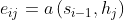
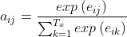
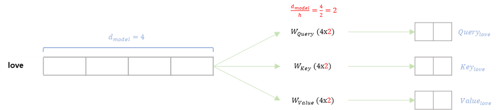
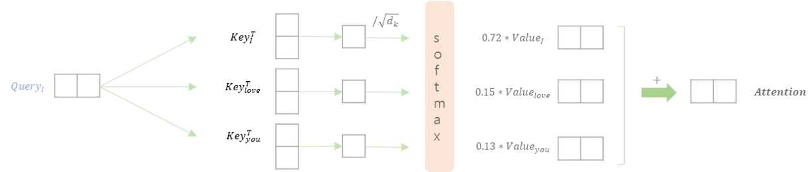
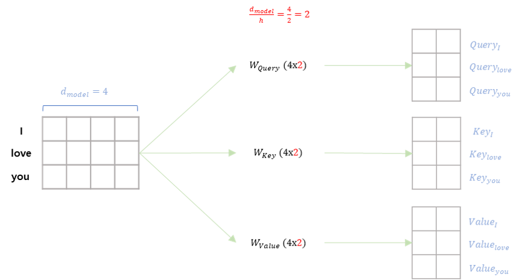
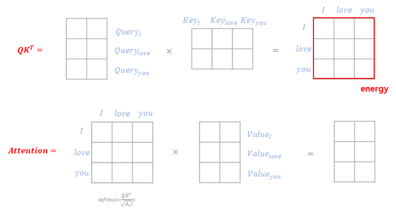
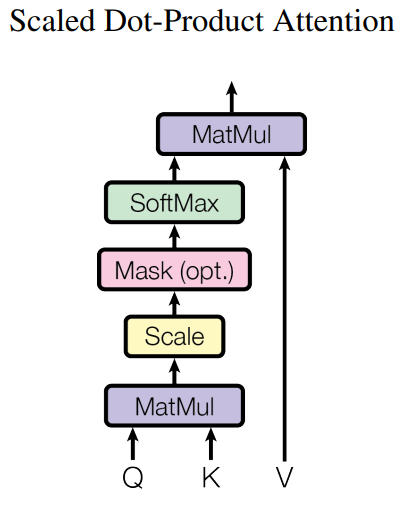

## Basic
참고
- https://wikidocs.net/24996
- https://www.youtube.com/watch?v=AA621UofTUA

 
 

### 자연어 처리 (기계 번역) 개요
- Seq2Seq는 소스 문장을 고정된 크기의 context vector로 만들어 사용하기 때문에 성능의 제한이 존재
- 2015년 Attention 기법이 나오기 시작하면서 입력 시퀀스 전체에서 정보를 추출하는 방법
- 2017년에 Transformer가 나온 후 자연어 관련 작업에서 RNN 기반의 방식보다는 attention 기반의 방식이 주가 됨
- 그 이후에 나온 GPT, BERT는 각각 Transformer의 디코더(Decoder), 인코더 (Enocder) 구조를 활용

 
 

### Seq2Seq 모델 구조
- 입력 문장을 받는 RNN 셀을 인코더, 출력 문장을 출력하는 RNN 셀을 디코더라고 함
- 실제로는 성능 문제로 RNN 이 아닌 LSTM 이나 GRU 셀로 구성
- 입력 문장은 단어 토큰화를 통해 단어 단위로 쪼개짐
- 단어 토큰은 각각 RNN 셀의 입력이 됨
- 인코더 RNN 셀은 모든 단어를 입력 받은 뒤의 인코더 RNN 셀의 마지막 시점의 hidden state 값을 디코더에 넘겨주는데 이를 context vector라 함 

 
 

### Seq2Seq 모델의 한계
- 소스 문장을 압축하여 context vetor (문맥 벡터)에 압축
    - 병목현상이 일어나 성능 하락의 원인
    - 소스 문장의 길이와 상관없이 항상 고정된 크기의 context vector를 만들어야 하므로 성능 하락
- 매번 새로운 단어가 들어올 때마다 hidden state 값이 갱신
- 마지막 단어가 들어왔을 때의 hidden state vector는 source 문장 전체의 정보가 들어있음  
- 그 고정된 context vector는 디코더의 입력으로 사용

 

- 하지만 출력되는 문장이 길어지면 contect vector의 정보가 손실 될 수 있음 
- 성능을 개선하기 위해서 context vector를 RNN에서 항상 참고하도록해서 성능을 개선할 수 있음
- 하지만 이렇게 개선한다고 하더라도 입력 소스 문장을 고정된 크기의 vector로 압축해야 하기 때문에 병목 현상은 여전히 발생 
- 즉, 하나의 context vector가 소스 문장 전체를 포함하고 있어야한다는 점이 문제

 
 

### Seq2Seq with Attention
- 출력 단어를 만들 때 마다 소스 문장에서의 출력 전부를 입력을 받는 방식으로 Seq2Seq 문제 해결
    - 최신 GPU의 빠른 병렬처리와 메모리 증가로 가능
- Seq2Seq 모델에 attention 적용
    - 디코더는 인코더의 모든 출력을 참고할 수 있음 
- 매 단어가 입력될 때마다 얻는 hidden state h값을 전부 저장하고 이를 디코더에서 단어를 출력할 때마다 이용하여 소스 문장 전체를 반영하겠다는 의미 
- 디코더에서 현재의 hidden state 값을 만든다고 하면 이전 단어의 hidden state (s_{t-1}) 값과 인코더의 소스 문장 단의 hidden state 값을 묶어 별도의 행렬 곱을 수행하여 Energy 값을 만듦 
- Energy
    - 현재 어떤 단어나 값을 출력하기 위해서 소스 문장에서 어떤 단어에 초점을 둘 필요가 있는지 수치화해서 나타낸 값
- Energy 값에 softmax를 취하여 확률값을 구한 뒤 소스 문장의 각각의 hidden state 값에 대해서 어떤 vector에 더 가중치를 두어서 참고하면 좋을지를 반영하여 가중치 값을 hidden state에 곱한 것을 각각의 비율에 맞게 더해준 후 그러한 weighted sum 값을 매번 출력 단어를 만들기 위해서 반영 

 
 

### Seq2Seq with Attention : 디코더
- 디코더는 매번 인코더의 모든 출력 중에서 어떤 정보가 중요한지 계산

 

- 에너지 (Energy) 
    - 소스 문장에서 나왔던 모든 출력값들 중에서 어떤 값과 가장 연관성이 있는지를 알기 위해 수치로 구한 것 

     

    

    

    
    $$i : 현재 디코더가 처리 중인 인덱스$$
    $${j} : 각각의 인코더 출력 인덱스 $$

    

    - 매번 출력 단어를 만들 때마다 모든 j를 고려, 즉 인코더의 모든 출력 고려하겠다는 의미

 

- 가중치 (Weight)
    - 에너지 값에 softmax를 취하여 확률 값 얻음
   
     

    

     
 

- 가중치 합 (Weighted sum)
    - 가중치 값들을 소스 문장의 각각의 hidden state와 곱하여 전부 더해준 값
    - 디코더의 이전 hidden state와 함께 들어가는 입력

 

- Attention 가중치를 사용하여 각 출력이 어떤 입력 정보를 참고했는지 알 수 있음 

 

# Attention is All You Need
## Abstract 
- 시퀀스 변역 모델은 복잡한 인코더와 디코더를 포함한 RNN이나 CNN모델 사용
- 가장 좋은 성능을 내는 모델은 인코더와 디코더를 연결하는 attention 매커니즘 사용
- 이 논문에서는 간단한 매커니즘은 **Transformer** 를 제안
- 두 가지 기계 번역 task를 실행한 결과 다른 알고리즘보다 Transformer가 훨씬 더 좋은 성능을 보이는 것을 확인
- 하지만 학습을 시킬 때 요구되는 시간은 현저하게 적음
- 이 논문에서는 Transformer가 다른 작업에서도 일반화가 잘 되는 것을 확인 
    - 데이터 양이 많고 제한된 학습 데이터에 모두에서 English constituency에 성공적으로 적용됨

 
 

## 1 Introduction
- Recurrent neural networks(RNN), long-short-term memory(LSTM), gated recurrent neural network(GRU)은 특히 시퀀스 모델링과 변환 문제에 대해서 최신의 접근법을 제시
    - 언어 모델링, 기계 번역 등
- Recurrent 언어 모델과 인코더-디코더 구조를 벗어나기 위해 많은 시도를 함

 

- Recurrent 모델은 hidden state의 시퀀스 $h_{t}$를 만들기 위해서는 이전 단계의 hidden state 인 $h_{t-1}$과 $t$에서의 입력이 필요함, 즉 이전 값이 입력으로 들어감
- 이런 순차적인 특징은 병렬화를 못하게 만듦
- 최근의 연구는 factorizaion tricks과 conditional computation을 통해 계산의 효율을 매우 높임
- 하지만 순차적인 계산의 근본적인 제약은 여전히 남아있음

 

- Attention 매커니즘은 다양한 작업에 사용되는 강력한 시퀀스 모델링과 변환 모델의 필수적인 부분
- 또한 attention은 입력,출력의 시퀀스 길이에 상관없는 모델의 종속성 모델링을 허용
- 지금까지는 몇 가지 경우를 제외하고는 모두, recurrent 네트워크와 함께 사용됨

 

- 이 논문에서 **Transformer** 를 제안
- 이 모델 구조는 recurrent 구조를 피하고 입력과 출력 사이의 전역적인 종속성을 알아내기 위해 attention 매커니즘을 이용
- Transformer를 이용하여 병렬화가 명확하게 가능

 
 

## 2 Background
- Sequential 계산을 줄이기 위해 Extended Neural GPU, ByteNet, ConvS2S 등의 모델이 사용됨
    - 이 모델 모두 convoultional neural network를 기본 블럭으로 사용
    - 모든 입,출력 자리에서 병렬적으로 hidden representations 사용 가능 
### 추가

 

- Self-attention (intra-attention)은 시퀀스의 representation을 계산하기 위한 하나의 시퀀스의 다른 자리들과 관련된 attention 매커니즘

 

- Recurrent attention을 기반으로 한 end-to-end 메모리 네트워크는 간단한 언어로 질문하고 답하는 언어 모델링에서 좋은 성능을 보임

 

- Transformer는 입력과 출력의 representatio을 계산하기 위해 RNN과 CNN을 사용하지 않고 온전히 self-attention만 이용 
    

 
 

## 3 Model Architecture
- 가장 경쟁력있는 neural 시퀀스 변환 모델은 인코더-디코더의 구조를 가진 모델
- 인코더는 입력 시퀀스

 
 

### 3.1 Encoder and Decoder Stacks

**Encoder**
- 6개의 동일한 layer들을 쌓아서 구성
- 각 layer들은 2개의 sub-layer 로 구성
    - Multi-head self-attention, simple position-wise fully connected feed-forward network
- 각 sub-layer 주변에서 residual connection을 적용하고 sub-layer를 통과한 값들과 합쳐 layer normalize를 진행
- Rsidual connection을 용이하게 진행하기 위해, 모델의 모든 sub-layer과 embedding layer들의 output의 차원을 ($d_{model}$) 512로 맞춤

 

**Decoder**
- 디코더도 동일하게 6개의 동일한 layer들을 쌓아서 구성
- 디코더에는 인코더에는 존재하지 않는 세 번째 sub-layer 존재
- 
- 인코더와 마찬가지로 각 sub-layer 주변에 residual connection을 적용하고, sub-layer를 통과한 값들과 합쳐 layer normalization을 진행
- 

 
 

### 3.2 Attention
- Attention은 어떤 단어가 다른 단어들과 각각 어떤 연관성을 가지는지 구하는 것
- 3가지 요소가 존재
    - Query (쿼리) : 무언가를 물어보는 주체
    - Key (키) : 물어보는 대상
    - Value (값)

     

    - "I" 라는 단어가 "I am a teacher"라는 문장의 각 단어와 어떤 연관성을 갖는지 알고싶을 때 "I"가 query, "I am a teacher"의 각 단어가 key가 됨 

 

- 논문에서 제시하는 attention 흐름

    

     

    

     

- 위의 한 단어가 아닌 행렬곱을 이용

     

    

     

    

     

- Attention은 query와 key-value 쌍을 output에 매핑한다고 볼 수 있음 
    - Query, key, value 는 모두 벡터
- Attention은 value에 weighted sum 방식으로 계산이 되는데 각 value에 곱해지는 가중치들은 query와 대응되는 key의 값들을 
- 

 
 

#### 3.2.1 Scaled Dot-Product Attention

 

 

- 위와 같은 구조를 가지는 특정한 attention을 "Scaled Dot-Product Attention"이라 함 
- Input은 쿼리와 $d_{k}$ 의 차원을 가지는 키, 그리고 $d_{v}$의 차원을 가지는 value들로 구성
- Query와 모든 key들을 dot product를 진행하고 그 값들을 $\sqrt{d_{k}}$ 로 나눈 후 softmax 함수를 적용하여 각 value들에 적용할 weight들을 구함
- 

 

- 실제로 attention을 계산을 할 때는 여러 query들에 대하여 한번에 계산하며 아래와 같은 식으로 표현 가능

 

$$Attention(Q,K,V)=softmax(\frac{QK^{T}}{\sqrt{d_{k}}})V$$

 

- 가장 흔하게 사용되는 Attention 기법 2가지는 addictive attention과 dot-product (multiplicative) attention
- Dot-product attention은 scaling factor인 $\frac{1}{d_{k}}$ 를 제외하고는 논문에서 제시하는 알고리즘과 같음
- Addictive attention은 하나의 hidden layer를 가진 feed-forward network를 이용하여 compatibility function을 계산
- 두 방법은 이론적으로는 복잡도가 비슷하나 실제적으로 dot-product 방식이 더 빠르고 공간 효율이 좋음

 

- $d_{k}$가 작은 값일 떄는 두 매커니즘의 성능이 비슷했으나

 
 

#### 3.2.2 Multi-Head Attention
$$head_{i}=Attention(QW_{i}^{Q},KW_{i}^{k},VW_{i}^{V})$$
$$MultiHead(Q,K,V)=Concat(head_{1},...,head_{h})W^{O}$$

#### 3.2.3 Applications of Attention in our Model
### 3.3 Position-wise Feed-Forward Networks
### 3.4 Embeddings and Softmax
- 학습된 embedding을 이용하여 input token(단어)과 output token을 $d_{model}$ 차원의 벡터로 변환
    - 작은 차원의 연속적인 값으로 표현
- 또한 학습된 선형변환과 softmax를 사용하여 decoder의 output을 에측된 다음 token의 확률로 바꿈
- 이 모델에서,두 embedding layer들과 pre-softmax 선형 변환은 같은 가중치를 공유
- Embedding layer에서는 가중치들에 $\sqrt{d_{model}}$을 곱함

 
 

### 3.5 Positional Encoding
- 논문에서 제시하는 모델은 recurrence와 convolution이 존재하지 않기 때문에 시퀀스의 순서를 알 수 없음
- 시퀀스에서의 token의 상대적 또는 절대적 위치에 대한 정보를 제공해야 함
- 따라서 "positional encoding"을 인코더와 디코더 스택의 하단에 추가함
- positional encoding은 embedding과 마찬가지로 $d_{model}$ 차원을 가졌기 때문에 두 결과를 더할 수 있음 (element-wise)
- positional encoding에는 여러 방법이 존재하나(학습되거나 고정된 방법) 이 실험에서는 sine, cosine 함수를 이용

 

$$PE_{(pos, 2i)}=sin(pos/10000^{2i/d_{model}})$$
$$PE_{(pos, 2i+1)}=cos(pos/10000^{2i/d_{model}})$$
$$i : 차원$$
$$pos : 단어의 위치$$

 

- positional encoding의 각 차원은 정현파에 대응됨
- 어떤 고정된 offset $k$에 대하여 $PE_{pose+k}$는 $PE_{pos}$의 선형 함수로 나타낼 수 있기 때문에 이 모델이 상대적 위치를 쉽게 알 수 있을 것이라고 가정

 

- 학습된 positional embedding 사용하여 실험해보았으나 두 방법의 결과가 거의 비슷
    - Table 3, (E) 참고
- 그럼에도 이 실험에서는 정현파를 이용한 방법을 선택했는데 그 이유는 학습하는 동안 경험한 시퀀스보다 더 긴 시퀀스를 추론 할 수 있기 때문

 
 

## 4 Why Self-Attention
