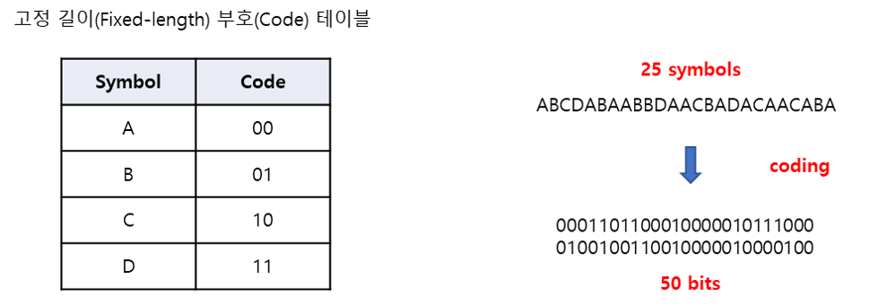
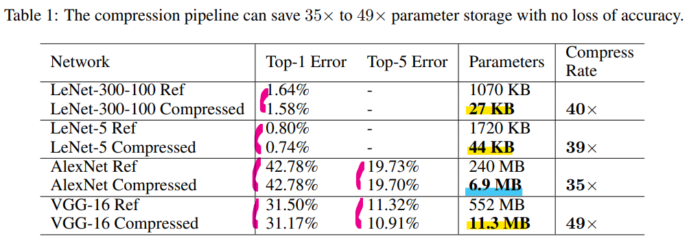
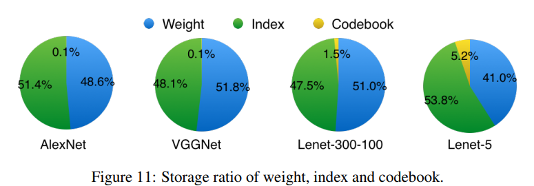

# Basic
- 모바일 환경에서의 딥러닝 기술은 이점 
    - 개인정보 보호
        - 서버까지 데이터를 전송하지 않아도 됨
    - 실시간 처리
        - On device 환경에서 GPU가 탑재되어있다면 서버와 데이터를 주고받을 필요 없음
    - 네트워크 대역폭 
- 딥러닝 모델은 대부분 큰 용량을 가지고 있기 때문에 모바일 앱에 딥러닝 모델 직접적으로 탑재하기 어려움
- 딥러닝 모델의 크기가 크면 에너지 소비의 문제가 생김
    - 큰 네트워크를 사용할 때 가중치를 fetch 하는 과정에서 많은 대역폭 요구
    - 포워딩을을 위해 많은 내적 연산 수행
    - 특히 메모리 접근 과정에서 많은 에너지 소비 발생 가능 

 
 

# DEEP COMPRESSION: COMPRESSING DEEP NEURAL NETWORKS WITH PRUNING, TRAINED  QUANTIZATION AND HUFFMAN CODING
**2016년 ICLR에서 best paper로 선정된 우수 논문**

 
 

## Abstract
- Neural Network는 계산 집약적이고 메모리 집약적이기 때문에 제한된 하드웨어 리소스를 가진 임베디드 시스템에 적용하기에 어려움
- 이를 해결하기 위해 세 단계의 파이프라인으로 구성된 "**deep compressin**" 을 도입
    - Pruning (가지치기)
    - trained Quantization (양자화)
    - Huffman coding (하프만 코딩)
- 세 방법을 모두 적용하여 정확도에 영향을 미치지 않고 용량을 35 ~ 49 배를 줄임
- Pruning은 중요한 네트워크 연결만 학습할 수 있도록 네트워크를 가지치기 하여 중요한 연결만 학습하는 것
- Quantization은 가중치를 양자화하여 가중치를 공유하도록 함
- 이 두 과정 후에 Huffman coding을 적용
- 처음 두 단게 이후 남아있는 연결과 양자화된 중심점(centroids)을 finetuning하기 위한 재학습을 진행
- Pruning으로 네트워크 연결을 9 ~ 13배 줄임
- Quantization으로 각 연결을 나타내는 표현 (가중치)를 32bit에서 5bit로 줄임
- 이 방법은 off-chip DRAM memory가 아닌 on-chip SRAM cache에 저장 할 수 있게 함
- 애플리케이션 크기와 다운로드 대역폭이 제한된 모바일 어플리케이션에서 복잡한 뉴럴 네트워크를 사용 할 수 있게 함
- 기준이 되는 CPU, GPU, 모바일 GPU에서, 압축된 모델은 층간 속도를 3~4배 증가시키고 에너지 효율을 3~7배 증가시킴

 
 

## 1. Introduction
- Computer vision에서 딥러닝은 매우 강력한 기술이지 많은 수의 가중치들은 상당히 많은 저장 공간과 메모라 대역폭이 필요함
- 이는 딥러닝 네크워크를 모바일 시스템에 탑재하기 어렵게 만듦

 

- 많은 mobile-first 회사들의 앱들은 다양한 앱스토어를 통하여 업데이트가 되고 이 회사들은 binary 파일의 크기에 민감
    - App store에서 "100MB 가 넘는 app은 Wi-Fi 연결이 될 때까지 다운로드 할 수 없음" 등의 제약이 있기 때문 
- 그 결과로 binary 크기를 100MB 씩 증가시키는 기능은 10MB씩 증가시키는 기능보다 더 철저한 검토를 받음 
- 비록 모바일에서 작동하는 딥 뉴럴 네트워크는 여러 좋은 특징들을 가지고 있음
    - 개인정보 보호
    - 더 좁은 네트워크 대역폭
    - 실시간 프로세싱
- 하지만 큰 저장공간이 필요하다는점이 딥 뉴럴 네트워크가 모바일 앱에 통합되는 것을 어렵게 함 

 

- 두 번째 문제는 에너지 소비
- 큰 뉴럴 네트워크를 실행하는 것은 가중치를 fetch하기 위해 많은 메모리 대역폭을 요구하고 내적을 하기 위해서 내적 연산을 하기 위해 많은 계산 수행
    - 이는 결국 상당한 에너지 소비가 발생
- 모바일 장치는 베터리가 제한적이고 전력을 많이 소비하는 딥 뉴럴 네트워크는 탑재시키기 어려움

 

- 에너지 소비는 대부분 메모리에 접근 할 때 발생  
- 45nm CMOS 에서, 32 bit floating point 덧셈을 하는 경우  **0.9pJ**, 32 bit SRAM chache 접근하는 경우 **5pJ**, 32 bit DRAM 메모리에 접근하는 경우 **640pJ** 이 필요함 
- 큰 네트워크는 on-chip 저장 공간에 맞지 않기 때문에 비용이 더 큰 DRAM 메모리에 접근을 해야 함

 

 

- 이 연구의 목표는 모바일 장치에 딥러닝 모델을 탑재시켜 추론이 가능할 수 있도록 저장 공간과 에너지 소비를 줄이는 것

 

 

- 이를 위하여 "deep compression" 제안
    - 정확도를 보존하고 뉴럴 네트워크의 저장 공간을 줄이기 위한 3 단계의 파이프라인 방식
- 불필요한 연결을 제거하고 주요한 연결만 남기는 Pruning (가지치기)
- 가중치를 Quantization (양자화) 하여 많은 연결들이 같은 가중치를 공유
    - 그로 인해서 코드북(codebook, 유효한 가중치)과 index들만 저장하면 됨
- 마지막으로 Huffman coding으로 편향적으로 분포된 가중치들의 이점을 얻음

 

- Pruning과 Quantization을 통해서 두 과정이 서로 방해없이 네트워크를 높은 압축률로 압축할 수 있다는 것을 알아냄
- 이 과정을 통해 네트워크를 압축하면 모든 가중치들을 on-chip cache에서 이용가능

 
 

## 2. Network Pruning

 

 

- Pruning(가지치기)을 사용하면 네트워크 복잡도를 감소시키고 과적합을 막을 수 있음
- 2015년 연구에서 최신의 CNN 모델에서 pruning 기법을 사용하더라도 정확도의 손실이 없음을 확인
- Pruning 과정 
    1. 일반적인 네트워크 학습을 진행
    2. 모든 연결(가중치 값)에서 가중치 값이 특정 threshold 값보다 작은 경우 연결들을 가지치기
        - 3보다 작은 경우 

         
        

         

    3. 남아있는 희소(sparse)한 연결들의 가중치 값들을 얻기 위해 네트워크 재학습
- Pruning은 AlexNet의 파라미터를 9배, VGG16의 파라미터를 13배 감소시킴

 

- Pruning의 결과로 나온 sparse 구조를 CSR(Compressed Sparse Row) 또는 CSC(Compressed Sparse Column) 형식으로 저장 

    - COO (Coordinate Format)
        - 행렬에 포함된 0이 아닌 값을 가진 데이터에 대하여 행과 열의 위치 정보를 기록 
        - 0 이 아닌 원소의 수가 a개 일 때 3a 만큼의 원소 필요

     
    

     

    - CSR (Compressed Sparse Row)
        - 행의 압축 정보인 Row Pointer 를 이용하여 표현
        - 2a + (n+1) 만큼의 원소 필요, a는 0이 아닌 원소 수, n은 행의 길이
        - 일반적으로 COO 보다 메모리가 적게 사용 됨
        - Row Pointer에 접근해서 각 행에 0이 아닌 원소의 수가 몇 개 인지 알 수 있음

     
    

     
    
    - CSC (Compressed Sparse Column)
        - 열의 압축 정보를 이용한다는 점만 제외하고 CSR과 같음

 

- 절대적인 위치를 저장하는 대신 index의 차이를 저장
- 이 차이를 convolution layer에 8비트, fc layer에 5비트로 인코딩
- 인코딩 범위보다 큰 index 차이가 생기는 경우 zero padding solution을 이용
    - 차이 값을 저장하기 위해 3bits만을 사용할 때, 그 차이가 3bits 보다 크면 패딩 삽입

     
    

     

    - index 4에 위치한 원소와 index 15에 위치한 원소의 거리가 8보다 크기 때문에 중간에 0을 삽입하여 3bit로 표현 가능하게 만들어줌

 
 

## 3. Trained Quantization and Weight Sharing
- Quantization (양자화) 과정과 가중치 공유를 통하여 각 가중치를 나타내는 bit 수를 줄여 가치지기를 한 네트워크를 더 압축 가능 
- 여러 연결(가중치)들이 같은 가중치 값을 공유하게 만들면서 우리가 저장할 유효한 가중치의 수를 제한하고 이 공유된 가중치들을 fine-tuning 함 

 

 

- 4개의 input 4개의 output이 존재하면 총 16개의 가중치 존재하고 각 가중치들은 32 bit로 표현
- 16개의 가중치들은 4개의 클러스터로 묶음
    - 위의 그림에서 4가지 색으로 표현
- 같은 클러스터로 묶인 가중치들의 평균값을 구하고 이를 centroids (중심점)이라 하고 해당 클러스터에서 이 값들을 공유하여 사용
    - 즉, centroids = 중심점 = 공유 가중치 
- 각 가중치는 공유 가중치 테이블에 작은 index만 저장 

 

 

- 중심점들을 업데이트 하기 위해, 각 가중치의 기울기들을 가중치의 클러스터에 맞게 할당하고 이 값들을 합쳐 하나의 값으로 만듦
- 합친 값을 학습률과 곱하고 그 값을 기존의 중심점, 즉 공유 가중치 값에서 뺌

 

- 압축률의 계산은 아래와 같은 식으로 진행
    
     
    
  
    n : 총 가중치의 수  
    k : 클러스터의 수   
    b : 가중치를 나타내는 bit 수
    

     

    - 총 가중치 수 x 각 가중치를 나타내는 bit 수
    - 총 가중치 수 x 각 클러스터를 나타내는 bit 수 (index를 표현하기 위해 인코딩되는 bit 수)
    - 클러스터의 수 x 각 가중치를 나타내는 bit 수

 

- 압축률의 식을 위의 예제에 적용해보면 3.2의 압축률을 얻음

       
    

     

- centroids 들은 계속 사용하는 것이 아니라 fine-tuning을 통해 업데이트

 
 

### 3.1 Weight Sharing
- 학습된 네트워크의 각각의 레이어의 공유되는 가중치를 정하기 위해서 K-means 클러스터링 방법을 이용
    - 같은 클러스터로 묶인 데이터는 같은 가중치를 공유
- 가중치는 같은 layer에서만 공유되며 layer들끼리 공유하지 않음

 

 

- n개의 가중치들  을 k개의 클러스터  로 분류

 
 

### 3.2 Initialization of Shared Weights
- 중심점 = centroids = 공유 가중치 = 코드북(codebook)
- 중심점 초기화는 클러스터링 성능에 영향을 미치고, 이는 네트워크 예측 성능에도 영향을 줌
- 이 논문에서는 3가지 초기화 방법을 실험
    - Forgy(random)
    - Density-based
    - Linear
- 네트워크 가지치기 후에 가중치들은 bimodal(양봉) 분포를 가짐
    - 가중치의 크기가 특정값보다 작은 값들이 사라졌기 때문

 

 

- **Forgy**
    - 가중치 중에서 랜덤으로 k개를 선택하여 이것을 초기 중심점으로 사용
    - 2개의 피크를 가지고 있기 때문에 이 두 피크점 주변에 초기 중심점이 존재할 가능성 높음
    - 그림에서 노란색 점
- **Density-based**
    - 가중치의 CDF에서 y축에 대하여 동일한 간격으로 나누고 CDF에서 이에 대응하는 x축의 가중치값을 초기 중심점으로 사용
    - 이 방법은 초기 중심점들이 두 피크점들 근처로 초기 중심점이 더 밀집하게 존재하지만 Forgy 방법보다는 덜함
    - 그림에서 파란색 점 
- **Linear**
    - 가중치의 [min, max] 사이에서 동일한 간격으로 선택
    - 이 방법은 가중치 분포에 변하지 않고 앞의 두 방법보다 더 골고루 중심점들이 분포
    - 그림에서 빨간색 점

 

- 딥러닝에서는 자주 나오는 가중치보다 절대값이 큰 가중치가 더 중요한 역할을 수행하므로 빈도가 높은 가중치가 선택되는 것이 유리한 것이 아니라 절대값이 큰 가중치를 선택하는 것이 유리
- 하지만 큰 값의 가중치는 수가 적음
- Forgy와 density-based 는 절대값이 큰 중심점을 적게 가지므로 절대값이 큰 가중치를 표현하기 어려움
- Linear 초기화를 통하여 이 점을 해결하고 정확도를 높임
- 그림의 오른쪽의 초록색 x 점이 linear 로 선택된 점이고 이를 fine-tuning 한 값이 빨간색 점

 
 

### 3.3 Feed-Forward and Back-Propagation
- K-means 알고리즘을 이용하여 적절한 중심점을 찾았다고 하더라도 같은 클러스터는 중심점에 해당하는 값에 할당되므로 어느 정도 데이터 유실이 있을 수 있음 
- 중심점을 조금 더 적절한 값으로 fine-tuning 해주기 위해서 Forward를 하고 Backpropagation 
- Forward를 하고 Backpropagation을 통해 얻은 기울기를 구한 후, 각 클러스터마다 구해진 기울기를 종합하여 각각의 중심점을 어떤 방향으로 업데이트 할 것인지 결정
- 공유 가중치 테이블의 index는 각 연결에 대한 정보를 저장 
- Back-propagation 과정에서, 각 공유 가중치의 기울기는 계산되며 이를 바탕으로 값이 갱신됨  

 
 

## 4. Huffman Coding 
- 고정 길이 부호
    
     
    

     

- Huffman coding
    1. 각 symbol을 그 출현 빈도와 함께 하나의 노드로 만듦

     

    

    
     
    
    2. 모든 노드를 우선순위큐에 삽입
        - 가장 key값(출연 빈도)이 작은 노드가 왼쪽에 오는 것을 확인 
    
     
    

     

    3. 우선순위 큐에 노드가 하나 남을 때 까지 아래 과정 반복
        1. 우선순위 큐에서 두개의 노드 추출
            - 가장 작은 두 노드를 꺼냄
        2. 두 개의 노드를 자식노드로 하는 새로운 노드를 생성하여 우선순위 큐에 삽입

     
    

     

    4. 트리 구축이 완료된 후 각가의 노드의 위치까지 재귀적으로 조회하며 왼쪽 경로에 0, 오른쪽 경로에 1 부여

 

 

- Huffman code는 무손실 데이터 압축에 사용되는 optimal prefix code
- Source symbol (여기에서는 공유 가중치)을 인코딩하기위해 가변 길이의 코드워드(codeward) 사용
- 테이블은 각 symbol의 발생 확률에서 만들어짐
- 더 흔한 symbol 일수록 더 적은 bit수로 표현

 

 

- AlexNet의 마지막 fully-connected layer의 양자화된 가중치들의 확률 분포와 희소 행렬 index를 보여줌
- K를 32개로 설정 한다면 총 32개의 중심점(centroid)이 존재하고 특정한 중심점들이 많이 나오는 것을 확인 할 수 있음 
- 즉, 분포는 편향되어 있음 (biased distribution) 
    - 대부분의 양자화 된 가중치들은 두 피크 근처에 분포함
    - 희소 행렬의 index 차이는 거의 20을 초과하는 것은 거의 없음
- 만약 편향되어있지 않고 uniform하게 존재했다면 허프만 코딩을 이용해도 비트수를 줄이기 힘듦
- 위의 분포처럼 편향되게 존재한다면 정확도의 손실없이 압축 가능
- Huffman coding은 학습이 필요하지 않고 fine-tuning이 끝난 후에 offline으로 실행
 
 

## 5. Experiments
- 4개의 네트워크에 pruning, quantization, huffman encoded를 실행
    - 2개의 모델은 MNIST에 2개의 이미지는 ImageNet에 적용
- 제시하는 압축 파이프 라인을 이용하면 정확도의 성능 저하 없이 서로 다른 네트워크에서 네트워크 저장 공간을 35에서 49배까지 줄일 수 있음 

 

 

- AlexNet은 240MB에서 6.9MB로 크기가 감소하고 이는 on-chip SRAM에 모델을 저장 가능하므로 DRAM에 저장하여 많은 에너지를 사용하는 것을 방지 할 수 있음 

 
 

### 5.1 LeNet-300-100 and LeNet-5 on MNIST
- LeNet-300-100은 2개의 hidden layer가 각각 300, 100개의 뉴런을 가지고 있는 fully-connected 네트워크
    - MNIST 데이터셋에 대하여 1.6%의 에러율
- LeNet-5는 2개의 convolution layer와 2개의 fully connected layer를 가진 네트워크
    - MNIST 데이터셋에 대하여 0.8%의 에러율

 

 

- Table 2,3은 압축 파이프라인의 통계를 보여줌
- 압축률은 codebook과 sparse index의 오버헤드를 포함
- 대부분의 압축은 Pruning 과 Quantization에서 발생

 
 

### 5.2 AlexNet on ImageNet
- ImageNet으로 학습
    - 1.2M개 학습데이터, 50k개 검증데이터

 

 

- AlexNet Caffee 모델이 reference 모델
- 정확도에 영향을 미치지 않고 2.88% 압축
- 각 Convolution layer에 256개의 공유 가중치 존재하고 이는 8bit로 인코딩 됨
    - 즉, 공유가중치는 8bit로 표현됨
- 각 Fully-Connected layer에는 32개의 공유 가중치가 존재하고 이는 5bit로 인코딩
- Relative sparse index는 4bit로 인코딩

 
 

### 5.3 VGG-16 on ImageNet
- AlexNet의 결과를 확인하고, 더 크고 최신의 네트워크인 VGG-16을 ImageNet 데이터로 학습 
- VGG-16은 더 많은 convolution layer와 3개의 fully-connected layer로 구성

 

 

- VGG16 네트워크는 최대 49배 압축이 가능
- Convolution layer의 가중치는 8bit로, Fully-connected layer는 5bit로 표현 가능
- Index bit는 5bit 만큼 사용 
- 가장 용량이 큰 두 layer인 fc6, fc7은 압축률이 1.6%가 됨
- 이렇게 감소된 용량은 실시간 이미지 프로세싱에 중요한 역할을 함
    - 배치 프로세싱과 다르게 이미지 전반에 걸쳐 layer들의 재사용이 거의 없는 경우
- 빠른 Object detection에도 중요한 역할을 함 
    - 하나의 Conv pass가 많은 FC pass에 의해 사용되는 경우
- 압축의 결과로 on-chip SRAM에 모델 저장이 가능하고 적절한 대역폭 요구사항을 가짐
- 이러한 감소 없이는 대역폭 요구사항을 감당할 수 없음

 
 

## 6. Discussions
### 6.1 Pruning and Quantization Working Together

 

 

- Prunng과 Quantization을 각각 또는 같이 수행했을 때의 압축률에 따른 정확도를 확인 할 수 있음
- Pruning과 Quantization을 각각 실행하는 경우 압축률이 8% 보다 작아지게 되면 정확도가 급격하게 떨어지게 됨
- 하지만 두 방식을 동시에 적용하면 압축률이 3%가 되어도 정확도의 손실이 없음
- 맨 오른쪽의 SVD 결과를 확인하면 이는 비용이 비싸지만 압축률 또한 좋지 않음

 

 

- Conv layer(left), FC layer(middle), all layer(right)의 각 연결당 더 적은 bit수롤 사용할 수록 얼마나 정확도가 떨어지는지 보여줌 
- 각각의 그림은 top-1, top-5 정확도를 보여줌
- Quantization 만 적용한 경우와 Quantization과 Pruning을 같이 적용한 경우 둘의 차이는 거의 없음 
    - 이는 Pruning이 Quantization과 같이 잘 어우러짐을 보여줌

 

- Quantization은 Pruning 한 네트워크에서 잘 작동함
    - Pruning을 하지 않은 AlexNet은 Quantization할 6천만개의 가중치가 존재하고 Pruning한 AlexNet은 오직 6백 70만개의 가중치가 존재하지만 같은 중심점(centroids)를 가지는 경우 후자가 더 성능이 좋음

 

- Conv layer는 FC layer보다 정확도를 유지하기 위해 더 많은 bit 수가 필요
- Conv layer는 4bit 보다 적어지면 급격하게 정확도가 떨어지는 반면에 FC layer는 조금 더 robust 함

 
 

### 6.2 Centeroid Initialization

 

 

- 중심점 초기화 방법에 따른 정확도를 보여주고 네트워크는 2 ~ 8 비트로 양자화를 진행
- Linear 초기화는 3bit 일 때를 제외하고 모든 케이스에서 다른 방법보다 좋음 

 
 

### 6.3 Speedup and Energy Efficiency
- Deep Compression은 latency에 중점을 둔 모바일에서 실행되는 어플리케이션에 타겟팅함
    - 자율주행 자동차에 내장된 보행자 감지와 같은 실시간 추론과 같은
- 하나의 Batch가 모일 때까지 지연(latency)가 발생하기 때문에 성능과 에너지 효율을 측정할 때, 이 논문에서는 batch의 크기가 1인 경우를 고려 

 

- Fully connected layer는 모델 사이즈에 크게 영향을 주고 (90%) Deep Compression으로 가장 많이 압축이 됨 (VGG-16에서 96%의 가중치 가지치기)
- 압축되지 않은 Fast R-CNN 는 전체 시간의 38%까지 FC layer에서 소비됨
- 따라서 FC layer를 보면 에너지와 성능 측면에서 Deep Compression의 효과를 알수 있음
- 그래서 이 논문에서는 AlexNet과 VGG-16의 FC6, FC7, FC8을 기준으로 하기로 함
- Batch가 없는 경우, activation 벡터는 하나의 Column을 가진 벡터이기 때문에 계산은 각각 원본/가지치기된 모델에 대한 dense / sparse 행렬-벡터 곱으로 압축됨
- 논문을 연구할 당시의 CPU, GPU에 대한 BLAS 라이브러라는 간접 조회와 상대적인 인덱싱을 지원하지 않으므로 양자화된 모델을 벤치마킹 하지 않음

 

- 이 논문에서 세개의 다른 규격의 하드웨어로 비교
    - 데스크톱 프로세서 : NVIDIA GeForce GTX Titan X 
    - 데스크톱 프로세서 : the Intel Core i7 5930K
    - 모바일 프로세서 : NVIDIA Tegra K1

 

 

- CPU / GPU / TK1 의 Dense(pruning x)/ Pruning 네트워크에서의 계산 시간이 얼마나 단축되는지 보여줌
    - CPU에 맞춰 정규화
- Batch 크기가 1인 경우, 평균적으로 pruning을 하게되면 3 ~ 4배 정도 속도가 증가
    - 메모리 공간이 더 작고 데이터 전송 오버헤드를 줄일 수 있기 때문, 특히 cache 메모리에 저장되지 않은 큰 행렬같은 경우

 

 

- 다른 하드웨에에서의 에너지 효율을 보여줌 
- 에너지 소비를 구하기 위해 전력 소비량과 계산 시간을 곱함
- Pruning 과정을 거치면 3 ~ 7 배 에너지를 더 적게 사용 가능

 
 

### 6.4 Ratio of Weights, Index and Codebook
- Pruning은 가중치 행렬을 조금더 sparse하게 만들기 때문에 0이 아닌 원소를 저장할 공간이 필요
- Quantization은 코드북(codebook)에 대한 저장 공간을 필요로 함

 

 

- 4개의 네트워크를 양자화할 때 3가지 요소를 부내하는 것을 보여줌
- 평균적으로 가중치와 sparse index는 5 비트들로 인코딩되기 때문에 각각 대략 50%의 확률로 존재
- 코드북 (Codebook)의 overhead는 매우 작음

 
 

## 9. Conclusion
- 이 논문에서 정확도에 영향을 미치지 않고 뉴럴 네트워크를 압축하는 "Deep Compression" 제공
- 이 방식은 중요하지 않은 연결을 가지치지(Pruning)하고 , 네트워크를 양자화 (Quantization)하여 가중치 공유를 하고, 그 후 하프만 코딩 (Huffman Coding)을 적용
- AlexNet과 같은 경우는 정확도 손실없이 가중치 저장 공간을 35배를 줄임
- VGG-16과 LeNet 네트워크에도 정확도의 하락없이 네트워크를 각각 49배, 39배 압축할 수 있음 
- 이는 모바일 앱에 네트워크를 올릴 수 있는 요구조건을 만족
- Deep Compression를 적용한 후에 off-chip DRAM(640pJ/access) 메모리가 아닌 on-chip SRAM cache(5pJ/access)에 저장 가능
- 모바일에서 네트워크가 돌아가서 딥러닝 네트워크를 더 에너지 효율적을 만듦
- 이 압축 방법은 복잡한 뉴럴 네트워크를 어플리케이션 크기와 다운로드 대역폭이 제한되어있는 모바일 어플리케이션에서도 용이하게 사용 할 수 있게 해줌