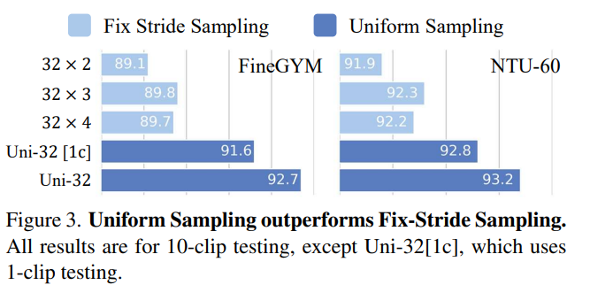
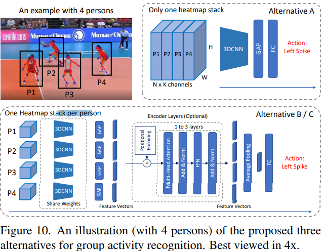
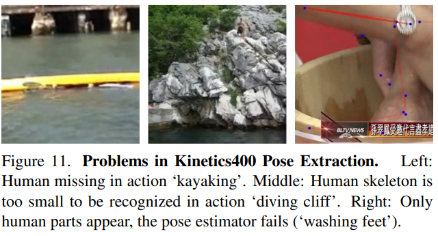

## Abstract 
- Skeleton based action recognition 에서  기존의 많은 알고리즘은 GCNs 기반의 방식을 선택
- 하지만 GCN 을 기반의 모델들은 robustness, interoperability, scalability 에 한계 존재
- 이 논문에서는 새로운 방식의 skeleton based action recongnition 방식을 제시하고 이를  **PoseConv3D** 라 함
- 기존의 GCN 기반의 방식들이 human skeleton의 graph sequence에 의존하는 대신 PoseConv3D는 3D heatmap volume에 의존함
- GCN 방식과 비교하여 PoseConv3D 방식은
    - 시공간적인 특징을 학습하는데 더 효과적
    - pose estimation noise 에 더욱 강함
    - cross-dataset 에 대하여 더욱 일반화가 잘됨
    - multi-person 에 대하여 추가적인 계산 비용 없음
    - 다른 modality와 early fusion stage에서 융합하여 성능을 향상

 
 

## 1. Introduction
- 사람의 skeleton은 영상에서 주로 관절들의 좌표 리스트 []의 시퀀스로 나타남
    - 좌표는 pose estimator에서 추출
- 관절에 대한 정보만 들어있기 때문에 배경의 다양성이나 빛의 변화와 같은 contextual nuisances에 강함
- Skeleton-based action recognition에서 가장 많이 사용되고 있는 방법은 GCN(graph convolutional networks) 
- GCN은 모든 timestep마다 모든 사람의 관절이 노드가 됨

GCN에 대한 내용 공부하고 추가 할 것 

 

- GCN을 기본으로 한 방식들을 몇 가지 한계가 존재
    1. Robustness
        - GCN은 사람의 좌표를 직접적으로 다루기 때문에 다른 pose estimator를 사용하므로 생기는 좌표 이동 분포에 영향을 받아 recognition 성능에 영향을 미침
    2. Interoperability
        - RGB, optical flow, skeletons 등의 서로 다른 modality는 상호보완적  
        - 다른 modalities를 결합하여 사용하면 성능 향상이 가능함을 예전 연구들에서 증명
        - 하지만 GCN의 경우는 skeleton들의 그래프를 사용하기 때문에 결합이 어려움
    3. Scalability
        - GCN 기반의 방식은 모든 사람의 관절을 노드로 하기 때문에 GCN의 complexity는 사람의 수에 따라 선형적으로 증가함

 
 

- 이 논문에서는 GCN 기반의 방식보다 경쟁력있는 새로운 프레임워크인 **PoseConv3D** 제시

- PoseConv3D는 2D pose estimator에서 얻은 2D pose를 input으로 사용

 

 

- HRNet은 skeleton의 관절들의 heatmap들을 쌓아 2D pose 표현 

 

 

- 다른 timestep의 heatmap들은 3D heatmap volume을 만들기 위해 시간축으로 쌓음
- PoseConv3D는 3D convolutional neural network 이용하여 3D heatmap volume 으로 action recognition 진행 
- GCN과의 차이는 아래의 표에 정리

 

 

- PoseConv3D는 위에 언급된 GCN의 문제 해결 
    1. 3D heatmap volume을 사용하는 하면서 up-stream pose estimation 보다 더 robust 해짐
        - 경험적으로 PoseConv3D 방식이 다양한 접근법으로 얻은 input skeleton에 대하여 일반화가 잘됨
    2. 발전하는 다양한 Convolution Network 적용 가능하며 다양한 Modality와 함께 사용할 수 있음
    3. 연산 overhead 증가 없이 많은 사람들이 있는 영상에도 적용 가능
        - 3D heatmap volumne은 사람의 수와 관련 없음
- PoseConv3D 성능을 검증하기 위해 여러개의 데이터 셋 이용
    - FineGYM. NTURGB-D, UCF101, HMDB51, Kinetics400, Volleyball

 
 

## 2. Related Work
### 3D-CNN for RGB-based action recognition
- 공간의 특징을 학습하는 2D-CNN을 시공간으로 확장한 것이 3D-CNN

 

 

- Action recognition에서 많이 사용
- 매우 많은 수의 parameter가 있기 때문에 좋은 성능을 내기 위해서는 매우 다양하고 많은 영상이 요구됨
- 이 논문에서는 3D heatmap volume을 input으로 사용하는 3D-CNN 제안

 
 

### GCN for skeleton-based action recognition
- Skeleton-based action recognition에서 사용하는 가장 대표적인 방법
- 사람의 skeleton sequence를 시공간 그래프로 모델링
- ST-CGCN이 가장 잘 알려진 baseline 모델   

 

 

- 시공간으로 모델링하기 위해 spatial graph convolutiobn과 interleaving temperal convolution을 결합

 
 

### CNN for skeleton-based action recognition
- 2D-CNN-based 접근법들은 manually 하게 설계된 변환을 기반으로 skeleton sequence를 psedo image로 먼저 모델링
- 그 중 하나의 방식은 색상 인코딩 또는 학습된 모듈과 함께 heatmap을 시간축을 따라 합쳐(aggregate) 2D input으로 사용
    - 잘 설계하더라도 heatmap을 합치는 경우 정보가 손실
- 또 다른 방법은 직접적으로 skeleton sequence 좌표를 psedo image로 변환
    - 보통 2D input (shape: K x T)
        - K : 관절의 수 (ex > cocodataset : 17)
        - T : temporal length
    - 이런 input은 convolution 의 지역적 특성을 이용할 수 없기 때문에 GCN보다 효과적이지 않음
- 아주 소수의 연구들이 3D-CNN 방식을 선택
    - 3D input을 만들기 위하여 거리 matrices의 psedo image를 쌓거나 3d skeleton을 요약하여 직육면체로 만듦
    - 이 방식들 역시 정보 손실이 존재하여 낮은 성능을 가짐
- 이 논문의 연구는 heatmap을 시간축으로 쌓아 3D heatmap volume으로 만들어 정보 손실이 없도록 함
- 시공간에 대한 특징 학습을 잘 할 수 있도록 2D가 아닌 3D-CNN 사용

 
 

## 3. Framework

 

 

### 3.1 Good Practices for Pose Extraction
- Skeleton-based action recognition의 가장 중요한 pre-processing 과정은 pose (또는 skeleton) 추출이며 이는 마지막 recognition 정확도에 큰 영향을 줌

 

- 일반적으로 2D pose estimation은 3D pose estimation보다 좋은 성능을 가짐
- 이 실험에서는 2D Top-down 방식의 pose estimator를 선택
    - Benchmark dataset에 대한 성능 비교하면 2D Bottom-up 방식보다 더 좋은 성능을 얻음
- 한 frame에 여러 사람이 존재하는데 그 중 몇 명의 사람들의 행동에만 관심이 있을 때, skleton-based recognition에서 좋은 성과를 얻기 위해서는 몇 가지의 사전 지식이 필요
    - 비디오의 첫 프레임에서의 관심 있는 사람들에 대한 위치 등
- 예측된 heatmap의 저장 관점에서, 이전 문헌에서는 (x, y, c) 로 저장
    - c : 예측된 heatmap의 최대 score
    - (x, y) : c에 대응되는 좌표
- 위에서 처럼 저장하는 것은 성능 저하가 거의 없이 저장 공간을 줄일 수 있음  

 
 

### 3.2 From 2D Poses to 3D Heatmap Volumne
- 비디오에서 2D Pose가 추출되고 난 후, PoseConv3D에 적용하기 위해 결과를 3D heatmap volume (K x H x W)으로 재구성
    - K : 관절의 수
    - H, W : frame 의 height, width
- Top-Down에서 얻어진 heatmap을 사용할 수 있지만 이 실험에서는 skeleton의 관절 좌표인 오직 (x, y, c)를 사용
- Skeleton 관절에 대한 좌표를 가지고 K 개의 가우시안 맵을 생성

 

&nbsp; : 가우시안 맵의 분포를 조절  
 &nbsp; : k번째 관절의 좌표  
 &nbsp; k 번째 관절의 confidence score

 

 

- Limb heatmap 또한 생성이 가능

 

 &nbsp; : k 번째 두 관절  
  
 &nbsp; :  &nbsp;와 &nbsp;   사이의 거리  

 

- 위의 과정은 한 사람에 대한 결과지만 여러 사람으로 확장되어도 모든 사람에 대한 k번째 관절 좌표를 k번째 가우시안 맵에 축적하면 heatmap에 대한 확장 없이 가능
- 결과적으로 **3D Heatmap Volumne**은 시간 축으로 heatmap (J 또는 L) 을 쌓으며 만들어짐
    -  **K x T x H x W**

 

- 추후에 3D heatmap volume의 redundency를 줄이기 위해 2가지 기술을 적용
- **Subjects Centered Cropping**
    - Heatmap을 frame 크기만큼 만드는 것은 비효율적
    - 특히 행동을 분석해야 하는 사람이 전체 이미지에서 좁은 영역에 있을 경우
    - 이런 경우 프레임들에 걸쳐 모든 2D pose를 감싸는 가장 작은 bounding box를 찾음
    - 프레임들을 이 box로 crop하고 target size로 resize
    - 모든 2D Pose와 행동들이 유지되면서 heatmap volume을 공간적으로 줄일 수 있음
- **Uniform Sampling** 
    - 3D heatmap volume은 frame을 샘플링하면서 줄일 수 있음 
    - 기존의 RGB 기반 action recognition 방식은 short temporal-window로 샘플링을 진행
    - 이 논문에서는 위의 방법과는 다른 uniform sampling 방식 제공 
    - 이 방식은 비디오에서 n개의 프레임을 샘플링 하기 위해서, 비디오를 일정한 길이 n개의 부분으로 나누고 각 구간에서 임의로 하나의 frame을 선택 
    
 
 

### 3.3 3D-CNN for Skeleton-based Action Recognition
- Skeleton-based action recognition에서는 GCN 기반 방식들을 주로 사용
- RGB-based action recognition 에서는 3D CNN 기반 방식들 주로 사용 
- Skeleton-based action recognition에서의 3D-CNN의 skeleton sequence의 시공간적인 동적임을 잘 포착할 수 있다는 것을 보여주기 위해 PoseConv3D와 RGBPose-Conv3D를 디자인

 

- **PoseConv3D** 
    - 다양한 3D-CNN 모델들이 backbone 사용 될 수 있음
    - 3D-CNN 초기 stage에서 downsampling 제거 
        - 3D heatmap volume은 RGB 클립만큼 크지 않기 때문 
    - shallower(fewer layers) & thiner (fewer channels)
        - 3D heatmap volumes이 이미 mid-level 특징이기 때문에
    - 이 논문에서 위에 있는 내용을 바탕으로 가장 대표적인 3개의 3D-CNN 알고리즘 선택
        - C3D
        - SlowOnly
        - X3D

 

- **RGBPose-Conv3D**
    - PoseConv3D의 interoperability를 보여주기 위해 초기에 human skeleton과 RGB 프레임들을 합친 모델 제시
    - 이 two-stream modality는 Pose modality와 RGB modality를 각각 수행함

## 4. Experiments
### 4.1 Dataset Preparation
- 이 실험에서 6개의 데이터 사용
    - FineGYM
        - 잘 정제된 29,000 개의 체조(운동) 영상
        - 99개의 humam action class
    - NTURGB+D
        - 연구실에서 모은 매우 방대한 양의 human action recognition dataset
        - NTU-60, NTU-120 두 가지 버전 존재
        - NTU-60
            - 57,000 개의 비디오
            - 60개의 human action class
        - NTU-120
            - 114,000개의 비디오
            - 120개의 human action class 
    - Kinetics400, UCF101, HMDB51
        - 이 세개의 dataset은 web에서 얻은 일반적인 action recognition dataset
        - Kinetics400
            - 300,000 개의 비디오
            - 400개의 human action class
        - UFC101
            - 13,000개의 비디오
            - 101개의 human action class
        - HMDB51
            - 6,700개의 비디오
            - 51개의 human action class
    - Volleyball
        - Group activity recognition dataset
        - 4830개의 비디오
        - 8개의 group action class

 
 

### 4.2 Good properties of PoseConv3D
- 이 실험에서 제시한 모델과 GCN 기반의 모델을 비교하기 위하여 SlowOnly 방식과 MS-G3D 방식 비교
    - SlowOnly (PoseConv3D), MS-G3D (GCN-based)
- 두 모델은 같은 Input을 가짐
    - GCN-based : (x, y, c)
    - PoseConv3D : (x, y, c) 으로부터 생성된 heatmap

 

**Performance & Efficiency**  

 

 

 

**Robustness**  
- Input의 keypoints를 p의 확률로 없앤 후 이 변화가 얼마나 최종 정확도에 영향을 미치는지 확인 
- 체조 동작에서  몸통이나 얼굴의 keypoint 보다 사지의 keypoint가 더 중요하기 때문에 각 프레임에서 한 개의 limb keypoint를 drop 함

 

 
 

# 추각ㄱㄱㄱㄱㄱㄱㄱㄱㄱㄱㄱㄱㄱㄱㄱㄱ
**Generalization**  
- FineGYM 데이터셋에 대한 교차 모델 검사를 설계
- Pose 추정을 위해 HRNet(Higher-Quality, HQ)과 MobileNet(Lower-Quality, LQ)은 두 가지 모델을 사용하고 그 위에 PoseConv3D 모델을 각각 학습 
- 테스트 과정에서, HQ로 학습된 모델에 LQ input을 주고 그 반대도 수행함

 
 

**Scalability**
- GCN 기반의 방식들은 비디오에 있는 사람의 수가 증가하면 scale이 선형적으로 증가하기 때문에 group action recognition 방식에서 성능이 떨어짐
- 이를 증명하기 위해서 Volleyball dataset 사용
- 각 비디오에는 13명의 사람 존재 

 
 

### 4.3 Multi-Modality Fusion with RGBPose-Conv3D

- 앞에서 계속 언급했던 것 처럼 PoseConv3D는 Early-stage feature fusion 단계에서 다른 modality들과 잘 결합할 수 있음

 

 

- RGBPose-Conv3D, 초기 stage에서 RGB-pathway와 Pose-pathway는 cross-modality 특징 결합을 하는데 lateral connection이 이용됨
- RGB와 Pose modality를 각각 학습시키고 이를 RGBPose-Conv3D를 초기화 시키는데 이용
- 몇 번의 epoch로 fine tuning 시켜 lateral connection 학습
- 최종 예측은 각 pathway에서 오는 예측 score를 합한 값으로 얻음
- 초기와 마지막 fusion을 다시 합치면 더 좋은 결과 얻을 수 있음

 

- 단방향 lateral connection과 양방향 lateral connection 을 비교

 

 

- RGBPose-Conv3D는 또한 두 modality의 중요성이 다른 경우에도 작동을 잘 함
- FineGYM 데이터는 pose modality에서 Pose modality의 중요성이 더 크고 NTU-60은 그 반대

 

 
 

### 4.4 Comparisions with the state-of-the-art
**Skeleton-based Action Recognition**

 

 

- PoseConv3D모델은 SlowOnly backbone 사용
- 위의 모델은 3D skeleton 사용
- 공평한 비교를 위해 MS-G3D++은 (x, y, c)를 input으로 받고, PoseConv3D는 같은 input으로 heatmap을 만들어 진행

 
 

**Multi-modality Fusion**

 

 

- RGBPose-Conv3D는 backbone으로 R50 사용

 

 
 

## 4.5 Ablation on Heatmap Porcessing
**Subjects-centered Cropping**  
- 데이터에서 사람의 위치와 사이즈는 매우 다양하기 때문에 가능한 작은 size의 H x W의 크기로 행동을 알고 싶은 대상의 정보를 저장하는것이 중요
- 이를 알기 위해 같은 FINE-GTM dataset을 이용하여 Input size (32x56x56)로 하여 실험 진행
- 이를 적용하여 실험한 결과 적용하지 않았을 때보다 Mean-Top1 이 **1% (91.7% to 92.7%)** 상승

 
 

**Uniform Sampling**
- Input이 작은 사이즈의 temporal window를 가지게 되면 human action의 전체적인 역동성을 파악하기 힘듦
- Fixed stride sample
    - 32개의 frame을 stride 2, 3, 4 로 얻음
- Uniform sample
    - 전체 클립을 일정한 간격으로 나누어 32개의 frame sampling

  

 

 
 

**Pseudo Heatmaps for Joints and Limbs**
- GCN 기반의 방식은 recognition 성능을 올리기 위해서 multiple streams(joint, bone, ect. )의 결과를 ensembple
- 이 방식은 PoseConv3D에서도 적용가능
- 이 실험에서 저장한 (x, y, c) 를 이용하여 joint heatmap과 limb heatmap 생성 가능 
- 3D-CNN의 input으로 joint heatmap, limb heatmap 둘 다 좋음
- Joint-PoseConv3D의 결과와 Limb-PoseConv3D의 결과를 ensemple을 하면 성능 향상 가능

 
 

**3D heatmap Volumes v.s 2D Heatmap Aggregations**
- 3D heatmap volume은 2D-pose를 나타내는데 더 "lossless" 함
    - 2D psedo images aggregation (colorization or temporal convolutions 으로 만든) 보다
- 이전 연구들의 결과와 함께 PoTion (≤ 85) 보다 GCN 또는 PoseConv3D (all ≥ 90)의 정확도가 훨씬 높다는 사실 확인

 

 
 

## 5. Conclusion
- 이 연구에서 3D heatmap volume을 input으로 하는 3D-CNN 기반의 skeleton-based action recognition 방식인 **PoseConv3D** 제시
- GCN 기반 방식의 한계인 robustness, interoperability, scalability 를 극복하는 방법
- 학습할 weight 양이 적은 3D-ConvNets과 compact한 3D heatmap volume을 input으로, GCN 기반의 방식보다 더 좋은 성능을 만듦 (Accuracy, Efficiency)
- 이 연구는 PoseConv3D를 기반으로 여려 벤치마크에서 skeleton-based, multi-modality based action recognition 모두에서 최첨단의 기술을 달성

 
 

## A. Visualization
- 4가지 dataset에 대한 pose extract 결과를 제공

 

- **NTURGB+D**
    - 거의 완벽한 pose extract 가능
        - 배경이 복잡하지 않고 한 프레임에 최대 두명의 사람이 Occulusion이 거의 없이 존재하기 때문
    
     

    

    
    

     

- **FineGYM**
    - Ground-truth bounding box를 기반으로 pose를 추출했지만, 완벽하지는 않음
    - Extractor는 COCo-keypoint에서 거의 잘 일어나지 않는 동작이거나 motion blur가 생겼을 때 pose를 잘 추출하지 못함
    - Pose 추출은 완벽하게 하지 못했지만 skeleton-based action recognition을 하기에는 충분

     

    

     

- **Kinetics400**
    - Action recognition을 위한 인간 중심의 dataset이 아님
    - 사람의 크기, 위치 그리고 수도 매우 다양해서 NTURGB+D 나 FineGYM 보다 human skeleton을 extract 하는 것이 훨씬 어려움

     

    

     

- **Volleyball**
    - Group activity recognition을 위한 dataset
    - 각 frame은 12명의 사람을 포함 (각 팀에 6명)

     

    

     

 
 

## B. Generating Pseudo Heatmap Volumes
- PoseConv3D의 input인 pseudo heatmap volume 을 만드는 과정 설명
    - Pose estimator로는 HRNet 사용하여 Pose를 추출하고 (x, y, c) 형태로 저장
    - Heatmap을 만들기 위해 Uniform sampling을 수행하여 T개의 frame을 균일하게 sampling 한 후 나머지 frame을 폐기
    - Global cropping box를 찾아 모든 T frame에 대하여 crop 
    - 주어진 코드 파일을 살펴보면 위의 두 과정을 거친 후 heatmap 생성하도록 pipeline 구성

 

 

 
 

## C. Detailed Architectures of PoseConv3D
### C.1. Different variants of PoseConv3D
**C3D**  
- RGB-based action recognition을 위한 초기의 3D-CNN 모델
- 8개의 3D Convolution layer로 구성
- 적용하기 위해서 채널의 크기를 반으로 줄임 (64-> 32)
- Poaw-C3D-s는 마지막 2개의 convolution layer를 없앰

 

**X3D**
- Action recognition을 위한 최신 모델
- vanilla convolution, 즉 일반적인 convolution을 depth-wise convolution으로 대체하면서 적은 수의 파라미터와 FLOPs로 좋은 성능의 recognition을 가능하게 함
- Pose-X3D-s의 경우 기존의 X3D-s에서 첫번째 stage를 제거했다는 점 외에 크게 달라진 것이 없음
- Pose-X3D-s을 위해 하이퍼파라미터 값을 2.2에서 1.1로 바꿔 각 stage의  convolution layers를 균일하게 제거

 

**SlowOnly**
- RGB-based action recognition 의 유명한 3D-CNN
- ResNet 마지막 두 stage의 layer들을 2D에서 3D로 변환
- SlowOnly를 skeleton-based action recognition 방식으로 바꾸기 위해서, 기존의 처음의 stage에서 네트워크의 channel-width를 반으로 줄임 (64->32)
- Pose-SlowOnly-wd (with channel-width 64) 와 Pose-SlowOnly-HR (2x 큰 input, deeper network)
- 더 무거운 backbone을 사용한다고해도 성능이 향상되지 않음

 

 
 

### C.2 RGBPose-Conv3D instantiated with SlowOnly
- RGBPose-Conv3D는 RGB-Pose dual-modality action recognition의 대표적인 방식이며 다양한 3D-CNN들을 backbone으로 사용할 수 있음

 

 

- RGB path는 낮은 frame rate를 가지고 더 큰 channel width를 가짐
    - RGB는 low level feature
- Pose path는 더 긴 frame rate를 가지고 작은 channel width를 가짐
- Time stride convolutions는 두 pathways 사이에 bi-directional lateral connections을 다른 두 modality들 사이의 의미를 충분히 교환하기 위해서 사용
    - 이 실험에서는 res3, res4 이후에 
- 또한 late fusion 방식을 통해 두 pathway에서 오는 결과를 합쳐 더 좋은 성능을 만듦
- RGBPose-Conv3D는 개별적으로 loss를 가지며 각 pathway에서 학습
- 두 개의 modality에서 학습한 하나의 loss는 심각한 overfitting 발생할 수 있음 

 
 

## D.Supplementary Experiments
### D.1. Ablation Study on Pose Extraction

 

 

**2D v.s. 3D Skeletons**  
- 2D skeleton을 이용하는 경우 정확도가 훨씬 높게 나옴 (a)
- 2D pose를 3D로 확장하여 recognition 과정을 진행하는 경우 성능이 좋아지지 않거나 심지어 떨어지는 경우도 존재 (b)

 

**Bottom-Up v.s. Top-Down**  
- HRNet의 Top-Down 방식이 가장 높은 성능
- Bottom-Up 방식의 결과도 무시할 수 없으나, 가장 높은 성능을 가지는 실험을 고려하면 Top-Down 방식
- Frmae에 사람이 많지 않으면 Top-Down 방식이 더 빠름

 

**Interested Person v.s. All Persons**  
- 비디오에 많은 사람이 존재하지만, 그 모든 사람이 우리가 관심을 가지는 행동을 하는 것이 아님
    - FineGYM 운동 선수의 동작만이 의미가 있고 청중들과 같은 다른 사람들의 행동은 관련없음
- 3가지의 다른 사람에 대한 boundning box를 사용
    - Detection
    - Tracking (with Siamese-RPN)
    - Ground Truth

 

**Coordinates v.s. Heatmaps**
- 3D heatmap을 저장하는 것은 방대한 양의 디스크 공간 필요
- 더 효율적으로 진행하기 위해서 2D pose를 (x, y, score) 로 저장 한 후 3D heatmap volume으로 재구성

 
 

### D.2. Multi-Modality Action Recognition Results on UCF101 and HMDB51
- PoseConv3D는 매우 큰 dataset로 pretrain한 weights 이용 가능
- Kinetics400 데이터로 미리 pretraining 시킨 weight를 사용하여 PoseConv3D 초기화
- 규모가 큰 dataset으로 사전 학습시킨 weight를 이용하면 "Linear", "Finetune" 패러다임 모두에서 소규모 데이터 세트의 다운스트림 인식 작업에 도움이 됨

 

 

- Skeleton-based action recognition 와 I3D 를 결합하여 실험

 

 
 

### D.3. Using 3D Skeletons in PoseConv3D
- PoseConv3D는 2D skeleton keypoint heatmap을 쌓아 input으로 사용
- 3D skeleton만 존재한다면 PoseConv3D에 사용하기 위해 projection 
- NTURGB+D dataset의 경우 Microsoft Kinect v2 센서를 이용하여 3D skeleton 획득
- 이 dataset은 3D 관절을 2차원 이미지 좌표로 projectio 한 데이터 제공

 

 

- 3D CNN이 projection으로 잃은 정보 보상 가능

 
 

### D.4. Practice for Group Activity Recognition
- PoseConv3D에서 group activity recognition에서 모든 사람들을 하나의 heatmap volume으로 나타내는 것이 가장 좋다는 것을 발견

 

 

- A
    - N명의 사람에게 N개의 channel 할당
    - PoseConv3D의 input N x K channel (K 대신)
- B
    - 3D heatmap volume을 각 사람에 대하여 (K x T x H x W) 으로 생성하고 N 명의 사람이 weights를 공유하면서 skeleton feature를 추출하기 위해 다른 PoseConv3D를 사용
    - N명의 사람의 특징을 하나의 feature vector로 만들기 위해 average pooling 사용 
- C
    - B의 마지막, inter-person modeling을 위한 average pooling을 하기 전 몇 개의 encoder 추가

 

- A는 High-dimension input으로 overfitting 발생하고 Top-1 Accuracy는 75.3%
- B, C는 계산량이 엄청 늘어나지만 (＞13X) 만족할만한 recognition 성능 얻지 못함
    - 기껏해야 Volleyball에서 Top-1에서 85.7% 87.9% 의 성능을 얻음
- 이 실험에서 사용한 방식으로는 91.3%의 성능

 
 

### D.5 Uniform Sampling for RGB-based recognition
- Uniform Sampling이 skeleton-based action recognition에서 좋은 성과를 거두었기 때문에 RGB-based action recognition에서도 효과가 있는지 검증하기 위해서 적용
- Input frame을 16으로 고정

 

 

- Uniform sampling의 이점은 두 데이터셋트의 길이가 매우 다양한 경우 발생
- 이와 반대로, Kinetics400에 uniform sampling을 적용하는 경우는 정확도가 약간 떨어짐

 
 

### D.6. NTU-60 Error Analysis
- NTU-60 X-Sub, 94.1%의 Top-1 정확도 
    - 최신의 가장 높은 모델의 결과보다 2.6% 높음
- 연구를 더 발전시키기 위하여, confusion score를 정의

 

 &nbsp; : class i 이지만 class j라고 인식된 비디오의 수 

 

- 총 1770개의 action classes pair 존재
- 가장 헷갈리기 쉬운 5개의 confusion pair 표로 제시

 

 

### D.7 Why skeleton-based pose estimation performs poorly on Kinetics400
- 높은 성능의 2D skeleton을 이용하는 PoseConv3D는 skeleton-based action recognitiond 에서의 Kinetics400에 대한 Top1 정확도를 38.0%에서 47.7%로 향상시킴 
- 하지만 다른 dataset에 비하면 Kinetics400에 대한 정확도는 상대적으로 낮음
    1. 인간 중심 데이터가 아니기 때문에 skeleton을 찾기 힘듦
    2. Frame에 사람이 매우 작게 나타나서 skeleton 을 찾기 힘듦

 

 

- Kinetics-Motion 데이터에 대한 class 평균 정확도 제공
- 사람의 body motion과 관련된 30개의 class 제공

 

 