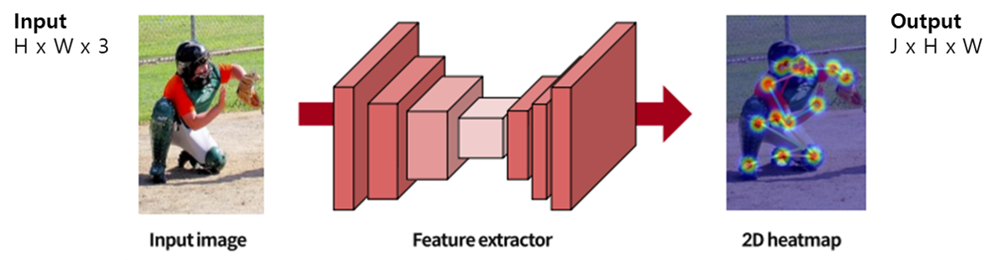
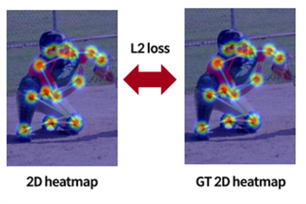
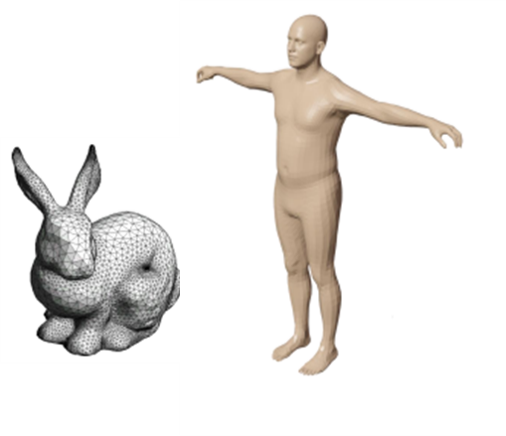
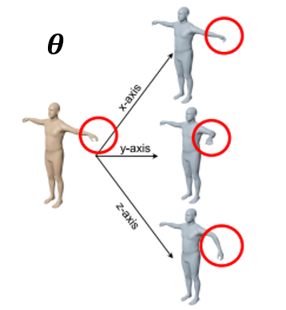
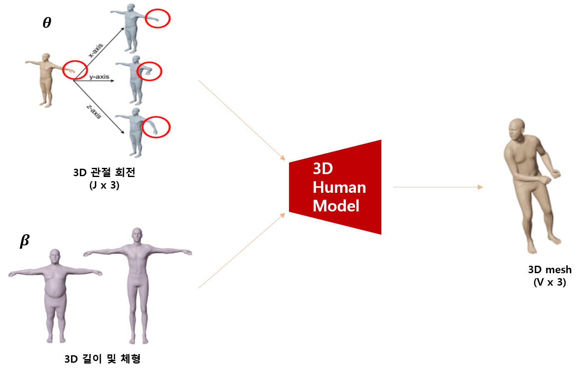

# 2D Pose Estimation
## 2D Human Pose Estimation OverView
- 입력 이미지로부터, 여러 사람의 관절을 2D 공간에 위치화 시키는 알고리즘

 

### Simple 2D HPE

 

 

- 가장 대표적인 MSCOCO dataset은 17개의 관절을 정의
- 입력 이미지 (H x W x 3) 으로부터 좌표를 추정함
    - H : 이미지의 height
    - W : 이미지의 width
    - 3 : Channel 수 
- Output은 N x J x 2 로 구성
    - N : 사람의 수, 입력 이미지마다 다름
    - J : 관절 개수를 의미, 보통 dataset마다 정해진 상수 (COCO dataset은 17)
    - 2 : 2D 좌표 값
- 가장 간단하지만 좌표를 추정하는 방식은 거의 사용하지 않음

 

### Basic 2D Human Pose Estimation Training (Single)

 

 

- 입력 이미지의 특징을 Feature extractor가 추출
    - 보통 Resnet, Hourglass Network 이용
- 2D heatmap (J x H x W) 추정
    - J : 관절 개수 의미
    - H : Heatmap의 높이
    - W : Heatmap 너비
    - J 번째 2D heatmap 마다 하나의 Gaussian blob이 J 번째 관절의 위치 중심에 만들어짐 
        - mean : 관절의 위치
        - std : 미리 지정한 hyper-parameter
- J 번째 2D heatmap에 argmax 적용하여 J 번째 관절의 x,y 좌표 출력
    - 최종적인 Output은 (J x 2) 또는 (J x 3)
        - x,y 좌표에 confidence score가 포함되는 경우 존재

 

 

- Ground truth 2D 좌표로 부터 얻어진 GT 2D heatmap과 추정된 2D Heatmap과의 L2 loss를 최소화하는 방향으로 학습 진행
- 관절이 입력 이미지에 정의가 안되어 있는 경우 (Occulusion, 잘림 등의 현상)
    - 정의되어 있지 않은 관절들은 loss를 0으로 설정
        - 신경을 쓰지 않겠다는 의미

 

- 직접적으로 좌표를 추정하지 않고 2D Heatmap을 추정하는 이유
    1. 높은 성능
        - Cost 자체는 좌표가 더 좋지만 (J x 2), 정확도의 차이가 꽤 많이 남
    2. 2D 좌표의 직접적인 추정 비선형적 연산 요구
        - 이미지는 H, W 개념 존재
        - Feature extractor 역시 Fully convolutional network 이기 때문에 H, W 개념 보존
            - downsampling, upsampling 개념이 존재하기 때문에 크기는 변할 수 있지만 여전히 H, W 개념 보존
        - 좌표를 구하기 위해서는 보통 GAP (Global Average Pooling) 하여 특징을 vectorize 하고 좌표를 추정
            - 입력 이미지의 H, W 개념이 없어지고 비선형적인 연산을 요구하여 낮은 성능 야기한다는 것이 실험적으로 알려짐
        - 2D heatmap은 연속적인 convolutional 만으로도 추정 가능 
    - 물론 2D 좌표를 사용하는 경우 Demension이 작기 때문에 computational cost 적게들기는 하나 정확도 차이가 많이 남

 
 

## Challenges of 2D Human Pose Estimation
- Occulusion
    - 콘서트장이나 운동장 같은 곳 
    - 지금도 해결해 나가고 있는 문제
- 복잡한 자세
    - 일상 생활 외의 자세 (요가, 필라테스 등등)
- 작은 해상도
    - CCTV를 이용한 범죄 감지 등에서 자주 발생
- 모션 블러
    - 입력 이미지의 정보가 불안전
    - 사람이 빨리 움직이거나 또는 사진 찍으면서 손이 흔들리는 경우
- 이미지 잘림
    - Human Pose Estimation의 경우 관절 Joint의 개수가 정해져 있기 때문에 이상하게 결과가 나오는 경우 존재

 
 

## Top-Down approach
- **Human detection + Single person pose estimation**
- Bottom-up 방식보다 더 뛰어난 정확성
- 최근 발표된 yolo 등의 매우 정확한 human detection network 존재
    - Bottleneck은 single person pose estimation에서 발생
    - Human detection이 실패하면 아예 single person pose estimation이 불가능하다는 단점이 존재하나 detector의 성능이 좋아져 어느정도 해결
- Human pose estimation에 쓰이는 이미지가 매우 고해상도
    - Human detection 한 후 resize 하기 때문에 해상도가 낮아 손목, 발목 등이 잘 안보이는 단점 해결 
- Bottom-up approach들보다 비효율적
    - 2개의 분리된 시스템이기 때문
- 대표적인 방식 
    - Mask R-CNN (ICCV 2017)
    - Simple Baseline (ECCV 2018)
    - HRNet (CVPR 2019)
 
 

## Bottom-Up approach
- **Joint detection + Grouping**
- Top-down approach들보다 낮은 정확성
- Human pose estimation에 쓰이는 사람 입력 이미지가 저해상도일 가능성 존재
    - Top down 방식처럼 resize하지 않기 때문
    - 여러 scale의 사람들을 다뤄야하기 때문에 network에 부담이 갈 수 있음
- Top-down approach 들보다 더 효율적
- 대표적인 방식 
    - Associative Embdeeing
    - HigherHRNet

 
 
 
 

# 3D Pose Estimation
## 2D 와 3D 차이
- 임의의 **시점(view)** 으로 대상을 표현 할 수 있는지가 근본적인 차이

 

    

 

- 2D는 다른 view에서의 pose 볼 수 없음
- 3D는 시점을 변경하여 다른 view에서 pose 보는 것 가능

 
 

## 3D Human Pose Estimation OverView
- 입력 이미지로부터 사람의 관절을 3D 공간에 위치화 시키는 알고리즘

 

### 3D human pose
- 3D 관절 좌표
    
     
    
    

    
     

    - 3D 표면 (mesh) 로 표현 불가능
    - 점 : 관절
    - 선 : Kinematic chain 정보 (관절 연결 정보)

     

- 3D 관절 회전 
    
     

    

     

    - 3D 표면 (mesh) 로 표현 불가

 

### 3D Human Mesh
- 3D objec를 표현하는 가장 standard한 자료구조

 

 

- 많은 수의 작은 삼각형의 모음으로 3D 물체의 표면을 표현
    - 내부와 외부는 비어있음
- 꼭짓점과 면으로 구성
- 다름 물체 표현 법에 비해 표율적이고 직관적이기 때문에 가장 많이 사용
    - ex> volumne (메모리 많이 차지하기 때문에 비효율적)
- 삼각형의 **꼭지점의 개수**와 **각 면을 이루는 꼭지점들의 index**는 상수라고 가정하고 꼭지점들의 3D 좌표를 구하는 것이 목표
    - 각 면을 이루는 꼭지점들의 index는 어떤 삼각형 index가 면을 이루는지를 의미 

 

### 3D Human Model
- 3D Pose Estimation에는 2개의 orthogonal한 input 존재
    - 3D 관절 회전
        
         

        

         

        - 같은 shape 일 때 joint의 위치 회전

         

    - 3D 길이/체형

         

        

         

        - 같은 pose 일 때 길이, 체형 차이

 

- 3D Human Model

 

 

- 3D 관절 회전과 다른 파라미터들로부터 3D mesh를 출력하는 함수
- 입력과 출력 사이의 관계를 "model" 이라고 함
- 3D 관절 회전을 