# 3D Human Pose Estimation
3D Pose Estimation에 대한 기본 내용 정리

 
 

## 2D 와 3D 차이
- 임의의 **시점(view)** 으로 대상을 표현 할 수 있는지가 근본적인 차이

 

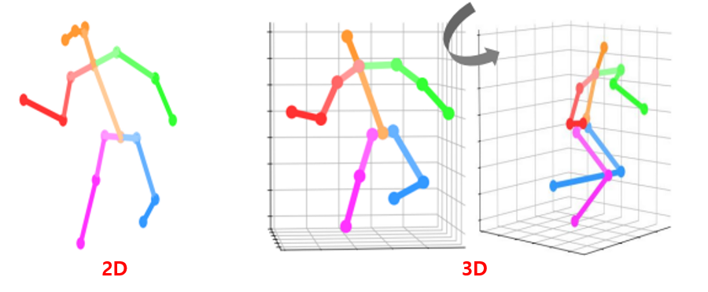
    

 

- 2D는 다른 view에서의 pose 볼 수 없음
- 3D는 시점을 변경하여 다른 view에서 pose 보는 것 가능
    - 더 풍부한 정보를 가지고 있음

 
 

## 3D Human Pose Estimation OverView
입력 이미지로부터 사람의 관절을 3D 공간에 위치화 시키는 알고리즘

 

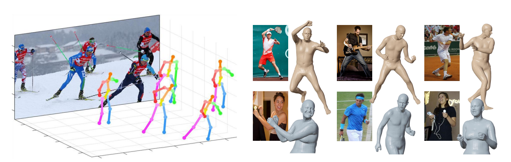

 

### 3D human pose
3D에서의 pose는 관절 좌표, 관절 회전 모두에게 사용

 

- 3D 관절 좌표
    
     
    
    
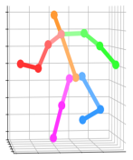

    
     

    - 3D 표면 (surface, mesh) 으로 표현 불가능
    - 점 : 관절
    - 선 : Kinematic chain 정보 (관절 연결 정보)

     

- 3D 관절 회전 
    
     

    
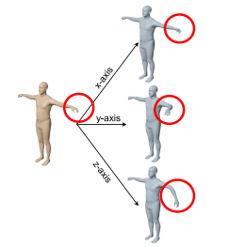

     

    - 3D 표면 (surface, mesh) 으로 표현 가능
        - 관절의 좌표만으로는 회전을 표현할 수 없음
    - 팔꿈치가 움직이면 팔꿈치의 자식 관절들만 움직임
    - 길이가 있다면 엄밀히 말해 6D (각도 3 + 위치 3)

 

### 3D Mesh
- 3D objec를 표현하는 가장 standard한 자료 구조

 

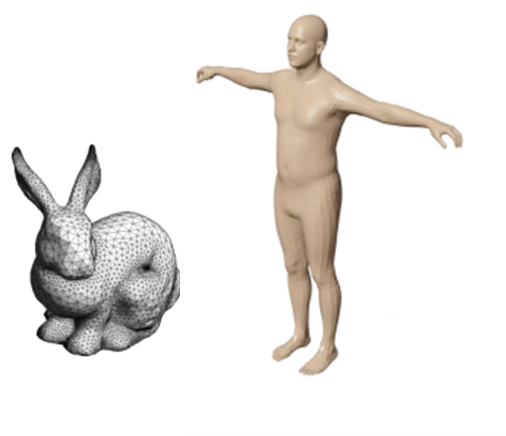

 

- 3D object를 많은 수의 작은 삼각형의 모음으로 3D 물체의 표면을 표현
    - 내부와 외부는 비어있음
- 꼭짓점(vertex)과 면(face)으로 구성
- 다른 물체 표현법(volume, point cloud) 비해 효율적이고 직관적이기 때문에 가장 많이 사용
    - ex> volumne (메모리 많이 차지하기 때문에 비효율적)
- 삼각형의 **꼭지점의 개수**와 **각 면을 이루는 꼭지점들의 index**는 상수라고 가정하고 꼭지점들의 3D 좌표를 구하는 것이 목표
    - 꼭짓점(vertex)은 삼각형의 각 꼭지점을 의미
    - 각 면을 이루는 꼭지점들의 index는 어떤 삼각형 index가 면을 이루는지를 의미 
    - 예를 들어 두 번째 손가락 손톱은 vertex index 0, 1, 2 로 표현하고 왼쪽 눈은 3, 4, 5 vertex index로 표현
- 3D human mesh estimation의 목표는 꼭짓점들의 좌표를 구하는 것이고 꼭지점의 개수와 꼭지점들의 index를 mesh topology라고 함 

 
 

### 3D Human Model
- 3D Pose Estimation에는 2개의 orthogonal한 input 존재
    - 3D 관절 회전 (Pose)
        
         

        
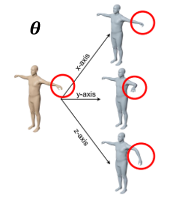

         

        - 같은 shape 일 때 관절 위치 회전
        - Mesh 관점으로 같은 체형일 때 vertex의 위치 변경

         

    - 3D 길이/체형 (Shape)

         

        
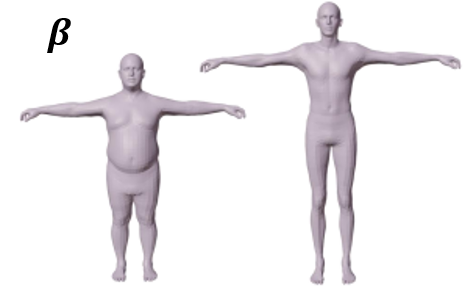

         

        - 같은 t-pose 일 때 길이, 체형 차이

 

- 3D Human Model

 

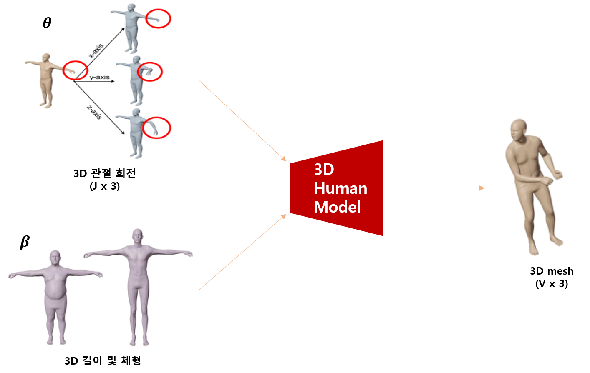

 

- 3D 관절 회전(pose)과 다른 파라미터(Shape)들로부터 3D mesh를 출력하는 함수
- 입력과 출력 사이의 관계를 "model" 이라 함

 
 

### 3D 관절 회전

 

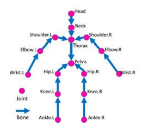

 

- **해당 관절의 부모 관절에 상대적인 3D 회전**을 하고 회전으로 인해 모든 자식 관절들 이동 
    - Human kinetic chain 존재 (joint의 종류마다 다름)
    - Pelvis는 root joint이고 hip, thorax는 pelvis의 child joint
        - Tree 구조
    - 팔꿈치의 3D 회전은 부모 관절인 어깨의 상대적인 3D 회전
    - 즉, 부모 관절의 회전, 위치에 상관없이 독립적으로 pose 모델링 가능
    - 팔꿈치를 움직이면 child node인 손목만 움직이고 팔꿈치를 포함한 부모 관절은 움직이지 않음
- 따라서 leaf node에 해당하는 관절들은 3D 회전이 정의 되어있지 않음
    - Leaf node는 마지막으로 존재하는 child node이고 이 그림에서는 wrist, ankle, head
    - child node가 없기 때 3D 회전이 정의되지 않음
- Root node에 해당하는 관절의 회전은 global rotation(전신의 3D 회전)에 해당

 
 

### 3D 길이 및 체형

 

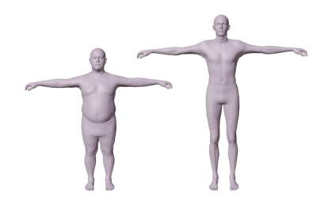

 

- T-pose(zero 3D 관절 회전)를 취한 사람의 길이와 체형에 대한 파라미터
- PCA (Principal Component Analysis)를 통해 사람의 체형과 길이에 대한 latent space를 모델
- PCA의 coefficient를 beta로 사용

 
 

### 3D 길이 및 체형을 위한 PCA
- T-Pose를 취한 큰 규모의 3D scan dataset에 PCA 알고리즘 적용
- PCA를 통해 얻은 PC (Principal Component) 들은 사람 체형을 구분하는 가장 주된 기준 제시
- PCA components에 beta (weights)를 곱한 후 더해서 최종 t-posed 3D mesh를 획득

 

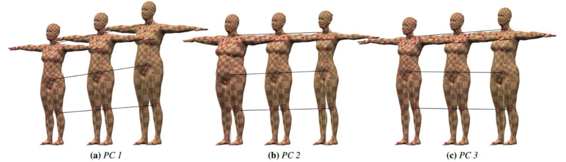

 

- PC1, 2가 가장 큰 영향을 줌
- PC 1
    - 기준이 키인 component
    - beta 값이 달라지면 키가 달라짐
- PC 2
    - 기준이 체형인 component
    - beta 값이 달라지면 체형이 달라짐

 
 

### 3D Human Model Bssic Process

 

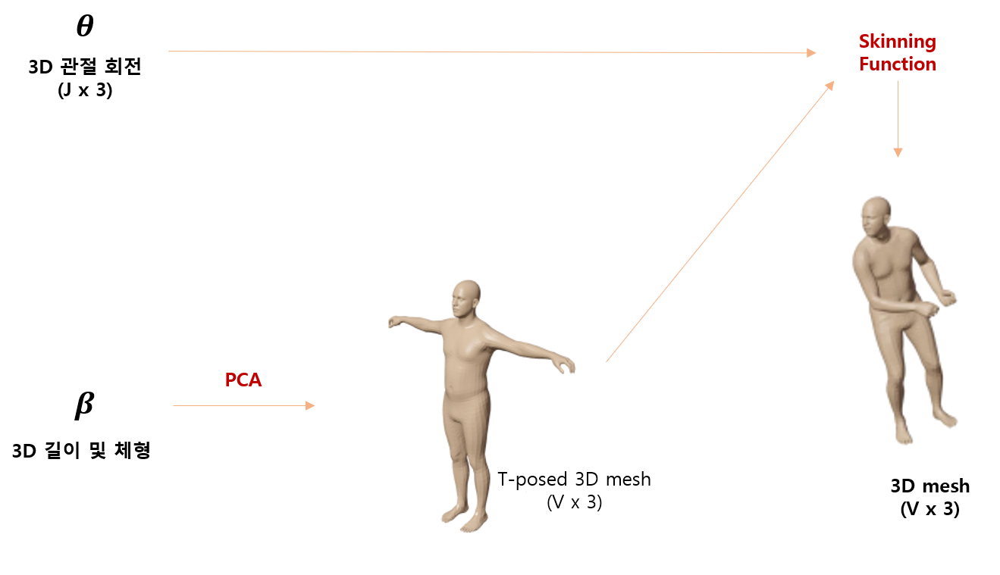

 

- PCA를 통해 3D 사람의 길이 및 체형을 결정
- Skinning Function
    - 관절들의 위치로부터 피부를 입히는 기능
    - Skinning weight를 알아야 함
    - 대표적인 알고리즘으로 **LBS(Linear Blend Skinning)**
- 두 결과에 skining function을 적용하여 pose를 취한 특정 체형의 3D mesh 획득

 

### LBS (Linear Blend Skinning)
- Skinning Weight

     

    

     

    - 각 mesh vertex가 각 관절에 영향을 받는 정도를 의미
        - 새끼손가락의 피부들은 대부분 새끼 손가락의 관절 부분 회전엔 가장 크게 영향을 받음
        - 팔꿈치 근처에 있는 vertex는 팔꿈치의 rotation에 가장 큰 영향을 받음
    - 3D human model 마다 3D artist가 미리 만들어 놓는 weight 존재
        - 그대로 쓰기도 하지만 데이터에 맞춰 optimize 하는 경우도 많음
    - V : mesh의 수를 의미
    - J : 관절의 수

 

- LBS
    - 모든 관절의 변형을 선형(Linear)으로 합쳐서(blend) 3D mesh를 얻는 skinning algorithm

     

    

     

    - 아주 단순해서 좋은 결과를 내기 힘들기 때문에 다양한 correction 방법들이 존재

 

- **LBS, Correction** 을 적용한 Human Model

     

    

    
     

    - LBS의 단점을 보완하기 위한 다양한 correction 방법 적용
        - 대표적인 방법으로는 **pose-dependent correctives**
            - Pose를 취할 때 사람의 살이 중력 등의 여러 요소로 인해 변화하는데 이를 모델링해주어야 함
            - LBS는 선형 function 이기 때문에 표현을 할 수 없음

 
 

## 3D 모델을 만들기 위해 필요한 요소
1. 3D 관절 회전을 정의하기 위한 **human Kinematic Chain** 
2. PCA를 통해 3D 길이 및 체형 space model을 만들기 위한 **여러 체형과 키를 가진 사람의 3D scan 필요**
    - PCA 알고리즘을 적용할 큰 규모의, 다양한 체형의 T-Pose 3D scan 데이터 셋 필요
3. Pose-dependent corrective 를 하기 위한 **여러 포즈를 취한 사람의 3D scan 데이터** 필요
    - 그냥 3D scan 데이터를 얻는 것도 어렵짐나 어려운 포즈 데이터를 얻는 것은 더 어려움
4. **Skinning weight**
    - 주로 3D artist가 만든 후 약간의 fine-tuning 

 
 
