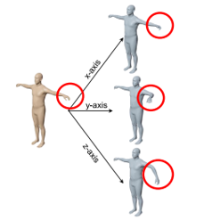
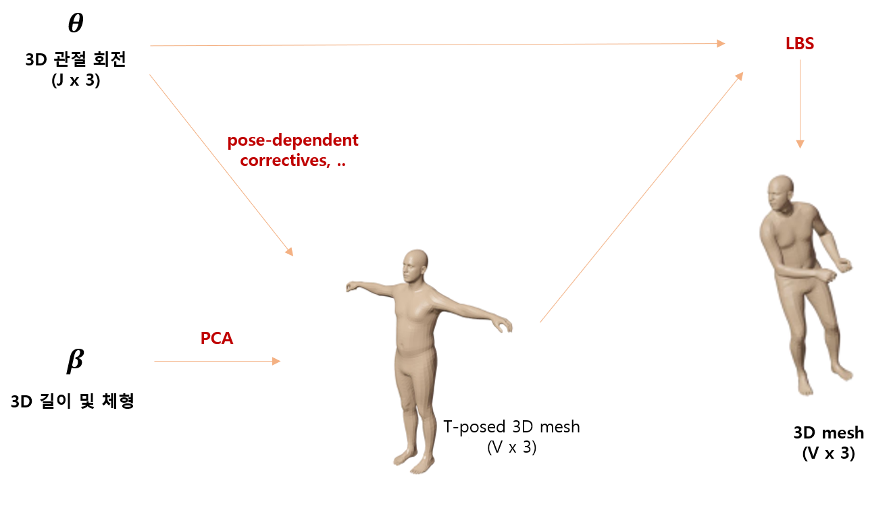

# 2D Pose Estimation

## Human body modeling
### Kinematic

 

 

- 사람의 관절을 포인트로 나타내고 그 관절들의 위치와 관계를 나타내는 모델
- 관절의 개수와 포인트는 학습시키는 데이터 셋마다 다름
- 그래프나 트리로 표현 가능
- 질감이나 특수한 표현을 하는데 제한적

 

### Planar

 

 

- 평면모델 같은 경우는 예전에 많이 사용된 모델
- 인체를 표현하기 위해 body part를 나누어 직사각형의 모양으로 표현
- 지금은 많이 사용하지 않음

 

### Volumetric

 

 

- 요즘 많이 연구되고 있으나 데이터 부족

 
 

### 

## 2D Human Pose Estimation OverView
입력 이미지로부터, 여러 사람의 관절을 2D 공간에 위치화 시키는 알고리즘

 

### Simple 2D HPE (Human Pose Estimation)

 

 

- 가장 대표적인 MSCOCO dataset은 17개의 관절을 정의
- 입력 이미지 (H x W x 3) 으로부터 좌표를 추정함
    - H : 이미지의 height
    - W : 이미지의 width
    - 3 : Channel 수 
- Output은 N x J x 2 로 구성
    - N : 사람의 수, 입력 이미지마다 다름
    - J : 관절 개수를 의미, 보통 dataset마다 정해진 상수 (COCO dataset은 17)
    - 2 : 2D 좌표 값
- 관절의 좌표를 직접적으로 추정하는 방식은 가장 간단한 방식이지만 거의 사용하지 않음

 

### Basic 2D Human Pose Estimation Training (Single)
한 명의 사람의 관절의 좌표를 추측, 추정하는 방법

 

 

- 입력 이미지의 특징을 Feature extractor가 추출
    - 보통 Resnet, Hourglass Network 이용
- 최종적으로 2D heatmap (J x H x W) 추정
    - J : 관절 개수 의미
    - H : Heatmap의 높이
    - W : Heatmap 너비
    - J 번째 2D heatmap 마다 하나의 Gaussian blob이 J 번째 관절의 위치 중심에 만들어짐 
        - mean : 관절의 위치
        - std : 미리 지정한 hyper-parameter
- J 번째 2D heatmap에 argmax 적용하여 J 번째 관절의 x,y 좌표 출력하는 과정을 모든 관절에 적용
    - 최종적인 Output은 (J x 2) 또는 (J x 3)
        - x,y 좌표에 confidence score가 포함되는 경우 존재

 

 

- Ground truth 2D 좌표로 부터 얻어진 GT 2D heatmap과 추정된 2D Heatmap과의 L2 loss를 최소화하는 방향으로 학습 진행
- 관절이 입력 이미지에 정의가 되어 있지 않은 경우 (Occulusion, 잘림 등의 현상)
    - 정의되어 있지 않은 관절들은 loss를 0으로 설정
        - 신경을 쓰지 않겠다는 의미

 

- 직접적으로 좌표를 추정하지 않고 2D Heatmap을 추정하는 이유
    1. 높은 성능
        - Cost 자체는 좌표를 직접적으로 구하는 방법은 (J x 2)으로 더 좋지만 , 정확도의 차이가 꽤 많이 남
    2. 2D 좌표의 직접적인 추정 비선형적 연산 요구
        - 이미지는 H, W 개념 존재
        - Feature extractor 역시 Fully convolutional network 이기 때문에 H, W 개념 보존
            - downsampling, upsampling 개념이 존재하기 때문에 크기는 변할 수 있지만 여전히 H, W 개념 보존
        - 좌표를 구하기 위해서는 보통 GAP (Global Average Pooling) 하여 특징을 vectorize 하고 좌표를 추정
            - 입력 이미지의 H, W 개념이 없어지고 비선형적인 연산을 요구하여 낮은 성능 야기한다는 것이 실험적으로 알려짐
        - 2D heatmap은 연속적인 convolutional 만으로도 추정 가능 
    - 물론 2D 좌표를 사용하는 경우 Dimension이 작기 때문에 computational cost 적게들기는 하나 정확도 차이가 많이 남

 
 

## Challenges of 2D Human Pose Estimation
- Occulusion
    - 콘서트장이나 운동장 같은 곳 
    - 지금도 해결해 나가고 있는 문제
- 복잡한 자세
    - 일상 생활 외의 자세 (요가, 필라테스 등등)
- 작은 해상도
    - CCTV를 이용한 범죄 감지 등에서 자주 발생
- 모션 블러
    - 입력 이미지의 정보가 불안정
    - 사람이 빨리 움직이거나 또는 사진 찍으면서 손이 흔들리는 경우
- 이미지 잘림
    - Human Pose Estimation의 경우 관절 Joint의 개수가 정해져 있기 때문에 이상하게 결과가 나오는 경우 존재

 
 

## Top-Down approach
**Human detection + Single person pose estimation**
- 이미지에서 사람을 먼저 찾고 찾은 각 사람의 영역 안에서 관절을 찾는 방법

 

    

 

- Bottom-up 방식보다 더 뛰어난 정확성
- 최근 발표된 yolo 등의 매우 정확한 human detection network 존재
    - Bottleneck은 single person pose estimation에서 발생
    - Human detection이 실패하면 아예 single person pose estimation이 불가능하다는 단점이 존재하나 detector의 성능이 좋아져 어느정도 해결
- Human pose estimation에 쓰이는 이미지가 매우 고해상도
    - Human detection 한 후 resize 하기 때문에 해상도가 낮아 손목, 발목 등이 잘 안보이는 단점 해결 
- Bottom-up approach들보다 비효율적
    - 2개의 분리된 시스템이기 때문
- 대표적인 방식 
    - Mask R-CNN (ICCV 2017)
    - Simple Baseline (ECCV 2018)
    - HRNet (CVPR 2019)

 
 

## Bottom-Up approach
**Joint detection + Grouping**
- 이미지에 존재하는 관절을 먼저 찾고 그 관절들을 각 사람으로 그룹화 해주는 방법 

 

    

 

- Top-down approach들보다 낮은 정확성
- Human pose estimation에 쓰이는 사람 입력 이미지가 저해상도일 가능성 존재
    - Top down 방식처럼 resize하지 않기 때문
    - 여러 scale의 사람들을 다뤄야하기 때문에 network에 부담이 갈 수 있음
- Top-down approach 들보다 더 효율적
- 대표적인 방식 
    - Associative Embdeeing
    - HigherHRNet

 
 
 
 

# 3D Pose Estimation
## 2D 와 3D 차이
- 임의의 **시점(view)** 으로 대상을 표현 할 수 있는지가 근본적인 차이

 

    

 

- 2D는 다른 view에서의 pose 볼 수 없음
- 3D는 시점을 변경하여 다른 view에서 pose 보는 것 가능

 
 

## 3D Human Pose Estimation OverView
입력 이미지로부터 사람의 관절을 3D 공간에 위치화 시키는 알고리즘

 

 

### 3D human pose
- 3D 관절 좌표
    
     
    
    

    
     

    - 3D 표면 (surface, mesh) 으로 표현 불가능
    - 점 : 관절
    - 선 : Kinematic chain 정보 (관절 연결 정보)

     

- 3D 관절 회전 
    
     

    

     

    - 3D 표면 (surface, mesh) 으로 표현 가능
    - 팔꿈치가 움직이면 팔꿈치의 자식 관절들만 움직임
    - 엄밀히 말해 6D (각도 3 + 위치 3)

 

### 3D Human Mesh
- 3D objec를 표현하는 가장 standard한 자료 구조

 

 

- 많은 수의 작은 삼각형의 모음으로 3D 물체의 표면을 표현
    - 내부와 외부는 비어있음
- 꼭짓점(vertex)과 면(face)으로 구성
- 다른 물체 표현법(volume, point cloud) 비해 효율적이고 직관적이기 때문에 가장 많이 사용
    - ex> volumne (메모리 많이 차지하기 때문에 비효율적)
- 삼각형의 **꼭지점의 개수**와 **각 면을 이루는 꼭지점들의 index**는 상수라고 가정하고 꼭지점들의 3D 좌표를 구하는 것이 목표
    - 각 면을 이루는 꼭지점들의 index는 어떤 삼각형 index가 면을 이루는지를 의미 

 

### 3D Human Model
- 3D Pose Estimation에는 2개의 orthogonal한 input 존재
    - 3D 관절 회전
        
         

        

         

        - 같은 shape 일 때 joint의 위치 회전

         

    - 3D 길이/체형

         

        

         

        - 같은 pose 일 때 길이, 체형 차이

 

- 3D Human Model

 

 

- 3D 관절 회전과 다른 파라미터들로부터 3D mesh를 출력하는 함수
- 입력과 출력 사이의 관계를 "model" 이라고 함

 

### 3D 관절 회전
- **해당 관절의 부모 관절에 상대적인 3D 회전**
    - 어께를 움직이면 child node인 팔꿈치와 손목만 움직이고 나머지는 움직이지 않음
    - 즉, 부모 관절의 위치, 회전에 상관없이 독립적인 pose로 모델링이 가능
- 회적으로 인해 모든 자식 관절들 이동
- 따라서 leaf node에 해당하는 관절들은 3D 회전이 정의 되어있지 않음
    - child node가 없기 때문
- Root node에 해당하는 관절의 회전은 global rotation(전신의 3D 회전)에 해당

 

### 3D 길이 및 체형
- T-pose(zero 3D 관절 회전)를 취한 사람의 길이와 체형에 대한 파라미터
- PCA를 통해 사람의 체형과 길이에 대한 latent space를 모델
- PCA의 coefficient를 beta로 사용
- PCA를 통해 얻은 PCA components들은 사람 체형들을 구분하는 가장 주된 기준을 나타냄
- PCA componentes에 beta를 곱한 뒤, 더해서 최종 t-posed 2d mesh를 얻음

 

 

- PC 1
    - 기준이 키인 component
    - beta 값이 클 수록 큰 사람
- PC 2
    - 기준이 체형인 component
    - beta 값이 작을 수록 

 

### 3D Human Model Bssic Process

 

 

- PCA를 통해 3D 사람의 길이 및 체형을 결정
- Skinning Function
    - 관절들의 위치로부터 피부를 입히는 기능
    - Skinning weight를 알아야 함
    - 대표적인 알고리즘으로 **LBS(Linear Blend Skinning)**
- 두 결과에 skining function을 적용하여 pose를 취한 특정 체형의 3D mesh 획득

 

### LBS (Linear Blend Skinning)
- Skinning Weight

     

    

     

    - 각 mesh vertex가 각 관절에 영향을 받는 정도를 의미
        - 새끼손가락의 피부들은 대부분 새끼 손가락의 관절 부분 회전엔 가장 크게 영향을 받음
        - 팔꿈치 근처에 있는 vertex는 팔꿈치의 rotation에 가장 큰 영향을 받음
    - 3D human model 마다 3D artist가 미리 만들어 놓는 weight 존재
        - 그대로 쓰기도 하지만 데이터에 맞춰 optimize 하는 경우도 많음
    - V : mesh의 수를 의미
    - J : 관절의 수

 

- LBS
    - 모든 관절의 변형을 선형(Linear)으로 합쳐서(blend) 3D mesh를 얻는 skinning algorithm

     

    

     

    - 아주 단순해서 좋은 결과를 내기 힘들기 때문에 다양한 correction 방법들이 존재

 

- **LBS, Correction** 을 적용한 Human Model

     

    

    
     

    - LBS의 단점을 보완하기 위한 다양한 correction 방법 적용
        - 대표적인 방법으로는 **pose-dependent correctives**
            - Pose를 취할 때 사람의 살이 중력 등의 여러 요소로 인해 변화하는데 이를 모델링해주어야 함
            - LBS는 선형 function 이기 때문에 표현을 할 수 없음

 
 

## 3D 모델을 만들기 위해 필요한 요소
1. 3D 관절 회전을 정의하기 위한 **human Kinematic Chain** 
2. PCA를 통해 3D 길이 및 체형 space model을 만들기 위한 **여러 체형과 키를 가진 사람의 3D scan 필요**
    - PCA 알고리즘을 적용할 큰 규모의, 다양한 체형의 T-Pose 3D scan 데이터 셋 필요
3. Pose-dependent corrective 를 하기 위한 **여러 포즈를 취한 사람의 3D scan 데이터** 필요
    - 그냥 3D scan 데이터를 얻는 것도 어렵짐나 어려운 포즈 데이터를 얻는 것은 더 어려움
4. **Skinning weight**
    - 주로 3D artist가 만든 후 약간의 fine-tuning 

 
 
