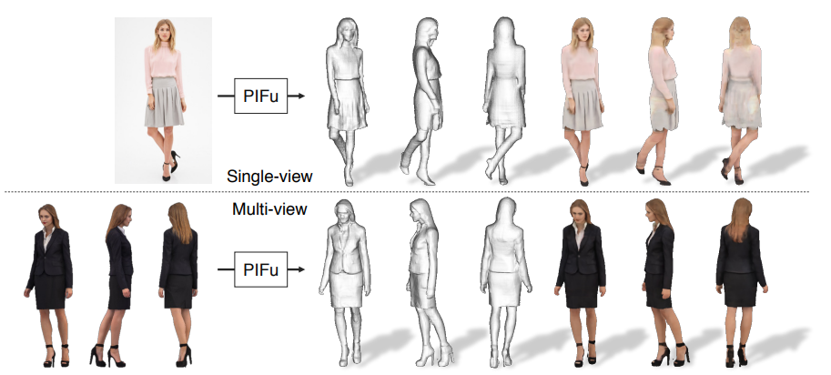
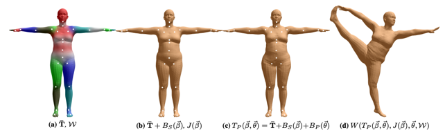
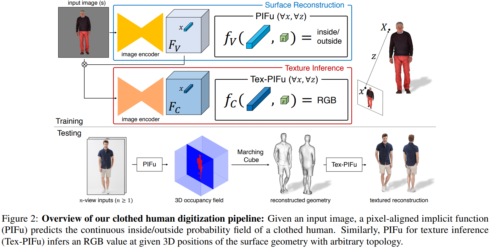
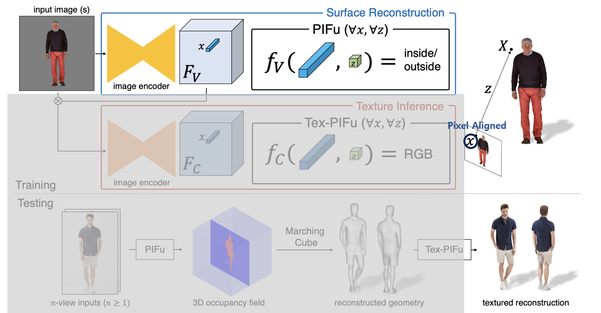
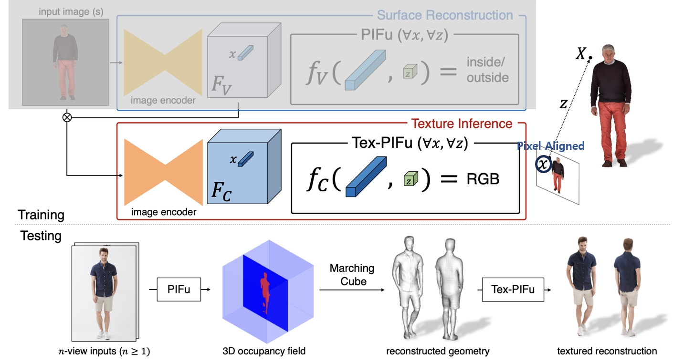
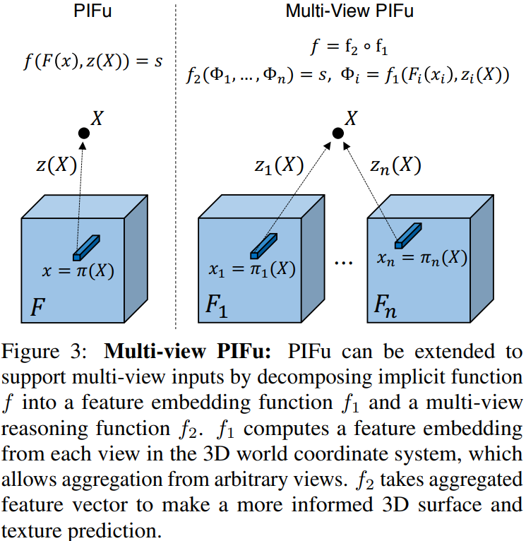

#  PIFU
[PIFu: Pixel-aligned implicit function for high-resolution clothed human digitization](https://arxiv.org/pdf/1905.05172.pdf) (ICCV 2019)

 

## 3D Human Digitization
- 궁극적으로 PIFU가 해결하고자 하는 문제는 Image-based 3D Human digitization
- 2차원의 사람 이미지가 한 장 또는 여러 장이 주어졌을 때, 그 사람을 표현하는 모델을 예측하는 task

 

 

- 이를 이용하여 AR/VR, metaverse, Movie, Game 등에 사용

 
 

### 3D Human Digitization 중요성
- 전문적인 기술과 다수의 촬영 장비가 필요함
- 기존 영화나 게임에서 사용하는 3D virtual human modeling 기술은 매우 비용이 많이 들어감
- 3D Human Digitization을 활용하여 이미지로부터 자동으로 3D human model을 얻을 수 있다면 그 비용 획기적으로 줄일 수 있음 

 
 

## Previous Work
### Paraametric Model 

 

 

- 3D Body Model 이라고도 함
- 이미지로부터 바로 3D mesh나 point cloud 등의 geometry한 구조를 예측하는 것은 어렵기 때문에 parameteric model을 사용하여 3D human modeling 함
- Template model에서 model의 여러 attribute를 data로 배울 수 있는 statical body model 정의 
    - SMPL은 사람의 체형, 자세, 자세에 따라 달라지는 관절의 위치 관계 등을 바탕으로 임의의 체형을 가진 사람의 임의의 자세를 사실적으로 표현하는 statistical model 제안
- Naked Human body에만 적용 가능
    - 더 사실적으로 나타내기 위한 옷, 머리 스타일 등을 표현 못함
- 미리 정의된 topology 사용하기 때문에 복잡한 topology 표현 못함
    - 옷, 드레스, 머리카락 등

 
 

### Voxel-based represnetation
- 입력 이미지로부터 뽑은 feature를 바탕으로 사람의 포즈와 semantic 정보를 추출한 후 3차원 공간에 사람을 나타내는 voxel grid를 직접 예측하는 방법
- 비교적 간단한 구조로 작동
- Voxel representa의 과도한 메모리 사용
    - 한 voxel의 크기가 작아질수록 세제곱으로 memory requirement 증가

 
 

## PIFu: Pixel-Aligned Implicit Function
### Overall Pipeline

 

 

- 입력 이미지로부터 image encoder를 사용하여 feature 추출 
- Feature를 implicit function에 입력하여 3차원 공간의 occupancy 예측
- Voxel과 같은 explicit, 명시적 데이터 표현으로 사람을 나타내는 것이 아닌, 하나의 함수 형태로 주어진 좌표에 해당하는 공간이 함수에서 사람의 표면 밖인지 나타냄으로 3D human 을 나타냄 
- 예측된 3D implicit occupancy field로부터 marching cube 방법을 이용하여 3D mesh 추출 가능
- 또 다른 implicit function을 이용하여 mesh의 texture를 예측하여 최종 결과물 생성

 
 

### Surface Reconstruction

 

 

- Image Encoder를 이용해 feature를 추출하고 이 값을 바탕으로 occupancy field로 mappling 해주는 implicit function 헉습
- Implicit function의 입력은 현재 occupancy value를 알고자하는 3차원 공간의 x좌표 값과 해당 3차원 좌표값을 이미지에 projection 했을 때 얻어지는 pixel의 feature 값을 입력으로 받음

 

- 입력은 사람이 존재하는 이미지를 카메라 포즈를 이용해 해당 3차원 좌표 $X$ 를 이미지 좌표 위로 projection 시킴
- 이미지 위에 위치하는 projection된 픽셀 좌표를 $x$ 라 하면 implicit functuion은 해당 $x$ 좌표의 feaeture와, depth 값인 $z$ 으로 함
- implicit function은 이를 바탕으로 $X$ 좌표가 사람의 표면 내부의 점인지 아닌지 판단하는 occupancy 값 출력
    - 출력값이 1, 사람 표면 내부 점을 의미
    - 출력값이 0 , 사람 표면 밖인 점을 의미
- 3차원 좌표 $X$를 이미지 위의 픽셀값과 align 시키고, 그 align을 통해 얻은 2D image feature를 활용한다는 관점에서 Pixel aligned implicit function이라는 이름 가짐

 
 

#### Single-view Surface Reconstruction
- Predicted Occupanccy function

     

    $ f(F(x),z(X))=s:s\in \mathbb{R}$

     

- Groundtruth Occupancy function

     

    $f_{v}^{*}(X)=\left\{\begin{matrix}
    0,\ \  if \ X \ is \ inside \ mesh \ surface \\
    1, \ \ otherwise \end{matrix}\right. $

     

- MSE loss
    - Implicit occupancy function을 학습시키는 loss

     

    $L_{V}=\frac{1}{n}\sum_{i=1}^{n}\left|f_{v}(F_{V}(x_{i}),z(X_{i}))-f^{*}_{v}(X_{i})\right|^{2}$

     

    
 
 

#### Spatial Sampling 
- 3차원 모든 공간에 대하여 loss를 계산 할 수 없기 때문에 loss 계산에 사용할 sample point를 골라야 함
- 이 Sample point를 어떻게 고르는지에 따라서 최종 결과에 많은 영향을 미침
- 단순하게 균일하게 분포되어있는 격자 포인트를 사용하는 경우에는 대다수의 점들이 human surface가 멀리 떨어진 점
- 모든 점들이 human surface 근처에 있다면 overfitting이 발생

 

- Uniform sampling과 adaptive sampling을 같이 사용
    - 3D human mesh의 표면에 일정 개수의 샘플 포인트를 고르고, 골라진 샘플 포인트 좌표들에 약간의 랜덤 노이즈를 가한 포인트들을 학습에 사용
    - 일정 개수의 균일하게 분포하고 있는 격자 점들을 학습하여, overfitting을 방지

 
 

### Texture Inference

 

 

- Reconstruct 한 Human의 body mesh surface의 texture를 에측하여 사진에 표현되어 있는 human texture를 3차원을 전이 
- 별도의 image encoder와 pixel aligned implicit function이 사용됨
- Image encoder의 입력으로 입력 이미지 뿐만이 아니라 Occupancy image encoder의 feature map이 함께 들어감
    - 단순하게 입력 이미지만 입력으로 받으면 해당 이미지 encoder는 texture를 예측함과 동시에 human geometry 까지 함께 예측해야 한다는 부담이 생기기 때문
    - 이로 인해 texture image encoder는 texture prediction에만 집중 할 수 있음

 
 

### Multi-View Stereo

 

 

- Single-view 뿐만이 아니라 Multi-view 정보를 이용하여 더 정확하게 reconstruction 할 수 있도록 확장 할 수 있음

 

- 기존 single-view reconstructio 상황에서 사용했던 pixel aligned implicit function을 2개의 function으로 decomposition
    - Feature embedding function $f_{1}$
    - Multi-view resoning function $f_{2}$
- $f_{1}$ 은 feature embedding 함수롤 image encoder를 이용해 입력으로 들어온 각각의 이미지의 feature를 추출
- 각 이미지의 카메라 포즈를 이용하여 pixel aligned 시킨 후, aligned된 image feature vector와 depth를 이용하여 intermediate feature $\phi$를 추출
- 이렇게 뽑힌 n개의 intermediate feature들은 average pooling 된 후 $f_{2}$ 인 multi-view reasoning 함수의 입력으로 들어가 최종적으로 3차원 좌표의 occupancy 값으로 맵핑

 
 

## Experiments
### Implementation Detail
- Surface reconstrunction ($f_{v}$)
    - Stacked Hourglass
        - BatchNorm -> GroupNorm
- Texture Inference ($f_{c}$)
    - CycleGAN의 6개의 residual block
- Implicit Function
    - 6개의 hidden layer를 가진 MLP
    - Leaky ReLU 

 
 

