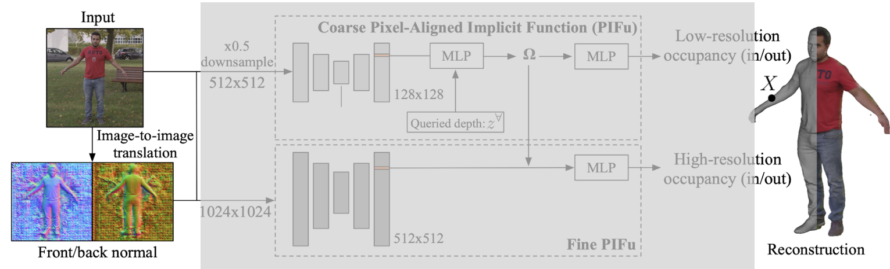

# PIFuHD
PIFuHD: Multi-Level Pixel-Aligned Implicit Function for High-Resolution 3D Human Digitization (Oral presentation)

<br>

## PIFU limitation
- 기존의 3D human digitization 방법들과 비교했을 때는 뛰어났지만, professional capture system 보다는 정확도가 떨어짐
- PIFu는 image encoder의 receptive field 때문에 고해상도의 이미지를 사용할 수 없음 
    - Pixel aligned implicit function이 잘 작동하기 위해서는 이 함수의 입력으로 주어지는 image pixel feature가 이미지 전체에 대한 정보를 가지고 있어야 함
    - 이미지의 지역적 정보만 가지고는 consistent한 3D occupancy 예측하지 못함
    - Receptive field를 늘리는 방법은 2가지가 존재
        - Depth 늘리기
        - 입력 이미지 사이즈 줄이기
    - PIFu는 GPU 물리적 한계로 network depth를 깊게 만드는 것보다 입력 이미지의 사이즈를 줄이는 방법을 선택


<br>
<br>

## Method
### Pixel-Aligned Implicit Function
- 

<br>
<br>

### Multi-level Pixel-Aligned Implicit Function

<br>

<p align=center></p>

<br>


- 기존의 PIFu가 가지고 있는 문제를 해결하기 위해 적용
- Multi-level framework
    - Coarse level
        - PIFu와 마찬가지로 저해상도 입력이미지에서 global geometric 정보를 바탕으로 coarse한 3D occupancy field 예측
    - Fine level
        - 고해상도 이미지를 입력으로 하여 coars level에서 예측한 coarse geometry에 더 정교한 디테일을 더해줌

<br>
<br>


#### Coarse Level

<br>

<p align=center></p>

<br>

- PIFu와 구조적으로 매우 비슷
- 512 x 512 의 이미지를 받아 image encoder를 통해 128 x 128 의 feature 획득
- 이 feature가 pixel-aligned implicit function의 입력으로 들어가 low-resolution occupancy 예측


<br>

$$
f^{L}(X)=g^{L}(\Phi^{L}(x_{L}, I_{L}, F_{L},B_{L}), Z)
$$

<br>

- PIFu와 다른 점이 있다면 추가적으로 입력 이미지에 대한 **forwared normal map ($F_{L}$)** 과 **backward normal map ($B_{L}$)** 을 같이 image encoder의 입력으로 넣어줌
    - Normal map을 얻는 방법은 pix2pixHD 라는 기존의 학습된 image translation network 이용

<br>
<br>

#### Fine Level

<br>

<p align=center></p>

<br>

- Coarse level에서 얻은 coarse한 occupancy에 대한 정보는 fine level로 전달
- Fine Level 에서는 1024 x 1024의 해상도를 가지는 이미지를 입력으로 받아 512 x 512의 feature 획득

<br>


$$
f^{H}(X)=g^{H}(\Phi^{H}(x_{H}, I_{H}, F_{H},B_{H}), \Omega(X))
$$

<br>

- Pixel-aligned implicit function에 depth인 z 값 대신 coarse level에서 얻은 intermediate featrue가 3D embedding으로 들어감 
    - Fine level implicit function은 고해상도 이미지에 대한 global context, holistic reasoning, 즉, receptive field가 이미지 전체를 cover하지 않더라도 coarse level에서 feasture를 추가 입력 받았기 때문에 global 정보에 접근 가능 

<br>
<br>

### Front-to-Back Inference

<br>

<p align=center></p>

<br>

- 미리 학습된 image translation network를 이용하여 입력 이미지를 front normal map, backward normal map 으로 변환
- Single-view에서 관측되지 않는 사람의 뒷모습에 대한 reconstruction이 가능해짐
    - 입력 이미지에서 보지 못한 사람의 뒷모습과 이미지에서 부족했던ㄷ 추가적인 geometric 정보를 제공하여 더 정교한 모습을 예측하게 함

<br>
<br>

### Loss Function and Surface Sampling
#### Surface Sampling 
- PIFU와 유사함
    - 일정 비율의 uniform grid 한 점들
    - 일정 비율의 human surface 위에서 샘플링한 점들
- 그 점들에 대한 loss function 계산

<br>
<br>

#### Loss Function
- Binary Cross Entropy를 활용하여 occupancy에 대한 binary probability를 학습하는 방식

<br>

```math
L_{o}=\sum_{X\in S}\lambda f^{*}(X)\log f^{(L,H)}(X)+(l-\lambda)(1-f^{*}(X))\log (1-f^{(L,H)}(X))
```
<br>
