# TCMR: Beyond Static Features for Temporally Consistent 3D Human Pose and Shape from a Video (CVPR 2021)

 

## Basic
### Video 기반 3D pose estimation
- 대부분의 연구는 단일 이미지에서의 3D pose estimation
- 하지만 많은 application에서는 입력으로 동영상을 받음
    - 하지만 jittering 존재

 

- 매 frame 마다 단일 이미지에서 3D human pose estimation을 이용하여 추론하는 방법이 가장 straightforward한 방법 

     

    
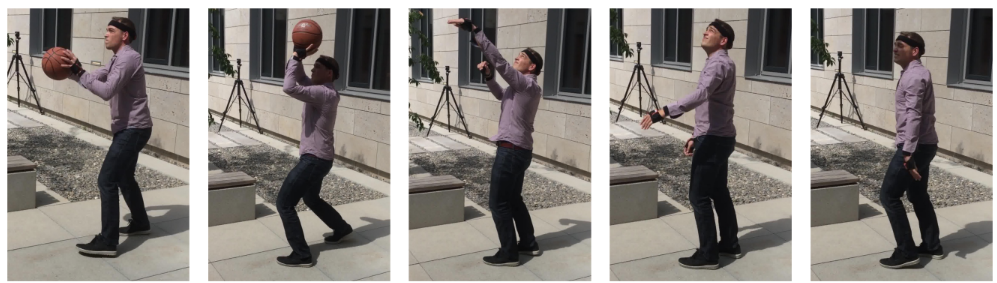

     

- 매 frame 마다 3d pose estimation을 독립적으로 적용하는 경우에는 frame의 motion blur에 대한 대처를 하기 어려움
    - 즉, 한 장의 frame만 보는 경우 어떤 pose인지 알아보기 애매해짐
    - 전, 후 어떤 pose인지 알 수 있다면 감을 잡을 수 있음

 

- 한 frame에 대한 3D human pose estimation은 주변 frame 정보를 활용할 수 없음
- 주변 frame 정보를 활용하는 **temporal module** 필요
    - temporal module : LSTM, GRU, GraphCNN, Transformer, ..
- 같은 데이터 셋을 이용한다면 비디오를 입력으로 하는 것이 더 높은 성능
    - 주변 frame의 정보도 같이 활용하기 때문에 정보의 양이 매우 많아짐

     

    
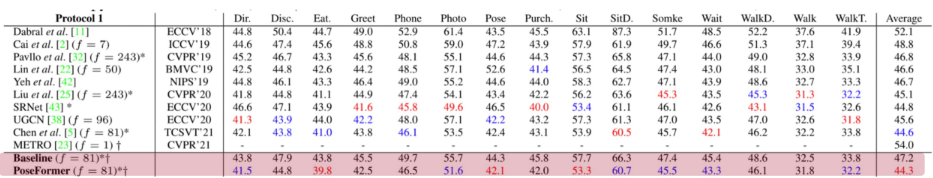

     

 

### Video 3D pose estimation 문제
- 모든 frame을 GPU에 올려야하므로 GPU 메모리가 매우 부족해짐
    - Critical한 문제
- Video를 입력으로 하는 연구 부족
- In the wild video dataset 거의 존재하지 않음 
    - Motion capture dataset은 처음부터 동영상으로 데이터를 얻음
    - 비디오 데이터도 별로 존재하지 않지만 video dataset은 t와 t+1의 데이터가 유사
        - 즉, single RGB image와 video의 데이터 수가 같다면 image의 데이터가 더 다양

 
 

###  Video 3D pose esimation GPU 문제 해결 방안
1. GPU 메모리 문제를 해결하기 위해서 입력을 이미지가 아니라 **2D pose** 로 대체
    - 2d pose의 sequence를 입력으로 받으면 end-to-end training이 가능해짐

     

    
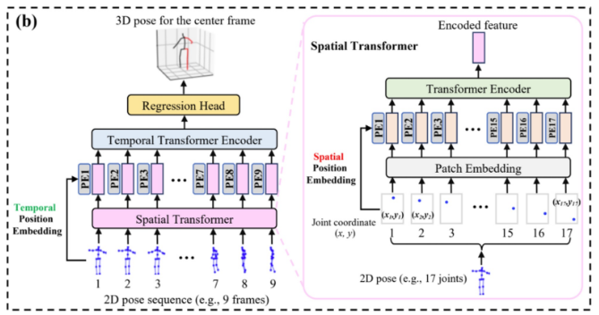

     

 

2. GPU 메모리 문제를 해결하기 위해서 입력을 이미지가 아닌 이미지 **feature** 로 대체
    - 단일 이미지에서 사용하는 pretrained 3D human pose estimation 모델을 이용하여 image feature를 추출하여 저장
    - 비디오에서 3D human pose estimation은 미리 저장해둔 image feature vector를 입력으로 학습 진행
    - Image feature vector이기 때문에 메모리 문제는 해결이 되지만 end-to-end training, data augmentation 불가능 

     

    
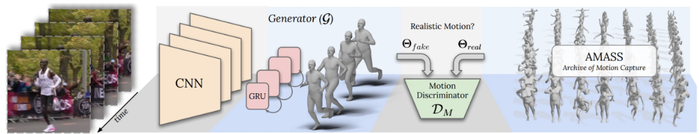

     

 
 

## TCMR

 

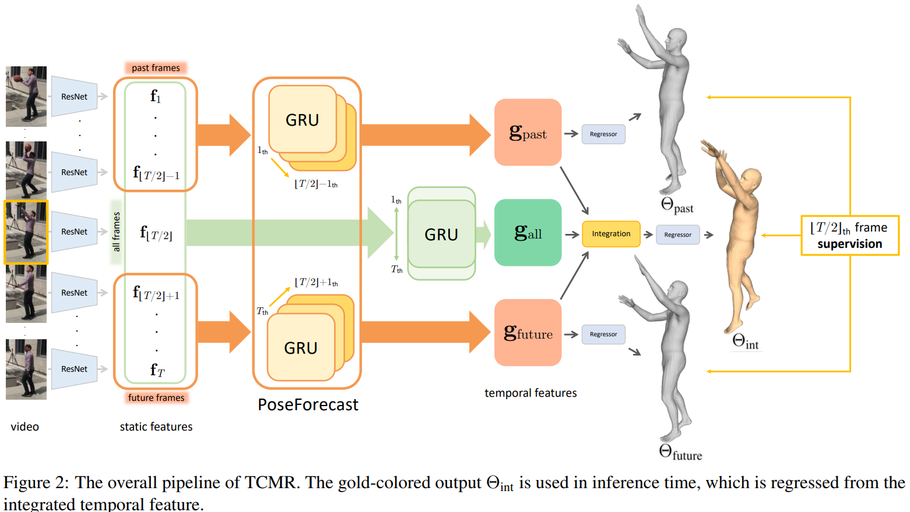

 

### Temporal encodeing from all frames
- 입력 이미지를 pretrained 된 single RGB용 3D pose estimator 인 ResNet 에 통과시켜 **static image feature** 추출
- 모든 frame들의 static image feature 들이 **Temporal Encoder**를 통과시켜 $g_{gall}$ 을 얻음
- 기존에는 static과 temporal feature 사이에 residual connection이 존재했으나 이를 제거
    - 제거하기 전에는 static image feature를 그대로 사용하여 local minima에 쉽게 빠짐
    - 제거하므로 static image feature 에 대한 의존도를 낮춤

 
 

### Temporal encoding by PoseForecast
- 오직 과거와 미래의 frame들을 이용하여 현재 시점의 pose를 예측하기 위해 2개의 PoseForecast 존재 
    - 과거 시점 frame들의 static image feature 들을 이용하여 temporal feature $g_{past}$ 얻음 
    - 미래 시점 frame들의 static image feature 들을 이용하여 temporal feature $g_{future}$ 얻음
- TCMR이 static feature만을 선호하는 것을 방지함

 
 

### Temporal feature integration
- 모든 frame에서 얻은 temporal feature $g_{all}$와 과거 frame들에서 얻은 temporal feature $g_{past}$, 그리고 미래 frame들에서 얻은 temporal feature $g_{future}$를 통합하여 최종 3D mesh를 획득

 

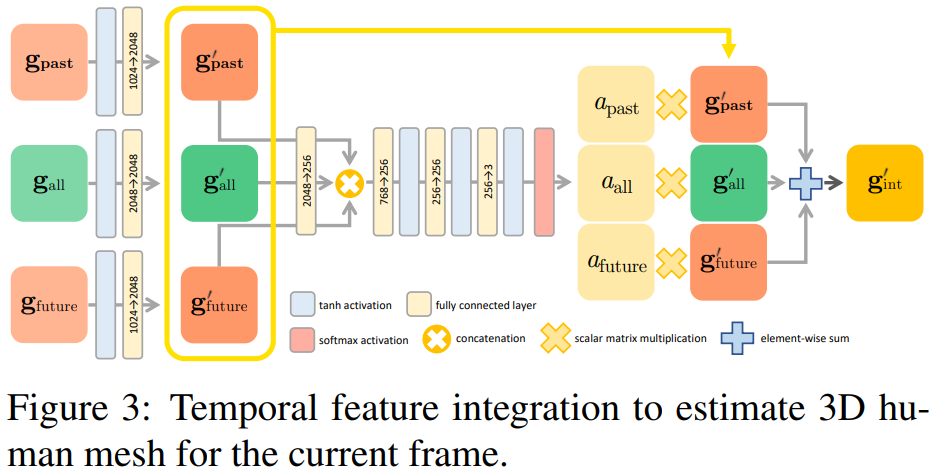

 

- 각 feature들은 ReLU activation function과 FC layer 통과
    - channel dimension을 2048로 바꾸기 위해
    - 각 feasture들이 통과한 결과를 $g^{'}_{all}$, $g^{'}_{past}$, $g^{'}_{future}$
- Weight를 공유한 FC layer를 이용하여 256 으로 resize하고 concatenate
- 몇 개의 FC layer들을 거쳐 attention value를 얻고 이를 이용하여 $g^{'}_{int}$ 을 구함
- 학습 과정에서 $g^{'}_{all}$, $g^{'}_{past}$, $g^{'}_{future}$ 가 SNPL parameter를 구하기 위한 regressor의 입력으로 들어감

 
 

## Experiment
### Ablation Study
**Effectiveness of residual connection removal**

 

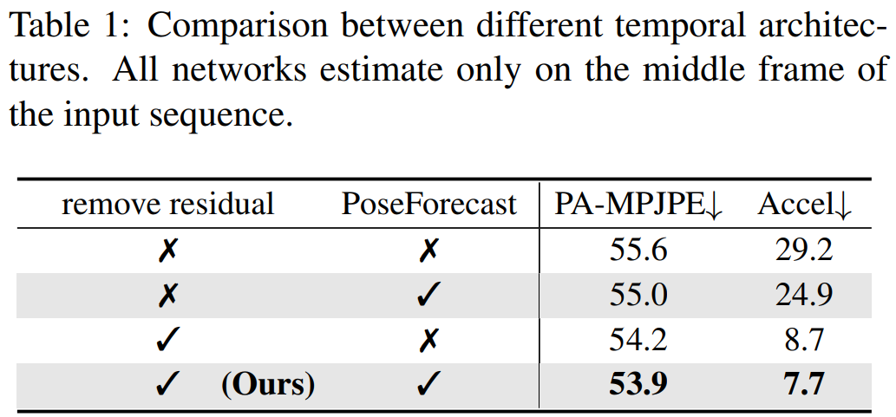

 

- Residual connection을 제거하면 acceleration error가 크게 줄음
    - Acceleration error가 줄으면 temporal consistency와 3D human motion의 smoothness가 증가

 
 

**Effectiveness of PoseForecast**

 

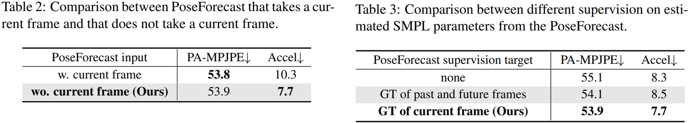

 

- Table 2의 결과로 Current frame이 있으면 static feature이 영향을 많이 주게 된다는 것을 알 수 있음
- Table 3의 결과로 현재의 frame의 pose를 추정하는 것이 더 성능이 좋다는 것을 알 수 있음

 
 

### Comparison with state-of-the-art methods

 

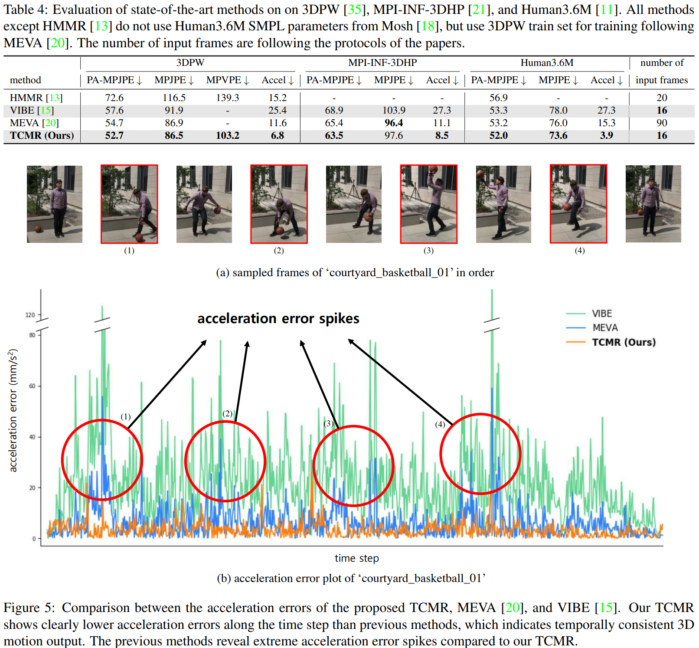

 

- 그림 5의 (a)에서 빨간 박스는 움직임이 큰 frame을 의미하고 (b)에서 다른 알고리즘을 보면 이 frame 부근에서 accleration error가 튀는 것을 볼 수 있음
- TCMR가 temporary consistency가 좋음을 알 수 있음

 

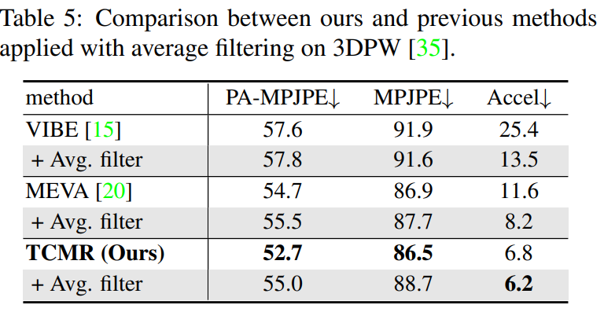

 

- 보통 temporary consistency 한 결과를 얻기 위해서 average filter를 후처리로 적용 
- Filter를 적용하면 accel error는 감소하지만 정확도는 감소함
    - 즉, average filter는 **contextual information** 을 고려하지 못함

 
 

### Comparison with single image-based and video-based methods.

 

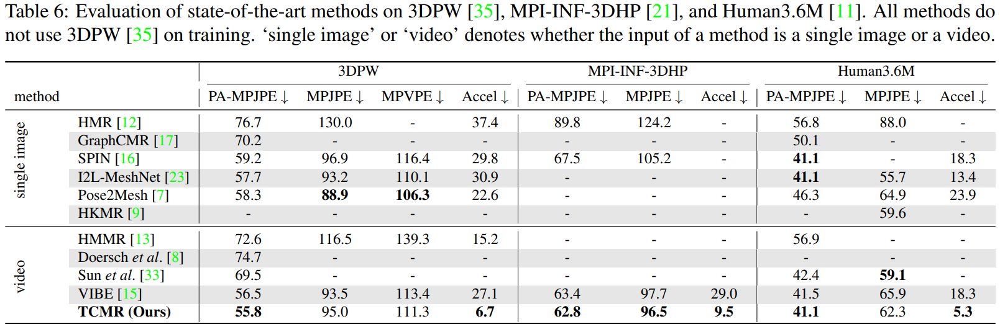

 