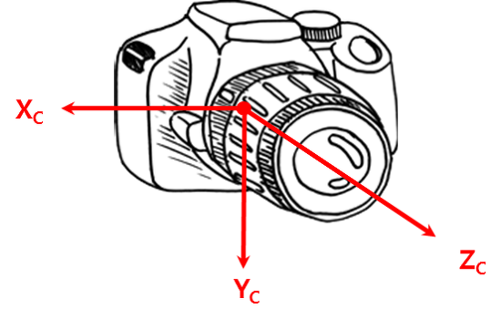
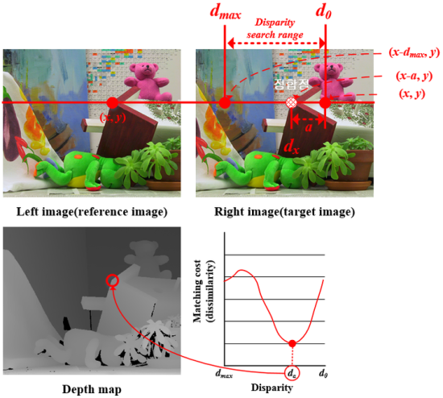
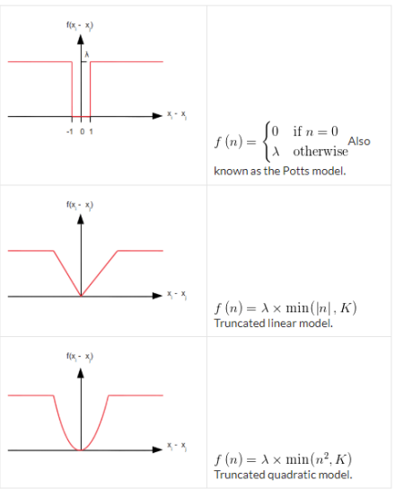

# Coordinate System

 

<a href="https://darkpgmr.tistory.com/77?category=460965">출처</a>

 

## 1. 월드 좌표계 (World Coordinate System)
- 우리가 살고 있는 공간의 한 지점을 기준으로 한 좌표계

 

 
 

## 2. 카메라 좌표계 (Camera Coordinate System)
- 카메라를 기준으로 한 좌표계
- 카메라의 초점(렌즈의 중심)을 원점, 광학축 방향을 Z축, 카메라의 아래쪽 방향을 Y, 오른쪽방향을 X축으로 잡음

 

 

<a href="https://darkpgmr.tistory.com/77?category=460965">출처</a>

 
 

## 3. 영상좌표계 (Image Coordinate System)
- 위의 그림에서 편의상 픽셀 좌표계 (Pixel Image Coordinate System) 라고 부름

 

 

- 3D 공간상의 한 점 &nbsp; 는 카메라의 초점 (또는 렌즈의 초점)을 지나서 이미지 평면의 한 점 에 투영(projection) 

 
 

## 4. 정규 이미지 좌표계 (Normalized Image Coordinate System)
- 1~3 좌표계는 모두 매우 직관적인 좌표계이지만 정규 좌표계는 편의상 도입된 가상의 좌표계
- 카메라 내부 파라미터에 대한 영향을 제거한 이미지 좌표계
- 좌표계의 단위를 없애 정규화 된 좌표계이며 **카메라 초점과의 거리가 1**인 가상의 이미지 평면을 정의하는 좌표계

 

 

- 원점은 정규 이미지 평면의 중점(평면과 &nbsp;의 교점)

 
 

# Epipolar Geometry
- 동일한 사물 또는 장면에 대한 영상을 서로 다른 두 지점에서 획득했을 때, 영상 A와 영상 B의 매칭쌍들 사이의 기하학적 관계를 다루는 것

 

<a href="https://darkpgmr.tistory.com/77?category=460965">출처</a>

 

- 3차원 공간 &nbsp; 가 A에서는 &nbsp; , B에서는 &nbsp; 에 투영
- 두 카메라 원점을 잇는 선과 이미지 평면이 만나는 점을 &nbsp;  , &nbsp; 
    - 이 두점을 epipole 이라 함
- 투영점과 epipole을 잇는 직선() 을 epiline(epipolar line) 이라 함
- 두 카메라 위치 사이의 기하학적 관계인 &nbsp;

 

- A의 영상좌표 &nbsp;와 대응되는 B의 영상좌표 를 유일하게 결정 할 수는 없지만  이 지나는 직선인 epiline &nbsp; 은 유일하게 결정 가능
- 한 영상좌표로부터 다른 영상에서의 대응되는 epiline을 계산해주는 변환행렬 Fundamental Matrix, Essential Matrix

 

### Essential Matrix
- 정규화된 이미지 평면에서의 매칭 쌍들 사이의 기하학적 관계를 설명하는 행렬
    - 카메라 내부 파라미터 행렬인 K가 제거된 좌표계에서의 변환관계
- 영상 A에서는 &nbsp;에 투영되고, 영상 B에서는  &nbsp; 에 투영되었다면 두 영상 좌표 사이에는 다음 관계를 만족하는 행렬이 항상 존재
    - ,  &nbsp;  는 normalized 이미지 평면에서의 homogeneous 좌표

 

 

### Fundamental Matrix
- 카메라 파라미터까지 포함한 두 이미지의 실제 픽셀(pixel) 좌표 사이의 기하학적 관계를 표현하는 행렬
- 영상 A에서는 &nbsp;에 투영되고, 영상 B에서는  &nbsp; 에 투영되었다면 두 영상 좌표 사이에는 다음 관계를 만족하는 행렬이 항상 존재

 

 

 

- 영상 A에 대한 카메라 내부 파라미터 행렬을 &nbsp; , 영상 B에 대한 카메라 행렬을 &nbsp; 라하면 다음 관계를 만족

 

 
 

# Stereo Vision
- 일반 카메라로 찍은 사진은 **이미지의 깊이(Depth of image)** 라는 정보를 얻지 못함
    - Depth of Image
        - 2차원 화면상의 이미지의 각 점들이 카메라로부터 떨어져 있는 거리 
- 사라진 이미지 정보를 복원하기 위해서 또 다른 위치에서 찍은 다른 사진 필요
    - 사람의 눈도 두 개가 있어 같은 물체를 서로 다른 장소(양쪽 각각의 눈 위치)에서 보고 그 영상의 차이를 이용해 거리를 복원
- Stereo Vision
    - 같은 물체에 대해 서로 다른 장소에서 촬영한 여러 이미지에서 물체의 3차원 정보를 계산하는 학문 분야

 
 

## Camera Calibration
- 실제 3차원의 점들이 카메라로 찍은 이미지 상에서 어디에 맺히는지는 영상을 찍을 당시의 카메라의 위치 및 방향에 의해 결정 
- 또한 이미지는 사용된 렌즈, 렌즈와 이미지 센서와의 거리, 렌즈와 이미지 센서가 이루는 각 등 카메라 내부의 기구적인 부분에 의해서 크게 영향을 받음
- 3차원 점들이 영상에 투영된 위치를 구하거나 역으로 영상 좌표로부터 3차원 공간 좌표를 복원할 때에는 이러한 요인을 제거해야만 정확한 계산이 가능
- 카메라 파라미터를 구하는 과정을 카메라 캘리브레이션라고 함
    - 구해서 파라미터를 조절하는 과정이라고 설명하는 논문도 있음 

 

- 핀홀 카메라 모델에서의 3차원 공간상 점들을 2차원 이미지 평면에 투사한 변환 관계

 

 &nbsp;: 키메라 내부 파라미터(intrinsic parameter) 

 &nbsp;: 카메라 외부 파라미터(extrinsic parameter) 

 

### 카메라 내부 파라미터(intrinsic parameters)
- 초점 거리 (focal length)
    - 렌즈중심과 이미지센서(CCD, CMOS 등)와의 거리
    - 

 

- 주점 (principal point)
    - 카메라 렌즈의 중심에서 이미지 센서에 내린 수선의 발의 좌표
    - 

 

- 비대칭 계수 (skew coefficient)
    - 이미지 센서의 cell array의 y 축이 기울어진 정도 

     

    

    
<a href="https://darkpgmr.tistory.com/32#calibration2">출처</a>

     

    

 

### 카메라 외부 파라미터(extrinsic parameters)
-  카메라 좌표계와 월드 좌표계 사이의 변환 관계를 설명하는 파라미터
    - 두 좌표계 사이의 회전(Rotation) 및 평행 이동(translation) 으로 표현
- 카메라를 어떤 위치에 어떤 방향으로 설치했는지에 따라 달라짐
- 외부 파라미터를 구하기 위해서는 내부 파라미터를 먼저 구해야 함

 
 

## Stereo Rectification
- 찾아낸 epipolar line을 평행하게 일치시키는 과정 
- 일반적인 스테레오 카메라에서는 epipolar line이 사선으로 나타남 

 

<a href="http://www.ntrexgo.com/archives/2280">출처</a>

 

- 매칭 문제를 쉽게 해결하기 위해 epipolar line을 평행하도록 이미지를 변환하는 과정을 이미지 렉티피케이션(image rectification)

 

<a href="http://www.ntrexgo.com/archives/2280">출처</a>

 
 

## Stereo Vision 3차원 거리 정보 계산
- 3차원 거리 정보는 시차, 초점 거리(focal length), 베이스라인(baseline) 3가지 요소를 통해 획득 가능
    - 초점 거리 : 렌즈에서 이미지 센서까지의 거리
    - 베이스라인 : 두 카메라의 간격
    - 시차 : 두 영상에서 동일하게 나타나는 물체에 대한 위치 차이(아래 그림에서 x축 위치 차이)
        - x축의 위치 차이만 고려할 수 있는 이유는 Stereo Rectification 과정 거쳤기 때문

 

<a href="http://www.idec.or.kr/upfiles/board/newsletter/201501.pdf">출처</a>

 

 

- 초점 거리와 베이스라인은 물리적요소로 고정 상수, 실제로 필요한 값은 시차이고 이를 Stereo Matching 과정을 통해 도출

 
 

# Stereo Matching
- 기준 영상(reference image)에서의 한 점에 대한 동일한 점을 목표 영상(target image)에서 찾는 과정
    - 즉, 시차 (disparity)를 계산하는 과정 
    - 대부분의 Stereo matching 방법은 disparity estimation에 집중함
- 계산 된 시차 값들을 이미지로 표현하면 흑백영상으로 표현 가능한데 이를 disparity image 또는 depth map 라고 함
    - 시차의 차이가 클수록 가까이에 있는 물체, 즉 밝을 수록 가까이 있는 물체 
- Stereo Matching 전에 camera calibration 과정과 stereo rectification 과정 거치는 것이 좋음

 

 

- Stereo Matching의 보편적 단계
    1. Matching cost computation
        - 동일한 장면이지만 다른 시점을 가진 stereo 영상들로부터 matching 알고리즘을 적용하여 복수의 영상의 같은 pixel 내 서로 유사도를 계산하여 cost를 구하여 3차원 cost volume(x, y, costs) 생성
    2. Cost aggregation
    3. Disparity computation / optimization
    4. Disparity refinement

 

## Stereo Matching Method

 

 

### 1. Local matching method
- 기준 pixel 근처의 작은 영역의 pixel들을 사용하는 방법
- 특징 기반
    - 특징점을 기반으로 matching point를 찾음
    - 최근에는 사용하지 않음 

- 영역 기반
    - 일정 영역(=window)의 픽셀 정보들을 이용하여 matching point를 찾음
    - 일정 크기의 윈도우 내 픽셀 정보들만 사용하기 때문에 global matching에 비해 상대적으로 부정확하지만 간단하고 빠름

    - Matching cost computation
        - SAD(Sum of absolute difference), SSD(Sum of squared difference), NCC(normalized cross correlation), Census transform, Rank transform, .. 

        - **SAD (Sum of Absolute Difference)**
            - 기준 영상과 목표 영상의 disparity search range 내 존재하는 각 pixel에 대한 절대값 차이 계산
            - 범위 내 같은 위치의 pixel들의 절대값 차이를 계산한 후, 계산된 절대값 차이를 합산하여 matching cost로 사용
                - window 내 픽셀 값들의 차이가 크면 클수록 유사하지 않다는 의미
            
         

        

        
<a href="https://blog.naver.com/dldlsrb45/220879732646">출처</a>

         

        - **SSD (Sum of Squared Difference)**
            - SAD와 거의 비슷하지만 matching cost 구하는 방법이 다름
            - window 내 같은 위치의 픽셀 값들의 차이를 계산한 후 제곱하여 합산한 값을 matching cost로 사용 

         

        

        
<a href="https://blog.naver.com/dldlsrb45/220879732646">출처</a>

         

        - **Census transform**
            - 기준 영상과, 목표 영상의 window들 내에 존재하는 중심 pixe과 주변 pixel 값들의 비교를 통해 1 또는 0의 패턴 생성
                - 중심 pixel이 주변 pixel 값보다 크면 1
                - 중심 pixel값 보다 주변 pixel이 크거나 같으면 0
            - 생성된 패턴은 1열의 벡터로 표현하고 이를 Census vector라 함 
            - 기준 영상의 window에 대한 Census vector와 시차 탐색 범위 만큼의 목표 영상의 Census vector를 차이를 계산
                - vector의 요소가 얼마나 다른지 확인 

            - 잡음에 강한 특징

         

        

        
<a href="https://blog.naver.com/dldlsrb45/220880488720">출처</a>

         

        - **Rank transform**
            - 개별적으로 기준 영상의 window와 목표 영상의 window를 설정
            - window 내에 존재하는 pixel들에 Rank 윈도우를 설정
            - Rank wundow를 중심 pixel로 가지고 이동하는 Window를 만들어 중심 pixel과 주변 pixel을 비교하여 1과 0의 값으로 계산(Census transform 처럼)
            - 그 후 1의 수를 세어 Rank window 중심 부분에 해당하는 pixel 위치에 그 값을 넣음
            - 이렇게 만들어진 window들을 SAD 수행하여 Ranking matching cost 값 획득 

         

        

        
<a href="https://blog.naver.com/dldlsrb45/220880488720">출처</a>

         

- Cost Aggregation
    - Adaptive support weight, adaptive support weight, ...
    - **Adaptive Support Weight**
        - 모든 pixel이 같지 않음
            - 가까운 pixel에 더 큰 weight 부여
            - 비슷한 색에 더 큰 weight 부여

 

- Disparity computation / optimization
    - Winner-takes-all
        - 가장 작은 matching cost 값 선택

     

    

     

- Disparity Refinement
    - **Left-right consistency check**, Hole filling, **Weighted median filtering**

 

### 2. Global matching method
- 영상 전체의 정보나 적어도 줄 단위 정보를 사용하는 방법
- 좋은 stereo correspondence 요소
    - Match quality 
        - 각 pixel이 다른 이미지에서 좋은 match pixel을 찾아야 함
    - Smoothness
        - 두 pixel이 인접해있다면, 보통은 같은 거리로 움직여야 함 

 

- **Energy function**
    - Data term과 smoothness term으로 구성

     

    

     

    - **Data term**
        - 다른 이미지에서 좋은 matching pixel을 찾는 Match quality 관점
        
         

        

        
         
        
        - pixel  에 disparity  을 할당하기 위한 cost 

         

    - **Smoothness term**
        - Smoothness 관점 

        

        

        
        
 &nbsp; : 이웃한 pixel

         

        

        
<a href="https://www.cs.cmu.edu/~16385/s17/Slides/13.2_Stereo_Matching.pdf">출처</a>

         

- Smoothness Cost 선택
     

    

    
<a href="http://media.ee.ntu.edu.tw/courses/cv/18F/slides/cv2018_lec14.pdf">출처</a>

     

- Energy function optimization
    - Energy function의 global minima를 찾기 위해 여러 알고리즘 이용
    - Belief propagation, dynamic programming, semi-global matching, graph-cut, ...

 
 

# Deep Learning on Stereo Matching
## Non-end-toend learning algorithm
- 전통정인 stereo matching 방식에서 하나 또는 하나 이상의 단계를 deep learning 방식으로 대체하고 나머지는 전통적인 방식과 동일한 과정을 거치는 방법 

 

### **MC-CNN (Stereo Matching cost with a Convolutional Neural Network)**
- 2016년에 처음으로 제안된 supervised deep learning 프레임워크
- stereo image pair를 해당 disparity에 매핑하는 patch 레벨 방식 

 

<a href="https://www.sciencedirect.com/science/article/pii/S1319157820304493">출처</a>

 

- 네트워크의 목적은 모든 고려중인 disparity에 대해 각 위치 p에서의 matching cost를 결정하는 것 
- Cost는 점 p에 대한 patch간 절대 차이로 간단하게 결정

 

&nbsp;:  image intensities

 &nbsp;:  를 중심으로 하는 고정된 window의 위치집합 

 

- 위 네트워크를 통하여 두 patch의 유사성 검사 가능
- 이 네트워크를 통과하여 matching cost 얻음

 

<a href="https://towardsdatascience.com/dl-for-depth-estimation-p2-7cb2c9ff325d#8c29">출처</a>

 
 

- 나머지는 전통적인 Stereo Matching 방식 따름

 

## End-to-end learning algorithm
- 전통적 방식의 후처리 과정 없이 오직 deep learning 을 활용한 방식인 matching 기술 개발

 

### **GC-NET (Geometry and Context Network)​**
-  더 넓은 context 정보를 이해하기 위해 end-to-end stereo regression 모델을 학습하는 것이 목표

 

<a href="https://arxiv.org/pdf/1703.04309v1.pdf">출처</a>

 

- Sub-pixel disparity를 추정하기 위해 정제된 stere pair로 부터 end-to-end 학습 진행
- Geometry에 영향을 미치는 미분가능한 cost volume 생성
- Cost volumee을 통해 multi-scale 3D convolution에서 context를 학습
- disparity 곡선을 평가하기 위해 미분가능한 Soft ArgMax 사용

 

<a href="https://arxiv.org/pdf/1703.04309v1.pdf">출처</a>

- Feature Extration
    - Raw pixel intensity를 통해 cost를 계산하는 방법 대신 요즘 feature representation 사용
    - 저자틑 특징을 unary feature 라고 함
    - 이 과정을 통해 cost volume 생성
- Cost volume
    - 두 장의 이미지 각각에서 추출한 feature map에 disparity에 대한 비용 함수 추가
    - cost volume의 차원을 **height × width × (max disparity + 1) × feature size** 로 형성
    - 각 disparity level에서의 반대편 stereo image와 대응되는 unary feature와 기존 unary feature를 합치고 4D volumn으로 패킹하여 만듦
- Learning context
    - Unary 사이의 matching cost는 deep feature representation을 사용한다고 해도 완벽하지 않음
    - Disparity cost volume을 3차원 convolution으로 학습하며 이 volume의 context를 고려하고 disparity estimate을 정제하는 것을 가능하게하는 regularization function 을 학습 할 수 있게 됨
    - Deconvolution은 dense의 예측을 original input 차원으로 할 수 있도록 만들어주기 때문에 필수
- Soft Arg
    - discrete해서 미분불가능한 값을 가능하게 변환하여 back propagation 가능하게 만듦
    - sub-pixel의 disparity 예측하는 것을 가능하게 해줌

 

 

### **PSMNet**
- SPP는 서로 다른 scale과 location으로 context를 합쳐 cost volume을 형성하므로 global context 정보 이용하게 만듦
- 3D CNN은 multiple hourglass network를 사용하여 cost volume을 정규화 하는 방법을 학습

 

<a href="https://arxiv.org/pdf/1803.08669.pdf">출처</a>

 

- 두 입력 사진에 동일한 weight를 적용한 CNN 모델을 적용하여 feature map 추출

 

- SPP(Spatial Pyramid Pooling)
    - multi-scale pooling 사용
    - 각 level마다 원본 해상도에 다른 필터를 적용
    -  추출된 feature map이 각각 SPP(Spatial Pyramid Pooling) 을 거쳐 이미지의 context 정보를 가진 feature가 됨

 

- SPP module을 통과한 feature들은 convolution layer를 거쳐 원래의 해상도로 up-sampling

 

- Cost Volume 생성
    - 오른쪽 왼쪽 각 이미지에서 H x W x F 크기의 feature tensor 생성
    - H x W x D x 2F 크기의 Cost Volume 생성

- feature map이 결합되어 4D cost volume 생성
 
 

- 4D cost volume을 3D CNN에 통과시켜 cost volume 정규화
    - 일반적인 구조보다  stacked hourglass 구조를 사용했을 경우 context 잘 학습
    - Stacked hourglass
        - 3개의 hourglass 모델로 구성
        - 각 부분에서 생성된 disparity map와 loss를 합쳐 학습에 이용
        - 추론 시에는 마지막 hourglass의 output 사용