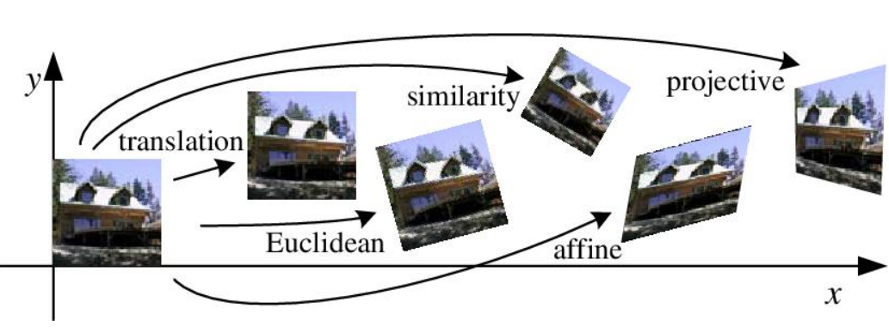
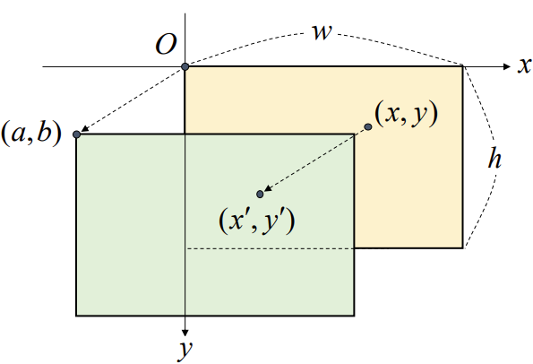
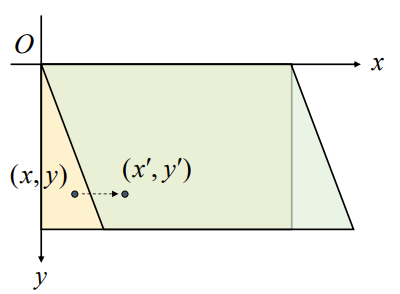
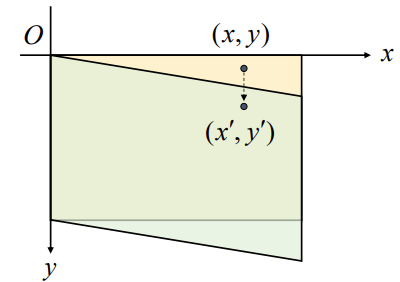
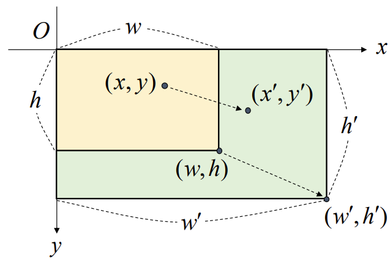
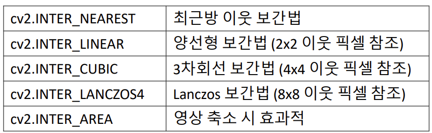

## 영상의 기하학적 변환 (Geometric Transformation)
- 영상을 구성하는 픽셀의 배치 구조를 변경함으로써 전체 영상의 모양을 바꾸는 작업
- Image registration, removal of geometric distortion, ... 

<br>

<p align=center></p>

<br>
<br>


### 영상의 이동 변환 (Translation transformation)
- 가로 또는 세로 방향으로 영상을 특정 크기만큼 이동시키는 변환
- x축과 y축 방향으로의 이동 변위를 지정


    <br>

    <p align=center></p>
    
    <br>


    <br>

    $
    \left\{\begin{matrix}
    {x}^{'}=x+a \\
    {y}^{'}=y+b
    \end{matrix}\right.
    $

    <br>

    $
    \begin{bmatrix} {x}^{'} \\ {y}^{'} \end{bmatrix}= \begin{bmatrix}1 & 0 \\ 0 & 1 \\\end{bmatrix}\begin{bmatrix}x \\ y\end{bmatrix}+ \begin{bmatrix}a \\ b \end {bmatrix}
    $

    <br>

    - 단위 행렬로 나타낸 이유는 나중에 덧셈을 하나로 합치기 위함
    
    <br>

    $
    \begin{bmatrix} {x}^{'} \\ {y}^{'} \end{bmatrix}= \begin{bmatrix}1 & 0 & a \\ 0 & 1 & b\\\end{bmatrix}\begin{bmatrix}x \\ y \\ 1\end{bmatrix}
    $

    <br>

    - $\begin{bmatrix}1 & 0 & a \\ 0 & 1 & b\\\end{bmatrix}$ : $2 \times 3$ 어파인 변환 행렬
    - 동차좌표계를 공부하면 이해를 더 잘 할 수 있음

<br>
<br>

- 영상의 어파인 변환 함수

    ```python
    cv2.warpAffine(src, M, dsize, dst=None, flags=None, borderMode=None, borderValue=None) -> dst
    ```
    - src : 입력 영상
    - M : **2x3 어파인 변환 행렬** 
        - 실수형
    - dsize : 결과 영상 크기 
        - (w, h) 튜플
        - (0, 0)이면 src와 같은 크기로 설정
    - dst : 출력 영상
    - flags : 보간법
        - 기본값은 cv2.INTER_LINEAR.
    - borderMode : 가장자리 픽셀 확장 방식
        - 기본값은 cv2.BORDER_CONSTANT
        - 새롭게 생겨나는 공간들은 어떤 방식으로 채울 것인지
    - borderValue : cv2.BORDER_CONSTANT일 때 사용할 상수 값. 
        - 기본값은 0 (검정)

<br>
<br>

### 전단 변환 (Shear transformation)
- 층 밀림 변환
- x축과 y축 방향에 대해 따로 정의

    <br>

    <p align=center></p>

    <br>

    $
    \left\{\begin{matrix}{x}^{'}=x+my \\ {y}^{'}=y \end{matrix}\right.
    $

    - y 좌표에 scaling factor를 주어서 이동 

    <br>

    $
    \begin{bmatrix} {x}^{'} \\ {y}^{'} \end{bmatrix}= \begin{bmatrix}1 & m \\ 0 & 1 \\\end{bmatrix}\begin{bmatrix}x \\ y\end{bmatrix}
    $

    <br>

    $
    \begin{bmatrix} {x}^{'} \\ {y}^{'} \end{bmatrix}= \begin{bmatrix}1 & m & 0 \\ 0 & 1 & 0\\\end{bmatrix}\begin{bmatrix}x \\ y \\ 1\end{bmatrix}
    $


    <br>

    <p align=center></p>

    <br>


    $
    \left\{\begin{matrix}{x}^{'}=x \\ {y}^{'}=mx+y \end{matrix}\right.
    $

    <br>


    $
    \begin{bmatrix} {x}^{'} \\ {y}^{'} \end{bmatrix}= \begin{bmatrix}1 & 0 \\ m & 1 \\\end{bmatrix}\begin{bmatrix}x \\ y\end{bmatrix}
    $

    <br>

    $
    \begin{bmatrix} {x}^{'} \\ {y}^{'} \end{bmatrix}= \begin{bmatrix}1 & 0 & 0 \\ m & 1 & 0\\\end{bmatrix}\begin{bmatrix}x \\ y \\ 1\end{bmatrix}
    $


### 크기 변환 (Scale transformation)
- 영상의 크기를 원본 영상보다 크게 또는 작게 만드는 변환
- x 축과 y축 반향으로 스케일 비율 (scale factor) 지정


    <br>

    <p align=center></p>

    <br>


    <br>

    $
    \left\{\begin{matrix}{x}^{'}=s_{x}x \\ {y}^{'}=s_{y}y \end{matrix}\right. \ \ \  \ \ \ \left\{\begin{matrix}{s}_{x}={w}{'}/w \\ {s}_{y}={h}{'}/h \end{matrix}\right.
    $

    <br>


    $
    \begin{bmatrix} {x}^{'} \\ {y}^{'} \end{bmatrix}= \begin{bmatrix}s_{x} & 0 & 0 \\ 0 & s_{y} & 0\\\end{bmatrix}\begin{bmatrix}x \\ y \\ 1\end{bmatrix}
    $

    <br>


- 영상의 크기 변환 함수

    ```python
    cv2.resize(src, dsize, dst=None, fx=None, fy=None, interpolation=None) -> dst
    ```
    - src : 입력 영상
    - dsize : 결과 영상 크기
        - (w, h) 튜플
        - resize 했기 때문에 출력 영상의 크기를 명시적으로 나타내주어야 함
        - (0, 0)이면 fx와 fy 값을 이용하여 결정.
    - dst : 출력 영상
    - fx, fy : x와 y방향 스케일 비율(scale factor) 
        - dsize 값이 0일 때 유효
    - interpolation : 보간법 지정
        - 기본값은 cv2.INTER_LINEAR

        <br>

        <p align=left> </p>

        <br>

<br>

#### 영상 축소 시 고려햘 사항
- 영상을 축소할 대 디테일이 사라지는 경우 발생
    - 한 픽셀로 구성된 선분 등
- 입력 영상을 부드럽게 필터링한 후 축소, 다단계 축소
- OpenCV의 `cv2.resize()` 함수에서 `cv2.INTER_ARERA` 사용 

<br>
<br>

### 대칭 변환 (Flip, Reflection)
