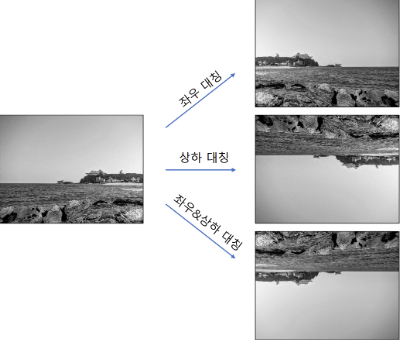
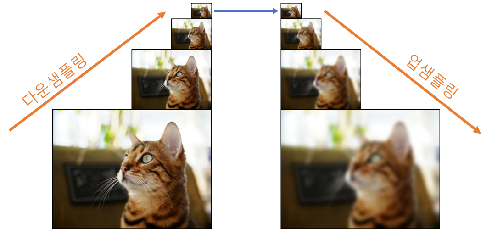
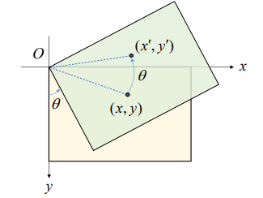
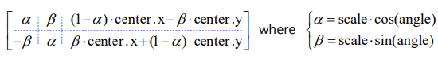
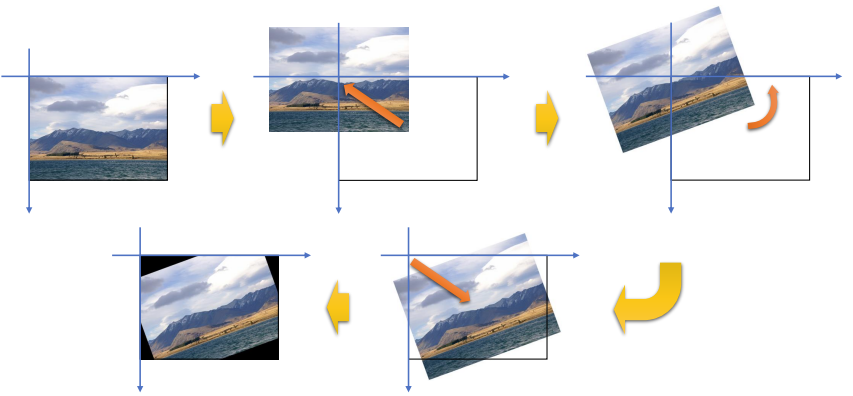
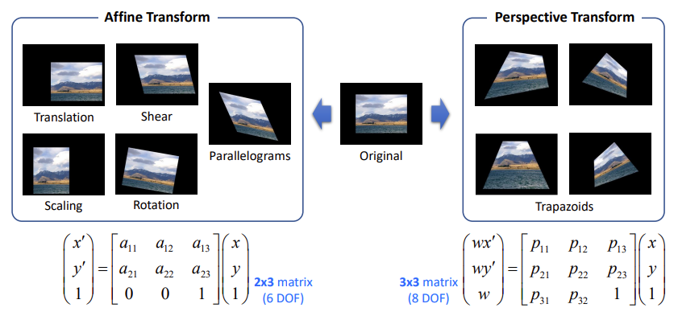
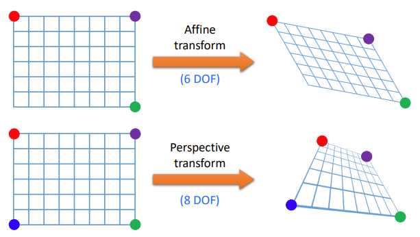
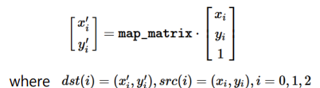
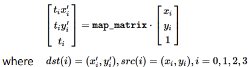

## 영상의 기하학적 변환 (Geometric Transformation)
- 영상을 구성하는 픽셀의 배치 구조를 변경함으로써 전체 영상의 모양을 바꾸는 작업
- Image registration, removal of geometric distortion, ... 

<br>

<p align=center></p>

<br>
<br>


### 영상의 이동 변환 (Translation transformation)
- 가로 또는 세로 방향으로 영상을 특정 크기만큼 이동시키는 변환
- x축과 y축 방향으로의 이동 변위를 지정


    <br>

    <p align=center></p>
    
    <br>


    <br>

$$
\left\{\begin{matrix}
{x}^{'}=x+a \\
{y}^{'}=y+b
\end{matrix}\right.
$$

<br>

```math
\begin{bmatrix} {x}^{'} \\ {y}^{'} \end{bmatrix}= \begin{bmatrix}1 & 0 \\ 0 & 1 \\\end{bmatrix}\begin{bmatrix}x \\ y\end{bmatrix}+ \begin{bmatrix}a \\ b \end {bmatrix}
```

<br>

- 단위 행렬로 나타낸 이유는 나중에 덧셈을 하나로 합치기 위함

<br>

```math
\begin{bmatrix} {x}^{'} \\ {y}^{'} \end{bmatrix}= \begin{bmatrix}1 & 0 & a \\ 0 & 1 & b\\\end{bmatrix}\begin{bmatrix}x \\ y \\ 1\end{bmatrix}
```

<br>

- $\begin{bmatrix}1 & 0 & a \\ 0 & 1 & b\\\end{bmatrix}$ : $2 \times 3$ 어파인 변환 행렬
- 동차좌표계를 공부하면 이해를 더 잘 할 수 있음

<br>
<br>

- 영상의 어파인 변환 함수

    ```python
    cv2.warpAffine(src, M, dsize, dst=None, flags=None, borderMode=None, borderValue=None) -> dst
    ```
    - src : 입력 영상
    - M : **2x3 어파인 변환 행렬** 
        - 실수형
    - dsize : 결과 영상 크기 
        - (w, h) 튜플
        - (0, 0)이면 src와 같은 크기로 설정
    - dst : 출력 영상
    - flags : 보간법
        - 기본값은 cv2.INTER_LINEAR.
    - borderMode : 가장자리 픽셀 확장 방식
        - 기본값은 cv2.BORDER_CONSTANT
        - 새롭게 생겨나는 공간들은 어떤 방식으로 채울 것인지
    - borderValue : cv2.BORDER_CONSTANT일 때 사용할 상수 값. 
        - 기본값은 0 (검정)

<br>
<br>

### 전단 변환 (Shear transformation)
- 층 밀림 변환
- x축과 y축 방향에 대해 따로 정의

<br>

<p align=center></p>

<br>

```math
\left\{\begin{matrix}{x}^{'}=x+my \\ {y}^{'}=y \end{matrix}\right.
```

- y 좌표에 scaling factor를 주어서 이동 

<br>

```math
\begin{bmatrix} {x}^{'} \\ {y}^{'} \end{bmatrix}= \begin{bmatrix}1 & m \\ 0 & 1 \\\end{bmatrix}\begin{bmatrix}x \\ y\end{bmatrix}
```

<br>

```math
\begin{bmatrix} {x}^{'} \\ {y}^{'} \end{bmatrix}= \begin{bmatrix}1 & m & 0 \\ 0 & 1 & 0\\\end{bmatrix}\begin{bmatrix}x \\ y \\ 1\end{bmatrix}
```

<br>

<p align=center></p>

<br>


```math
\left\{\begin{matrix}{x}^{'}=x \\ {y}^{'}=mx+y \end{matrix}\right.
```

<br>


```math
\begin{bmatrix} {x}^{'} \\ {y}^{'} \end{bmatrix}= \begin{bmatrix}1 & 0 \\ m & 1 \\\end{bmatrix}\begin{bmatrix}x \\ y\end{bmatrix}
```

<br>

```math
\begin{bmatrix} {x}^{'} \\ {y}^{'} \end{bmatrix}= \begin{bmatrix}1 & 0 & 0 \\ m & 1 & 0\\\end{bmatrix}\begin{bmatrix}x \\ y \\ 1\end{bmatrix}
```

<br>
<br>

### 크기 변환 (Scale transformation)
- 영상의 크기를 원본 영상보다 크게 또는 작게 만드는 변환
- x 축과 y축 반향으로 스케일 비율 (scale factor) 지정


<br>

<p align=center></p>

<br>


<br>

```math
\left\{\begin{matrix}{x}^{'}=s_{x}x \\ {y}^{'}=s_{y}y \end{matrix}\right. \ \ \  \ \ \ \left\{\begin{matrix}{s}_{x}={w}{'}/w \\ {s}_{y}={h}{'}/h \end{matrix}\right.
```

<br>

```math
\begin{bmatrix} {x}^{'} \\ {y}^{'} \end{bmatrix}= \begin{bmatrix}s_{x} & 0 & 0 \\ 0 & s_{y} & 0\\\end{bmatrix}\begin{bmatrix}x \\ y \\ 1\end{bmatrix}
```

<br>

- 영상의 크기 변환 함수

    ```python
    cv2.resize(src, dsize, dst=None, fx=None, fy=None, interpolation=None) -> dst
    ```
    - src : 입력 영상
    - dsize : 결과 영상 크기
        - (w, h) 튜플
        - resize 했기 때문에 출력 영상의 크기를 명시적으로 나타내주어야 함
        - (0, 0)이면 fx와 fy 값을 이용하여 결정.
    - dst : 출력 영상
    - fx, fy : x와 y방향 스케일 비율(scale factor) 
        - dsize 값이 0일 때 유효
    - interpolation : 보간법 지정
        - 결과 영상의 퀄리티, 자연스러운 형태인지 부자연스러운 형태인지 결정할 수 있는 파라미터
        - 기본값은 `cv2.INTER_LINEAR`
            - 효율성이 가장 높고 속도가 빠름
            - 픽셀 값을 유추하는 방식 
                - 4 (2x2) 개의 픽셀 이용  

            <br>

            <p align=left> </p>

            <br>

<br>

#### 영상 축소 시 고려햘 사항
- 영상을 축소할 대 디테일이 사라지는 경우 발생
    - 한 픽셀로 구성된 선분 등
- 입력 영상을 부드럽게 필터링한 후 축소, 다단계 축소
- OpenCV의 `cv2.resize()` 함수에서 `cv2.INTER_ARERA` 사용 

<br>
<br>

### 대칭 변환 (Flip, Reflection)

<br>

<p align=center></p>

<br>

- 영상의 대칭 변환 함수

    ```python
    cv2.flip(src, flipCode, dst=None) -> dst
    ```
    - src : 입력 영상
    - flipCode : 대칭 방향 지정
        - 양수 (+1) : 좌우대칭
        - 0 : 상하 대칭
        - 음수 (-1) : 좌우 & 상하 대칭
    - dst : 출력 영상

<br>
<br>

### 이미지 피라미드 (Image Pyramid)
- 하나의 영상에 대해 다양한 해상도의 영상 세트를 구상
- 보통 가우시안 블러링 & 다운 샘플링 형태로 축소하여 구성


<br>

<p align=center></p>

<br>

- 일반적으로는 가로, 세로의 크기를 반으로 줄여 입력 영상의 크기그 1/4이 되도록 함
- 객체의 크기를 모르는 상태에서 객체를 찾을 때는 객체의 크기를 다양하게 설정하여 찾음

<br>
<br>

- 영상 피라미드 다운 샘플링 함수

    ```python
    cv2.pyrDown(src, dst=None, dstsize=None, borderType=None) -> dst
    ```
    - src: 입력 영상
    - dst: 출력 영상
    - dstsize: 출력 영상 크기. 
        - 따로 지정하지 않으면 입력 영상의 가로, 세로 크기의 1/2로 설정.
    - borderType 가장자리 픽셀 확장 방식
    - 참고 사항
        - 먼저 5x5 크기의 가우시안 필터를 적용
        - 이후 짝수 행과 열을 제거하여 작은 크기의 영상을 생성

<br>

- 영상 피라미드 업 샘플링 함수

    ```python
    cv2.pyrUp(src, dst=None, dstsize=None, borderType=None) -> dst
    ```
    - src: 입력 영상
    - dst: 출력 영상
    - dstsize: 출력 영상 크기. 
        - 따로 지정하지 않으면 입력 영상의 가로, 세로 크기의 \2로 설정.
    - borderType 가장자리 픽셀 확장 방식

<br>
<br>


### 회전 변환 (Rotation Transformation)
- 영상을 특정 각도만큼 회전시키는 변환 (반시계방향)
- 영상이 비틀어져있는 경우 똑바른 경우로 바꿔주기 위해 많이 사용
- `cv2.warpAffine` 을 사용하여 진행

<br>

<p align=center></p>

<br>


```math
{x}^{'}=cos\theta\cdot x+sin\theta \cdot y   \\
{y}^{'}=-sin\theta\cdot x+cos\theta \cdot y
```

<br>

```math
\begin{bmatrix} {x}^{'} \\ {y}^{'} \end{bmatrix}= \begin{bmatrix}cos\theta & sin\theta & 0 \\ -sin\theta & cos\theta & 0\\\end{bmatrix}\begin{bmatrix}x \\ y \\ 1\end{bmatrix}
```

<br>
<br>

- 특정 좌표를 기준으로 영상 회전 변환 행렬 구하는 함수

    ```python
    cv2.getRotationMatrix2D(center, angle, scale) -> retval
    ```
    - center: 회전 중심 좌표 
        - (x, y) 튜플
    - angle: (반시계 방향) 회전 각도(degree)
        - 음수는 시계 방향
    - scale: 추가적인 확대 비율
    - retval: 2x3 어파인 변환 행렬
        - 실수형

        <br>

        <p align=left> </p>

        <br>


<br>
<br>

#### 영상의 중앙 기준 회전

<br>

<p align=center></p>

<br>
<br>

### 어파인 변환(Affine Transform), 투시 변환 (Perspective Transform)

<br>

<p align=center></p>

<br>

- 어파인 변환
    - 영상에 대해 이동, 전단, 크기, 회전 변환 등을 조합해서 적용하는 경우 직사각형 영상이 평행사변형으로 변환 가능
        - 위의 모든 변환들이 어파인 변환
    - 2 x 3 실수형 행렬로 표현 가능
- 투시 변환
    - 어파인 변환보다 자유도가 높음
    - Projective transform = Homography transform
    - 직사각형 영상이 평행사변형 보다 자유도가 높은 임의의 사각형을 만들어내는 변환
    - 3 x 3 행렬로 표현 가능

<br>

<p align=center></p>

<br>

- 어파인 변환 행렬
    - 6개의 미지수로 구성이 되어있기 때문에 6개의 방정식 필요
    - 점 3개가 어디로 이동했는지 이동 관계를 알고있으면 어파인 행렬 구할 수 있음
- 투시 변환 행렬
    - 8개의 미지수로 구성이 도어있기 때문에 8개의 방정식 필요
    - 점 4개의 이동 관계를 알고 있어야 함

<br>
<br>


- 어파인 변환 행렬 구하는 함수

    ```python
    cv2.getAffineTransform(src, dst) -> retval
    ```
    - src: 3개의 원본 좌표점
        - numpy.ndarray. shape=(3, 2)
            -  np.array([[x1, y1], [x2, y2], [x3, y3]], np.float32)
    - dst: 3개의 결과 좌표점
        - numpy.ndarray. shape=(3, 2)
    - retval: 2x3 어파인 변환 행렬

        <br>

        <p align=left> </p>

<br>
<br>

- 투시 변환 행렬 구하는 함수

    ```python
    cv2.getPerspectiveTransform(src, dst, solveMethod=None) -> retval
    ```
    - src: 4개의 원본 좌표점
        - numpy.ndarray. shape=(4, 2)
            - np.array([[x1, y1], [x2, y2], [x3, y3], [x4, y4]], np.float32)
    - dst: 4개의 결과 좌표점
        - numpy.ndarray. shape=(4, 2)
    - retval: 3x3 투시 변환 행렬

        
        <br>

        <p align=left> </p>

        <br>

<br>

- 어파인 변환 함수

    ```python
    cv2.warpAffine(src, M, dsize, dst=None, flags=None, borderMode=None, borderValue=None) -> dst
    ```
    - src: 입력 영상
    - M: 2x3 어파인 변환 행렬 
        - 실수형
    - dsize: 결과 영상 크기
        - (w, h) 튜플
        - (0, 0)이면 src와 같은 크기로 설정
    - dst: 출력 영상
    - flags: 보간법 
        - 기본값은 cv2.INTER_LINEAR
    - borderMode: 가장자리 픽셀 확장 방식
        - 기본값은 cv2.BORDER_CONSTANT
    - borderValue: cv2.BORDER_CONSTANT일 때 사용할 상수 값
        - 기본값은 0

<br>
<br>

- 투시 변환 함수

    ```python
    cv2.warpPerspective(src, M, dsize, dst=None, flags=None, borderMode=None, borderValue=None) -> dst
    ```
    - src: 입력 영상
    - M: 3x3 투시 변환 행렬
        -실수형
    - dsize: 결과 영상 크기
        - (w, h) 튜플
        - (0, 0)이면 src와 같은 크기로 설정
    - dst: 출력 영상
    - flags: 보간법
        - 기본값은 cv2.INTER_LINEAR
    - borderMode: 가장자리 픽셀 확장 방
        - 기본값은 cv2.BORDER_CONSTANT
    - borderValue: cv2.BORDER_CONSTANT일 때 사용할 상수 값
        - 기본값은 0

<br>
<br>        

### 리맵핑 (Remapping)
- 영상의 특정 위치 픽셀을 다른 위치에 재배치하는 일반적인 프로세스
    - Geometric transform을 일반화시켜 맵핑하는 방식
    - $dst(x, y) = src(map_{x}(x,y), map_{y}(x,y))$
        - `map` 이라는 함수를 정의하여 출력 영상의 픽셀값을 입력 영상 어느 좌표에서 가져올 것인지 지정 
- 어파인 변환, 투시 변환을 포함한 다양한 변환을 리매핑으로 표현 가능 
- 어파인, 투시 변환은 입력 영상이 평행사변형, 사다리꼴 등이 되는 변환이 되는데 이를 제외하고 영상이 구불구불해지는 변환도 리맵핑을 잘 이용하면 가능

<br>
<br>


- 리매핑 함수

    ```python
    cv2.remap(src, map1, map2, interpolation, dst=None, borderMode=None, borderValue=None) -> dst
    ```
    -  src: 입력 영상
    - map1: 결과 영상의 (x, y) 좌표가 참조할 입력 영상의 x좌표
        - 입력 영상과 크기는 같음
        - 타입은 np.float32인 numpy.ndarray
    - map2: 결과 영상의 (x, y) 좌표가 참조할 입력 영상의 y좌표
    - interpolation: 보간법
    - dst: 출력 영상
    - borderMode: 가장자리 픽셀 확장 방식
        - 기본값은 cv2.BORDER_CONSTANT
    - borderValue: cv2.BORDER_CONSTANT일 때 사용할 상수 값
        - 기본값은 0