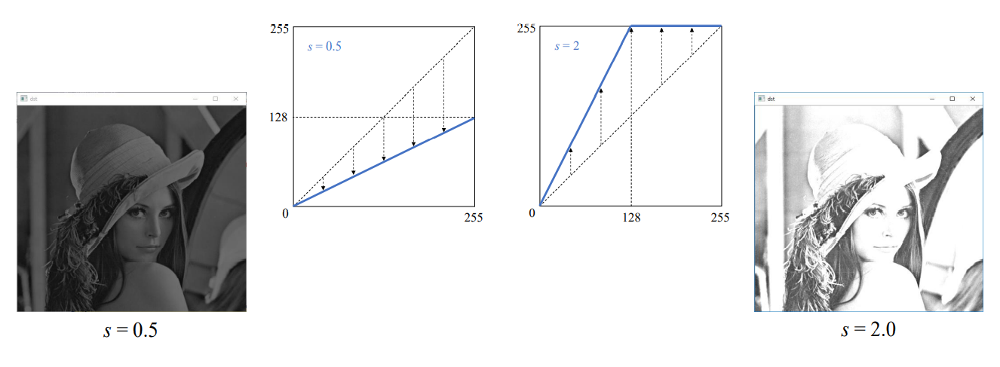
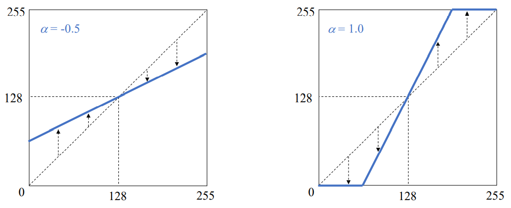
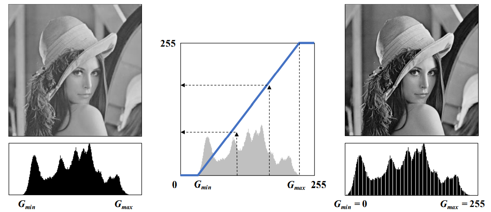
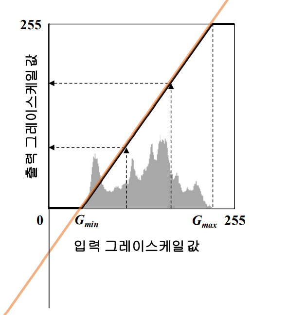

## 명암비 (Contrast)
- 밝은 곳과 어두운 곳 사이에 드러나는 밝기 정도의 차이
- 컨트라스트, 대비

<br>
    <p align=center></p>

<br>

- 보통 명암비를 높여서 선명하게 만들기 위한 노력을 함

<br>
<br>


## 기본적인 명암비 조절 함수
- 기본적인 명암지 조절 함수
    - 명암비를 조절할 때는 덧셈이 아니라 곱셈을 이용 

    <br>

    <p align=center></p>

    <br>

    <p align=center></p>

    <br>

    - 입력 영상에 s 라는 scale vector를 rhqtgka
    - s = 0.5인 경우에는 입력영상에는 0 ~ 128 사이로 나타남
        - 그 영상은 어두운 영상으로 나타남
    - s = 2 인 경우에는 255보다 큰 경우는 255로 saturate 됨!
        - 전체적으로 포화가 되는 경우가 많아짐

    <br>

- 효과적인 명암비 조절 함수

    <br>

    <p align=center></p>

    <br>

    <p align=center></p>

    <br>

    - 기울기가 알파 값에 의해서 결정
    - 무조건 (128, 128) 점을 지남
    - 명암비 조절은 딱 정해져 있지 않음, 이 식도 이 책에서 정한 효과적인 것
        - 왜냐하면 보통의 영상들이 pixel들의 128 근방에 많이 분포
        - 만약 전체적으로 밝거나, 어두운 영상이면 이 수식도 좋은 결과를 얻을 수 없음! 
        - opencv에서도 지원을 하지 않음
    
<br>
<br>

# 영상의 자동 명암비 조절 
## 히스토그램 스트레칭 (Histogran stretching)
- 영상의 **자동 명암비 조절**
-  여상의 히스토그램이 그레이스케일 전 구간에서 걸쳐나타나도록 변경하는 선형 변환 기법
- 전처리 과정 중 많이 사용하는 기법 중 하나


<br>

<p align=center></p>

<br>

- 늘리기 때문에 중간중간에 pixel 값이 없는 흰색 부분이 존재
- opencv에서 histogram stretch를 지원하는 함수가 딱히 있는 것은 아님

    <br>


    ```python
    cv2.normalize(src, dst, alpha=None, beta=None, norm_type=None, mask=None) -> dst    
    ```
    - src : 입력 영상
    - dst : 결과 영상
        - 사실 dst는 잘 쓰지 않음, None 주면 됨
    - alpha : (노름 정규화 인 경우) 목표  노름 값, (원소값 범위 정규화인 경우) 최솟값
    - beta : (원소 값 범위의 정규화인 경우) 최댓값
    - norm_type : 정규화 타입
        - NORM_INF, NORM_L1, NORM_L2, NORM_MINMAX 
            - NORM_MINMAX 로 alpah = 0, beta = 255 하면 위의 설명과 같은 결과를 얻게 됨
    - dtype :  결과 영상의 타입
    - mask : 마스크 영상

<br>
<br>

## 히스토그램 스트레칭 변환 함수
- 변환 함수의 직선의 방정식

    <br>

    <p align=center></p>

    <br>

<br>

<p align=center></p>

<br>

- 기울기

    <br>

    <p align=center></p>

    <br>

- y절편 

    <br>

    <p align=center></p>

    <br>
    