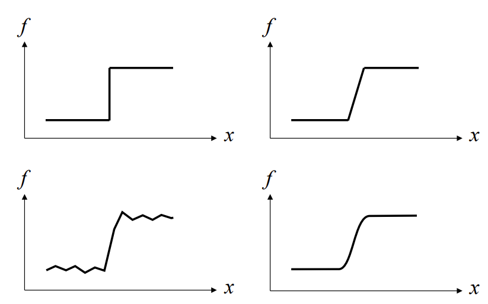
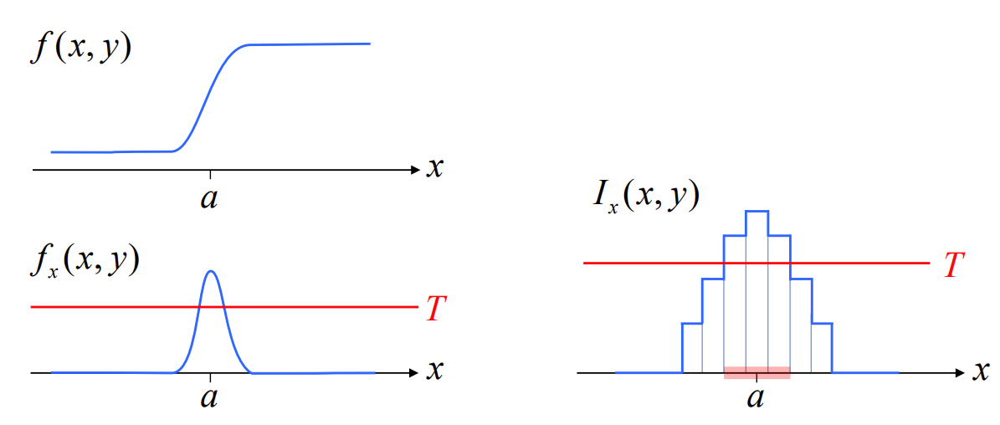
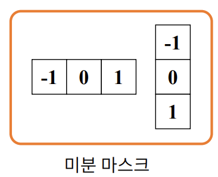
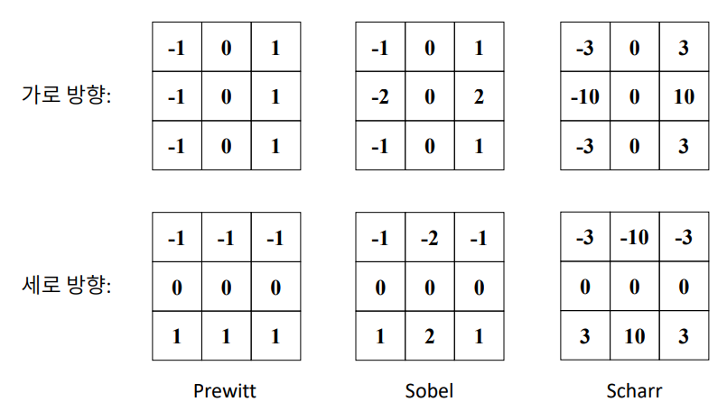

## 소벨 필터
### 에지 (Edge)
- 영상의 필셀의 밝기 값이 급격하게 변하는 부분
    - 에지를 구하기 위해 영상을 미분
- 일반적으로 배경과 객체, 또는 객체와 객체의 경계

<br>

<p align=center></p>

<br>


- 왼쪽 위는 pixel값이 급격하게 증가하는 모습
- 급격하게 증가하는것이 어려움으로 오른쪽 위와 같이 보임
- 실제로 노이즈가 발생하면 왼쪽 아래와 같이 신호에 자잘한 변동 발생
- 가우시안 필터와 같은 노이즈 제거 필터를 적용하면 오른쪽 아래와 같은 형태로 나타남
-  
    
### 기본적인 에지 검출 방법
- 1차 미분 
    - 영상을 (x, y) 변수의 함수로 생각했을 때, 이 함수의 1차 미분값이 크게 나타내는 부분 검출
    - 실제로는 영상은 디지털화 되어있기 때문에 discrete하게 기울기가 나움
    - Threshold T 보다 큰 값을 edge라 함


    <br>

    <p align=center></p>

    <br>


<br>

- 1차 미분의 근사화 (approximation)
    - 전진 차분 (Forward difference)

    <br>

    ```math
    \frac{\partial I}{\partial x}\cong \frac{I(x+h)-I(x)}{h}
    ```

    <br>

    - 후진 차분 (Backward difference)
   
    <br>

    ```math
    \frac{\partial I}{\partial x}\cong \frac{I(x)-I(x-h)}{h}
    ```

    <br>

    - 중앙 차분 (Centered difference)
        - 가장 정확하다고 알려짐
        

    <br>

    ```math
   \frac{\partial I}{\partial x}\cong \frac{I(x+h)-I(x-h)}{2h}
    ```

    <br>

    <p align=left></p>

    <br>
    
    - $2h$ 로 나누는 과정 생략하고 사용

<br>
<br>

- 보통 사용하는 다양한 미분 마스크

    <br>

    <p align=center></p>

    <br>

    - Prewitt
        - 자기 자신에 대한 미분을 계산할 때 그 하나만 가지고 하면 노이즈에 취약해서 평균값 (3X3) 을 이용
    - Sobel
        - 평균 형태로 미분을 계산하는데 자기자신에 가중치를 줌
        - 가장 많이 사용하는 형태
    - Scharr
        - 조금 더 가우시안을 잘 표현한다고 나타냄

<br>
<br>

- 소벨 필터를 이용한 미분 함수

    ```python
    cv2.Sobel(src, ddepth, dx, dy, dst=None, ksize=None, scale=None, delta=None, borderType=None) -> dst
    ```
    - src: 입력 영상
    - ddepth: 출력 영상 데이터 타입
        - -1이면 입력 영상과 같은 데이터 타입을 사용
        - 보통 미분을 하면 음수 값도 나올 수 있기 때문에 gray scale로 하면 좋지 않음
        - 입력 영상이 grayscale 이더라도, cv2.CV_32F 와 같이 받는 것이 좋음
    - dx: x 방향 미분 차수 
    - dy: y 방향 미분 차수 
    - dst: 출력 영상(행렬)
    - ksize: 커널 크기
        - 기본값은 3
    - scale 연산 결과에 추가적으로 곱할 값
        - 기본값은 1
    - delta: 연산 결과에 추가적으로 더할 값 
        - 기본값은 0
    - borderType: 가장자리 픽셀 확장 방식. 기본값은 cv2.BORDER_DEFAULT

    <br>

    - 보통 소벨 필터를 사용할 때는 (dx = 0, dy = 1, ksize= 3) , (dx = 1, dy = 0, ksize= 3) 이런식으로 사용
    - (dx = 1, dy = 1) 이렇게 사용하기 보다는 위의 2개를 사용


<br>
<br>

- 샤르 필터를 이용한 미분 함수

    ```python
    cv2.Scharr(src, ddepth, dx, dy, dst=None, scale=None, delta=None, borderType=None) -> dst
    ```
    - src: 입력 영상
    - ddepth: 출력 영상 데이터 타입
        - -1이면 입력 영상과 같은 데이터 타입을 사용
    - dx: x 방향 미분 차수 
    - dy: y 방향 미분 차수 
    - dst: 출력 영상(행렬)
    - scale 연산 결과에 추가적으로 곱할 값
        - 기본값은 1
    - delta: 연산 결과에 추가적으로 더할 값
        - 기본값은 0.
    - borderType: 가장자리 픽셀 확장 방식 
        - 기본값은 cv2.BORDER_DEFAUL