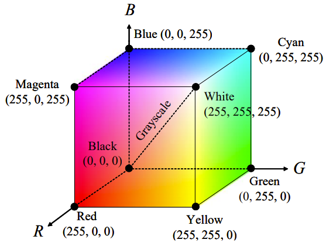
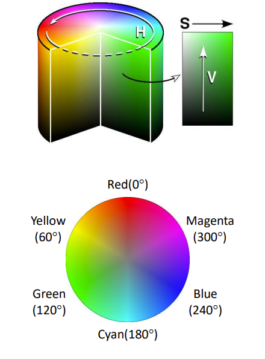
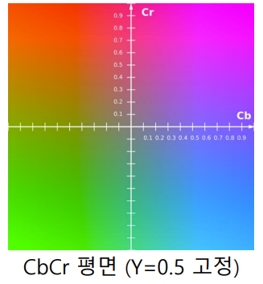

## 컬러 영상과 색 공간
### 컬러 영상
- 컬러 영상은 3차원 numpy.ndarray 형태로 표현
- OpenCV에서는 RGB가 아닌 BGR 순서로 표현

<br>

### OpenCV에서 컬러 영상 다루기
```python
img1 = cv2.imread("img.bmp", cv2.IMREAD_COLOR)
img2 = np.zeros((480, 640, 3), np.uint8)

img3 = cv2.imread("imh.bmp", cv2.IMREAD_GRAYSCALE)
img4 = cv2.cvtColor(img3, cv2.COLOR_GRAY2BGR)
```

- img4 영상의 각 픽셀은 B, G, R 색 성분 값이 모두 같게 설정됨
    - 하지만 Grayscale처럼 무채색으로 나타나게 됨

<br>

### RGB 색 공간
- 빛의 삼원색인 R(빨간색), G(녹색), B(파란색)을 혼합하여 색상 표현
    - 가산 혼합
- TV, 모니터, 카메라 센서 Bayer 필터, 비트맴


    <br>

    <p align=center></p>

    <br>

- (색상) 채널 분리
    ```python
    cv2.split(m, mv=None) -> dst
    ```
    - m : 다채널 영상
        - 예를 들면 (B, G, R)로 구성된 영상
    - mv : 출력 영상
    - dst : 출력 영상의 리스트
        - (B, G, R) 영상이 입력으로 들어가면 출력은 GrayScale 영상 3개가 리스트 형태로 묶어져서 결합

<br>

- (색상) 채널 결합
    ```python
    cv2.merge(mv, dst=None) -> dst
    ```
    - mv : 입력 영상 리스트 또는 튜플
    - dst : 출력 영상

<br>

### HSV 색 공간
- H (Hue) : 색상, 색의 종류
    - 보통 각도로 표현 (0 ~ 360)
    - 8 bit로 360가지 표현을 못하기 때문에 반으로 나누어 180가지의 값으로 표현
- S (Saturation) : 채도, 색의 탁하고 선명한 정도
    - 원의 중심이 0이고 바깥으로 갈수록 1 또는 255의 값을 가지게 됨 
- V (value) : 명도, 빛의 밝기
    - 밑에서 위로 올라가면서 값이 커짐
        - 0 -> 1 또는 255
    - HSI(Intensity), HSL(Ligntness) 3가지는 약간의 수식은 다름

    <br>

    <p align=center></p>

    <br>


- HSV 값 범위
    - cv2.CV_8U 영상의 경우
    
    <br>

    <p align=center></p>

    <br>

### YCrCb 색 공간
- PAL, NTSC, SECAM 등의 컬러 비디오 표준에 사용되는 색 공간
- 영상의 밝기 정보와 색상 정보를 따로 분리하여 부호화
    - 흑백 TV 호환
- Y : 밝기 정보(luma)
- Cr, Cb : 색차(chroma)
    - Cr : chroma 인데 red 성분에 관련된 것
    - Cb : chroma 인데 blue 성분에 관련된 것 

    <br>

    <p align=center></p>

    <br>


- YCrCb 값 범위
    - cv2.CV_8U 영상의 경우
    <br>

    <p align=center></p>

    <br>


### 색 공간 변환
- 특정한 목적을 위해 RGB 색 공간을 HSV, YCrCb, GrayScale 등의 다른 색 공간으로 변환하여 처리

<br>

- 색 공간 변환 함수
    ```python
    cv2.cvtColor(src, code, dst=None, dstCn=None) -> dst
    ```
    - src : 입력 영상
    - code : 색 변환 코드
    - dstCn : 결과 영상 채널 수, 0이면 자동 결정
    - dst : 출력 영상

<br>

- RGB -> GrayScale
    - Color 정보가 크게 의미가 없을 때 사용

    <br>

    <p align=center></p>

    <br>


    - 장점 : 데이터 저장 용량 감소, 데이터 처리 속도 향상
    - 단점 : 색상 정보 손실

<br>

- 