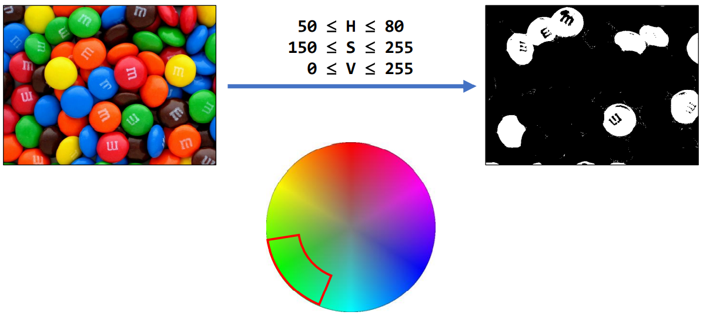

## RGB 색 공간에서 녹색 영역 추출하기

<br>
    
<p align=center></p>

<br>

- RGB는 영상을 획득하는 환경에 따라 문제가 생길 수 있음
    - 영상이 어두운 경우

    <br>
        
    <p align=center></p>

    <br>

<br>

## HSV 색 공간에서 녹색 영역 추출하기
- 보통은 RGB 말고 HSV 영역에서 추출하는 것을 선호
    - 또는 Ycrcb에서 
- H : 360도가 아닌 180도
    - 0, 90, 180, 270이 아닌 0, 45, 90, 135가 됨
- S : 너무 작은 값을 가지면 탁하게 됨
    - 원의 중심이 0, 원이 가장 밖이 255
- V : 컬러 영상에서의 밝기 성분, 0이 어두운 것 255가 밝은 것
    - 밝은 녹색, 어두운 녹색 상관하지 않겠다는 의미

<br>

<p align=center></p>

<br>
    
- HSV의 경우 영상이 어두워 질 때
    -RGB보다 영상 덜 받음, 밝기에 대한 보정이 될 수 있음

    <br>
        
    <p align=center></p>

    <br>

<br>

## 특정 범위 안에 있는 행렬 원소 검출
- opencv 함수

   <br>

    ```python
    cv2.inRange(src, lowerb, upperb, dst=None) -> dst    
    ```
    - src : 입력 영상
    - lowerb : 하한 값 행렬 또는 스칼라
    - upperb : 상한 값 행렬 또는 스칼라
    - dst : 입력 영상과 같은 크기의 마스크영상 (numpy.uint8)
        - 범위 안에 들어가는 픽셀은 255, 나머지는 0
        - 사실 dst는 잘 쓰지 않음, None 주면 됨
    - alpha : (노름 정규화 인 경우) 목표  노름 값, (원소값 범위 정규화인 경우) 최솟값
    - beta : (원소 값 범위의 정규화인 경우) 최댓값
    - norm_type : 정규화 타입
        - NORM_INF, NORM_L1, NORM_L2, NORM_MINMAX 
            - NORM_MINMAX 로 alpah = 0, beta = 255 하면 위의 설명과 같은 결과를 얻게 됨
    - dtype :  결과 영상의 타입
    - mask : 마스크 영상

