## 필터링 (Filtering)
- 영상에서 필요한 정보만 통과시키고 원하지 않는 정보는 걸러내는 작업
- 크게 2가지로 나눌 수 있음
    - 주파수 공간에서의 필터링 (Frequency domain filtering)
    - 공간적 필터링 (Spatial domin filtering)

<br>
<br>

### 주파수 공간에서의 필터링 (Frequency domain filtering)

<br>

<p align=center>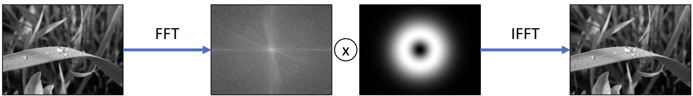</p>

<br>

- 영상을 주파수 공간으로 변환 (FFT)
    - 가운데가 저주파 성분, 밖이 고주파 성분을 표현
        - 저주파 성분
            - 영상에서 부드러운 부분
        - 고주파 성분
            - 영상에서 픽셀 값이 급격하게 변하는 부분 
- 중간 정도의 주파수만 통과시킴
- 다시 역 FFT 과정을 거쳐 영상을 얻음

<br>
<br>

### 공간적 필터링 (Spatial domin filtering)
- 영상의 픽셀 값을 직접 이용하여 필터링하는 방법
    - 대상 좌표의 픽셀 값과 주별 픽셀 값을 동시에 사용
- 주로 마스크 (mask) 연산 이용
    - 마스크 = 커널 (kernel) = 윈도우 (window) = 템플릿 (template)
- 다양한 모양과 크기의 마스크가 존재

    <br>

    <p align=left>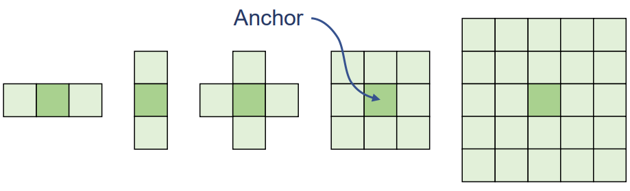</p>

    <br>


    - 주로 3 x 3 마스크를 사용
    - Anhor
        - 고정점이고 보통 필터링을 하고자 하는 대상 픽셀 위치
        - 보통 필터의 정중앙 위치

- 마스크의 형태와 값에 따라 필터의 역할 결정
    - 영상 부드럽게 만들기
    - 영상 날카롭게 만들기
    - edge 검출
    - 잡음 제거
    - .. 등등 

<br>
<br>

### 마스크 연산
### 3x3 크기의 마스크를 이용한 공간적 필터링

<br>

<p align=center>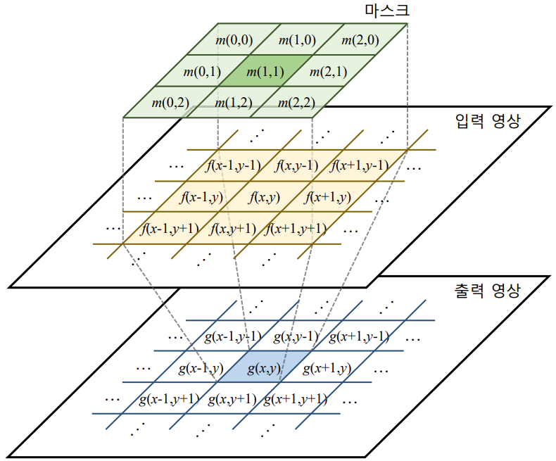</p>

<br>

- 연산 방법
    - Correlation (Convolution)

<br>

$$

\begin{align*}  
g(x,y) &=  m(0,0)f(x-1,y-1) \\ 
&+  m(1,0)f(x,y-1) \\
&+  m(2,0)f(x+1,y-1) \\
&+  m(0,1)f(x-1,y) \\
&+  m(1,1)f(x,y) \\
&+  m(2,1)f(x+1,y) \\
&+  m(0,2)f(x-1,y+1) \\
&+  m(1,2)f(x,y+1) \\
&+  m(2,2)f(x+1,y+1)
\\

&= \sum_{j=0}^{2} \sum_{i=0}^{2} m(i,j)f(x+i-1,y+j-1)

\end{align*}

$$

- 순차적으로 입력 영상이 모든 위치에 대해서 이 연산을 진행


<br>
<br>

### 3x3 크기의 마스크를 이용한 공간적 필터링의 최외각 처리


<br>

<p align=center></p>

<br>


- OpenCV에서는 보통 최외곽 바깥에 가상의 픽셀이 있다고 정의
- OpenCV 필터링에서 지원하는 가장자리 픽셀 확장 방법

    <br>

    <p align=center>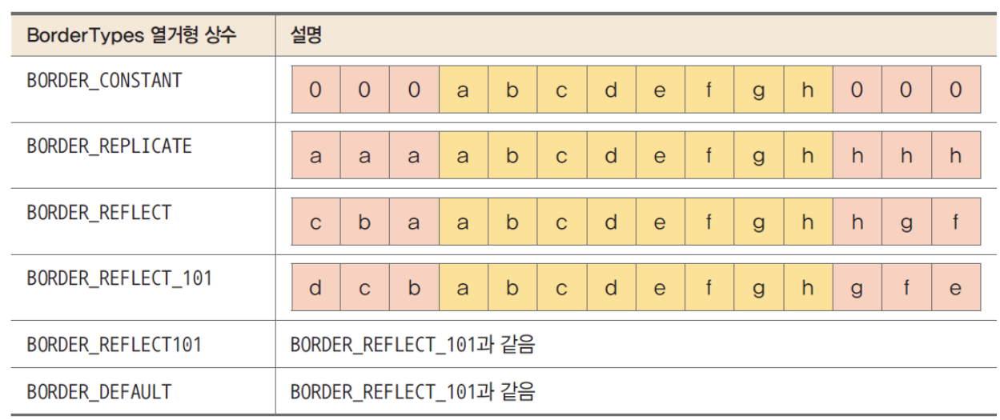</p>

    <br>

    - 주황색 부분은 기존 픽셀 값, 핑크색 가상의 픽셀 값
    - 맨 마지막 값을 기준으로 해서 대칭으로 나오는 `BORDER_REFLECT_101` 을 기본으로 사용 


    <br>

- 기본적인 2D 필터링 함수

    ```python
    cv2.filter2D(src, ddepth, kernel, dst=None, anchor=Noen, delta=None, borderType=None) -> dst
    ```
    - src : 입력 영상
    - ddepth : 출력 영상 데이터 타입
        - cv2.CV_8U (uint8), cv2.CV_32F (4byte 실수형), cv2.CV_64F (8byte 실수형), -1을 지정하면 src와 같은 타입의 dst 영상을 생성
        - 보통은 numpy에서의 uin8을 사용하는데 경우에 따라선든 float로 만들 수 있음 
    - kernel : 필터 마스크 행렬. 실수형.
    - anchor : 고정점 위치
        - (-1,-1) 이면 필터 중앙을 고정점으로 사용
            - 3 X 3인 경우는 (1, 1)과 (-1, -1) 은 같음
    - delta : 추가적으로 더할 값, default = 0
    - boarderType : 가장자리 픽셀 확장 방식
    - dst : 출력 영상

<br>
<br>

## 블러링 (Blurring)
평균값 필터와 가우시안 필터 존재

<br>
<br>


## 평균값 필터 (Mean Filter)
- 영상 특정 좌표 값을 주변 필셀 값들의 산술 평균으로 설정
- 픽셀들 간의 그레이 스케일 값 변화가 줄어들어 날카로운 **에지가 무뎌지고**, 영상에 있는 **잡음의 영향이 사라지는** 효과

<br>

<p align=center>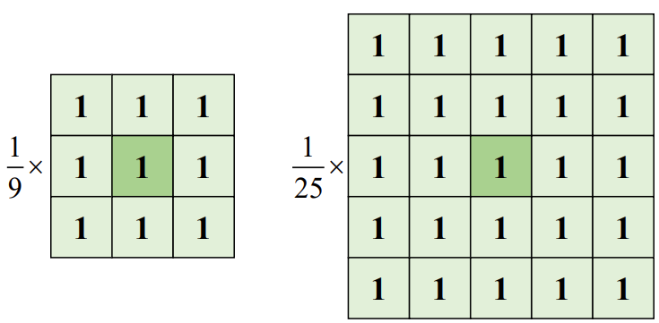</p>

<br>

- 영상 적용 효과
        
    <br>

    <p align=center>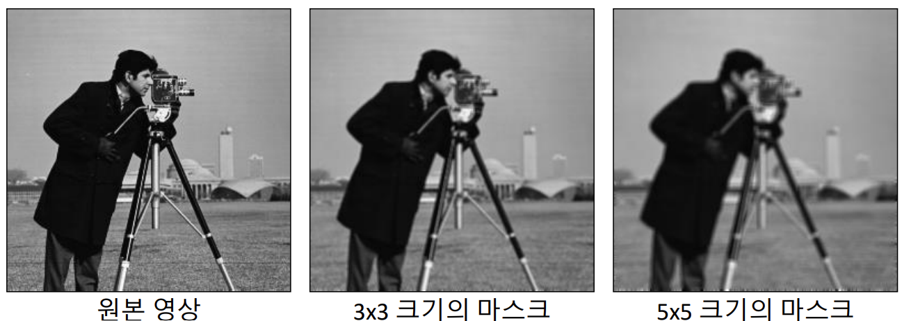</p>

    <br>

    - 마스크의 크기가 커질 수록 결과가 더욱 부드러움
        - 하지만 더 많은 연산 필요

<br>
<br>


- 평균 값 필터링 함수

    ```python
    cv2.blur(src, ksize, dst=None, anchor=None, borderType=None) -> dst
    ```
    - src : 입력 영상
    - ksize: 평균값 필터 크기
        - (width, height) 형태의 튜플
    - dst: 결과 영상
        - 입력 영상과 같은 크기, 같은 타입.

<br>
<br>

## 가우시안 필터 (Gaussian Filter)
- 평균값 필터에 의한 블러링 단점
    - 필터링 대상 위치에서 가까이 있는 픽셀과 멀리 있는 픽셀이 모두 같은 가중치 사용
    - 멀리 있는 픽셀 영향을 많이 받을 수 있음

    <br>

    <p align=center>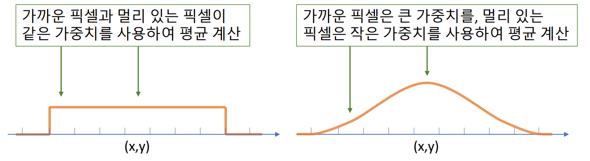</p>

    <br>

### 가우시안 함수 

<br>

$$
G_{\mu, \sigma}(X)=\frac{1}{\sqrt{2\pi}\sigma}e^{-\frac{{(x-\mu)}^{2}}{2{\sigma}^{2}}}
$$

<br>

#### 특징

<br>

<p align=center>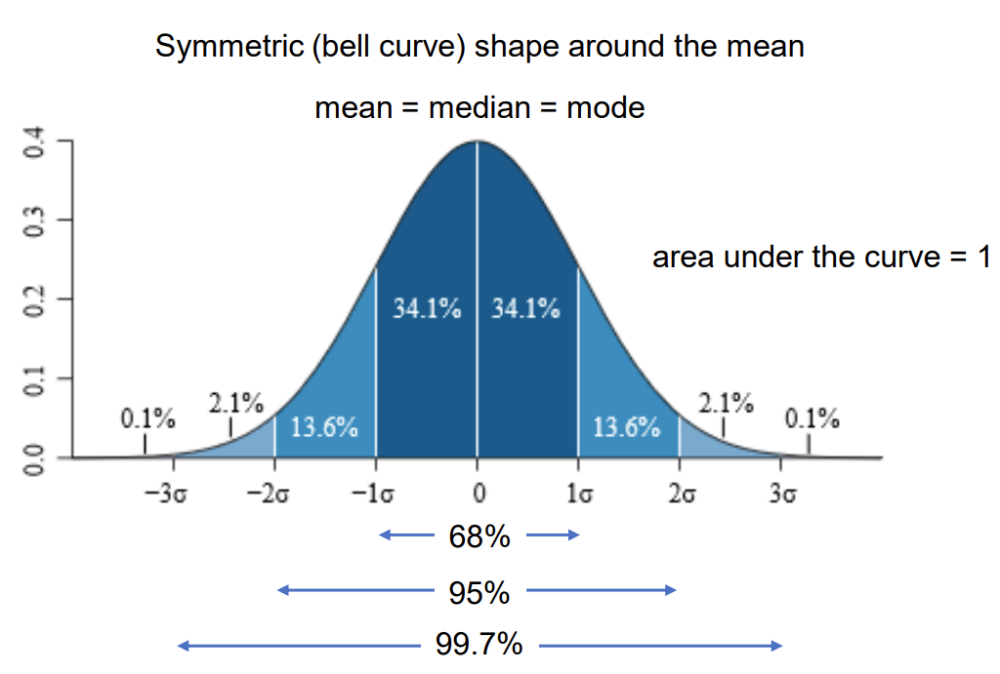</p>

<br>

- 평균값에 대해서 symmetric 함
- mean = median = mode (가장 높은 값) 이 세 값이 다 같음
- $\pm 4\sigma$ 안에 99.9%, $\pm 3\sigma$ 안에 99.7%,  $\pm 2\sigma$ 안에 95% $\pm 1\sigma$ 안에 68% 값 존재

<br>
<br>

#### 2차원 가우시안 함수

<br>

$$
G_{\sigma}(x, y)=\frac{1}{\sqrt{2\pi}{\sigma}^2}e^{-\frac{{x}^{2}+{y}^{2}}{2{\sigma}^{2}}}
$$

$$
\mu_{x}=\mu_{y}=0\
$$

$$
\sigma_{x}=\sigma_{y}=\sigma
$$

<br>
<br>

### 2차원 가우시안 필터
- 필터 마스크 ($\sigma=1.0$)
    - $\sigma$ 값이 1인 경우에 가우시안 함수가 의미있는 값을 갖는 범위가 +3 ~ -3 까지 정도로 볼 수 있음 
- 필터 마스크의 크기 : ($8\sigma+1$) 또는 ($6\sigma+1$)
    - 보통 이 2개 많이 사용 
    - ($6\sigma+1$) 은 자신에 위치에 대한 축과  $\pm 3\sigma$ 를 의미함


    <br>

    <p align=center>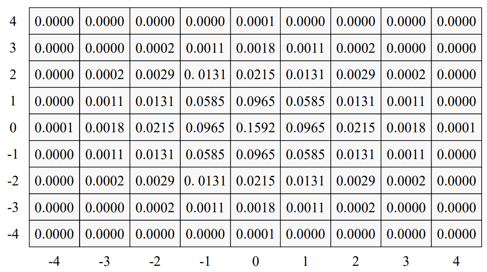</p>

    <br>
<br>


- 가우시안 필터링 함수

    ```python
    cv2.GaussianBlur(src, ksize, sigmaX, dst=None, sigmaY=None, borderType=None) -> dst

    ```
    - src: 입력 영상
        - 각 채널 별로 처리
    - dst: 출력 영상
        - src와 같은 크기, 같은 타입
    - ksize: 가우시안 커널 크기
        - **(0, 0)** 을 지정하면 sigma 값에 의해 자동 결정
            - 위의 값 권장! 
            - 강제로 주는 경우가 많은데 안 주는 것이 더 좋음 
    - sigmaX : x방향 sigma
    - sigmaY: y방향 sigma
        - 0이면 sigmaX와 같게 설정
    - borderType: 가장자리 픽셀 확장 방식

<br>
<br>

## 샤프닝 (Sharpening)
- 언샤프 마스크 필터

<br>
<br>

## 언샤프 마스크 필터링
- 날카롭지 않은 (unsharp) 영상, 즉, 부드러워진 영상을 이용하여 날카로운 영상을 생성

<br>

<p align=center>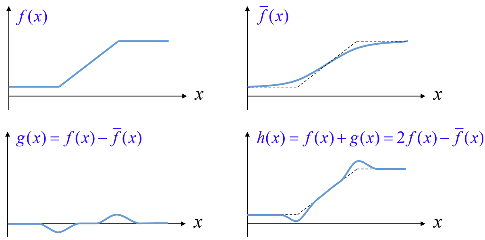</p>

<br>

- 원본 영상($f(x)$) 에서 부드럽게 만든 영상 ($\bar{f}{(x)}$ )을 빼면 날카로운 성분만 남은 ($g(x)$) 영상이 생성
- 날카로운 영상 ($h(x)$)은 원본 영상에 날카로운 성분만 남은 영상을 더해줌 
- $h(x)$ 는 local 한 영역에서 contrast 증가
    - 즉, edge 근방에서 contrast 증가

<br>

- 샤프닝은 OpenCV 함수가 구현이 되어있지 않기 때문에 직접 구현해야 함

### 샤프닝 정도 조절
- 샤프닝 정도를 조절 할 수 있도록 수식 변경

<br>

$$
h(x,y)=f(x,y)+\alpha \cdot  g(x,y) \\
= f(x,y)+\alpha(f(x,y)-\bar{f}(x,y))\\
= (1+\alpha)f(x,y)-\alpha \bar{f}{(x,y)}\\
= (1+\alpha)f(x,y)-\alpha\cdot G_{a}(f(x,y))
$$

<br>
<br>


## 잡음 제거
### 영상의 잡음 (Noise)
- 영상의 픽셀 값에 추가되는 원치 않는 형태의 신호
- 광학적 신호를 전기적 신호로 변환시키는 과정에서 잡음이 추가됨  
- 아날로그 신호를 디지털로 변환하는 과정에서 추가 될 수도 있음

<br>

$$
f(x,y)=s(x,y)+n(x,y) \\
f(x,y) :  획득된 영상 \\
s(x,y) :  원본 신호 \\
n(x,y) : 잡음
$$


<br>
<br>

- 잡음의 종류
    - 가우시안 잡음 (Gausian noise)
        - 잡음이 가우시안 분포 형태로 추가가 됨
        - 대부분의 경우는 센서 쪽에서 잡음이 추가되는 것ㄴ
    - 소금 & 후추 잡음 (Salt & Pepper noise)
        - 최근에는 보기 힘듦
        - 예전에 아날로그 통신을 했을 때 pixel 값이 0이나 255로 튀는 것

<br>
<br>

### 미디언 필터
- 주변 픽셀들의 값들을 정렬하여 그 중앙값(median)으로 픽셀 값을 대체
- 소금 & 후추 잡음에 효과적
    - 최근에는 많이 사용 안함

<br>

<p align=center>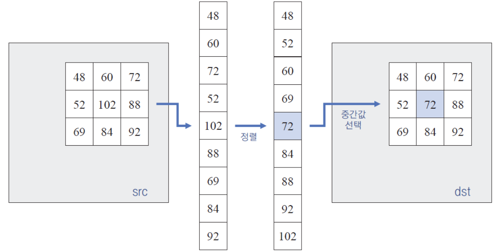</p>

<br>

-  미디언 필터링 함수

    ```python
    cv2.medianBlur(src, ksize, dst=None) -> dst
    ```
    - src: 입력 영상
        - 각 채널 별로 처리
    - ksize: 커널 크기
        - 1보다 큰 홀수
    - dst: 출력 영상
        - src와 같은 크기, 같은 타입
    