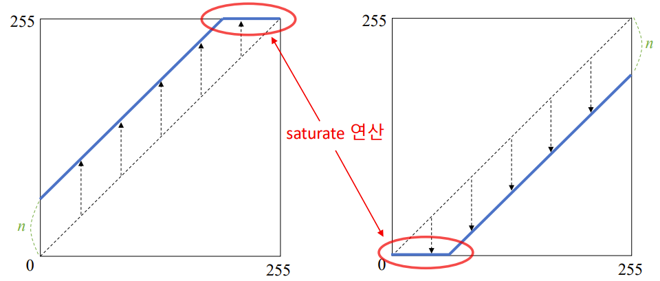

## 영상 화소 처리 기법
### 화소 처리(Point processing)
- 입력 영상의 특정 좌표 픽셀 값을 변경하여 출력 영상의 해당 좌표 픽셀 값으로 설정하는 연산

    <br>

    <p align=center></p>
    
    <br>
    
    <p align=center></p>

    <br>

    - 결과 영상의 픽셀 값이 정해진 범위 (ex> grayscale)dp dlTdjdi gka
    - 반전, 밝기 조절, 명암비 조절 등 

<br>

### 영상 밝기 조절
- 영상을 전체적으로 더욱 밝거나 어둡게 만드는 연상
    
    <br>

    <p align=center></p>

    <br>

- 밝기 조절 수식

    <br>

    <p align=center></p>

    <br>

    <p align=center></p>

    <br>

- 영상의 밝기 조절을 위한 덧셈 연산
    ```python
    cv2.add(src1, src2, dst=None, mask=None, dtype=None) -> dst
    ```

    - src1 : (입력) 첫 번째 영상 또는 scaler
        - scaler는 실수 값 하나 또는 실수 값 4개로 구성된 튜플
            - 실수 값 하나를 실수 값 4개를 가지는 튜플로 변환
            - grayscale에서 100 -> (100, 0, 0, 0)
            - color 에서 100 -> (100, 0, 0, 0), 즉 BGR 중 B만 100만큼 증가
    - src2 : (입력) 두 번째 영상 또는 scaler
    - dst : (출력) 덧셈 연산의 결과 영상
        - dst를 함수 인자로 전달하려면 dst의 크기가 src1, src2와 같아야 하며, 타입이 적절해야 함
    - mask : 마스크 영상
    - dtype :  출력 영상(dst)의 타입
        - cv2.CV_8U, cv2.CV_32F

<br>
<br>

## 영산의 산술 및 논리 연산
- 덧셈연산
    - 두 영상의 같은 위치에서 존재하는 픽셀 값을 더하여 결과 영상의 픽셀 값으로 설정

    <br>

    <p align=center></p>
    
    <br>

    - 결과가 255보다 크면 픽셀 값을 255로 설정 (포화 연산)
        ```python
        cv2.add(src1, src2, dst=None, mask=None, dtype=None) -> dst
        ```

        - src1 : (입력) 첫 번째 영상 또는 scaler
            - scaler는 실수 값 하나 또는 실수 값 4개로 구성된 튜플
                - 실수 값 하나를 실수 값 4개를 가지는 튜플로 변환
                - grayscale에서 100 -> (100, 0, 0, 0)
                - color 에서 100 -> (100, 0, 0, 0), 즉 BGR 중 B만 100만큼 증가
        - src2 : (입력) 두 번째 영상 또는 scaler
        - dst : (출력) 덧셈 연산의 결과 영상
            - dst를 함수 인자로 전달하려면 dst의 크기가 src1, src2와 같아야 하며, 타입이 적절해야 함
        - mask : 마스크 영상
            - 영상 전체가 아닌 일부 영역에만 add 함수 적용 가능 
        - dtype :  출력 영상(dst)의 타입
            - cv2.CV_8U, cv2.CV_32F
            - 보통 src1과 src2의 dtype이 같지만 다른 경우에 타입으로 출력할 지 결정해주어야 함

<br>

- 가중치 합 (weighted sum)
    - 두 영상의 같은위치에 존재하는 픽셀 값에 대하여 가중합을 계산하여 결과 영상의 픽셀 값으로 설정
        - 가중치로 두 영상의 윤곽, 색의 비중을 줄 수 있음 
        - add는 결과가 포화가 되는 경우가 많음

    <br>

    <p align=center></p>
    
    <br>
    
    - 보통 &nbsp;  이 되도록 설정
        - 두 입력 영상의 평균 밝기를 유지 

    <br>

    ```python
    cv2.addWeighted(src1, alpha, src2, beta, gamma, dst=None, dtype=None) -> dst    
    ```
    - src1 : 첫 번째 영상
    - alpha : 첫 번째 영상 가중치
    - src2 : 두 번째 영상
        - src1과 같은 크기, 같은 타입
    - beta : 두 번째 영상 가중치
    - gamma :  결과 영상에 추가적으로 더할 값 
    - dst : 가중치 합 결과 영상
    - dtype :  출력 영상(dst) 의 타입

<br>

- 평균 연산 
    - 가중치를 &nbsp;  로 설정한 가중치 합

    <br>

    <p align=center></p>

    <br>

<br>

- 뺄셈 연산
    - 두 영상의 같은 위치에 존재하는 픽셀 값에 대하여 뺄셈 연산을 수행하여 결과 영상의 픽셀 값으로 설정
    
    <br>

    <p align=center></p>

    <br>

    - 뺄셈 결과가 0보다 작으면 픽셀 값을 0으로 설정 (포화 연산)

    <br>

    ```python
    cv2.subtract(src1, src2, dst=None, mask=None, dtype=None) -> dst
    ```
    - src1 : 첫 번째 영상 또는 스칼라
    - src2 : 두 번째 영상 또는 스칼라
        - src1 - src2
    - dst : 뺄샘 연산 결과 영상
    - mask : 마스크 영상
    - dtype : 출력 영상(dst) 타입

<br>

- 차이 연산
    - 두 영상의 같은 위치에 존재하는 픽셀 값에 대하여 뺄셈 연산을 수행한 후, 그 **절댓값**을 결과 영상의 픽셀 값으로 설정
    - 뺄셈 연산과 달리 입력 영상의 순서에 영향을 받지 않음 
    - 변화가 있는 부분을 찾고자 할 때 사용 

    <br>

    <p align=center></p>

    <br>

    ```python
    cv2.absdiff(src1, src2, dst=None) -> dst
    ```
    - src1 : 첫 번째 영상 또는 스칼라
    - src2 : 두 번째 영상 또는 스칼라
    - dst : 차이 연산 결과 영상 (차영상)

<br>

## 영상의 논리 연산
- 비트 단위 AND, OR, XOR, NOT 연산
    - 각 픽셀 값을 이진수로 표현하고, bit 단위 논리 연산 수행

    <br>
    
    ```python
    cv2.bitwise_and(src1, src2, dst=None, mask=None) -> dst
    cv2.bitwiae_or(src1, src2, dst=None, mask=None) -> dst
    cv2.bitwise_xor(src1, src2, dst=None, mask=None) -> dst
    cv2.bitwise_not(src1, dst=None, mask=None) -> dst
    ```
    - src1 : 첫 번째 영상 또는 스칼라
    - src2 : 두 번째 영상 또는 스칼라
    - dst : 출력 영상
    - mask : 마스크 영상
