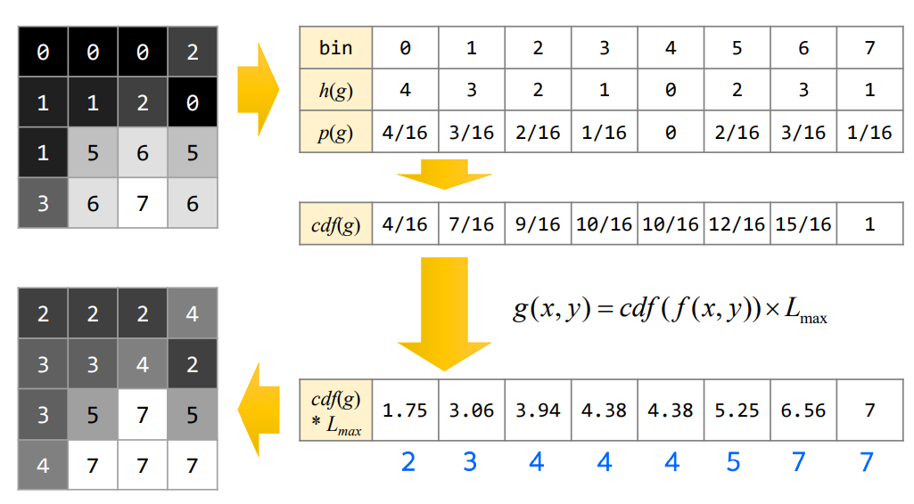
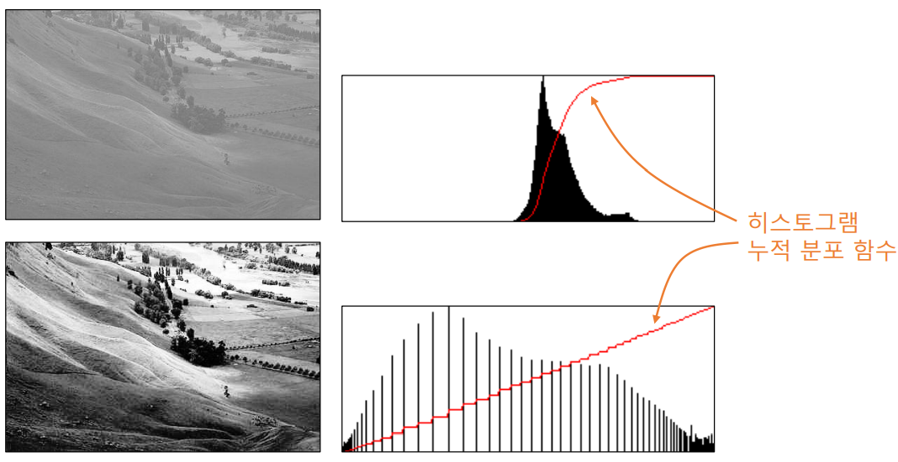
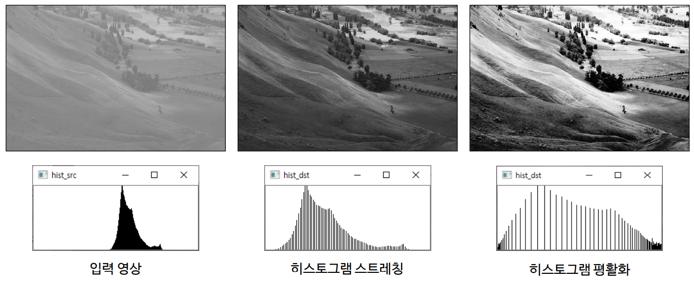
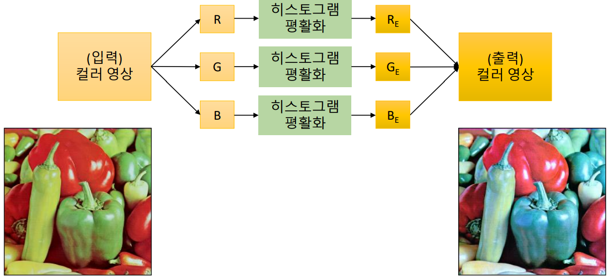
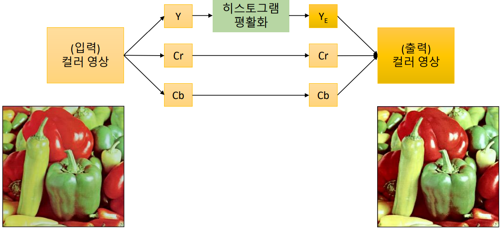

# 히스토그램 평활화
## 히스토그램 평활화 (Histogram equalization)
- 히스토그램이  그레이스케일 전체 구간에서 균일한 분포로 나타나도록 변경하는 명암비 향상 기법
    - 히스토그램 스트레칭과는 다름
- 히스토그램 균등화, 균일화, 평탄화

<br>
<br>

## 히스토그램 평활화를 위한 변환 함수 구하기
- 히스토그램 함수 구하기 

    <br>

    <p align=center></p>

    <br>

- 정규화된 히스토그램 함수 구하기

    <br>

    <p align=center></p>

    <br>

- 누적 분포 함수(cdf) 구하기 

    <br>

    <p align=center></p>

    <br>

- 변환 함수

    <br>

    <p align=center></p>

    <br>

    - pixel 값이 가질 수 있는 최대값을 곱해줌


<br>
<br>

## 히스토그램 평활화 계산 방법

<br>

<p align=center></p>

<br>
<br>

## 히스토그램 평활화와 히스토그램 누적 분포 함수와의 관계

<br>

<p align=center></p>

<br>
<br>

## 히스토그램 평활화
- opencv 함수

    <br>

    ```python
    cv2.eqaulizeHist(src, dst=None) -> dst    
    ```
    - src : 입력 영상
        - 그레이스케일영상
    - dst : 결과 영상

<br>
<br>

## 히스토그램 스트레칭과 평활화 비교
<br>

<p align=center></p>

<br>

- 히스토그램 스트레칭은 양 옆으로 늘린 것
    - 빈 부분이 골고루 비교적 균일 간격으로
- 히스토그램 평활화
    - 빈칸이 넓고, 좁게 들어감
    - 입력 영상 히스토그램에서 픽셀값이 뭉쳐있는 부분, 즉 많이 있는 부분은 넓게 펴고 적게 있는 부분은 좁게 피거나 좁힘
- 사람 눈으로 보면 평활화가 더 명암비가 도드라져 보임
- 하지만 경우에 따라서는 평활화를 할 때는 사람 눈으로 봤을 때 이상해보이는 경우가 있음
    - 너무 맹신하지는 말 것 

<br>
<br>

## 컬러 히스토그램 평활화
- 직관적 방법
    - R, G, B 각 색 평면에 대해 히스토그래 평활화

    <br>

    <p align=center></p>

    <br>

    - 색감이 완전이 변함

<br>

- 밝기 성분에 대해서면 히스토그램 평활화 수행 (색상 성분은 불변)

    <br>

    <p align=center></p>

    <br>
