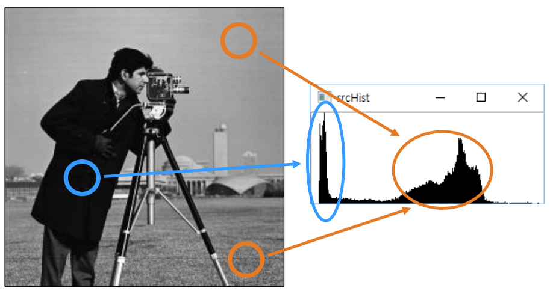
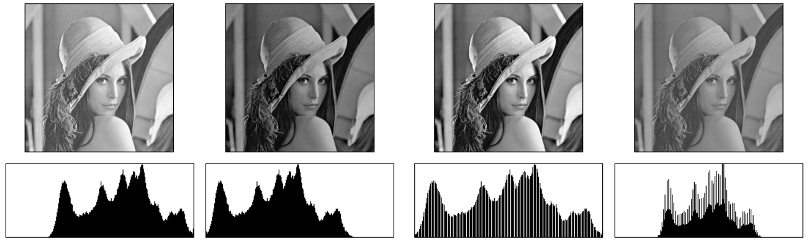

## 히스토그램 (Histogram)
- 데이터의 분포를 나타내는 방법
- 영상의 픽셀 값 분포를 그래프 형태로 표현한 것
    - GrayScale의 경우 0 ~ 255 까지의 값을 가질 수 있는데 각 grayscale 값에 해당하는 픽셀의 개수를 구하고 표현한 것 

<br>
<br>

### 정규화된 히스토그램 (Normalized histogram)
- 각 픽셀의 개수를 영상 전체 픽셀 개수로 나누어준 것
    - 크기에 대한 normalization
- 해당 그레이스케일 값을 갖는 픽셀이 나타날 **확률** 

<br>
<br>


## 영상과 히스토그램 관계
- 그래프 왼쪽으로 갈 수록 값이 작고(어두움), 오른쪽으로 갈 수록 값이 큼(밝음)

    <br>

    <p align=center></p>

    <br>

    - 히스토그램 모양의 전체적인 양상을 보고 영상이 밝은 이미지인지 어두운 이미지인지 확인 할 수 있음
    
    <br>

    <p align=center></p>

    <br>

    1. 밝은 영상
    2. 어두운 영상
    3. contrast가 높음
        - 어두운 부분부터 밝은 부분까지 골고루 분포
        - 비어있는 부분은 히스토그램 스트레칭을 적용해서 생김
    4. 히스토그램 구간이 좁음, contrast가 낮음
        - 영상이 뿌옇거나 흐릿함

<br>
<br>

## 히스토그램 구하기
- 히스토그램 구하는 함수
    ```python
    cv2.calcHist(images, channels, mask, histSize, ranges, hist=None, accumulate=None) -> hist
    ```

    - images : 입력 영상 리스트
        - 영상 하나로 구할 수도 있고 여러 개의 영상을 구할 수도 있음
    - channels : 히스토그램을 구할 채널을 나타내는 리스트
        - Grayscale : [0]
        - Color(BGR 모두) : [0, 1, 2]
        - Color(BG) : [0, 1] 
    - mask : 마스크영상, 입력 영상 전체에서 히스토그램을 구하려면 None 지정
    - histSize : 히스코그램 각 차원(bin)를 나타내는 리스트
        - ex> GrayScale : [256]
            - 작은 값을 주어면 [128] 값이 0 또는 1인 것, 2 또는 3인 것, .. 이렇게 rough 하게 나타냄
    - ranges : 히스토그램 각 차원의 최솟값과 최댓값으로 구성된 리스트
        - GrayScale : [0, 256]
        - 만약 2개의 channel을 이용하는 경우 : [0, 256, 0, 256]
    - hist : 계산된 히스토그램 (numpy.ndarray)
    - accumulate : 기존의 hist 히스토그램에 누적하려면 True 아니면 False (default : False)