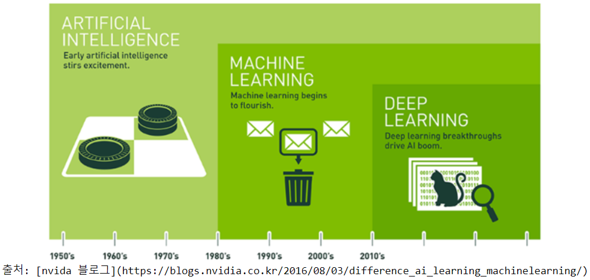
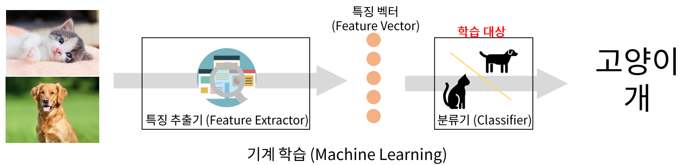
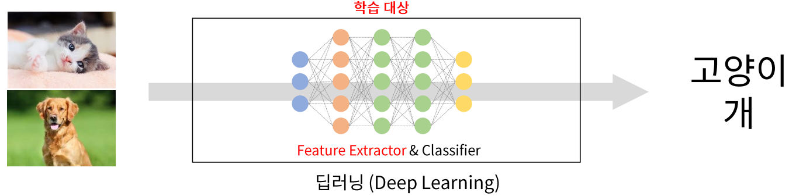
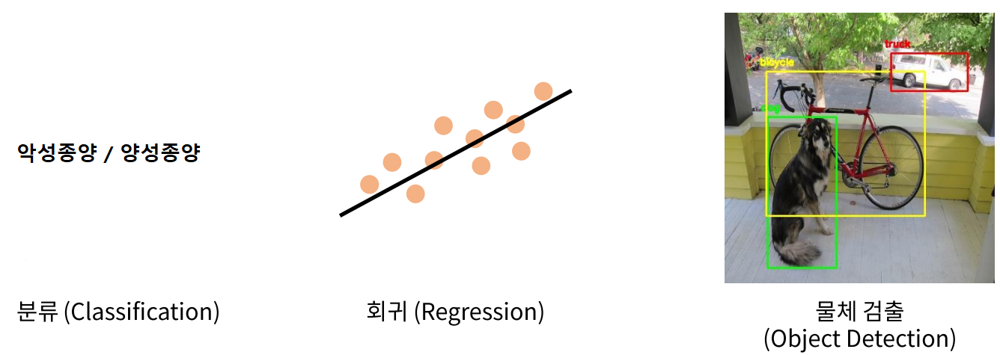
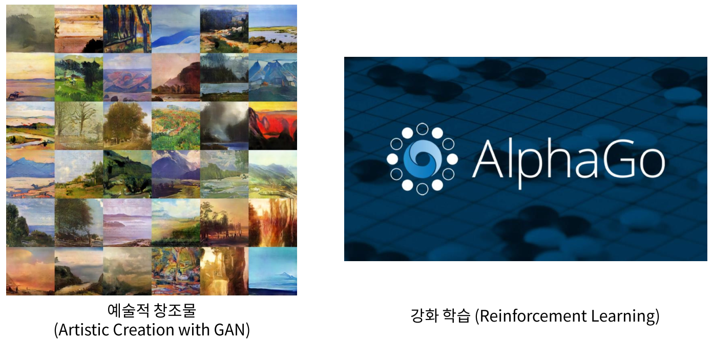
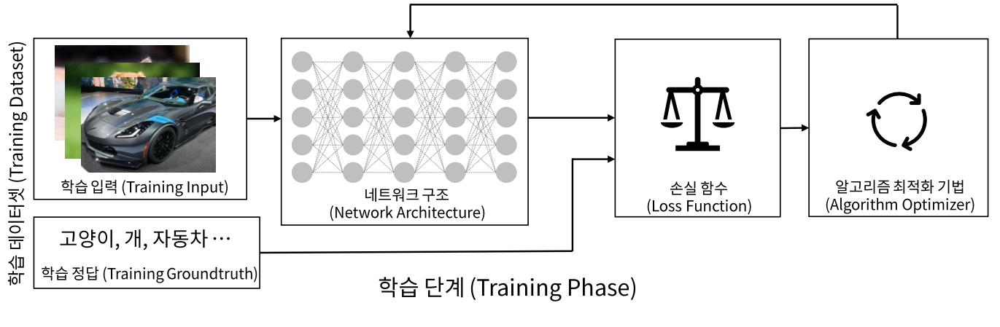
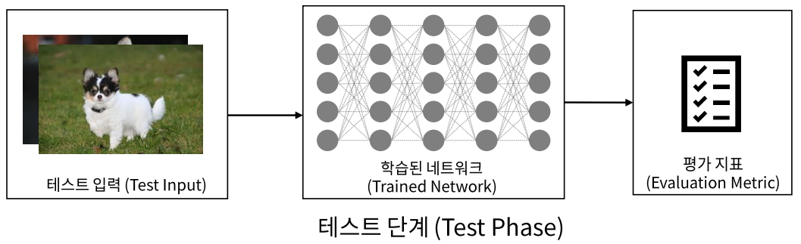

# 딥러닝 개요
<p align="center"></p>

<br>

### 인공지능 (AI - Artificial Intelligence)
- 지능
  - 어떤 문제를 해결하기 위한 지적 활동 능력
- 인공지능
      - 기계가 사람의 지능을 모방하게 하는 기술
      - 규칙기반, 데이터 학습 기반 

<br>

### 머신러닝(Machine Learning)
- **데이터 학습 기반**의 인공 지능 분야
- 기계에게 어떻게 동작할지 일일이 코드로 명시하지 않고 데이터를 이용해 학습할 수 있도록 하는 알고리즘과 기술을 개발하는 인공지능의 한분야

<br>

- ### 딥러닝 (Deep Learning)
- 인공신경망을 기반으로 하는 머신러닝의 한 분야 
- 비정형의 대용량 데이터 학습에 뛰어난 성능을 나타냄

## 딥러닝의 특징

<p align="center"></p>

<p align="center"></p>

## 딥러닝을 이용해 할 수 있는 일

<p align="center"> </p>
  
<br>

<p align="center"></p>

<br>

<p align="center"></p>

<br>
<br>

# 딥러닝 프로세스

<p align="center">
  
  
</p>

<br>
<br>

# [tensorflow](https://www.tensorflow.org/?hl=ko)
- 구글에서 오픈소스로 공개한 다양한 수치 연산과 딥러닝을 위한 라이브러리
- 구글내 연구와 제품 개발을 목적으로 사용하던 라이브러리를 2015년 공개

<br>
<br>

## [Keras](https://keras.io/)
- 파이썬으로 구현된 쉽고 간결한 딥러닝 라이브러리로 구글 개발자인 프랑소와 숄레 개발
- 직관적인 API를 제공 
- 내부적으로는 텐서플로우(TensorFlow), 티아노(Theano), CNTK 등의 딥러닝 전용 엔진위에서 작동
- Tensorflow 2.0 부터 Keras가 텐서플로에 포함됨


<br>
<br>

# tensorflow 설치

## conda 가상환경 만들기
```python
conda create -n tf2 python=3.8
conda activate tf2
conda install -c anaconda jupyter pandas matplotlib seaborn scikit-learn tensorflow
# conda install -c anaconda tensorflow=2.5.0

pip install tensorflow==2.5.0 
# prompt에서 설치할 때 conda로 하는 경우 install이 잘 되지 않음
# pip install로 실행
```