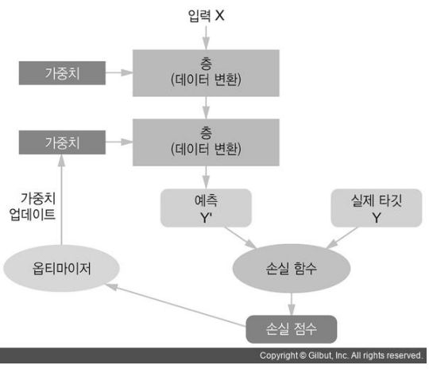

# Keras를 사용한 개발 과정
1. 입력 텐서(X)와 출력 텐서(y)로 이뤄진 훈련 데이터를 정의
2. 입력과 출력을 연결하는 Layer(층)으로 이뤄진 네트워크(모델)을 정의
    - Sequential 방식
        - 순서대로 쌓아올린 네트워크로 이뤄진 모델을 생성하는 방식
    - Functional API 방식
        - 다양한 구조의 네트워크로 이뤄진 모델을 생성하는 방식
    - Subclass 방식
        - 네트워크를 정의하는 클래스를 구현
    
3. 모델 컴파일
    - 모델이 Train(학습)할때 사용할 손실함수(Loss Function), 최적화기법(Optimizer), 학습과정을 모니터링할 평가지표(Metrics)를 설정
4. Training(훈련)
    - 모델의 fit() 메소드에 훈련데이터(X,y)를 넣어 Train

<br>

<p align=center></p>

<br>
<br>


# MNIST 이미지 분류 
- [MNIST](https://ko.wikipedia.org/wiki/MNIST_%EB%8D%B0%EC%9D%B4%ED%84%B0%EB%B2%A0%EC%9D%B4%EC%8A%A4)(Modified National Institute of Standards and Technology) database
- 흑백 손글씨 숫자 0-9까지 10개의 범주로 구분해놓은 데이터셋
- 하나의 이미지는 28 * 28 pixel 의 크기
- 6만개의 Train 이미지와 1만개의 Test 이미지로 구성

<br>

### 데이터 로드
- MNIST Dataset Loading
    -  keras의 toy data로 제공이 됨

    <br>

    ```python
    (train_image, train_label), (test_image, test_label) = keras.datasets.mnist.load_data()
    ```

<br>
<br>

## 신경망 구현
### network : 전체 모델 구조 만들기
- 전체적인 network 모델 구성
- 모델 안에 여러개의 layer 층 구성
- 하나의 layer 안에 여러 unit 존재

    ```python
    # 모델(네트워크)
    model = keras.Sequential()

    # 모델에 Layer들을 추가 
    # layer : 1 (28*28) , 이 모델에 어떤 사이즈의 이미지가 들어갈 지 알려줌
    model.add(keras.layers.InputLayer((28,28)))# 첫번째 Layer는 Input Layer(입력 데이터의 shape)

    # layer : 2 (784, ) Dense는 1차원 밖에 받을 수 없기 때문에 1차원으로 변환
    model.add(keras.layers.Flatten()) # 28 X 28 입력 데이터를 1차원 배열(784, )로 변환

    # layer : 3 ~ 5
    model.add(keras.layers.Dense(units = 128, activation='relu'))
    model.add(keras.layers.Dense(units=64, activation='relu'))
    model.add(keras.layers.Dense(units=10, activation='softmax'))
    ```

<br>
<br>

## 컴파일 단계
- 구축된 모델에 학습을 위한 추가 설정
- 손실함수
- Optimizer(최적화 함수)
- 평가지표

```python
model.compile(optimizer="adam",#최적화함수 - 모델의 파라미터(weight)들을 업데이트
             loss = "categorical_crossentropy", # Loss(손실, 오차)를 계산하는 함수 설정, categorical_crossentropy : 다중분류의 손실함수
             metrics=['accuracy']
             )
```

## 데이터 전처리
- X (Input Data Image)
    - 0 ~ 1 사이의 값으로 정규화
- y (Output Data)
    - one hot encoding 처리
        - Label이 다중분류일 경우 One Hot Encoding 
    - tensorflow.keras 의 to_categorical() 함수 이용

    <br>

    ```python
    # X_train = train_image/255.0
    # X_train.dtype # 'float64'

    X_train = (train_image/255.0).astype(np.float32) # tensorflow는 float32를 더 선호함!
    X_test = (test_image/255.0).astype(np.float32)
    ```

    ```python
    # Label onehot encoding

    y_train = keras.utils.to_categorical(train_label)
    y_test = keras.utils.to_categorical(test_label)
    ```
    
<br>
<br>

## 학습 (fit)
- model.fit() 함수 이용
  - History 객체 반환
    - History 객체 : train 시 epoch 별 평가 지표값을 반환

- 1 epoch : train dataset 전체를 한번 학습하는 것 
- 1 step : 파라미터(weight)를 한번 update 하는 것

    ```python
    hist = model.fit(X_train, y_train, # train dataset - x, y
            epochs = 10, # epcch 수 - train dataset 전체를 한번 학습하는 것 
            batch_size = 100, # 파라미터(weight- 모델의 학습대상)를 몇개의 데이터마다 업데이트 할지를 설정
            validation_split = 0.3 # train set의 30%는 검증데이터로 사용
            )
    ```

    
<br>
<br>


## 테스트셋 평가
- 테스트 데이터 평가

    ```python
    test_loss, test_acc = model.evaluate(X_test, y_test) # (X, y). 반환 : loss [, metrics 설정한 평가 지표값]
    ```

<br>
<br>

### 추론 메소드
- predict()
    - 분류 : 각 클래스 별 확률 반환
    - 회귀 : 예측값 반환
- <del>predict_classes()</del>
    - 클래스(범주값) 반환
    - tensorflow 2.3 부터 deprecated 됨
- 이진 분류(binary classification)
    - `numpy.argmax(model.predict(x) > 0.5).astype("int32")`
- 다중클래스 분류(multi-class classification)
    - `numpy.argmax(model.predict(x), axis=-1)`

    <br>

    ```python
    result = model.predict(X_test)
    numpy.argmax(model.predict(X_test), axis=-1)
    # axis=-1 은 현재 배열의 마지막 axis
    ```