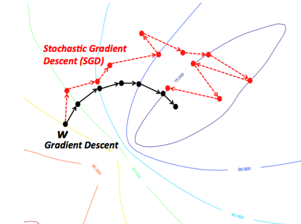
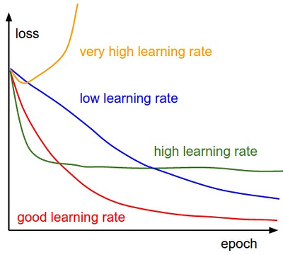
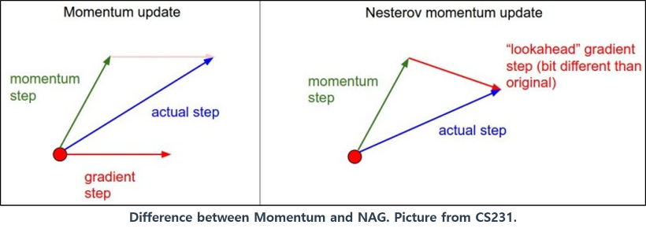
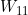
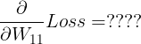

# DNN (Deep Neural Network)

## 신경망(Neural Network) 구성요소

### 딥러닝 프로세스

- 층(Layer)
    - Network를 구성하는 Layer(층)
- 손실함수(loss function)
    - 가중치를 어떻게 업데이트할 지 예측결과와 Ground truth(실제타깃) 사이의 차이를 정의
- optimizer
    - 가중치를 업데이트하여 모델의 성능을 최적화

 

- 모델 안에 optimizer, loss를 넣지 않는 이유는 실제 추론에는 사용하지 않기 때문
- optimizer와 loss는 학습에서만 필요하기 때문에 compiler 단계에 필요

 
 

## 유닛/노드/뉴런 (Unit, Node, Neuron)
- Tensor를 입력받아 Tensor를 출력하는 데이터 처리 모듈 
    - Input -> Output
- 입력 값에 Weight(가중치)를 곱하고 bias(편향)을 더한 뒤 활성화 함수를 거쳐 출력
- 하나의 노드 구성
    
    

      
    

    - **Input vector(입력값)**
        - 
    
        -  데이터의 속성값들
        
    - **Weights(가중치)**
        - 
    - **Bias(편향)**: 
        - 입력값이 0 일 때 어떤 값을 가지는지 표현
        - weights 만으로 예측하기 힘들기 때문에 조절을 위해 필요한 값
    - **Activation function(활성함수)**: 
        - 다양한 비선형 함수들을 사용
        
        
 

        
 

        
        - 활성화 함수가 sigmoid이면 그 unit은 Logistic Regression
        - 선형  을 비선형으로 만들어주는 역할

 
 

## 레이어/층(Layer)
- **Input Layer(입력층)**
    - 입력값들을 받아 Hidden Layer에 전달하는 노드들로 구성된 Layer

 

- **Output Layer(출력층)**
    - 예측결과를 출력하는 노드들로 구성된 Layer

 

- **Hidden Layer(은닉층)**
    - Input Layer와 Output Layer사이에 존재하는 Layer
    - Hidden Layer는 **특성 추출**을 하는 역할
    - 한 레이어가 찾는 특성이 다름 
    - activation 함수를 쓰지 않으면 각 레이어들이 나눠지지 않음
    - activation 함수를 쓰지 않으면 weight를 각각  2, 3, 5 주는 것과 한번에 30(2*3*5) 주는것과 차이가 없음
        - 즉, layer를 여러개 만드는 의미가 없음
        
- 대부분 Layer들은 가중치를 가짐 (dropout, pooling과 같이 가중치가 없는 layer도 있음) 

 

- **Network(망)**: Layer들의 연결
    - 많이 사용되는 Layer의 예
        - Fully connected layer (Dense layer)
        - Convolution layer 
        - Recurrent layer 
        - Embedding layer 
            - text를 전처리해주는 layer(text를 숫자로 바꿔줌)
        
 

- [**Layers**](https://www.tensorflow.org/api_docs/python/tf/keras/layers)

 
 

## 모델 (Network)
- Layer를 쌓아 만드는 네트워크 
- 이전 레이어의 출력을 input으로 받아 output을 주는 층을 순서대로 쌓음 
- 적절한 network 구조(architecture)를 찾는 것은 많은 경험이 필요 
- 기존의 잘 작동한 구조를 기반으로 구현하는 방식으로 접근 

 
 

## 딥러닝(Deep Learning)
- 신경망의 층이 많아지면 딥러닝

 
 

## 손실함수(Loss function, 비용함수)
- Model을 통해 나온 예측값(prediction) 와 실제 데이터(output) 의 차이를 수량화하는 함수
- 훈련하는 동안 이 값이 최소화되도록 파라미터(가중치와 편향)을 업데이트
- 문제의 종류에 따라 다른 손실함수 사용
- 손실 함수를 사용하는 이유?
    - 정확도라는 명확한 지표를 두고 손실함수를 사용하는 이유는 정확도는 대부분의 미분값들이 0이 되기 때문

 

해결하려는 문제의 종류에 따라 표준적인 Loss function이 존재함

 

- **Binary classification (이진 분류)**
    - 두 개의 클래스를 분류
        - 둘 중 하나
        - 1일 확률을 찾아내는 것
            - 즉 0.5보다 높으면 1
    - 예) 문장을 입력하여 긍정/부정 구분
    - loss function : **binary_crossentropy**
    
    

        
    

    
    >-  : 실제 값(Ground Truth),   : 예측확률
    
     

- **Multi-class classification (다중 클래스 분류)**
    - 두 개 이상의 클래스를 분류 
        - 여러개 중 하나
    - 예) 이미지를 0,1,2,...,9로 구분
        - one-hot-encoding
    - loss function : **categorical_crossentropy**
    
    

        
    

    
    >-  : 실제 값(Ground Truth),  : class별 예측확률

     

- **Regression (회귀)**
    - 연속형 값을 에측 
    - 예) 주가 예측 
    - loss function : **Mean squared error** 
        - **mse**로 지정해서 사용
        
    

        
    

    
    >-  : 실제 값(Ground Truth),  : 예측 값

     

- https://www.tensorflow.org/api_docs/python/tf/keras/losses

 
 

## 평가지표 (Metrics)
- 모델의 성능을 평가하는 지표
- 손실함수(Loss Function)와 차이
    - 손실함수는 모델을 학습할 때 가중치 업데이트를 위한 오차를 구할 때 사용
    - 평가지표 함수는 모델의 성능이 확인하는데 사용 

- https://www.tensorflow.org/api_docs/python/tf/keras/metrics

 
 

## 활성 함수 (Activation Function)
- 각 유닛이 입력결과를 처리한 후 출력하기 위해 거치는 함수
- 같은 층(layer)의 모든 유닛들은 같은 활성 함수를 가짐
- 최종 **출력 레이어의 경우 문제 유형에 따른 표준 활성화 함수가 존재**
- 은닉층 (Hidden Layer)의 경우 **ReLU** 함수를 주로 사용 

 

### 주요 활성함수(Activation Function)

- **Sigmoid (logistic function)**
    

    
     
    
    - 
    - 
    - 한계
        - 초기 딥러닝 모델의 활성함수로 많이 사용되었으나 레이어가 깊어지면 기울기 소실(Gradient Vanishing) 현상 발생
        - 함수값의 중심이 0이 아니어서 학습이 느려짐
            - X의 값이 0일때 0.5를 반환한다.
    - **Binary classification(이진 분류)를 위한 네트워크의 Output layer(출력층)의 활성함수로 사용**
        - 위와 같은 한계때문에 hidden layer(은닉층)의 활성함수로는 잘 사용되지 않음

     

- **기울기 소실(Gradient Vanishing)**
    - 최적화 과정에서 gradient가 0과 밑단층 (Bottom Layer)의 가중치들이 학습이 안되는 현상

     

- **Hyperbolic tangent**

    

    - 
    - 
    
    - Output이 0을 중심으로 분포하므로 sigmoid보다 학습에 효율 높음
    - 여전히 기울기 소실(Gradient Vanishing) 문제 발생

     

- ### ReLU(Rectified Linear Unit)

    

    - 

    - 기울기 소실(Gradient Vanishing) 문제를 어느정도 해결
    - 0이하의 값(z <= 0)들에 대해 뉴런이 죽는 단점 존재 (Dying ReLU)

     

- ### Leaky ReLU

    

    - 
    - 

    - ReLU의 Dying ReLU 현상을 해결하기 위해 나온 함수
    - 음수 z를 0으로 반환하지 않고 alpah (0 ~ 1 사이 실수)를 곱해 반환

     

- ### Softmax

    - 
    - 

    - **Multi-class classification(다중 분류)를 위한 네트워크의 Output layer(출력층)의 활성함수로 사용** 
        - 은닉층의 활성함수로 사용하지 않음
    - 각 class의 score를 정규화 하여 각 class에 대한 확률값으로 변환
        - 출력노드들의 값은 0 ~ 1사이의 실수로 변환되고 그 값의 총합은 1

    - Activation functions in Keras:https://www.tensorflow.org/api_docs/python/tf/keras/activations

 

 
 

## Optimizer 
- Loss function을 기반으로 네트워크가 어떻게 업데이트 될지를 결정하는 알고리즘  
    - Losss function에서 loss가 최소화되는 부분을 찾아가는 알고리즘 
 

### Gradient Decent (경사하강법)
- 최적화 
    - 모델(네트워크)가 출력한 결과와 실제값(Ground Truth)의 차이를 정의하는 함수를 **Loss function(손실함수, 비용함수)** 라고 함
    - Train 시 Loss function이 출력하는 값을 줄이기 위해 파라미터(weight, bias)를 update 과정을 최적화(Optimization) 라고 함
    
     

- Gradient Decent(경사하강법)
    - 최적화를 위해 파라미터들에 대한 Loss function의 Gradient값을 구해 Gradient의 반대 방향으로 일정크기 만큼 파라미터들을 업데이트 하는 방법
        
    

    
&nbsp;: 업데이트 시킬 파라미터

    
&nbsp;: 학습률

 

### SGD(Stochastic Gradient Descent)
 

 

- (Full) Batch Gradient Decent (배치 경사하강법)
    - Loss를 계산시, 전체 학습데이터를 사용해 그 평균값을 기반으로 파라미터를 최적화하는 방법
    - 많은 계산량이 필요해서 속도가 느림
    - 학습 데이터가 클 경우 메모리가 부족 현상 발생 가능

 

- Mini Batch Stochastic Gradient Decent (미니배치 확률적 경사하강법)
    - Loss를 계산할 때 전체 데이터를 다 사용하지 않고 지정한 데이터 양(batch size) 만큼마다 계산해 파라미터를 업데이트하는 방법
    - 계산은 빠른 장점이 있지만 최적값을 찾아 가는 방향이 불안정하여 부정확 
        - 반복 횟수를 늘리면 Batch 방식과 유사한 결과로 수렴

 

- **스텝(Step)**:  한번 파라미터를 업데이트하는 단위

- SGD와 GD의 차이 

     

    

    
<a href="https://seamless.tistory.com/38">출처</a>

    
     

    - 루트만 보면 SGD가 헤매이는 것 같지만 GD보다 빠른 속도로 학습

 

- SGD의 단점 
    - local minima 또는 안정점에서 기울기가 0이기 때문에 더 이상 이동하지 않음
        - 초기 위치 중요
    - 최적의 값을 찾아가는 과정이 비효율적
        - learning rate의 영향이 매우 큼 

             

            

            
<a href="https://seamless.tistory.com/38">출처</a>

             

            - learning rate의 크기가 작으면 학습이 오래 걸리거나 최적의 값을 찾기 전에 학습이 끝나는 경우가 생김
            - learning rate의 크기가 크면 빠르게 학습이 되나 최솟값 근처에서 왔다갔다 하는 현상이 발생
                - 한번의 step에서 이동할 수 있는 step size는 한계가 있으므로 최소값 주변을 왔다갔다 잔동하면서 하면서 최솟값을 찾는데 시간을 낭비하거나 찾지 못하게 하는 현상인 **Oscillation** 발생
        
     

 
 

#### SGD를 기반으로 한 주요 옵티마이저
- 방향성을 개선한 최적화 방법
    - Momentum
    - NAG(Nesterov Accelerated Gradient)
- 학습률을 개선한 최적화 방법
    - Adagrad
    - RMSProp
- 방향성 + 학습률 개선 최적화 방법
    - Adam (Momentum+RMSProp)

 

<a href="https://www.slideshare.net/yongho/ss-79607172">출처</a>

### Momentum
- SGD에 momentum 개념을 추가
    - 과거에 이동했던 방식을 기억하면서 그 방향으로 일정 정도를 추가적으로 이동하는 방식  

     

    

    

    
 &nbsp; : momentum의 비중을 얼마나 줄 지 정해주는 관성계수, 보통 0.9 사용

    
     

     

    

     

- local minima를 빠져나올 수 있음 
    - SGD의 경우 local minima를 만나면 기울기가 0이기 때문에 더 이상 이동하지 않음
    - momentum의 경우 중간에 local minima를 만나더라도 기존 관성에 의해 빠져나올 수 있음
- SGD의 Oscillation 현상 해결
    - 이동하는 방향에 관성이 생기기 때문에 진동을 하더라고 최솟값으로 가는 방향에 힘을 얻어 SGD에 비해 상대적으로 빠르게 진행 가능
    <!-- - 속도, 즉 변화율이 크게 나오는 경우 기울기가 크게 update되는 SGD의 단점을 보완 -->

 

- momentum 단점
    - 멈춰야 할 시점에서도 관성에 의해 훨씬 멀리 갈수도 있다는 단점이 존재
 
 

### NAG(Nesterov Acclated Gradient)
 

 

- Momentum 방식은 현재 위치에서의 gradient를 계산한 후 momentum 고려
    - 멈춰야 할 시점에도 관성에 의해 훨씬 멀리 이동하여 최적의 parameter 찾기 힘든 경우 생김
- NAG 방식은 momentum step으로 이동한 후 gradeint를 구하여 이동

     

    

    

- 신경망에는 적합하지 않음
    - Gradient에 적용할 bias와 weight를 관성을 적용하여 이동하여 계산하는 것이 역적파를 이용하여 계산을 더 효율적으로 사용하려는 것과 반대됨

- Bengio의 근사적 접근을 이용하면 편향과 가중치는 건들지 않기 때문에 신경망 학습 가능하다고 함

 

### Adagrad(Adaptive Gradient)
- parameter update 할 때, 각각의 parameter마다 learning rate(=step size)를 다르게 설정하여 이동
- 지금까지 많이 변화한 변수들은 최적의 값에 있을 확률이 높기 때문에 learning rate를 작게 설정하고, 적게 변화한 변수들은 최적의 값에 도달하기 위해서 많이 이동해야하므로 learning rate값을 크게 설정

     

    

     

    

    -   업데이트 할 파라미터 개수의 차원벡터, 이동 거리를 나타내는 척도로 사용
        - 즉, t까지 각 변수가 이동한 Gradient의 sum of squares 값 저장

     
     
    
    

     
- learning rate는 보통 0.01 정도로 설정한 후 그 이후로는 바꾸지 않음

 

- Adagrad 단점
    - G값은 제곱한 값이기 때문에 학습이 계속되면 learning rate가 매우 작아져 파라미터가  update 되지 않는 경우가 생김

 

### RMSProp
- Adagrad의 단점을 보완하기 위해 제안된 방법
- RMSProp은 이전 누적치와 현재 gradient의 좌표별 제곱의 가중치 평균을 고려
    - Adagrad 보다 최근 값을 더 반영

     

    

    
    
 &nbsp;: forgetting factor(decaying factor), 0~1 사이의 값

    
보통 0.9 ~ 0.999의 값 가짐 

    
     
     

    

     

- 가중치 기울기를 단순 누적시키는 것이 아닌, 최신 기울기들이 더 반영되도록 함
-  &nbsp;를 추가하여  &nbsp; 가 무한하게 커지지 않게 함

 

### AdaDelta (Adadelta)
- RMSProp와 마찬가지로 AdaGrade의 단점을 보완하기 위해 제안된 방법
- Adagrad의 식에서 를 구할 때 지수평균을 구함
    - learning rate을 단순히 &nbsp;&nbsp;로 사용하는 대신 learning rate의 변화값의 제곱을 가지고 지수 평균을 사용 

     

    

    

    

    

<!-- - 이해가 잘 안감... 나중에 추가 -->

 

### Adam (Adaptive Moment Estimation)
- 현재 가장 많이 쓰이는 optimizer
- RMSProp과 Momentum 방식을 융합한 방법, 즉 '관성' + '학습률 변화'
    

    

 
    

     

-  과 &nbsp; 처음에 0으로 초기화되기 때문에 가중치 &nbsp; , &nbsp; 가 1에 가까우면 값이 0에 편향
    - 보통 &nbsp; 는 0.9, &nbsp; 는 0.999, &nbsp; 은  &nbsp;의 값을 가짐

     
    
- 아래 식을 통하여 보정

     

    

    

    

 
 

# 오차 역전파(Back Propagation) 
- 딥러닝 학습시 파라미터를 최적화 할 때 추론한 역방향으로 loss를 전달하여 단계적으로 파라미터들을 업데이트
    - Loss에서부터(뒤에서부터) 한계단씩 미분해 gradient 값을 구하고 이를 Chain rule(연쇄법칙)에 의해 곱해가면서 파라미터를 최적화함

 
 

## 계산 그래프 (Computational Graph)
- 복잡한 계산 과정을 자료구조의 하나인 그래프로 표현한 것
- 그래프는 노드(Node)와 엣지(Edge)로 구성
    - 노드: 연산을 정의
    - 엣지: 데이터가 흘러가는 방향

### 계산 그래프의 예
- 슈퍼에서 1개에 100원인 사과를 2개 샀을 때 지불할 금액? (단 부가세는 10% 부과)

 

 

### 계산 그래프 장점
- 계산 그래프를 사용한 문제 풀이 절차
    - 계산 그래프를 구성
    - 계산 방향을 결정
        - 왼쪽에서 오른쪽 방향으로 계산: **순전파(Forward propagation)**
        - 오른쪽 방향에서 왼쪽 방향으로 계산: **역전파(Back propagation)**
- 특징/장점
    - **국소적 계산**을 통한 결과 획득
        - 각 노드의 계산은 자신과 관계된 정보(입력 값들)만 가지고 계산한 뒤 그 결과를 다음으로 출력
    - 복잡한 계산을 단계적으로 나눠 처리하므로 문제를 단순하게 만들어 계산할 수 있게 함
        - **딥러닝에서 역전파를 이용해 각 가중치 업데이트를 위한 미분(기울기) 계산을 효율적으로 만들어줌**
    - 중간 계산결과 보관 가능

 

## 합성함수의 미분
- 합성함수 : 여러 함수로 구성된 함수

 

- 연쇄 법칙(Chain Rule)
    - 합성함수의 미분은 합성함수를 구성하는 각 함수의 미분의 곱으로 표현 가능

 

 

### 연쇄 법칙과 계산 그래프

 
 

## 딥러닝 네트워크에서 최적화 예

 

- 을 업데이트 하기 위한 미분값은?

    

    

    

 
 

<!-- - https://www.tensorflow.org/api_docs/python/tf/keras/activations -->

