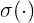
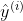
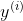
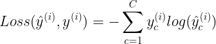

# DNN (Deep Neural Network)

## 신경망(Neural Network) 구성요소

### 딥러닝 프로세스

- 층(Layer): Network를 구성하는 Layer(층)
- 손실함수(loss function): 가중치를 어떻게 업데이트할 지 예측결과와 Ground truth(실제타깃) 사이의 차이를 정의
- optimizer: 가중치를 업데이트하여 모델의 성능을 최적화

- 모델 안에 optimizer, loss를 넣지 않는 이유는 실제 추론에는 사용하지 않기 때문
- optimizer와 loss는 학습에서만 필요하기 때문에 compiler 단계에 필요

## 유닛/노드/뉴런 (Unit, Node, Neuron)
- Tensor를 입력받아 Tensor를 출력하는 데이터 처리 모듈 
    - Input -> Output
- 입력 값에 Weight(가중치)를 곱하고 bias(편향)을 더한 뒤 활성화 함수를 거쳐 출력
- 하나의 노드 구성
    
    

      
    

    - **Input vector(입력값)** : 
    
        -  데이터의 속성값들
        
    **Weights(가중치)**: 
    - **Bias(편향)**: 
        - 입력값이 0 일 때 어떤 값을 가지는지 표현
        - weights 만으로 예측하기 힘들기 때문에 조절을 위해 필요한 값
    - **Activation function(활성함수)**: 
        - 다양한 비선형 함수들을 사용
        
        

            
            
        

    
        - 활성화 함수가 sigmoid이면 그 unit은 Logistic Regression
        - 선형  을 비선형으로 만들어주는 역할

## 레이어/층(Layer)
- **Input Layer(입력층)**: 입력값들을 받아 Hidden Layer에 전달하는 노드들로 구성된 Layer
- **Output Layer(출력층)**: 예측결과를 출력하는 노드들로 구성된 Layer
- **Hidden Layer(은닉층)**
    - Input Layer와 Output Layer사이에 존재하는 Layer
    - Hidden Layer는 특성 추출을 하는 역할
    - 한 레이어가 찾는 특성이 다름 
    - activation 함수를 쓰지 않으면 각 레이어들이 나눠지지 않음
    - activation 함수를 쓰지 않으면 weight를 각각  2, 3, 5 주는 것과 한번에 30(2*3*5) 주는것과 차이가 없음
        - 즉, layer를 여러개 만드는 의미가 없음
        
- 대부분 Layer들은 가중치를 가짐 (dropout, pooling과 같이 가중치가 없는 layer도 있음) 
- **Network(망)**: Layer들의 연결
- 많이 사용되는 Layer의 예
    - Fully connected layer (Dense layer)
    - Convolution layer 
    - Recurrent layer 
    - Embedding layer 
        - text를 전처리해주는 layer(text를 숫자로 바꿔줌)
- **Layers** : https://www.tensorflow.org/api_docs/python/tf/keras/layers

## 모델 (Network)
- Layer를 쌓아 만드는 네트워크 
- 이전 레이어의 출력을 input으로 받아 output을 주는 층을 순서대로 쌓음 
- 적절한 network 구조(architecture)를 찾는 것은 과학 보다는 예술의 경지! 많은 경험이 필요 
- 기존의 잘 작동한 구조를 기반으로 구현하는 방식으로 접근 

## 딥러닝(Deep Learning)
- 신경망의 층이 많아지면 딥러닝

## 손실함수(Loss function, 비용함수)
- Model을 통해 나온 예측값(prediction) 와 실제 데이터(output) 의 차이를 수량화하는 함수
- 훈련하는 동안 이 값이 최소화되도록 파라미터(가중치와 편향)을 업데이트
- 문제의 종류에 따라 다른 손실함수 사용

해결하려는 문제의 종류에 따라 표준적인 Loss function이 존재함
- ### Binary classification (이진 분류)
    - 두 개의 클래스를 분류
        - 둘 중 하나
        - 1일 확률을 찾아내는 것
            - 즉 0.5보다 높으면 1
    - 예) 문장을 입력하여 긍정/부정 구분
    - **binary_crossentropy**를 loss function으로 사용
    
    

        
    

    
    -  : 실제 값(Ground Truth),   : 예측확률
- ### Multi-class classification (다중 클래스 분류)
    - 두 개 이상의 클래스를 분류 
        - 여러개 중 하나
    - 예) 이미지를 0,1,2,...,9로 구분
        - one-hot-encoding
    - **categorical_crossentropy**를 loss function으로 사용 
    
    

        
    

    
    -  : 실제 값(Ground Truth),  : class별 예측확률
- ### Regression (회귀)
    - 연속형 값을 에측 
    - 예) 주가 예측 
    - **Mean squared error**를 loss function으로 사용 
        - **mse**로 지정해서 사용
        
    

        
    

    
    -  : 실제 값(Ground Truth),  : 예측 값

- https://www.tensorflow.org/api_docs/python/tf/keras/losses

## 평가지표 (Metrics)
- 모델의 성능을 평가하는 지표
- 손실함수(Loss Function)와 차이
    - 손실함수는 모델을 학습할 때 가중치 업데이트를 위한 오차를 구할 때 사용
    - 평가지표 함수는 모델의 성능이 확인하는데 사용 

- https://www.tensorflow.org/api_docs/python/tf/keras/metrics

## 활성 함수 (Activation Function)
- 각 유닛이 입력결과를 처리한 후 출력하기 위해 거치는 함수
- 같은 층(layer)의 모든 유닛들은 같은 활성 함수를 가짐
- 최종 **출력 레이어의 경우 문제 유형에 따른 표준 활성화 함수가 존재**
- 은닉층 (Hidden Layer)의 경우 **ReLU** 함수를 주로 사용 

### 주요 활성함수(Activation Function)

- ### Sigmoid (logistic function)
    
    
    - 
    - 
    - 한계
        - 초기 딥러닝 모델의 활성함수로 많이 사용되었으나 레이어가 깊어지면 기울기 소실(Gradient Vanishing) 현상 발생
        - 함수값의 중심이 0이 아니어서 학습이 느려짐
            - X의 값이 0일때 0.5를 반환한다.
    - **Binary classification(이진 분류)를 위한 네트워크의 Output layer(출력층)의 활성함수로 사용**
        - 위와 같은 한계때문에 hidden layer(은닉층)의 활성함수로는 잘 사용되지 않음
> ### 기울기 소실(Gradient Vanishing)
> - 최적화 과정에서 gradient가 0과 밑단층 (Bottom Layer)의 가중치들이 학습이 안되는 현상
