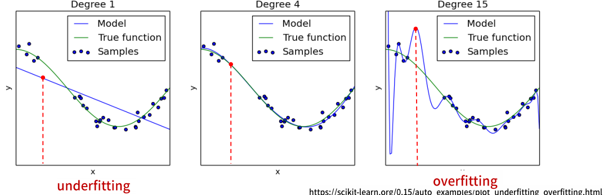
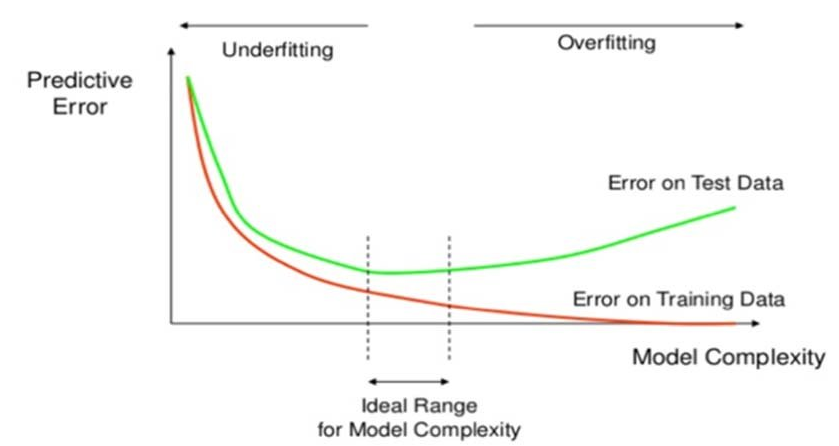
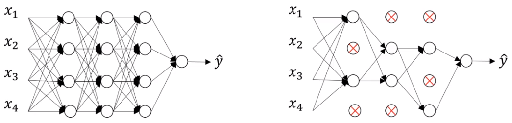
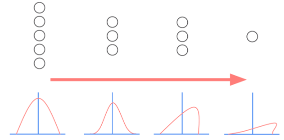
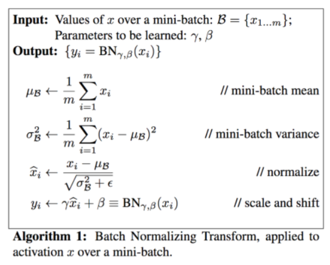
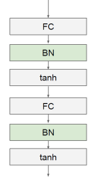
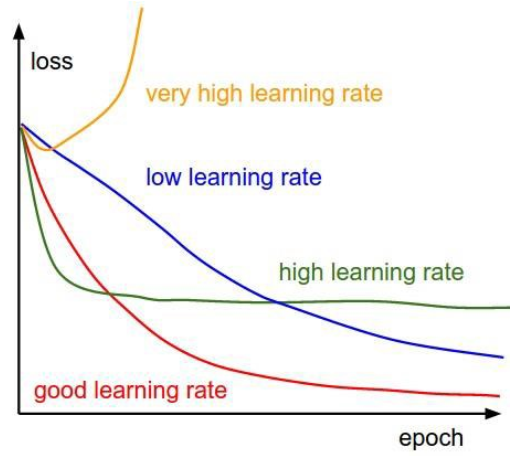

# Deep Neural Networks 모델 성능 개선
## 과대적합(Overfitting) 과소적합(underfitting)
- 최적화(Optimization)와 일반화(generalization)
    - **최적화(Optimization)**
        - train data에서 최고의 성능을 얻으려고 모델을 조정하는 과정
            - optimizer의 역할
    - **일반화(Generalization)**
        - 훈련된 모델이 처음 보는 데이터에서 얼마나 잘 수행되는지를 의미

 

- **과소적합(Underfitting)**  발생 
    - Epoch을 계속 진행해도 train loss와 test loss(validation loss)가 모두 결과가 좋지 않고 나아지지 않음
        - 핵심
            - train loss도 안좋고 test loss도 안 좋지 않음 
        - 모델이 너무 단순하면 train loss가 줄어들 지 않음
            - 그런 경우 좀더 복잡한 모델을 사용하거나 튜닝 필요
    - 모델의 성능이 발전될 여지가 있음 
        - optimization을 더 할 여지가 있음 

 

- Epoch가 진행되면서 **train loss는 계속 감소하지만(좋아짐) test loss(validation loss)가 증가(안 좋아짐)** 하기 시작함
    - 핵심 
        - test loss가 안 좋음
            - 새로운 데이터에 대한 예측이 안 좋음
            - 일반화(generalization)되지 않은 모델
    - 훈련 데이터에 특화된 패턴을 학습하기 시작하여 새로운 데이터에 대해 잘못된 판단 함 
    - 좀 더 단순한 모델을 사용하는 것을 고려

 

 

- 딥러닝에서 사용하는 모델은 대부분 복잡한 모델
    - 과대적합(Overfitting)이 발생하는 경우가 많음

 

 
 

## 과대적합(Overfitting)을 방지하기 위한 방법
- **더 많은 data를 수집**
    - 모델이 복잡해도 학습 시킬 데이터가 충분히 많으면 괜찮다.
    - 일반적으로 데이터를 늘리는데는 많은 시간과 돈 소요
        - 이미지의 경우 크기를 줄인다거나 회전등을 이용해 데이터를 어느 정도 늘릴 수 있음

         

- **모델의 간단하게 만듦**
    - 대부분 경우 데이터 수집이 쉽지 않기 때문에 모델을 간단히 만듦

         

- N번에 Epoch을 반복하여 학습할 때 Validation의 loss가 안 좋아지기 시작하는 시점의 epoch 까지만 학습

- 과대적합을 방지하기 위한 규제 방식은 모두 모델을 간단하게 만드는 방법

 
 

## DNN 모델  크기 변경

- 모델의 layer나 unit 수가 많을 수록 복잡한 모델
- Overfitting일 경우 모델을 간단하게 만들고 Underfitting일 경우 모델을 복잡하게 설정
    - Layer의 수, 각 layer의 unit 수를 조정 
- 큰 모델에서 시작하여 layer나 unit수를 줄여가며 validation loss의 감소 추세를 관찰     
    - 또는 반대

 

- **Smaller model**
    - training loss 감소 속도는 더 느림 
    - underfitting이 발생할 여지가 적음 
    - 충분히 train loss가 감소하지 않을 수 있음 (즉, optimization이 덜 됨)
    - validation loss가 최소화 될 때까지 걸리는 시간이 오래 걸림 
    
     

- **Bigger model**
    - validation loss가 초기부터 증가 추세
        - overfitting 발생 
    - Bigger model의 train loss는 빠르게 감소 
    - train data에 대해 optimization이 잘 되지만 validation set에 대해 성능이 좋지 않음 

 
 

##  Dropout Layer 추가를 통한 Overfitting 규제

- Neural network를 위해 사용되는 regularization 기법 중에서 가장 효과적이고 널리 사용되는 방법 중 하나
    - Overfitting의 이유는 너무 복잡한 모델
    - 데이터 양에 비해 Layer, Unit(노드)가 많으면 복잡한 모델(Network)
- Dropout Node
    - 학습시(fit) 일부 Unit(노드)들을 Random하게 빼고 진행
- 매 반복(epochs) 마다 Random하게 선택된 Unit(노드)를 training 진행 
    - 앙상블의 효과
- 일반적으로 dropout rate=0.2~0.5 를 지정
- Test set에 대해서는 적용하지 않음 

 

 
 

## Batch Normalization (배치정규화)
- 각 Layer 에서 출력된 값을 평균=0, 표준편차=1로 정규화 하여 **각 Layer의 입력분포를 균일하게 만듦**

 

### Internal Covariate Shift(내부 공변량 변화) 문제

 

 

- 내부 공변량 변화란 학습 과정에서 각 층을 통과할 때 마다 입력 데이터 분포가 달라지는 현상
- 입력 데이터의 분포가 정규분포를 따르더라도 레이어를 통과하면서 그 분포가 바뀌어 성능이 떨어지는 문제가 발생
- 각 레이어를 통과할때 마다 분포를 정규분포로 정규화하여 성능을 올림

 

 

-  &nbsp; : scaling 파라미터,  &nbsp; : shift 파라미터
    - 항상 일정한 분포로 나오는 것을 방지하기 위해  &nbsp;와   &nbsp; 를 이용해 분포에 약간의 변화를 줌
    -  &nbsp;와   &nbsp; 는 학습 과정에서 최적화 되는 값

 

- 일반적으로 활성함수 이전에 적용

 

 

### 효과
- 랜덤하게 생성되는 초기 가중치에 대한 영향력을 줄임
- 학습하는 동안 과대적합에 대한 규제의 효과
- Gradient Vanishing, Gradient exploding을 막아줌

 
 

## Learning Rate Decay (학습율 조절)을 통한 성능향상

 

 

- Optimizer의 Learning rate이 너무 크면 수렴을 못할 가능성 존재
- Learning rate이 너무 작으면 Local minima에서 못빠져 나와 수렴 못할 가능성 존재 

- 학습율을 처음에는 크게 움직이다가 일정 조건이 되면 learning rate을 낮춰서 점점 작게 움직이는 방법
    - 몇 에폭마다 일정량만큼 학습 속도를 줄임 
        - 전형적으로는 5 에폭마다 반으로 줄이거나 20 에폭마다 1/10씩 줄이기도 함 (튜닝대상)
    - 보통 고정된 학습 속도로 검증오차(validation error)를 살펴보다가 검증오차가 개선되지 않을 때마다 학습 속도를 감소시키는 방법 선택

 
 

## Hyper parameter tuning

- Parameters
    - 모델이 학습하여 업데이트할 대상
        - Weights : &nbsp; 
        - Bias :  &nbsp; 
- Hyper parameters
    - 모형의 구조를 결정하거나 optimization 방법을 결정하는 변수들 
        - Optimizer의 종류
        - learning rate()
        - Hidden layer의 수 
        - Hidden unit의 수 
        - Iteration의 수 
        - Activation function의 종류
        - Minibatch size 
        - Regularization
            - drop out 등               
    
- 다양한 조합의 hyper parameter를 시도해서 loss 함수가 빠르게 감소하는 hyper parameter를 찾아내는 시도가 필요 