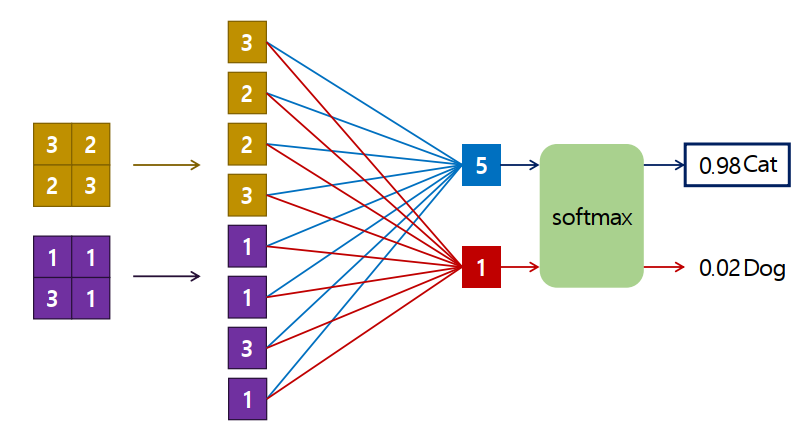
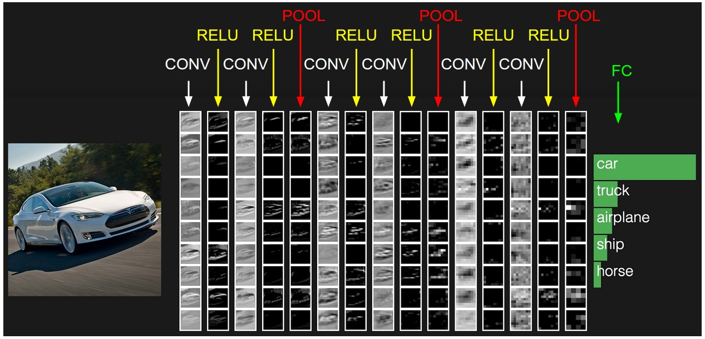

# CNN - 합성곱 신경망(Convolutional Neural Network)
- 1989년 **Yann Lecun**이 LeNet 모델을 만들면서 제안한 Deep learning 구조
- 주로 컴퓨터 비전(이미지, 동영상관련 처리) 에서 사용되는 딥러닝 모델
- Convolution 레이어를 이용해 데이터의 특징을 추출하는 전처리 작업을 포함시킨 신경망(Neural Network) 모델

 
 

## CNN 응용되는 다양한 컴퓨터 비전 영역

### 1.  Image Classification (이미지 분류)
- 입력된 이미지가 어떤 라벨에 대응되는지 이미지에 대한 분류(Classification)을 처리

 

### 2. Object Detection(객체 검출)
- 이미지 안의 Object(물체)들의 위치정보를 찾아 Bounding Box(사각형 박스)로 표시
    - 하나의 Object를 찾는 것을 : Localization
    - 여러 개의 Object를 찾는 것 :  Object Detection
- 찾은 Object 분류

 

### 3. Image Segmentation
- 이미지의 전체 픽셀에 대해 분류 

 

### Classification, Localization, Object Detection, Segmentation 차이
 

 

[출처](https://medium.com/zylappreview-of-deep-learning-algorithms-for-object-detection-c1f3d437b852) 

### 4. Image Captioning
- 이미지에 대한 설명문을 자동으로 생성

 

### 5. Super Resolution
- 저해상도의 이미지를 고해상도의 이미지로 변환

 

### 6. Neural Style Transfer 
- 입력 이미지와 스타일 이미지를 합쳐 합성된 새로운 이미지 생성 
- 이미지 스타일 변경해주는 것
- ex) 사진을 피카소 그림스타일로 변경 등

 

### 6. Text Dectection & OCR
- Text Dectection
    - 이미지 내의 텍스트 영역을 Bounding Box로 찾아 표시
- OCR
    - Text Detection이 처리된 Bounding Box 안의 글자들이 어떤 글자인지 찾는 것 

 

### 7. Human Pose Estimation
- 인간의 중요 신체부위를 Keypoint라는 점으로 추정해 연결하여 현재 포즈를 예측

 
 

## 이미지 인식(Image Recognition)이 어려운 이유

- ### 사람과 컴퓨터가 보는 이미지의 차이
    - 컴퓨터가 보는 이미지는 0 ~ 255 사이의 숫자로 이뤄진 행렬
        - 그 숫자들안에서 패턴을 찾는 것이 어려움

 
 

# 기존 이미지 처리 방식과 딥러닝의 차이

## Handcrafted Feature
- 분류하려고 하는 이미지의 특징들을 사람이 직접 찾아서 추출 (Feature Exctraction)
    - 그 찾아낸 특징들을 기반으로 학습
- 미처 발견하지 못한 특징을 가진 이미지에 대해서는 분류를 하지 못하기 때문에 성능이 떨어짐

 
 

## End to End learning
- 이미지의 특징 추출 부터 분류까지 자동으로 학습

 

 
 

## CNN 구성

- 이미지로 부터 부분적 특성을 추출하는 **Feature Extraction** 부분
- 분류를 위한 **Classification 부분**
- **Feature Extraction 부분에 이미지 특징 추출에 성능이 좋은 Convolution Layer를 사용** 
    - Feature Exctraction : Convolution Layer
    - Classification : Dense Layer (Fully connected layer)

 

 
 

## Dense Layer를 이용한 이미지 처리의 문제점
- 이미지를 input으로 사용하면 weight의 양이 이 매우 큼 
    - weight가 많으면 학습 대상이 많은 것이므로 학습하기가 그만큼 어려워짐
    - 64 * 64 픽셀 이미지의 경우
        - 흑백은 Unit(노드) 하나당 500 * 500 = 25000 개 학습 파라미터(가중치-weight)
        - 컬러는 Unit(노드) 하나당 500 * 500 * 3 (RGB 3가지) = 750000 학습 파라미터(가중치-weight)
- Fully connected layer(dense layer)만을  사용한다면 이미지의 공간적 구조 학습이 어려움  
    - 같은 형태가 전체 이미지에서 위치가 바뀌었을때 다른 값으로 인식
    - 공간적으로 가까운 픽셀값은 비슷하거나, RGB의 각 채널은 서로 밀접하게 관련이 되어 있다는 등의 특징이 사라짐

 
 

## 합성곱 연산
- Convolution Layer는 이미지와 필터간의 **합성곱 연산**을 통해 이미지의 특징을 추출

 

 
 

## 이미지와 합성곱

- 필터(커널, 마스크) : 이미지에서 특성(패턴)을 추출
- 특징 맵 출력
- 일반적으로 컨볼루션 신경망에서는 필터의 크기가 5X5, 3X3
    - 입력을 받아들이는 첫번째 컨볼루션 계층 5X5인 필터 사용 
    - 후단에서는 3X3 필터 사용

 
 

### 필터의 역할
- 원본 이미지와 필터의 값
 

 

- 이미지의 특정 부분의 값 1)

 

 

- 이미지의 특정 부분과 필터의 연산 1)

 

 
 

- 이미지의 특정 부분의 값 2)

 

 

- 이미지의 특정 부분과 필터의 연산 2)

 

 

- **필터와 부분 이미지의 합성곱 결과가 값이 나온다는 것은 그 부분 이미지에 필터가 표현하는 이미지특성이 존재한다는 것**
- 입력 이미지는 다양한 특징을 가지고 있기 때문에 여러 개의 다중 필터가 적용

 
 

## CNN에서 Filter
- CNN의 Layer는 이런 Filter(Kernel)들로 구성
- CNN은 주어진 Filter(Kernel)를 사용하는 것이 아니라 Filter(Kernel)의 값을 가중치(파라미터로)로 데이터를 학습
- 한 Layer를 구성하는 Filter들은 Input 이미지에서 각각 다른 패턴들을 찾아냄

 

### CNN도 레이어를 쌓음
- 첫번째 레이어는 부분적 특징을 찾음
- 다음 단계에서는 이전 레이어에서 찾아낸 부분적 특징들을 합쳐 점점 추상적 개념을 잡아냄

 

 
 

## Convolutional operation의 작동방식 
- hyper parameter 정의
    - Filter의 크기
        - 보통 홀수 크기(3 * 3, 5 * 5)
            - 주로 3 * 3 필터를 사용
        - 필터의 채널은 input image의 채널과 동일
    - Filter의 수
        - 필터의 개수
        - Feature map output의 깊이(depth)

 

> #### Featuer Map
>    - Filter를 거쳐 나온 결과물
>    - Feature map의 개수는 Filter당 한개가 생성된다.
>    - Feature map의 크기는 Filter의 크기, Stride, Padding 방식에 따라 다름

- 흑백 이미지는 하나의 행렬로 구성
- 컬러 이미지는 RGB의 각 이미지로 구성되어 3개의 행렬로 구성 

 

 

- 예) 
    - Input image는  &nbsp;  &nbsp; 형태
    - Filter: &nbsp;   &nbsp; 크기의 필터 2개
    - Output:  &nbsp;    &nbsp;  feature map 2개 생성 

     

 
 

## Padding
- 이미지 가장자리의 픽셀은 convolution 계산에 상대적으로 적게 반영 
- 이미지 가장자리를 0으로 둘러싸서 가장자리 픽셀에 대한 반영 횟수를 늘림
- "valid" padding
    - Padding을 적용하지 않음
    - Output(Feature map)의 크기가 줄어듦
- "same" padding 
    - Input과 output의 이미지 크기가 동일하게 되도록 padding 수를 결정 
    - **보통 same 패딩을 사용**
    - Output의 크기는 Pooling Layer를 이용해 줄임

     
        

         
        

 
 

## Strides
- Filter(Kernel)가 한번 Convolution 연산을 수행한 후 옆 혹은 아래로 얼마나 이동할 것인지 의미
- stride=2
    - 한 번에 두 칸씩 이동 
    - feature map의 너비와 높이가 2배수로 다운샘플링 되었음을 의미
- 보통 stride는 1을 지정

 

 
 

## Pooling
- 일반적으로 2*2 크기에 stride는 2를 사용 
    - 겹치지 않도록

- 강제적인 subsampling 효과 
    - weight 수를 줄여 계산속도를 높임
    - 특징의 공간적 계층구조를 학습
        - 부분적 특징을 묶어 전체적인 특징의 정보를 표현

- 컨볼루션 계층을 거쳐 추출된 특징들을 모두 고려하지 않음
    - 고해상도의 사진(많은 특징을 가진 데이터)을 보고 물체를 판별할 수도 있지만 저해상도의 사진 (보다 적은 특징을 가진 데이터)을 보고도 물체를 판별 가능

- 학습할 weight가 없음: 일반적으로 convolutional layer + pooling layer를 하나의 레이어로 취급 

 

### Max Pooling Layer(최대풀링) 
- 특정 영역에 있는 입력 화소들 중 최대의 값으로 서브샘플링
    - 가장 큰 feature 값이 계산 시 가장 큰 영향을 주기 때문에 출력 값에 영향이 가장 큼
    - feature 특징을 가장 잘 나타내기 떄문에 사용

 Max pooling layer(2 × 2 pooling kernel, stride 2, no padding) 

 

### Average Pooling Layer(평균풀링)
- 특정 영역에 있는 입력 화소들의 평균을 구하고 이들을 대표하기 위해 평균값으로 서브샘플링 

 Max pooling layer(2 × 2 pooling kernel, stride 2, no padding) 

 

### GlobalAveragePooling (GAP)
- Feature map의 채널별로 평균값을 추출 1 x 1 x channel 의 Feature map을 생성
    -  GAP는 (height, width, channel) 형태의 feature를 (channel,) 형태로 간단하게 만듦
 

 

- Feature Extraction layer에서 추출한 Feature map을 Classifier layer로 Flatten해서 전달하면 많은 연결노드와 파라미터가 필요
    - GAP를 사용하면 노드와 파라미터의 개수를 효과적으로 줄임
    -GAP는 CNN + FC(Fully Connected) Layer에서 classifier인 FC Layer를 없애기 위한 방법으로 도입
- Feature map의 채널수가 많을 경우 GAP를 사용하는 것이 효과적이나 채널수가 적다면 Flatten을 사용하는 것이 좋음
    - 보통 채널수가 512개 이상인 경우 많이 사용

 

 

 

## feature map 크기
 

 
 

 ## Fully-connected layer
- Feature Extraction layer들을 거처 나온 output에 대한 분류가 이루어짐
- output을 flatten 한 뒤에 처리

 

 
 

## CNN architecture
 

 

- 일반적으로 convolutional layer (+ ReLU or other activations) + pooling layer를 여러 개 쌓음 
- Convolution Layer가 진행 될 수록 **feature map의 크기는 줄어들고 깊이(개수)는 증가**
- 마지막에 Fully connected layer(+ ReLU or other activations) 추가하여 분류
- Output 형태에 맞는 output layer
    - 이진분류 or 다중 클래스 분류