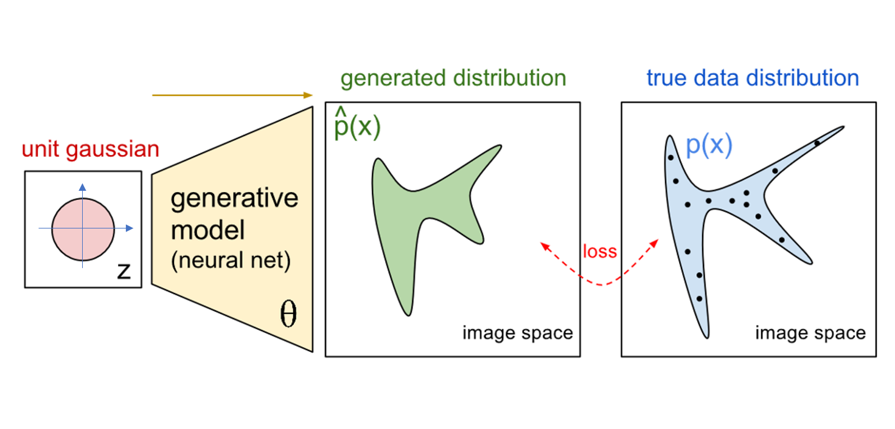

**참고자료(이미지, 내용)**

[1. 1시간만에 GAN(Generative Adversarial Network) 완전 정복하기](https://www.youtube.com/watch?v=odpjk7_tGY0)

[2. CSC321 Lecture 19: GAN](http://www.cs.toronto.edu/~rgrosse/courses/csc321_2018/)

# Generative model
## Discriminative Model v.s. Generative Model
- Discriminative model
    
     

    

     

- Generative model
    - unsupervised model

     

    

 
 

## Probability Distribution

 

- event : 주사위 던지면 {1, 2, 3, 4, 5, 6}의 event 발생
- 각각의 event를 1~6까지의 random variable이라고 assign
- discrete 한 경우이기 때문에 PMF라 함

- True 한 distribution이라고 한다면 무수히 많이 반복한다면 위와 비슷한 histogram을 가지게 됨
- 몇 번의 경험을 가지고 나온 확률이라면 통계적으로 이 확률을 추론을 할 수 있음 

 
 

- random variable &nbsp; 가 training data의 image(  ) 인 경우

- 사람이라는 사전정보가 있으면 어느 정도 특정한 분포를 가짐
    - 눈의 위치, 얼굴의 위치 등

 

- 얼굴 데이터의 확률 분포가 존재 할 것 (차원을 plot해서 볼 수 없어서 1차원이라고 가정)
- 와 비슷한  approximation 하여 그 모델에서 random sampling 하여 진짜처럼 보이는 이미지가 나오게 해야 함!

 
 

## Probability density function estimation problem
-  이  와 비슷하면,  에서 sampling 하여 데이터를 얻을 수 있음 

 

 
 

## Generative models from lower dimension
- 실질적으로 분포를 구하는 것이 목적

 
 

## Deterministic Transformation by Network
- 다시 정리하자면, &nbsp;  이 &nbsp;  에 근사하도록 만드는 것이 Generative modeling 목적
- Network 자체는 deterministic 함

 

- 1 dimensionla example
    

    - input neuron이 Gaussian 분포를 가짐
    - network는 모델을 학습하여 mapping을 진행

    - 만들어진 output이  &nbsp;   과 근사하다면 원래는 그 모델에서 sampling을 하지만 우리가 알고있는 Gaussian에서 sampling 하여 Network를 거쳐 Fake로 generate된 dataset 획득

 

- example
    

    - 각각 gaussian 분포를 가지는 input들이 학습된 Network와 mapping된 분포가 training 분포가 근사하다면
    
     

    

    - 각각 input에 맞게 sampling한 데이터를 network에 mapping 시키면 train dataset과 근사한 fake로 generate된 dataset이 생성됨

 

- example
    

 
 

# Generative Adversarial Networks (GAN)
- generative model은   이 &nbsp;  에 근사하도록 만드는 network를 학습시키는 것
- GAN은 explicit density function을 사용하지 않음
- 복잡하고 고차원인 학습 분포로부터 데이터를 샘플링하고자 하나 이를 직접적으로 하는 것 불가능
     - 쉽게 데이터 샘플링한느 것이 가능한 간단한 분포를 이용이 간단한 분포를학습 분포로 **변형**하는 법 학습
        - Normal distribution, .. 
        - 표준 정규분포로 얻은 Random vector나 Noise vector로 image 생성
 - 이런 복잡한 변형은 Neural Network로 포현

 
 

## VAE와의 차이
- VAE에서 decoder의 input은 입력이미지를 잘 학습해서 얻어진 평균과 분산을 잘 따르는 분포를 가진 분포에서 sampling
    - 학습 데이터를 잘 복원하는 방식으로 학습
- GAN은 처음에 자유롭게 Normal distribution을 따르는 vector를 latent space에 입력으로 넣어줌
    - 이 vector가 decoder를 통과하여 얻은 이미지는 우리가 가지고 있는 학습데이터의 한 이미지와 대응된다고 보기가 어려움
    - 즉, 학습이미지를 복원하는것으로는 학습불가능
    - 사용하여 생성된 이미지가 데이터 분포 내에 속하는지 판단하도록 함 
    
 
 

## Adversarial Nets Framework
- 모델의 성능을 판단하는 방법 중 하나는 그 모델을 sampling 하는 것
- GAN은 기존의 generative modeling과 다른 관점
    - 진짜와 가짜를 구별하는 역할을 하는 discriminator network에서 판단하여 실제 데이터와 구별할 수 없는 샘플을 생성하는 모델

 
 

## Generative Adversarial Network
- idea : 2개의 다른 네트워크를 train
    - generator network 
        - 진짜 같은 sample을 생성하기 위함
    - Discriminator network 
        - 진짜 data와 가짜 data를 구별하기 위함

- generator network는 discriminator network를 속이려고 노력
    - 처음에 discriminator는 generator가 만든 데이터 잘 구별
    - generator이 학습이 되면 진짜 같은 가짜가 데이터가 생성이 되게 되고 discriminator는 50%의 확률로 맞추게 됨

     

    

    - Discrimiator 는 real data를 real로, fake data를 fake로 하게 하는 Loss function을 define 하여 minimize 하게 함
    - Generator는 fake로 만들어진 generate 한 데이터가 discriminator에 들어가서 real 이라고 나오게 만들게 Loss function define 

     
     

## Discriminator Perspective
- Real 이미지로 학습

 

- Fake 이미지로 학습

 
 

## Generator Perspective

 
 

## Loss Function of Discriminator 

- Discriminator는 학습한 결과가 0(fake) 또는 1(real)로 나오기 때문에 Binary cross entropy 
-  는 존재하는 확률분포로부터  라는 데이터 수집
    - 즉, 가지고 있는 실제 학습데이터 의미 

 
 

## Loss Functoin of Generator

-  는 표준 정규로부터 sampling된 데이터 z를 의미
- 는 real 데이터라고 예측할 확률
- 는 f ake 데이터라고 예측할 확률

 
 

## Mini-max optimization 문제

 

 

1. (랜덤) 초기값 설정  : 

2.  로 고정할 때

  

3.  로 고정할 때

4.  만의 함수에 대해,  에 대한 편미분을 구하면

5.  만의 함수에 대해,  에 대한 편미분을 구하면 

6.  을 x에 대하여 gradient descent 수행, y에 대하여 gradient ascent 수행

 
 

## GAN 학습 
Minmax 목적 함수에 대해 두 과정을 번갈아 진행
1. Gradient descent on discriminator

2. Gradient ascent on generator

    
 
 

## Non-Saturating Game
- 일반적으로 GAN 모델을 학습 할 때, generator의 학습이 더 오래 걸리고 어려움
    - 초반에 generator로 생성된 이미지는 실제 존재하는 이미지와 굉장히 상이함
    - Real 데이터와 Fake 데이터를 구별하는 discriminator의 과정이 상대적으로 쉬워짐
    
 

- Fake 이미지의 discriminator output score를 고려
    - Generator gradient가 작아 초반에 학습이 잘 되지 않음
        
    

 

 
 

## Solving a Problem
### 1
- step 1 : &nbsp; 를 고정하고 gradeint step을 수행

- step 2 : &nbsp;를 고정하고 gradient step 수행 

 

### 2
- step 1 : &nbsp; 를 고정하고 gradeint step을 수행

- step 2 : &nbsp;를 고정하고 gradient step 수행 

