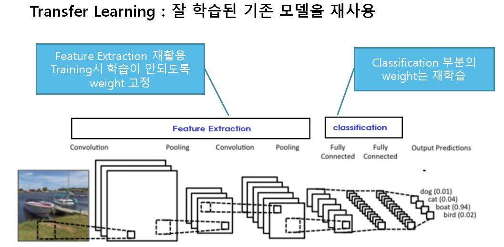
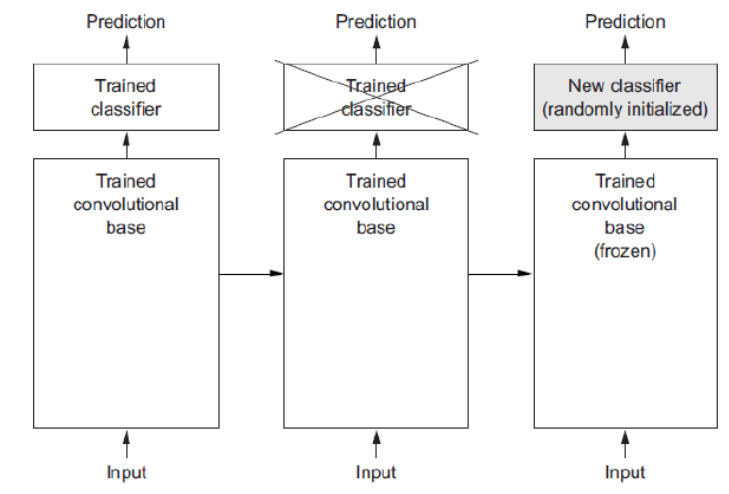

# Transfer learning (전이학습)
- 큰 데이터 셋을 이용해 미리 학습된 pre-trained Model의 Weight를 사용하여 현재 하려는 예측 문제에 활용

 
        

 

- Convolution base(Feature Extraction 부분) 만 활용
    - Convolution base는 이미지에 나타나는 일반적인 특성을 파악하기 위한 부분이므로 재사용할 수 있음
    - Classifier 부분은 학습하려는 데이터셋의 class들에 맞게 변경 해야 하므로 재사용할 가능

 

- Pretrained Convlution layer의 활용 
    - **Feature extraction**
        - 학습시 학습되지 않고 Feature를 추출하는 역할

    - **Fine tuning**
        - 학습시 Pretrained Covolution layer도 같이 학습해서 내 데이터셋에 맞춤

 
 

## Feature extraction
- 기존의 학습된 network에서 fully connected layer를 제외한 나머지 weight를 고정하고 새로운 목적에 맞는 fully connected layer를 추가하여 추가된 weight만 학습하는 방법
- `tensorflow.keras.applications` module이 지원하는  image classification models
    - (https://www.tensorflow.org/api_docs/python/tf/keras/applications)    

 
        

 
 

## Fine-tuning
- Pretrained 모델을 내가 학습시켜야 하는 데이터셋(Custom Dataset)에 재학습시키는 것을 fine tunning
- 주어진 문제에 더 적합하도록 모델의 가중치들을 조정

 

### Fine tuning 방식

 

 

### **세 방식 모두 classifier layer들은 train**
1. 전체 모델을 전부 학습
    - Pretrained 모델의 weight는 Feature extraction 의 초기 weight 역할
    - **Train dataset의 양이 많고** Pretrained 모델이 학습했던 dataset과 Custom dataset의 class간의 유사성이 **낮은 경우** 적용
    - 학습에 시간이 많이 소요
2. Pretrained 모델 Bottom layer들(Input과 가까운 Layer들)은 고정시키고 Top layer의 일부를 재학습
    - **Train dataset의 양이 많고** Pretrained 모델이 학습했던 dataset과 Custom dataset의 class간의 유사성이 **높은 경우** 적용
    - **Train dataset의 양이 적고** Pretained 모델이 학습했던 dataset과 custom dataset의 class간의 유사성이 **낮은 경우** 적용
3. Pretrained 모델 전체를 고정시키고 classifier layer들만 학습
    - **Train dataset의 양이 적고** Pretrained 모델이 학습했던 dataset과 Custom dataset의 class간의 유사성이 **높은 경우** 적용
  
  
> custom dataset: 내가 학습시키고자 하는 dataset 