# ImageNet Dataset & ILSVRC 경진대회
## [ImageNet Dataset](https://www.image-net.org/)
- 웹상에서 수집한 약 1500만장의 라벨링된 고해상도 이미지
- 약 22,000개 카테고리로 구성된 대규모 Image 데이터셋

## [ILSVRC(ImageNet Large Scale Visual Recognition Challenge)](https://image-net.org/challenges/LSVRC/)
- 2010년 부터 2017년 까지 진행된 컴퓨터 비전 경진대회
- ImageNet의 이미지중 **1000개 카테고리 약 120만장의 학습용이미지, 5만장의 검증 이미지, 15만장의 테스트 이미지를** 이용해 대회 진행
- **2012년** CNN기반 딥러닝 알고리즘인 **AlexNet**이 2위와 큰 차이로 우승하며 이후 딥러닝 알고리즘이 대세 
- 특히 2015년 우승한 **ResNet**은 0.036의 에러율로 우승
    - 사람이 판단했을 떄 보이는 에러율이라 알려진 0.05 보다 높은 정확도
- ILSVRC에서 우승하거나 좋은 성적을 올린 모델들이 컴퓨터 비전분야 발전에 큰 역할
- 이후 다양한 딥러닝 모델의 백본(backbone)으로 사용

 

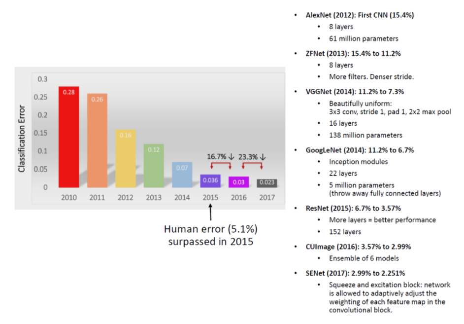

 
 

# 주요 CNN 모델
##  VGG16
- ImageNet ILSVRC Challenge 2014에서 2등한 모델로 Simonyan and Zisserman(Oxford Univ.)에 의해 제안
    - VGGNet이 준우승을 하긴 했지만, 구조의 간결함과 사용의 편이성으로 인해 1등한 GoogLeNet보다 더 각광받음
- 단순한 구조로 지금까지 많이 사용
- **총 16개 layer**로 구성됨
- 네트워크 깊이가 어떤 영향을 주는 지 연구 하기 위해 설계된 네트워크로 동일한 kernel size에 convolution의 개수를 늘리는 방식으로 구성됨
    - 11 layer, 13 layer, 16 layer, 19 layer 의 네트워크를 테스트함 
    - 19 layer의 성능이 16 layer보다 크게 나아지지 않음
- Filter의 수가 64, 128, 256, 512 두 배씩 커짐 
- 항상 &nbsp;  filter, Stride=1, same padding, &nbsp;   MaxPooling 사용
    - 이전 AlexNet이 5 X 5 필터를 사용했는데 VGG16은 3 X 3 필터 두개를 쌓아 사용
        - **3 x 3 필터 두개를 쌓는 것이 5 x 5  하나는 사용하는 보다 더 적은 파라미터를 사용하며 더 좋은 성능을 보임**

        
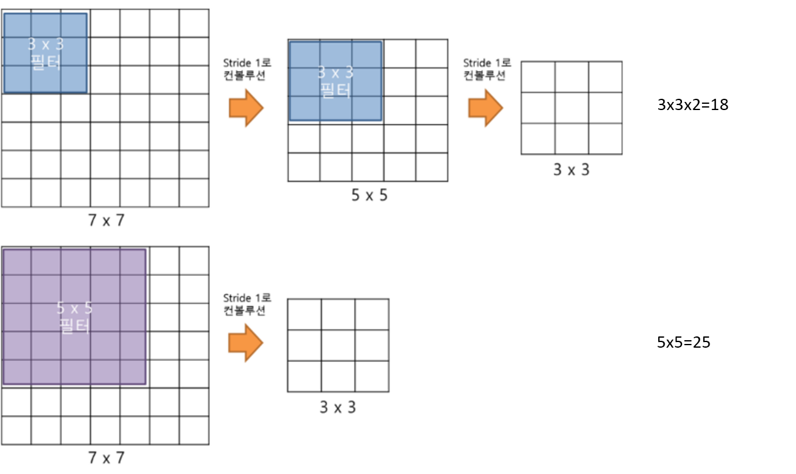

    - Feature map의 사이즈를 convolution layer가 아닌 Max Pooling 을 사용해 줄임
- 마지막 분류를 위해 Fully Connected Layer 3개를 붙여 파라미터 수가 너무 많아짐 
    - 약 1억4천만 개의 parameter(가중치)중 1억 2천만개 정도가 Fully Connected Layer의 파라미터

 

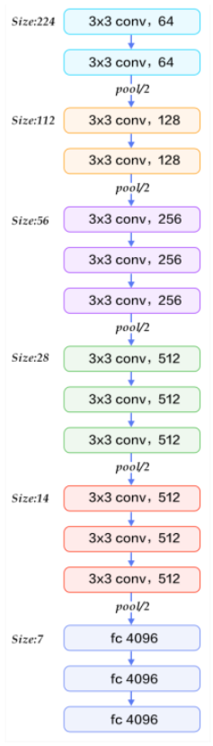

 
 

## ResNet (Residual Networks)
- 이전 모델들과 비교해 **shortcut connection기법을 이용해 Layer수를 획기적으로 늘린 CNN 모델**로 ILSVRC 2015년 대회에서 우승

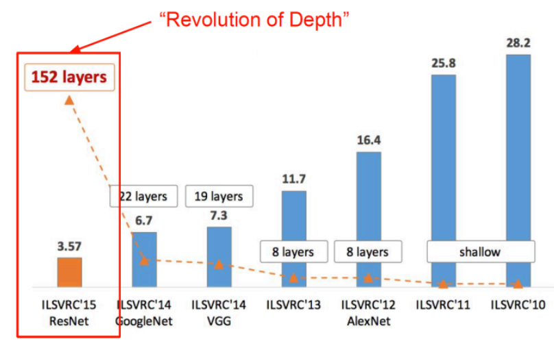

- 기존 모델 레이어를 깊게 쌓아도 실제는 Test 셋 뿐만 아니라 Train Set에서도 성능이 나쁘게 나옴
    - Train set에서도 성능이 나쁘게 나온 것은 최적화 문제
    - 레이어를 깊게 쌓으면 최적화 하기가 어렵다고 생각

 

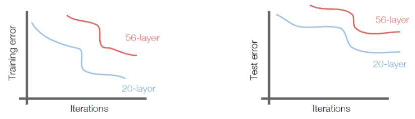

 

### Resnet Idea

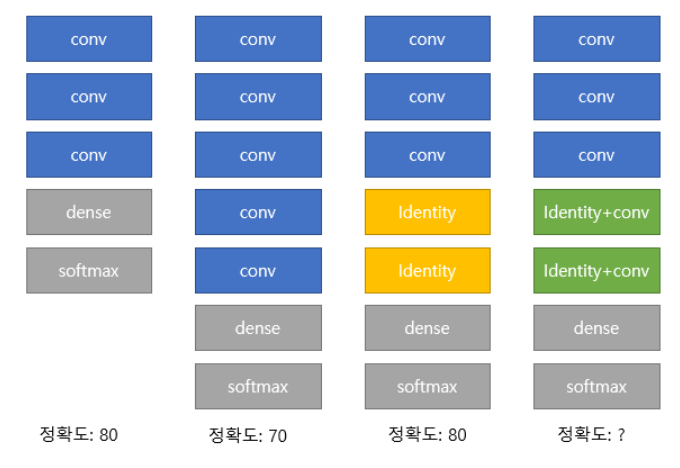

- 입력값을 그대로 출력하는 identity block 을 사용하면 성능이 떨어지지 않음
    - Convloution block을 identity block으로 만들면 최소한 성능은 떨어지지 않고 깊은 Layer를 쌓을 수 있음

 

- **Residual block**
    -   &nbsp; 를 잔차라고 생각

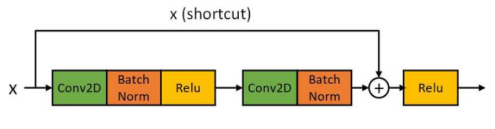

 

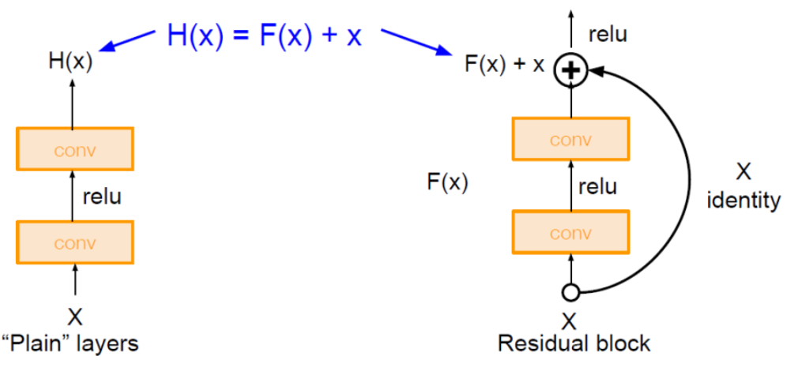

 

- 기존 Layer들의 목표는 입력값인 X를 출력값인 Y로 최적의 매핑할 수 있는 함수 H(X)를 찾는 것 
    - H(X) – Y 가 최소값이 되는 방향으로 학습을 진행하면서 H(X)를 찾음 
- 레이어가 깊어지면서 최적화에 어려움으로 성능이 떨어지는 문제가 발생

 

- ResNet은 layer를 통과해서 나온 값이 **입력값과 동일하게 만드는 것을 목표로 하는 Identity block을** 구성
- Identity block은 입력값 X를 레이어를 통과시켜서 나온 Y에 입력값 X를 더해서 합치도록 구성

 

 통과값 

  
 
- 목표는 H(x)(레이어통과한 값) 가 input인 x와 동일한 것이므로 F(x)를 0으로 만들기 위해 학습
- F(x)는 **잔차(Residual)**
    - 잔차인 $F(x)$가 0이 되도록 학습하는 방식이므로 **Residual Learning**이라고 함
- 입력인 x를 직접 전달하는 것을 **shortcut connection** 또는 **identity mapping** 또는 **skip connection** 이라고 함
    - 이 shortcut은 파라미터 없이 단순히 값을 더하는 구조이므로 연산량에 크게 영향 안 줌
- 그리고 Residual을 찾는 레이어 :  **Residual Block, Identity Block** 

 

### 성능향상
- H(x) = F(x) + x 을 x에 대해 미분하면 최소한 1이므로 Gradient Vanishing 문제를 극복
- 잔차학습이지만 Residual block 은 Convolution Layer와 Activation Layer로 구성
    - 이 Layer를 통과한 Input으로 부터 Feature map을 추출하는 과정은 진행되며 레이어가 깊으므로 다양한 더욱 풍부한 특성들을 추출하게 되어 성능이 향상
  

### ResNet 구조
- Residual block들을 쌓는 구조
    - 일반 Convolution Layer(backbone)을 먼저 쌓고 Identity(Residual) block들을 계속 쌓음
- 모든 Identity block은 두개의 3X3 conv layer로 구성
- 일정 레이어 수별로 filter의 개수를 두배로 증가시키며 stride를 2로 하여 downsampling 함
    - Pooling Layer는 Identity block의 시작과 마지막에만 적용
- 마지막 POOLING은 GAP 사용

 

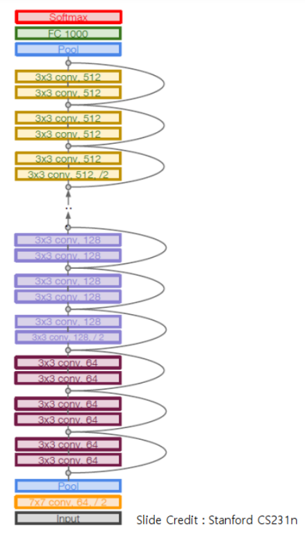

 

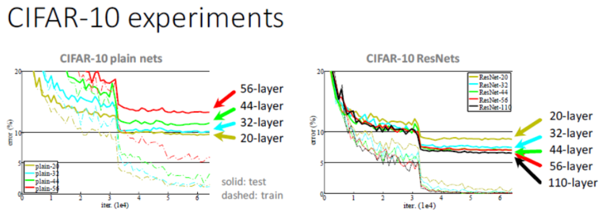

 
 

## MobileNet
### 개요
- 딥러닝을 이용한 어플리케이션이 항상 고성능 컴퓨터에서 실행되는 것 아님
    - 스마트폰이나 마이크로디바이스와 같이 저성능 환경에서 실행하기도 함
- 저성능 컴퓨팅 환경에서 실행할 수 있도록 하기 위해 딥러닝 네트워크를 가볍게 구성하는 (경량 네트워크-Small Deep Neural Network) 방법에 대한 연구가 활성화

 

- 저성능 환경에서 실행되기 위해서는 다음과 같은 사항들을 만족
    - 적은 연산량(낮은 계산의 복잡도)을 통한 빠른 실행
    - 작은 모델 크기
    - 충분히 납득할 만한 
    - 저전력 사용

- 즉 기존의 성능만을 신경쓴 모델 보다 적은 연산량으로 빠르게 추론할 수 있으되 성능이 보장되어야 함

### Small Deep Neural Network위한 방법
- **Channel Reduction**
    - Channel의 개수를 줄임
- **Distillation & Compression**
    - Distillation
        - 큰 모델(Teacher Model)이 미리 학습한 정보(Knowledge)를 작은 모델에 전달하여 성능을 향상시키는 기법
    - Compression
        - 모델 가지치기(Model Pruning-중요도가 떨어지는 파라미터를 0으로해 크기를 줄임), 낮은 순위 인수분해등의 기법들을 이용해 네트워크기 크기를 줄이는 기법
- **Depthwise Seperable Convolution**
    - Depthwise와 Pointwise Convolution 연산을 이용해 모델을 구성하여 연산량 줄임
- Remove Fully-Connected Layers
    - Fully Connected(Dense) Layer들을 Convolution Layer로 대체
        - Convolution Layer는 파라미터를 공유하므로 파라미터 개수가 줄어들어 Network이 경량화
- Kernel Reduction
    - Kernel(Filter)의 크기를 줄여서 연산량과 파라미터의 수를 줄임
- Early Spaced Downsampling
    - CNN은 Layer block (Conv, pooling)을 거칠수록 output의 size를 줄이는 downsampling
    - Downsampling을 **초반(bottom)에 크게 하면 네트워크의 크기는 줄어들지만 이미지의 특성을 많이 잃어버리게 되어 accuracy가 줄어들고 후반(top)에 많이 하게 되면 accuracy는 증가하지만 네트워크의 크기는 크게 줄지 않음** 
    - 그래서 전체적으로 균일하게 Downsampling을 하되 그 시점을 튜닝을 통해 찾음

 

### Mobilenet은 위의 기법 중 **Channel Reduction, Distillation & Compression, Depthwise Seperable Convolution** 적용하여 경량 네트워크를 구현한 딥러닝 모델

 
 

## Depthwise Separable Convolution
- [이미지출처](https://www.youtube.com/watch?v=T7o3xvJLuHk)
- Depthwise Convolution 구조에 Pointwise Convolution 구조를 합쳐 기존 Convolution layer
- 연산량을 줄여 속도를 증가시킴

 

### Depthwise Convolution
- 표준 Convolution은 한개의 Filter가 Input의 채널 전체에 대해 Convolution 연산
- Depthwise Convolution은 한개의 Filter는 한개의 Channel에만 Convolution 연산

  

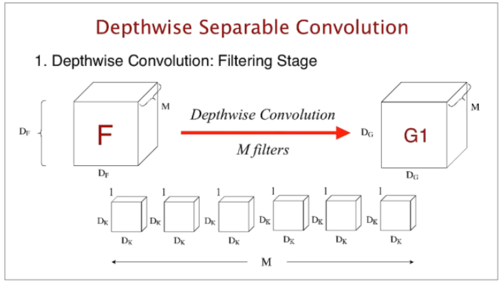

- Input Data의 shape이 &nbsp; 일 경우 &nbsp;  shape의 필터 M개를 생성
- 한개의 필터가 하나의 Channel(M개)에 대해 Convolution 연산을 처리
- 필터를 거친 Output은  &nbsp; 의 shape

 

### Pointwise Convolution
- 1 X 1 필터를 이용해 Convolution 연산을 처리 
- Pointwise Convolution을 사용하는 구조를 Bottleneck 
- height와 width를 유지하면서 Channel의 크기를 조절 하기 위하여 사용

 

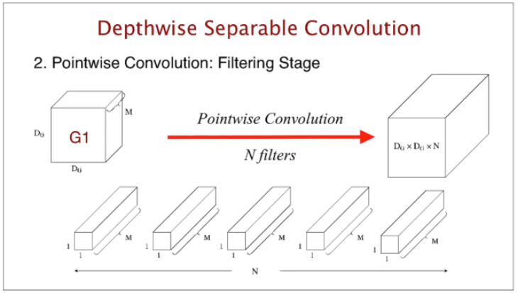

- Input Shape이 &nbsp;  일때 &nbsp;  shape의 필터를 &nbsp;  개 사용하여 Convolution 연산실행 
- 표준 Convolution연산을 진행하므로 filter의 channel 크기는 input과 동일한 &nbsp;  개이며 필터의 개수인 &nbsp;  으로 Output의 channel을 결정  
- Output의 결과는  이 됨 
- 1 X 1 필터를 사용하므로 출력 결과의 width, height는 변경되지 않음
    - stride를 1로 지정
- 단독으로도 쓰이기도 함 
    - 이미지의 채널 크기를 조절하기 위한 용도로 보통 줄일 때

  

위 두단계의 convolution연산을 이어서 진행 하여 표준 Convolution에 비해 **Depthwise convolution으로 연산량을 줄이고 pointwise convolution으로 출력 결과의 shape은 동일하게** 만듦

 
 

## 표준 Convolution과 Depthwise Separable Convolution 연산량 비교
### 표준 Convolution 연산량

 

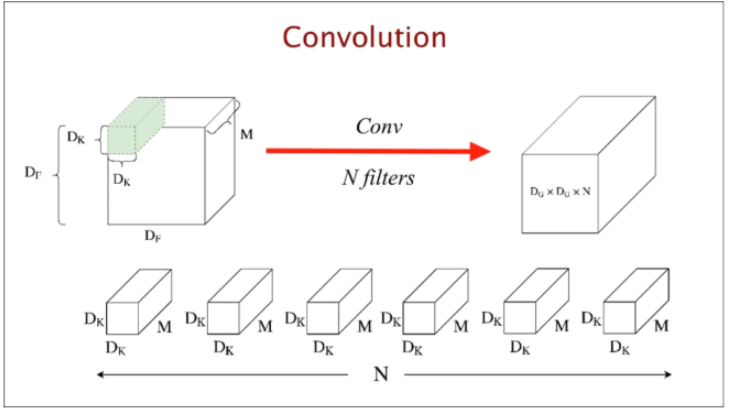

- Input Image shape: &nbsp; 
- Filter shape: &nbsp; 개
    - channel은 input의 channel과 동일
- Convolution연산 이동 횟수:  &nbsp;
- Output shape: &nbsp; 

 

- **연산량**
    - 한번의 연산량: &nbsp; 
    - 하나의 필터의 연산량: &nbsp; 
        - 가로, 세로방향으로 &nbsp; 만큼 이동하므로 한번 연산량에 &nbsp;  곱한 만큼 연산
    - N개의 Filter(Kernel)의 연산량: &nbsp; 

 

- **Depthwise Separable Convolution** 
    - 출력결과 형태(shape)은 동일하면서 연산량을 줄이는 것이 목표

 
 

### Depthwise Separable Convolution 연산량

#### Depthwise Convolution 연산량
- 한번의 연산량: &nbsp;  
    - Filter한개가 하나의 Channel과 연산
- 1개 Channel에 대한 연산량: &nbsp;  
    -  &nbsp; 가로,세로방향 이동 횟수
- M개의 Filter의 연산량: &nbsp; 

 

#### Pointwise Convolution 연산량
- 한번의 연산량: &nbsp; 
    - 1 x 1 필터이므로 한번 연산은 channel 개수만큼 연산
- 1개 Filter(Kernel)의 연산량: &nbsp; 
- N개 필터의 연산량: &nbsp; 

 

####  Depthwise Separable Convolution 연산량
- **Depthwise Convolution연산량 + Pointwise Convolution 연산량**

### 표준 Convolution 과 Depthwise Separable Convolution 연산량 비교

- &nbsp;: Filter의 height, width
- &nbsp;: Convolution의 이동 횟수. Output(Feature map)의 height, width
- &nbsp;: Input의 channel
- &nbsp;: Filter 개수

 