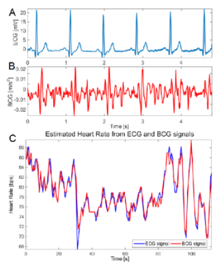
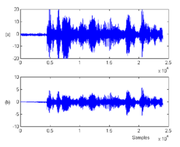
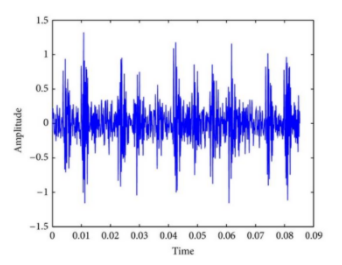

 # Time series 
## Sequence Matter

- 시간에 따라 이동하는 공의 위치 예측
    - sequece of data
        - HMM 사용하여 시계열 데이터 prediction
    - physics 에 기반하여 예측
        - kalman filter
    - deep learning
        - RNN, LSTM, ...

 
 

## Sequence
- Sentence
    - "This morning I took the dog for a walk"

- Medical signal
    

- speech wavefoem
    

- Vibration measurement
    

 
 

## Sequence Modeling
- 대부분의 실생활 데이터는 time-series
- 중요하게 고려할 요소
    - Past evens
    - Relations between events
        - Causality
            - 과거의 어떤 사건이 있어서 지금 현재의 일이 일어남
        - Credit assignment
    - Learning the structure and hierarchy

- 과거와 현재의 관측으로 미래를 예측

 
 

## (Deterministic) Time Series Data
- For example
    

 

- Closedform
    

 

- Linear difference equation(LDE) and initial condition

    

 
    - 한 시점의 과거로부터 현재의 값 예측 
 

- High order LEDs
    

    - 두 시점의 과거에서부터의 데이터로 현재의 값 예측

     

    

    
    - k 시점의 과거에서부터의 데이터로 현재의 값 예측

 
 

## (Stochastic) Time Series Data
- Stochastic
    - Probablistic 함, noise가 있고, ..

 

- Stationary
    - 시간이 변해도 통계쩍 특성이 일정한 time-series 데이터
- Non-stationary
    - 시간에 따라 통계적 특성이 변함
        - 평균, 분산, 공분산 등은 시간의 함수가 될 수 없음

 

 
 

## Dealing with Non-sationary
- **linear trends**
    

    
    -  으로 모델링
    -  &nbsp;
        - deterministic 하게 setting하고 parameter estimate
    - 
        - noise와 uncertainty을 handling
        - stochastic 해짐
    

 

- **Non-linear trends**
    

    - 다항식, exponential fitting

 

- **Seasonal trends**
    - 주기성이 있는 것

    

    -  으로 deterministic 한 부분 fitting

 

- model assumption
    

    

 
 

# Marokv Process
## Sequential Process
- 대부분의 classifier들은 데이터의 sequential 한 측면들 활용하지 않음

- 시스템이 &nbsp; 개의 discrete 한 states(or classes, categories) 
즁 하나를 가진다고 하면
    

 

- stochastic system에 관심이 있다면 state evlolution이 random하게 되어야 함
    - 어떻게 random하게 만들 것인지가 관건

- 수학적으로 정확하게 모델링했지만 계산을 할 수가 없음
    - 정확하게 조건부 확률을 알 수 없는 경우가 많음.

- joint distribution은 conditional distribution으로 분해될 수 있음
    

    - 계산이 거의 불가능

**이를 위해 Markov Chain(Process)가 나오게 됨**

 
 

## Markov Chain
- Markovian property(assumption)
    - (assumption) 다음 state는 현재의 state에만 의존, 즉 지금의 state가 다음 state를 결정하는 유일한 조건

    

 

- joint distribution 다루기 쉽고 계산 가능해짐

 
 

## Markovian property
- Markkov 상태

 

- 더 명확한 표현

 

- 현재의 state는 과거로부터의 모든 relevent한 정보를 축적해서 가지고 있음

 
 

## State Transition Matrix
- Markov state가 &nbsp; 에서 &nbsp; 으로 변화할 때의 **state transition probability**

 

- State transition matrix
    - 모든 상태 변화를 확률로 나타내는 행렬
    - 시간에 따라 변화하지 않고 고정

     

    

 
 

## Definition : Markov Process
- 과거의 정보가 중요하지 않기 때문에 memoryless
- 지금 state에서 다음 state로 넘어가는데 확률 분포를 가지고 있기 때문에 random process
- **Passive stochastic behavior**
    - 정해진 확률(state transition matrix)에 따라서 다음 state로 진행

 

 
 

