# 순환신경망 (RNN - Recurrent Neural Network)
- Sequence Data(순차데이터) 분석을 위한 신경망

 
 

## Sequence Data(순차데이터) 
- 순서가 의미가 있으며, 순서가 달라질 경우 의미가 바뀌거나 손상되는 데이터

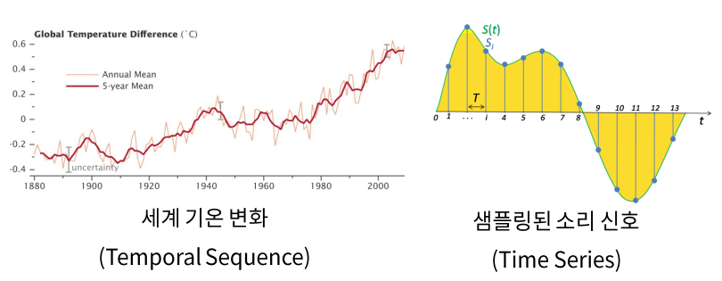

 
 

##  Sequence Data 분석
-  비시계열 데이터 모델 (ANN, CNN)

    
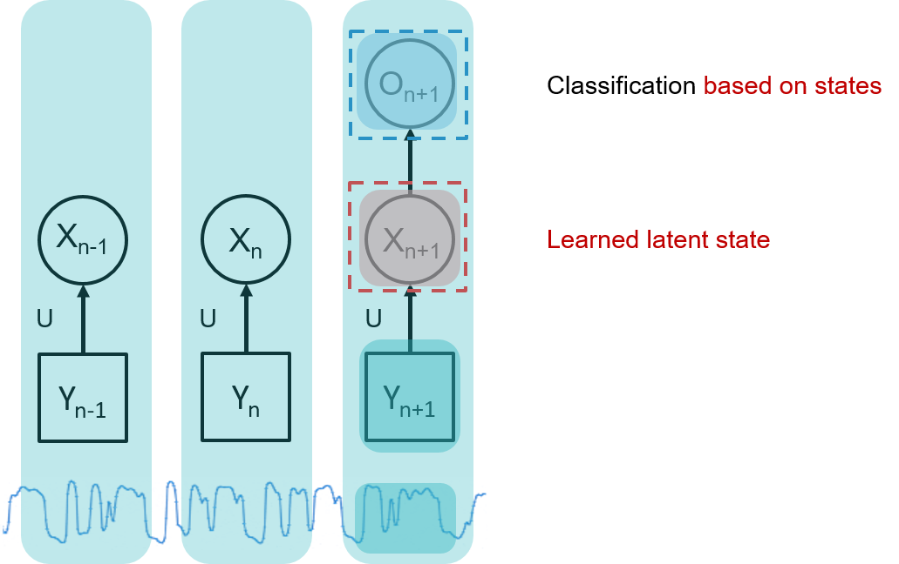 

    
    
<a href="https://i-systems.github.io/teaching/DL/iNotes_tf2/17_RNN_tf2.html"> 출처 </a> 

     

    - 각각의 time index 서로 독립적으로 움직임
        - 과거의 data가 현재의 data를 결정하는 것에 아무런 영향이 없다는 가정
    
     

- 시계열 데이터 모델
    - 시계열 데이터의 가장 큰 특징인 시간 흐름 방향의 dynamic한 behavior property 파악 가능한 구조
        - 이 특징을 hidden state(layer)에 둠
        - state가 중요한 정보를 가지고 있고, 그 정보가 시간에 따른 특성들을 표현할 수 있음

     

    
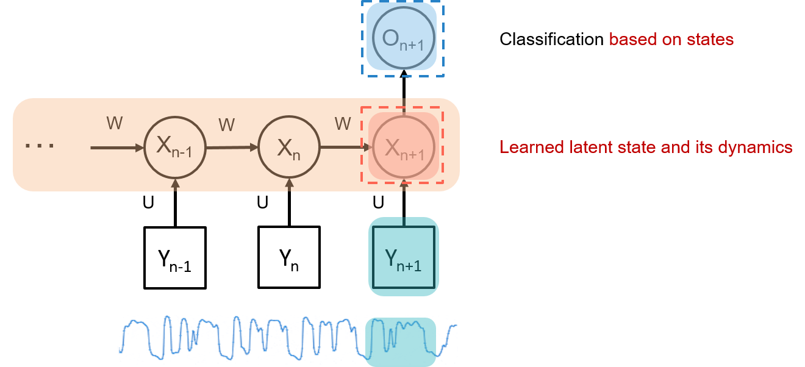 

    
    
<a href="https://i-systems.github.io/teaching/DL/iNotes_tf2/17_RNN_tf2.html"> 출처 </a> 

     

 
 

### Sequence-to-Vector (many to one)

- Sequence가 들어가면 Vector(하나)가 출력 

- 예: 주가예측 : 4일간의 주가가 들어가면 그 다음날 주가가 나옴

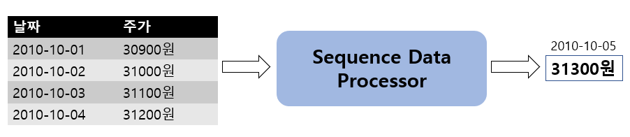

- Input: 4일간 주가
- Output: 5일째 주가

 

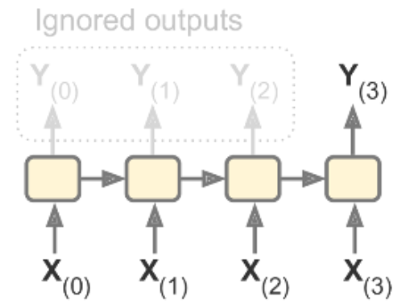

 

### Sequence-to-Sequence(many to many)
- 예: Machine translation (번역)

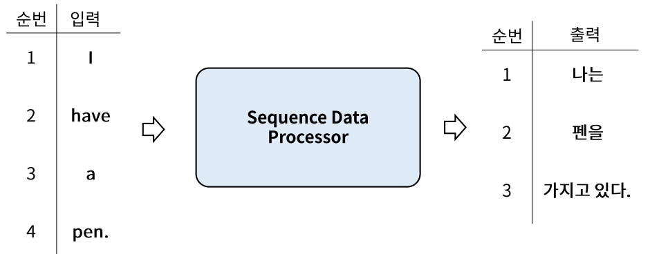

- Input: 영어 문장 전체를 단어 단위로 순차적 입력
- Output: 번역된 한글 문장을 단어 단위로 순차적 출력

 

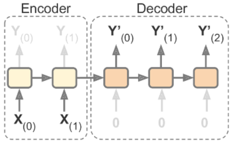

 

### Vector-to-Sequence (one to many)
- 이미지 하나(Vector)가 들어가면 단어들(문장) 출력
- 예: Image captioning 
    - 이미지를 설명하는 문장을 만드는 것 
    - 하나의 그림에 문장(단어들)이 나옴

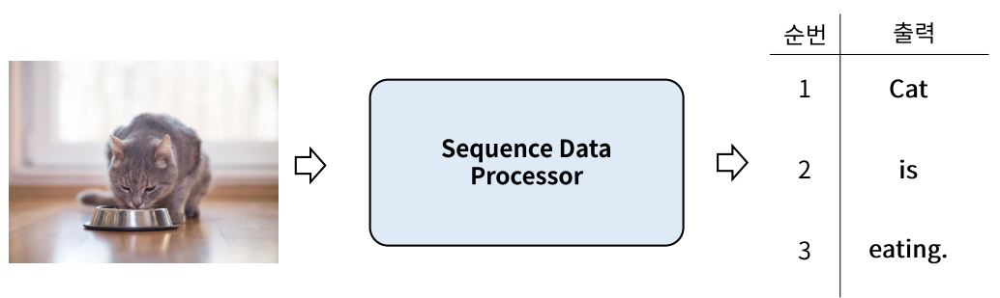

- Input: 이미지
- Output: 이미지에 대한 설명을 단어 단위로 순차적으로 출력 

 

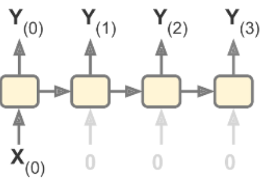

 
 
 

# RNN (Recurrent neural networks) 개요
- t에서의 값을 알기 위해 t-1의 값을 사용하는 것을 Recurrence 하다고 함

 
 

## RNN Shotcut
- Input : 시계열 데이터의 window size 만큼의 데이터
- 각각의 layer들은 많은 뉴런의 수를 가짐
- 이를 하나의 box로 간단하게 표현

     

    
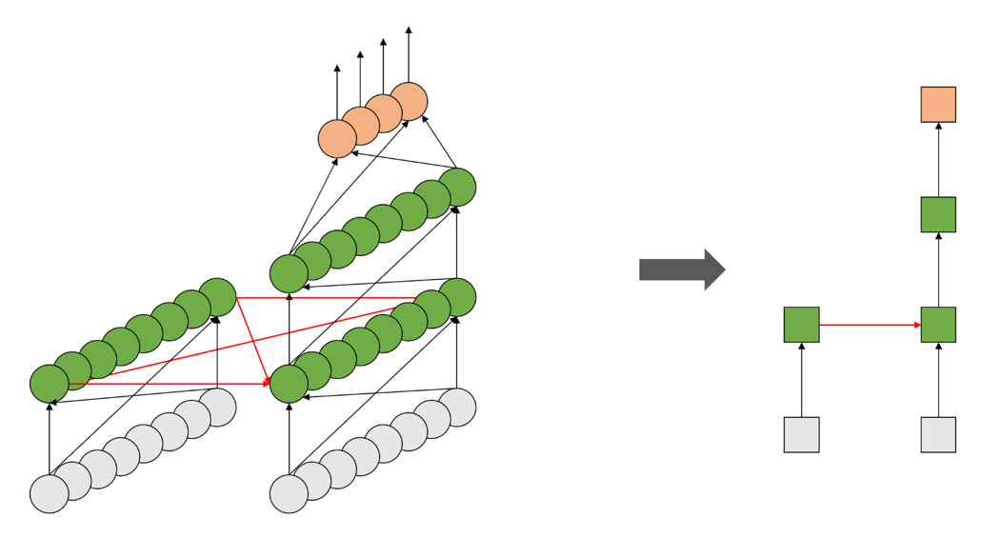

    
<a href="https://i-systems.github.io/teaching/DL/iNotes_tf2/17_RNN_tf2.html"> 출처 </a> 

 
 

## Memory System (기억시스템)
- **window size**
    - window size = n이면 t의 데이터가 t, t+1, t+2, ... ,t-(n-1) 에는 영향을 미치지만 그 후에는 미치지 않는 다는 가정 또는 의미
    - 이론상으로는 n이 무한대이면 가장 이상적이나 현실적으로 불가능 

 

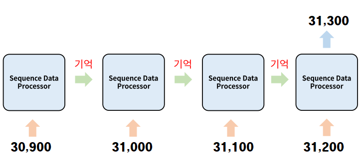

 

- 4일간의 주가 변화로 5일째 주가를 예측하려면 입력받은 4일간의 주가를 순서 기억해야 함
    - window size = 4
    - t의 데이터가 t, t+1, t+2, t+3에는 영향을 미치지만 그 후에는 미치지 않는 다는 것을 의미
- Fully Connected Layer나 Convolution Layer의 출력은 이전 Data에 대한 출력에 영향을 받지 않음

 
 

## Simple RNN
 

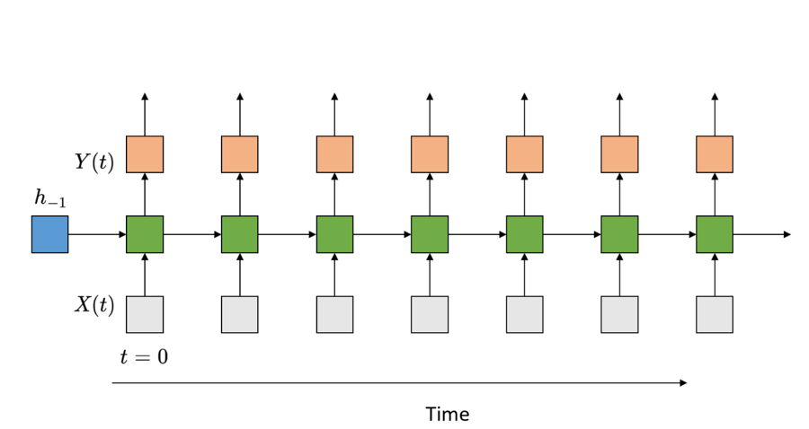

<a href="https://i-systems.github.io/teaching/DL/iNotes_tf2/17_RNN_tf2.html"> 출처 </a> 

 

- RNN은 내부에 반복(Loop)를 가진 신경망의 한 종류
- 각 입력 데이터는 순서대로 들어오며 Node/Unit은 **입력데이터()** 와 **이전 입력에 대한 출력 데이터()** 를 같이 입력 받음
- 입력 데이터에 weight를 가중합한 값과 이전 입력에 대한 출력 값에 weight를 가중한 값을 더해 activation을 통과한 값이 출력값 
- 그 출력값을 다음 Sequence 데이터 처리에 전달

 

<!-- 
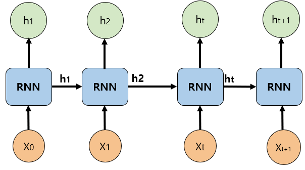
 -->

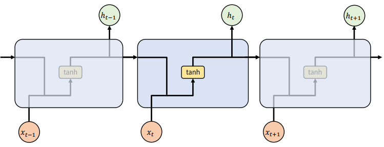

 

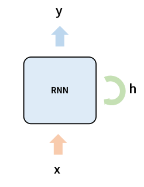

<!-- - 반복문을 돌면서 처리됨 -->

 
 

### RNN의 문제
- 순환을 하기 때문에 학습해야 할 parameter의 수가 훨씬 더 많아지고 network가 복잡해짐
    - 학습이 상대적으로 어려움
- Sequence가 긴 경우 앞쪽의 기억이 뒤쪽에 영향을 미치지 못함
    - 학습능력이 떨어짐
    - 경사 소실(Gradient Vanishing) 문제로 처음의 input값이 점점 잊혀지는 현상 발생 
- ReLU activation, parameter initialization의 조정 등 보다 모형의 **구조적**으로 해결하려는 시도 
    - **Long Short Term Memory(LSTM; Hochreiter & Schmidhuber, 1997)**
    - Gated Recurrent Unit(GRU; Kyunghyun Cho et al., 2014) 
        - LSTM의 성능을 최대한 유지하려고 하면서 계산량은 줄여줌
        - LSTM보다 성능은 떨어짐

 
 

## LSTM (Long Short Term Memory)
- RNN을 개선한 변형 알고리즘
    - 바로 전 time step(short term)의 처리 결과와 전체 time step(long term)의 처리 결과를 같이 입력 받음
- 오래 기억할 것은 유지하고 잊어버릴 것은 빨리 잊어버리자

 

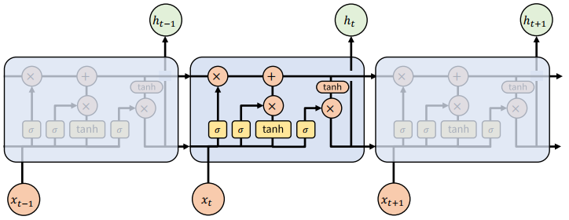

 

- LSTM의 노드는 RNN의 hidden state에 Cell state 를 추가로 출력

 

- Cell State 
    - 장기기억
    - 기억을 오래 유지하기 위해 전달 하는 값
    - 이전 노드들에의 출력 값에 현재 입력에 대한 값을 더함

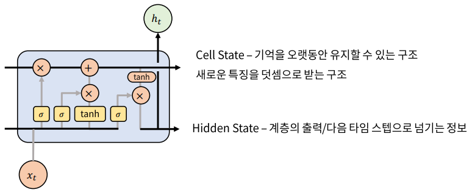

 

### LSTM의 구조
- **Forget gate**
- **Input gate**
- **output gate**

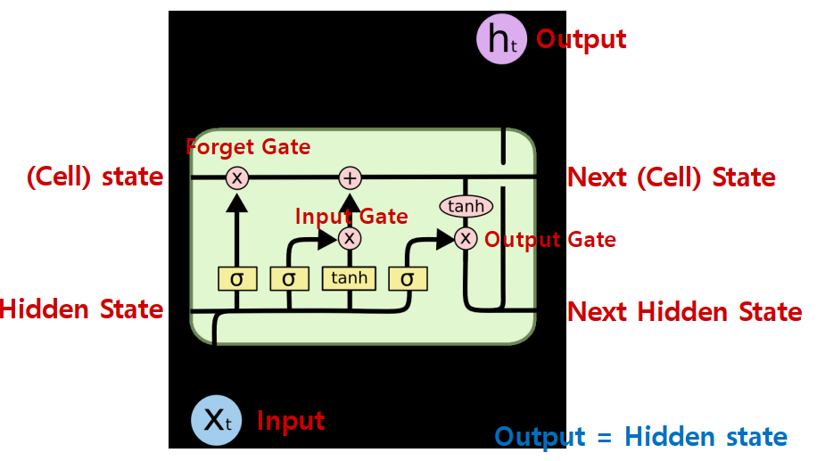

 

### Forget gate
- '과거 정보를 잊기’를 위한 게이트
- cell state의 값을 줄이는 역할
- 현재 노드의 입력값을 기준으로 Cell state의 값에서 **얼마나 잊을지** 결정
- 현재 데이터가 중요한 경우는 현재데이터를 많이 반영
- 현재 데이터가 중요하지 않은 경우는 과거의 데이터를 많이 반영
- 이 값이 0에 가까울수록 정보가 많이 삭제된 것이고 1에 가까울수록 정보를 온전히 기억한 것!
    - 1에 가까울수록 과거 정보 많이 기억
    - 0에 가까울수록 과거 정보 많이 잃음
    
     

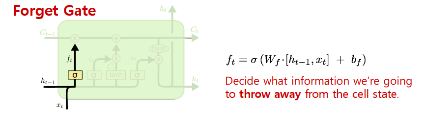

 

### Input gate
- ‘현재 정보를 기억하기’ 위한 게이트
- 현재 노드의 입력값을 Cell state에 추가
    - 즉, cell state에 현재입력을 더해주는 것

     

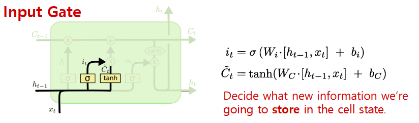

 

### Cell State 업데이트
- forget gate의 결과를 곱하고 input gate의 결과를 더함
    - 이전 메모리에 현재 입력으로 대체되는 것을 지우고 현재 입력의 결과를 더함

 

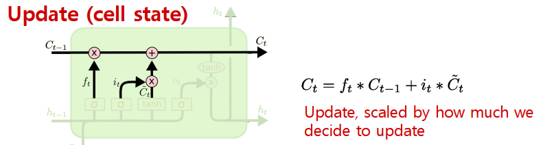

 

### Output gate
- LSTM에서 output은 hidden state 
- 다음 Input Data를 처리하는 Cell로 전달

 

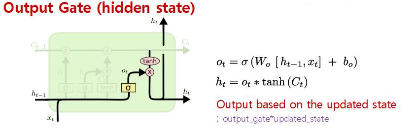

