# Autoencoder 개요
1. Unsupervised learning
    - 오토인코더 학습 할 때 unsupervised learning 
2. Manifold learning
    - 학습된 오토인코더에서 인코더는 차원 축소 역할 수행
3. Generative model learning
    - 학습된 오토인코더에서 디코더는 생성 모델의 역할 수행
4. ML density estimation
    - 오토인코더 학습 할 때 losss는 negative ML

 
 

# Autoencoder를 위한 기본 내용 학습
## Deep Learning 

 

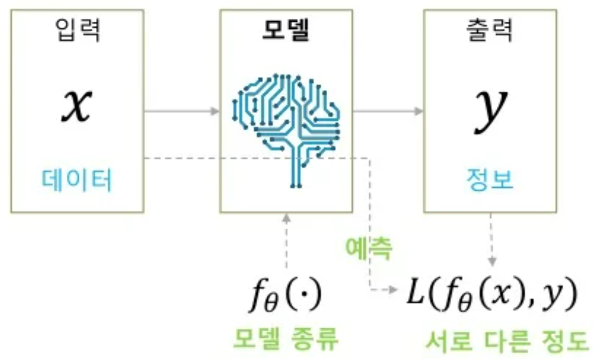

<a href="https://www.slideshare.net/NaverEngineering/ss-96581209">출처</a>

### 1. 데이터 수집

 

 

### 2. 모델의 종류와 손실 함수 정의
- 학습 모델

     

    

    
 &nbsp;: 학습 파라미터 (  )

     

- 손실 함수
    - Backpropagation을 사용하기 위한 2가지 가정
        1. 전체 training data에 대한 loss의 합은 각 edata에 대한 loss의 합과 같음
        2. 손실함수를 구성할 때 network의 출력값과 정답값만 사용
     

    

     

### 3. 학습
- 최적의 파라미터 찾아 주어진 데이터를 가장 잘 설명하는 모델 찾기

 

 

- Gradient Descent 방식을 기본으로 하는 알고리즘 사용

     

    
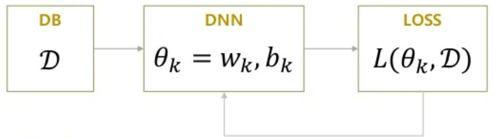

    
<a href="https://www.slideshare.net/NaverEngineering/ss-96581209">출처</a>

### 4. 예측

 
 

## Backpropagation 관점 해석

 
 

## Maximum likelihood 관점 해석

 
 

# Manifold Learning
## Manifold
- 고차원 데이터가 있을 때, 이 데이터를 데이터 공간에 배치하면 이 데이터들을 잘 아우르는 subspace를 **Manifold**  라고 함

 

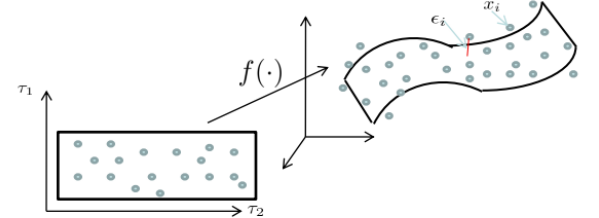

<a href="https://www.slideshare.net/NaverEngineering/ss-96581209">출처</a>

 
 

## Manifold Hypothesis
1. 고차원의 데이터 밀도는 낮지만, 이들의 집합을 포함하는 저차원 manifold 존재
2. 저차원 manifold를 벗어나면 급격하게 데이터의 밀도 낮아짐

 
 

## Manifold 역할
- Data compression
- Data visualization
    - Data intuition, 해석, ...
- Curse of dimensionality 극복
    - Curse of dimensionality
        
         

        
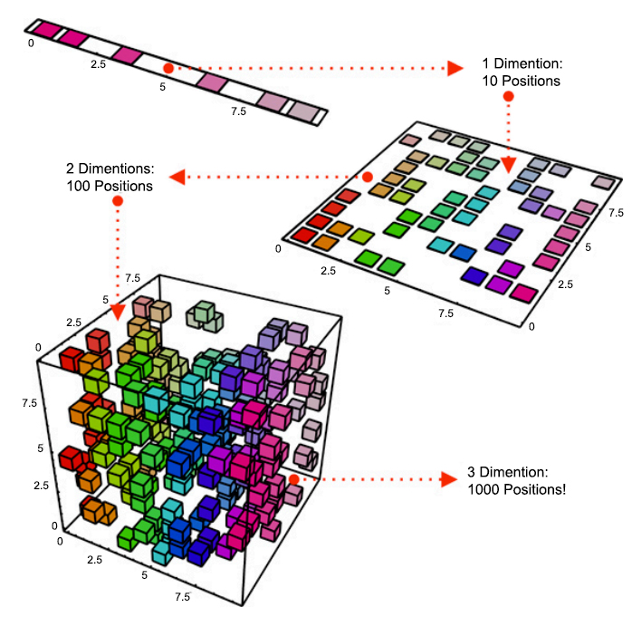

        
<a href="https://www.slideshare.net/NaverEngineering/ss-96581209">출처</a>

        
         
        
        - 1차원 10개의 공간에 8개의 데이터가 있다고 할 때, 2차원으로 늘리면 100개의 공간에 8개의 데이터가 존재하고 3차원으로 늘리면 1000개의 공간에 8개의 데이터가 존재함
        - 즉, 동일한 개수의 데이터의 밀도가 감소
        - 차원을 늘리면 동일한 데이터의 밀도가 떨어지고 모델 prediction이 제대로 되지 않음
        - 고차원에서 제대로 prediction 하기 위해서는 매우 많은 수의 데이터 필요
- Discovering most import features
    - 고차원의 데이터를 잘 표현하는 manifold를 이용해 데이터의 특징 파악 가능

 
 

# Autoencoder
## Basic Autoencoder (AE) 

 

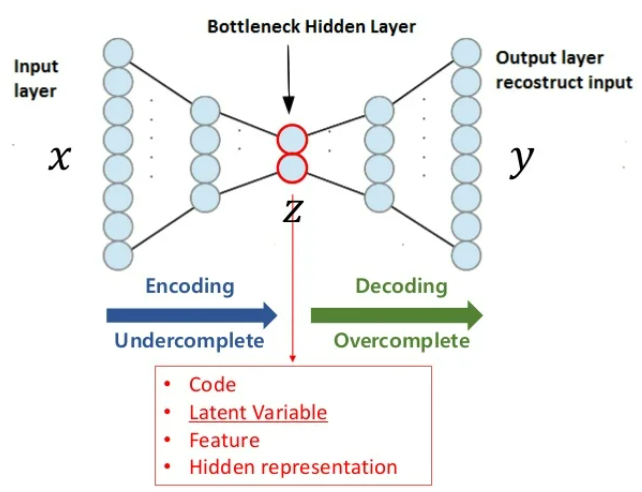

<a href="https://www.slideshare.net/NaverEngineering/ss-96581209">출처</a>

 

- input과 output이 같은 구조 
- 보통은 가운데 차원이 줄어드는 형태
    - 초반에는 차원이 늘어나는 sparse autoencoder, 지금은 거의 사용하지 않음
- Bottleneck Hidden layer
    - Latent Variable, Feature, Hidden representation, .. 등과 같은 표현

 
 

### Autoencoder 수식

 

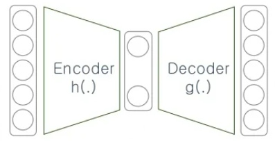

 

- Input은 같은 크기의 output을 생성
    
     

    

    
 &nbsp;: input

    
 &nbsp;: ourput

     

    

    
 &nbsp;: latent variable

    

     

- AE의 Loss를 Reconstruction error 라고도 함
    - 네트워크 input, output 값 이용

     

    

    

     

    - 이미 정답인 값을 알고있기 때문에 unsupervised learning에서 **sunpervised learning, self learning**으로 문제를 바꾸어 해결 가능
        - 차원 축소가 얼마나 잘 이루어졌는지 확인이 가능해짐

<be>

- 보통은 학습이 끝나면 encoder와 decoder를 분리하여 사용
- Decoder가 최소한 학습 데이터는 생성해 낼 수 있음 
    - 생성된 데이터가 학습 데이터와 비슷한 양상을 가짐
    - 최소한의 성능 보장
- Encoder가 최소한 학습 데이터는 latent vector로 표현을 잘 할 수 있음
    - 데이터 추상화 가능

 
 

### Linear Autoencoder
- Hidden layer를 activation function 없이 사용

 

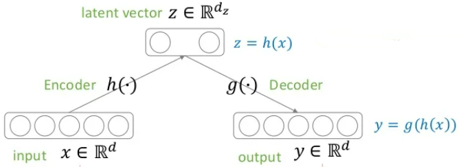

 

- Hidden layer 1개, layer간 fully-connected로 연결 

     

    

    

    

     

    - Loss function으로 MSE 사용하는 경우 PCA와 같은 manifold 학습

 
 

### SAE (Stacking AutoEncoder)
- 초기의 autoencoder는 네트워크 파라미터 초기화에도 많이 사용
    - 즉, pretraining 하는데 많이 사용
    - 지금은 거의 사용하지 않음

 

1. MNIST 데이터를 분류하기 위한 네트워크 구성

     

    
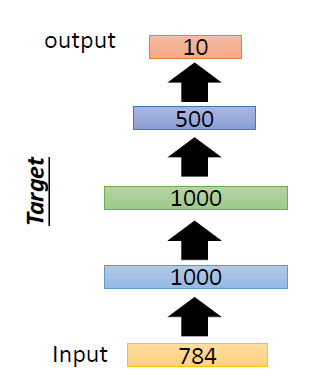

    
<a href="http://speech.ee.ntu.edu.tw/~tlkagk/courses/ML_2017/Lecture/auto.pdf">출처</a>

     

2. 1000개의 weight를 가진 layer를 지나 다시 input 복원하는 과정에서 데이터의 특징을 가지고 있는 weight를 학습

     

    
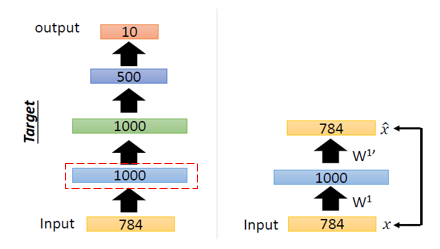

    
<a href="http://speech.ee.ntu.edu.tw/~tlkagk/courses/ML_2017/Lecture/auto.pdf">출처</a>

     

3. 이 weight들을 이용하여 초기 파라미터 설정하고 다른 layer들도 같은 방식으로 반복

     

    
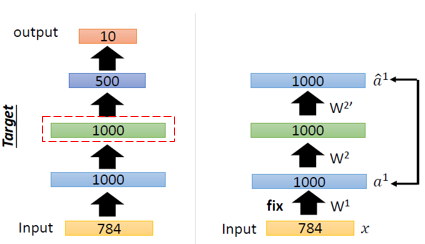

    
<a href="http://speech.ee.ntu.edu.tw/~tlkagk/courses/ML_2017/Lecture/auto.pdf">출처</a>

     

    
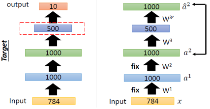

    
<a href="http://speech.ee.ntu.edu.tw/~tlkagk/courses/ML_2017/Lecture/auto.pdf">출처</a>

4. 마지막 layer의 weight들은 렌덤하게 초기화 한 후 backpropagation을 통해 파라미터 학습

     

    
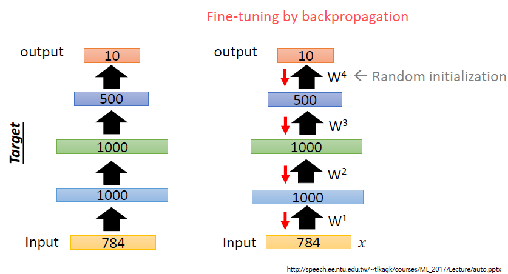

    
<a href="http://speech.ee.ntu.edu.tw/~tlkagk/courses/ML_2017/Lecture/auto.pdf">출처</a>

     

## DAE (Denosing AutoEncoder)

 

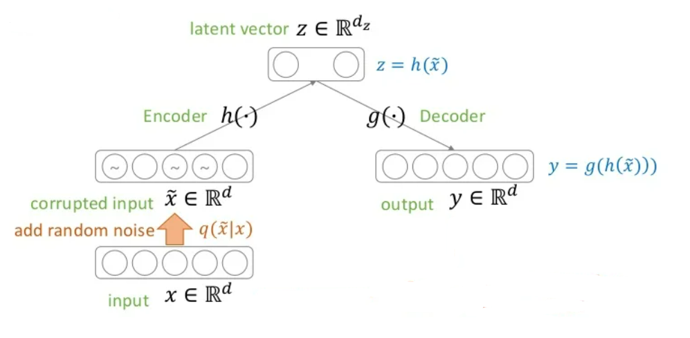

 

- 기존의 AE의 input에 확률적 맵핑을 시켜 noise를 추가한 새로운 input 생성

     

    

    
     

    - 사람이 봤을 때 의미적으로 벗어나지 않을 만큼의 noise 추가
    - 다양한 방법으로 noise를 추가하나 이 논문에서는 noise에 해당하는 위치의 pixel울 0으로 바꿈
        - Extracting and Composing Robust Features with Denoising Autoencoders(2018)
    
     
    
    
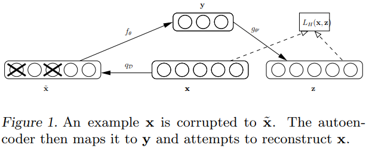

    
<a href="http://speech.ee.ntu.edu.tw/~tlkagk/courses/ML_2017/Lecture/auto.pdf">출처</a>

     

- Loss는 **noise가 추가되기 전의 데이터**와 **noise를 추가한 데이터가 DAE를 통과한 후의 output**을 이용

 

 

- 즉, 학습된 Network는 noise가 추가된 데이터를 넣으면 noise가 제거된 데이터가 output으로 나오므로 denoise 됨

 

### Manifold Learning 관점

 

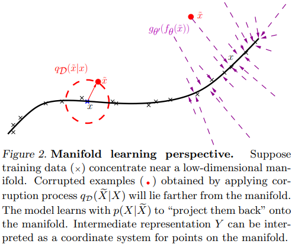

<a href="https://www.cs.toronto.edu/~larocheh/publications/icml-2008-denoising-autoencoders.pdf">출처</a>

 

- 하나의 데이터에 여러개의 noise를 추가한 데이터들은 의미적으로는 같은 sample
- 이 모든 sample들은 같은 manifold 공간에 맵핑이 되어야 함
- 그러므로, Decoder를 통해 복원되는 데이터는 noise가 제거된, 즉 noise를 추가하기 전의 데이터 하나

### SDAE ((Stacking Denoising AutoEncoder))
- Weight를 초기화하기 위해 pretrain하는 과정을 SAE대신 SDAE를 사용한 방법 
    - DAE를 제외하고는 위의 설명과 동일

 

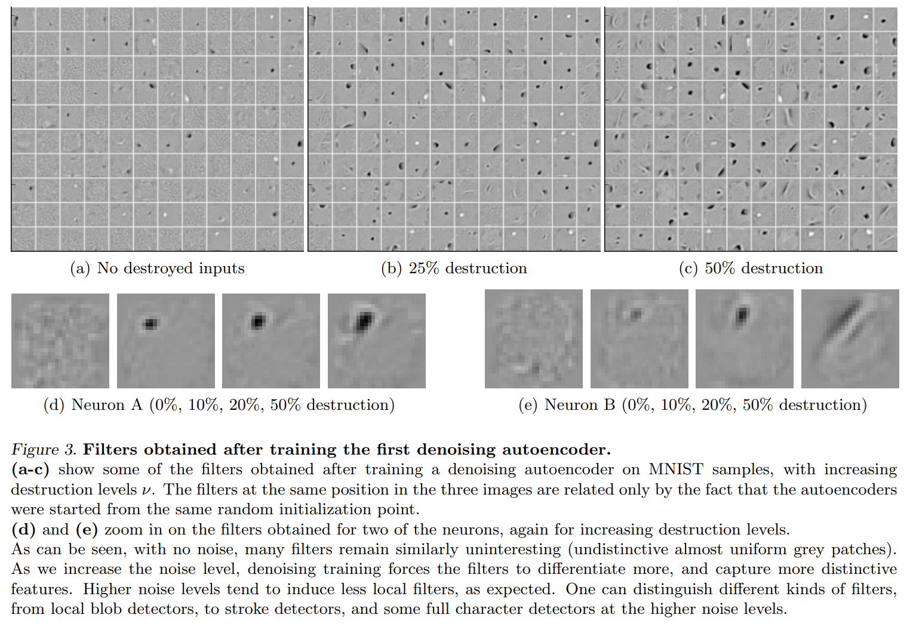

<a href="https://www.cs.toronto.edu/~larocheh/publications/icml-2008-denoising-autoencoders.pdf">출처</a>

 

- Noise를 추가했더니 점점 더 강한 edge detector가 나옴

 
 

## SCAE (Stochastic Contractive AutoEncoder)
- AE의 loss 에 regularization을 추가하면 DAE와 비슷하거나 더 좋은 효과를 낼 수 있음
- DAE의 의미를 수식적으로 표현했다고 볼 수 있음

 

- Loss Function

     

    

     

    - AE의 reconstruction error

         

        

        
         
    
    - Stochastic regularization
        - Manifold 상에서 위치를 같게 만들어주고 싶기 때문에 이 식 반영

         

        

        
         

 
 

## CAE ( Contractive AutoEncoder )
- SCAE의 stochastic 한 식을 deterministic 한 형태로 바꿈
- Noise
    
     

    

        
     

 
 

## VAE (Variational AutoEncoder)
- AutoEncoder는 manifold learning이 목적
    - Encoder를 self supervised learning으로 학습하기 위해 decoder를 이용
    - 주 목적은 encoder
- VAE는 generative model로 데이터 생성이 목적
    - Decoder로 데이터를 만들기 위해 앞단인 encoder가 붙인 것

 

### VAE 전체 흐름
- 이 부분 먼저 봐야 나머지 흐름 이해감

 

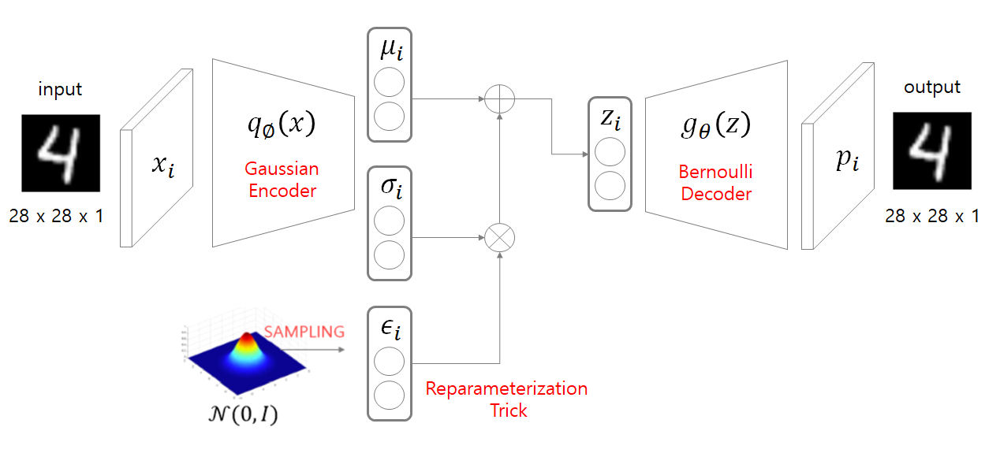

<a href="https://taeu.github.io/paper/deeplearning-paper-vae/">출처</a>

 

- AE는 encoder를 통과한 후 바로 latent space 생성
- VAE는 encoder를 거치면 latent variable을 생성하기 전에 output으로 2개의 vector 생성
    - 평균, 표준편차
- 평균과 표준편차로 normal distribution을 생성하고 여기서 값을 sampling 하여 latenet variable 만듦
- Sampling 하는 과정에서 reparameterization trick 사용
    - 이 과정이 있어야 backpropagation이 가능
    - 미분이 가능하게 바꿔주는 과정

 

### VAE 학습

 

 

- 우리가 궁극적으로 알고싶은 것은 &nbsp; 
    -  x를 우리가 가지고 있는 데이터라고 한다면 그 trainng 데이터의 likelihood를 최대화하고 싶음
        - 내가 가지고 있는 x가 나올 확률이 가장 큰 distribution을 찾아야 함
    - 아래 식을 최대화

 

 &nbsp;: Simple gaussian prior

  &nbsp;: Decoder neural network

 

-  는 gaussian 분포를 따른다고 가정하므로 알 수 있음
-  는 decoder 이기 때문에 신경망으로 구성할 수 있음
- 하지만 모든 &nbsp; 에 대해서  를 적분하는 것은 어려움

 

 

- 반대의 경우를 생각해보아도 &nbsp;가 존재하기 때문에 불가능

 

- &nbsp; 모델링 문제를 해결하기 위해서 **encoder**를 구성

 

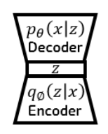

 

- 는 &nbsp; 를 가장 근사화하는 네트워크 

 

- Encoder를 덧붙여 학습

 

-  를 최대화 시키는 것이 목적이기 때문에 이 값에 log를 씌움
- 그리고 기댓값의 형태로 나타냄

 

 

- Bayes' rule과 log 공식을 이용하여 식을 정리

 

 

- Expectation 개념을 이용해 적분으로 변환
    - 
- KL divergence를 이용하여 변환
    - 
    - KL divergence를 이용하면 두 확률분포의 차이(거리)를 계산
- 즉, 변형된 위의 식을 최대화 해야함

 

- 
    - Encoder를 통과한 확률분포가 &nbsp; 의 확률분포와 같아야 함
- 
    -  는 우리가 알 수 없으므로 계산을 할 수 없음
    - 다만 KL divergence는 차이이기 때문에 항상 0 보다 크거나 같음을 알 수 있음

     
    

 

- Tractable lower bound
    

- **ELBO (Evidence LowerBOund)**
    - Variational lower bound
    - 우리가 최적화 시켜야 하는 부분
        - 
     

    

    

 

### VAE loss function

 

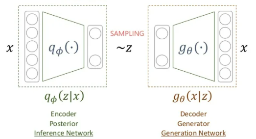

 

 

  

#### Regularization
- Assumption
    1. Encoder를 통과해서 나오는 distribution이 diagonal covariance를 가진다고 가정
    
     

    

     

    2. 실제 z에 대한 distribution은 normal distribution을 따름
    
     

    

     

- 둘을 같게 만들어주어여 함
    - 즉, Encoder를 통과한 값이 항상 normal distribution을 따르도록 만듦 
    - Encoder를 통과하는 확률 분포와 정규분포와의 거리가 최소화되도록 함
    - KL divergence 를 최소화

 

- 식을 정리하면 다음과 같은 식으로 정리가 됨

 

 

#### Reconstruction error
- Input이 그대로 복원될 수  있도록 하는 역할
- 현재 sampling 용 함수에 대한 negative log likelihood

 

 

- Monte-carlo technique 이용
    - 무한개, 혹은 무수히 많은 수의 sampling을 해서 평균을 내면 전체에 대한 기댓값과 거의 동일해짐

    
 

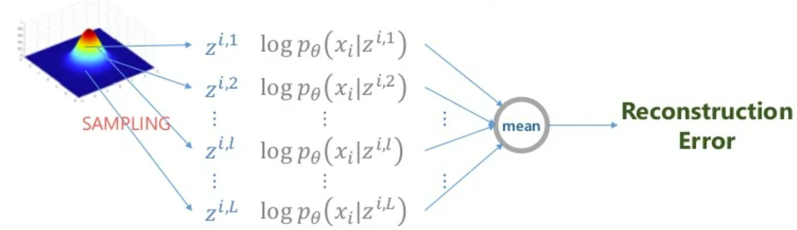

 

- Deep learning에서 이 방법을 쓰기에는 계산량이 너무 많음
    - 그래서 L을 1로 가정
    - 또한, sampling을 reparameterization trick 방식으로 진행

  

- Assumption 
    3.  가 bernoulli distribution나 gaussian distribution를 따른다고 가정
    - Bernoulli로 가정하면 Cross entropy 식으로 바뀜

         

        

         

        - Gaussian으로 가정하면 MSE로 바뀜

    

 

### Reparameterization Trick

 

 

- 단순히 평균과 표준편차만 이용하면 미분을 할 수 없어 backpropagation이 불가능

 

 

- Normal distribution에서 sampling 한 후 표준편차에 더한 후 평균을 더하면 z에 관한 식이 나오고 위와 같은 결과를 얻게 됨

 

### Latent variable 차원 특징

 

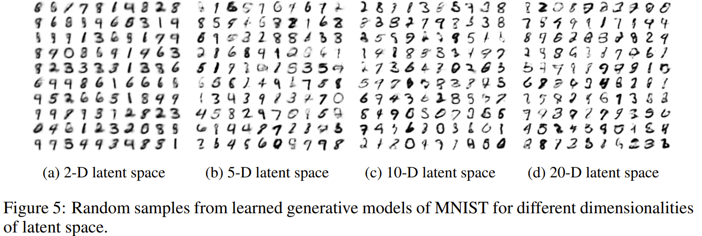

<a href="https://arxiv.org/pdf/1312.6114.pdf">출처</a>

 

- 너무 작은 차원으로 축소를 한 것보다 큰 차원으로 축소한 것이 의미는 있음 복원은 잘되긴 함

 
 

## CVAE (Conditional Variational AutoEncoder)
- VAE를 기반으로 한 방법
- VAE 에서는 label 정보를 사용하지 않음
- Condition
    - Label 정보를 알고있으니 encoder에도 사용하고 decoder에도 사용하겠다는 의미

 

### CVAE(M2) : Supervised version
- 모든 데이터의 label 정보를 다 알고있고 이를 이용하는 경우

 

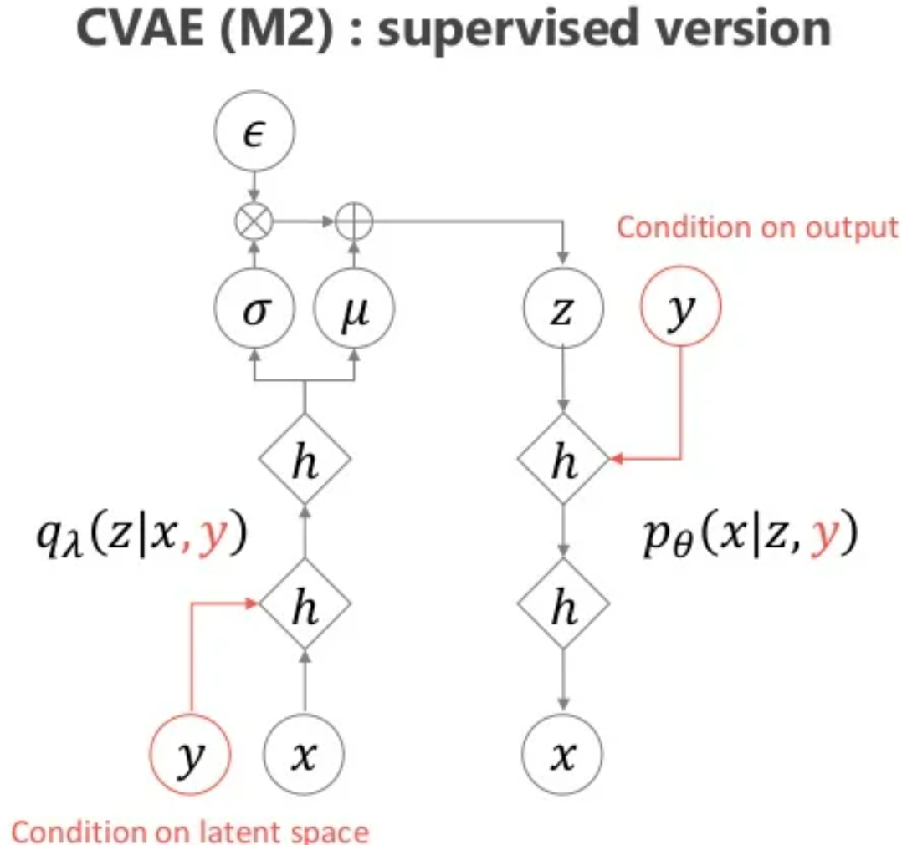

<a href="https://www.slideshare.net/NaverEngineering/ss-96581209">출처</a>

 

### ELBO
- VAE와 같은 방식으로 유도

 

 

### CVAE(M2) : Unsupervised version (or Semi supervised version)
- 일부 데이터의 label만 알고있는 경우
- Label을 알고있을 경우는 CVAE를 이용
- Label을 모르는 경우는 그 모르는 데이터에 대한 condition(y)를 추정하는 별도의 network를 이용
- 추정한 y값으로 CVAE 이용

 

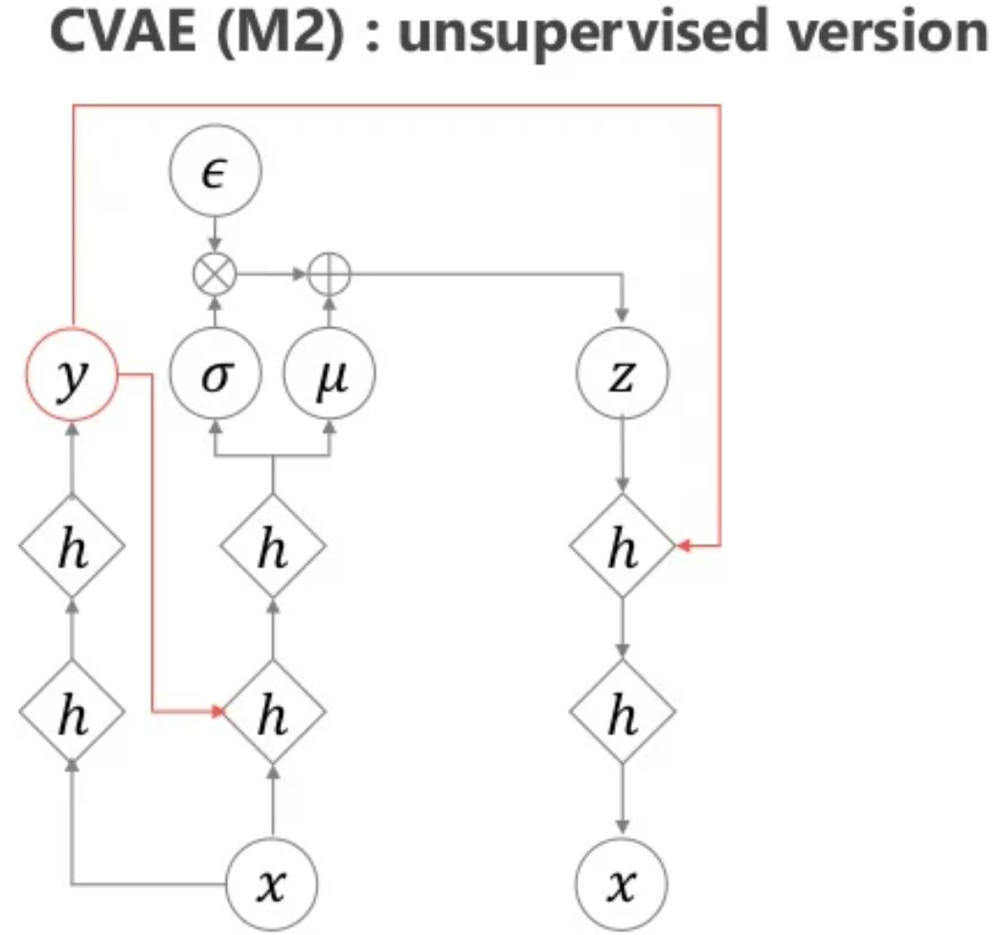

<a href="https://www.slideshare.net/NaverEngineering/ss-96581209">출처</a>

 

### CVAE(M3) : Unsupervised version (or Semi supervised version)
- 일부 데이터의 label만 알고있는 경우

 

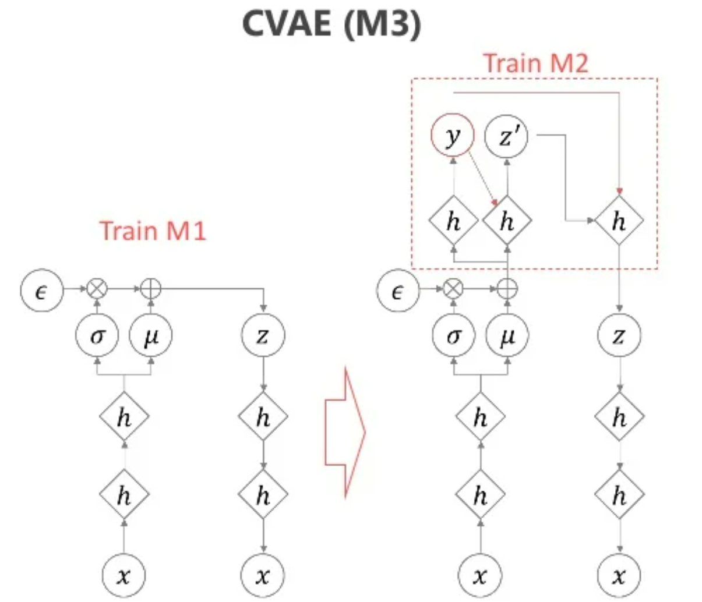

<a href="https://www.slideshare.net/NaverEngineering/ss-96581209">출처</a>

 

- 기존 VAE와 같은 M1으로 학습
- Latent variable z를 생성하는 과정에서 label y를 추정하는 network 추가
- label 정보 추정하여 z 생성
- 성능이 더 좋음 

 

### MNIST Result

 

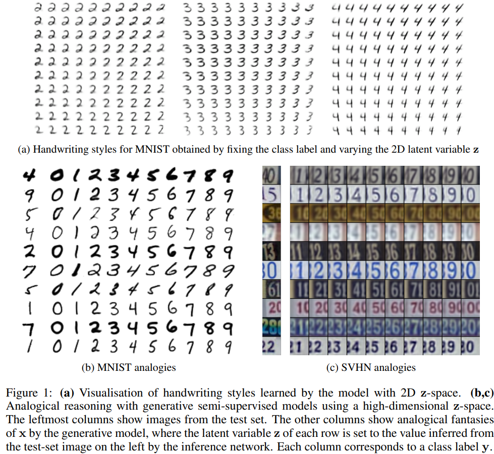

<a href="https://arxiv.org/pdf/1406.5298.pdf">출처</a>

 

- Label을 제외한 주된 feature를 latent variable이 학습
- (a) : label인 y 값을 고정하고 style을 바꾸는 경우
- (b) : z 값, style을 고정하고 condition만 바꾸면 같은 style인데 숫자만 다르게 나옴  
 
  
  

<!-- ## AAE (Adversarial AutoEncoder)
- VAE 학습 할 때 KL divergence term을 이ㅛㅇㅇ하여 prior과 sampling 함수의 차이 조절  -->
