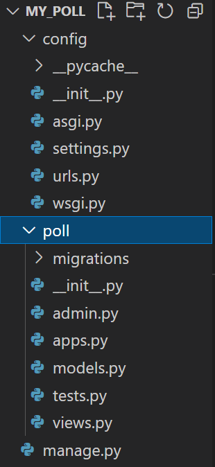
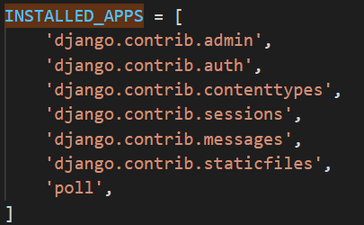
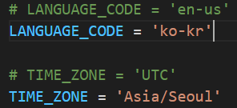
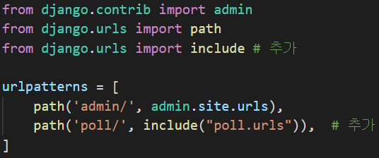
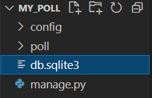
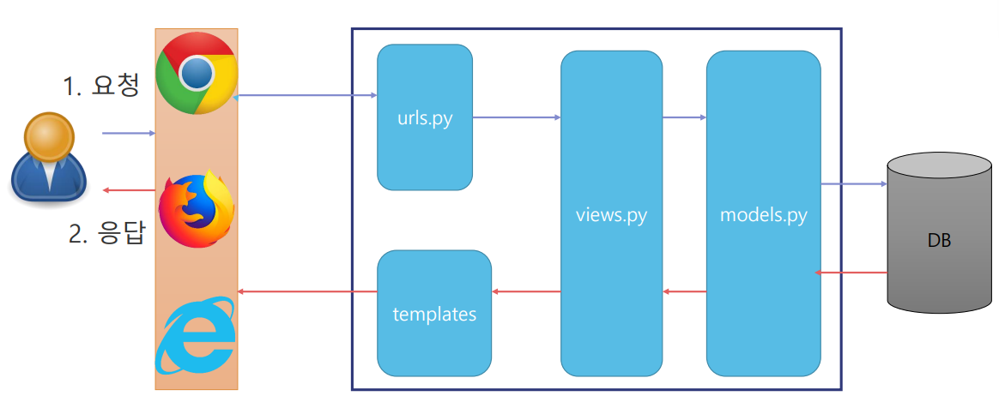

# Project와 App
## Project와 Apps


### project
  - 전체 프로젝트
    - 우리 쇼핑몰

### app
  - 프로젝트를 구성하는 하위 서비스
    - 회원관리, 게시판, 상품관리, ...


## APP
  - 하나의 프로젝트 안의 작은 서비스
  - 하나의 프로젝트는 여러개의 app을 가질수 이씀
  - 장고 프로젝트에서 app을 별도로 나누어 재사용성 용이
    - 재사용성의 목적이 아니라면 하나의 app에 모든 구현해도 상관없음
  - App을 생성하면 반드시 **settings.py** 에 **INSTALLED_APP** 에 등록
  - App 생성하면 기본 모듈 파일들이 자동 생성
    - 추가 모듈은 파일을 직접 만들어 추가

## Django 프로젝트 만들기(기본)
### 프로젝트 만들기
  - 프로젝트 만들기 1) 

  ```
  django-admin startproject 프로젝트명
  django-admin startproject my_poll
  ```
    - 설정 파일들이 my_poll의 하위폴더인 my_poll에 생성

  - 프로젝트 만들기 2)
    - 이렇게 진행

  `mkdir 프로젝트명`
  `cd 프로젝트명`
  `django-admin startproject config .`
  
  
  ```
  mkdir my_poll
  cd mysite
  django-admin startproject config .
  ```
    - 설정 파일들이 my_poll의 하위폴더인 config에 생성

### App 및 테이블 생성 및 설정
  1. App 생성
  ```  
  python manage.py startapp App이름
  python manage.py startapp poll
  ```

 

    - 위의 모든 과정을 마치면 사진과 같은 파일들이 생성됨

  2. config(전체설정경로이름)/settings.py 변경
    - INSTALLED_APPS 설정에 생성한 APP의 이름을 문자열로 등록 

    
    
    - LANGUAGE_CODE, TIME_ZONE 설정

    
  
  3. config(전체설정경로이름)/urls.py 변경
    - poll app에 접근하는 url 패턴을 등록
    
    
      - include를 사용하기 위해 헤더파일 추가
      - url path가 poll/ 로 시작하면 나머지 경로는 poll/urls.py를 찾아보라는 의미
      - poll/urls.py가 존재하지 않는다면 테이블 생성 후 설정(테이블 생성이 안됨)
  
  4. DB에 기본 테이블 생성
    
    - `python manage.py migrate`

    

      - db.sqlite3 생성됨
  
  5. 관리자 계정 생성 

    - `python manage.py createsuperuser`

  6. poll/urls.py 파일 생성(자세한 내용은 뒤에서..)

  7. poll/views.py 에 필요 코드 작성

  8. poll/urls.py 에 이 함수를 등록 

### 실행
  - 서버 실행
    - `python manage.py runserver`
  
  - 서버 종료
    - `ctrl + c`


## 프로젝트 구조


- config - 프로젝트 전체 설정 디렉토리
  - settings.py
    - 현재 프로젝트에 대한 설정을 하는 파일
  
  - urls.py
    - 최상위 URL 패턴 설정
    - 사용자 요청과 실행할 app의 url을 연결

  - wsgi.py
    - 장고를 실행시켜주는 환경인 wsgi에 대한 설정

- app 디렉토리(poll)
  - admin.py
    - admin 페이지에서 관리할 model 등록
  
    - apps.py
      - Application이 처음 시작할 때 실행될 코드를 작성

    - models.py
      - app에서 사용할 model 코드 작성

    - views.py
      - app에서 사용할 view 코드 작성

    - urls.py
      - 사용자 요청 URL과 그 요청을 처리할 View를 연결하는 설정을 작성

- manage.py
  - 사이트를 관리하는 스크립트

## manage.py
- python manage.py 명령어
  - **startapp** : 프로젝트에 app을 새로 생성
  - **makemigrations** : DB 테이블을어떻게 만들지 정의, 어플리케이션의 변경을 추적해 DB에 적용할 변경사항을 정리
  - **migrate** :  makemigrations 로 정리된 DB 변경 내용을 DB에 적용(테이블 생성, 변경)
  - **sqlmigrate** : 변경사항을 DB에 적용할 때 사용한 SQL 확인
  - **runserver** : 테스트 서버를 실행
  - **shell** : 장고 shell 실행.
  - **createsuperuser** : 관리자 계정 생성
  - **changepassword** : 계정의 비밀번호 변경

## 흐름

