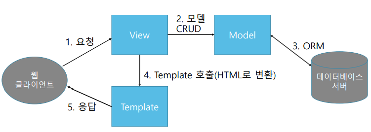

# Django(장고) 개요

## Django(장고) 개요
  - 파이썬 오픈소스 웹 어플리케이션 프레임워크
    - 장고(Django) : https://www.djangoproject.com/
      - 제공되는 기능이 많음
      - 자유도 떨어짐

    - 플라스크(Flask) : https://flask.palletsprojects.com/
      - 가벼운 프레임워크 지향
      - 자유도 높음

## Django(장고)의 특징
  - MVT 패턴 구조의 개발
  - ORM을 이용한 Database 연동
  - 자동으로 구성되는 관리자 기능
  - 유연한 URL 설계 지원
  - 화면 구성을 위한 template system 제공

## Django(장고) 설치
  - 가상환경 설정
    `conda create -n django python=3.8`

  - 가상환경에서 장고와 jupyter 설치
    `pip install django`
    `conda install jupyter`
  
  - VSC에서 python interpreter 선택 (해당 가상환경으로)
  - 터미널 열어 진행 (ctrl + `)

## MVT 패턴
  - 장고는 역할에 따라 Model, View, Template 세 종류의 컴포넌트로 나눠 개발
    - M (Model)
      - DB의 데이터를 다룸
      - ORM을 이용해 SQL문 없이 CRUD 작업 처리 가능

    - V (View)
      - Client 요청 받아 Client에게 응답할 때까지의 처리 담당
      - Client가 요청한 작업을 처리하는 Work flow 담당
      - 구현 방식
        - FBV : 함수 기반 방식
        - CBV : 클래스 기반 방식
    
    - T (Template)
      - Client에게 보여지는 부분(응답화면)의 처리 담당
  
  - 장점
    - 전체 프로젝트의 구조를 역할에 따라 분리해서 개발해 연관성이 적어짐
    - 유지보수성, 확장성, 유연성이 좋아짐

## MVT 패턴 흐름 

