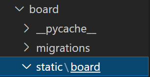
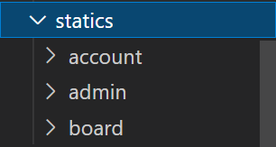
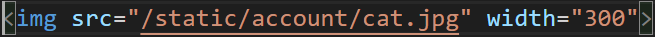
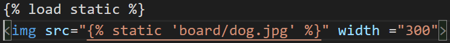

# static 파일 다루기

## static 파일과 media 파일
- Static 파일
    - HTML 문서를 구성하는 정적인 파일
    - 이미지 파일, CSS 파일, Javascript 파일
    - 앱이나 프로젝트 단위로 저장하고 사용

- Media 파일
    - 파일 업로드를 통해 저장된 모든 파일
        - FieldField나 ImageField를 이용해 저장된 파일
    - Database에는 저장된 경로를 저장하고 파일은 파일 스토리지에 저장
    - 프로젝트 단위로 저장하고 사용

## static 저장을 위한 설정
- 각각의 App에서 사용할 static 파일 저장 경로 설정
    - app/static/app이름 경로에 위치
    - app을 위한 image, css, javascript 파일 저장

    

- settings.py 에 설정할 내용
    -  STATICFILES_DIRS
        - 프로젝트 전체(여러 app)에서 공통으로 사용되는 static 파일 저장 경로
        - app/static 이외의 디렉토리에 static 파일들을 저장할 경우 그 디렉토리를 정의

    

    - STATIC_ROOT
        - 개발 할 때 필요한 각 app 디렉토리들에 저장된 static 파일들은 collectstatic 명렁을 사용해 settings.py의 STATIC_ROOT에 설정한 경로에 모은 뒤에 서비스 사용

    

    - STATIC_URL
        - template에서 static 파일들 요청시 사용할 URL 시작 경로는 settings.py의 STATIC_URL에 설정된 경로 사용
        - 즉, client에서 static 파일을 요청할 때 사용할 시작 URL

    

- python manage.py collectstatic
    - STATIC_ROOT에 static 파일 모음(복사)

    

## template에서 static URL 경로 지정
- static 경로에 저장된 파일들을 template에 지정하는 경우 
    - 하드코딩

    

    - template 태그 static를 이용

    
