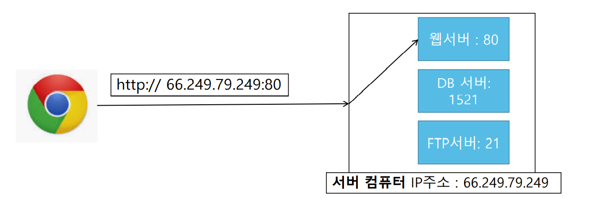

# Web 개요

## 인터넷

### 네트워크 (Network)
  - 컴퓨터와 컴퓨터 사이의 연결
  - 연결된 컴퓨터 간의 데이터(정보) 교환이 목적

### 인터넷 (Internet)
  - 전세계 컴퓨터 들을 연결한 통신망

### 프로토콜 (Protocol)
  - 네트워크 통신 규약
    - 즉, 두 컴퓨터 간 정보를 어떻게 교환할 것인지 정의한 규약
    
  - TCP/IP 프로토콜
    - IP 주소 체계를 따르며 TCP의 특성을 활용해 송신자와 수신자의 연결 생성, 신뢰성 유지
    - TCP : 데이터의 전송을 보장하며, 보낸 순서대로 패킷을 받게 만들어줌
    - IP : 데이터를 패킷 단위로 나누지만 전달 여부 보장하지 않고, 패캣을 보낸 순서와 받은 순서가 같음을 보장하지 않음
    - TCP는 IP 위에서 동작
    - HTTP, FTP, SMTP 등의 TCP를 기반으로 한 프로토콜들이 IP위에서 동작

## 서버 / 클라이언트

### 서버 (Server)
  - 서비스 제공자

### 클라이언트 (Client)
  - 서비스 요청자

## IP 주소, Port 번호, URL
  - IP 주소
    - 여러개의 PC들이 서로 연결되어 있기 때문에 원하는 PC에 연결하기 위해 각각의 PC에 고유하게 부여한 주소
      - 즉, 인터넷 상에 연결된 PC의 공유한 주소 
    - 외부에서 나에게 연결할 때 필요
    - 4바이트의 주소공간을 가지는 IPv4 체계로 구축되어왔으나 주소가 소진되고 있어 16바이트의 주소공간을 가지는 IPv6 프로토콜이 제안되어 적용 중..
    
  - Port 번호
    - PC 내에서 서비스하는 프로그램들을 구분하기 위한 번호
    - 0 ~ 65535 사이의 번호 사용

<!-- 
 -->
    
<!-- 
 -->
