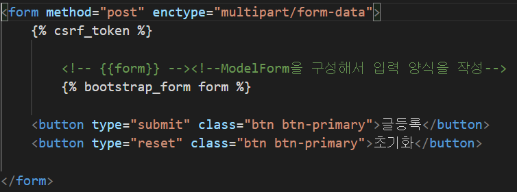

# 파일 업로드와 media 설정

## settings.py에 media 경로 설정
- Media 파일
    - Model 클래스의 FileField / ImageField를 이용해 저장된 모든 파일
        - ImageField는 FileField의 하위
    - client가 없로드한 파일은 파일 스토리지에 저장하고 DB에는 그 경로를 저장

- settings.py 에 설정할 내용
    - MEDIA_ROOT
        - 업로드 된 파일이 저장될 디렉토리 설정

            

    - MEDIA_URL
        - 업로드 된 파일을 클라이언트가 요청할 때 사용할 시작 URL (URL Prefix)

            

## Model의 FileField와 ImageField
- FileField
    - 일반 파일을 저장하기 위한 Field

- ImageField
    - 이미지 파일을 저장하기 위한 Field
    - Pillow 라이브러리를 이용해 이미지의 width/height 정보를 얻음
        - ImageField를 사용하기 위해선 pillow 라이브러리 설치 필수

            `conda install pillow`
            `pip install pillow`

## Model의 FileField와 ImageField 주요 속성(옵션)
- upload_to
    - 파일을 저장할 settings.MEDIA_ROOT 하위디렉토리 명
    - 생략시 settings.py의 MEDIA_ROOT 경로 밑에 저장
    - 같은 이름의 파일이 저장될 경우 뒤에 번호를 붙여 덮어쓰기 방지
    - 경로에 날짜/시간 관련 변환 문자 (%Y, %m, %d, %H, %M, %S) 를 이용해 디렉토리를 동적으로 만듦
        
        

    - models.ImageField(upload_to = "images")
        -  MEDIA_ROOT/images 아래 저장

    - models.FileField(upload_to = "docs/%Y/%m/%d")
        - docs/2021/01/05 경로에 저장

            
        
## Template에서 MEDIA url 처리
- settings.py의 MEDIA_URL 과 Field의 upload_to 의 경로를 조합해서 url 경로를 만듦 
- 하드코딩 할 경우 경로가 바뀌면 소스코드를 모두 변경
- 필드의 url 속성을 이용한 경로 조회 가능
    
    

## 개발 서버를 위해 media 파일 url 등록
- static 파일과 다르게 장고 개발 서버는 Media 파일을 client에게 서비스하는 것을 지원하지 않음
- 개발 서버에 media 파일 서비스를 위해 설정파일[config]/urls.py 에 등록

    

## 파일 업로드 - HTML
- form 설정
    - method : post
    - enctype: multipart/form-data 

- input 태그
    - type : file

        
