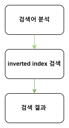
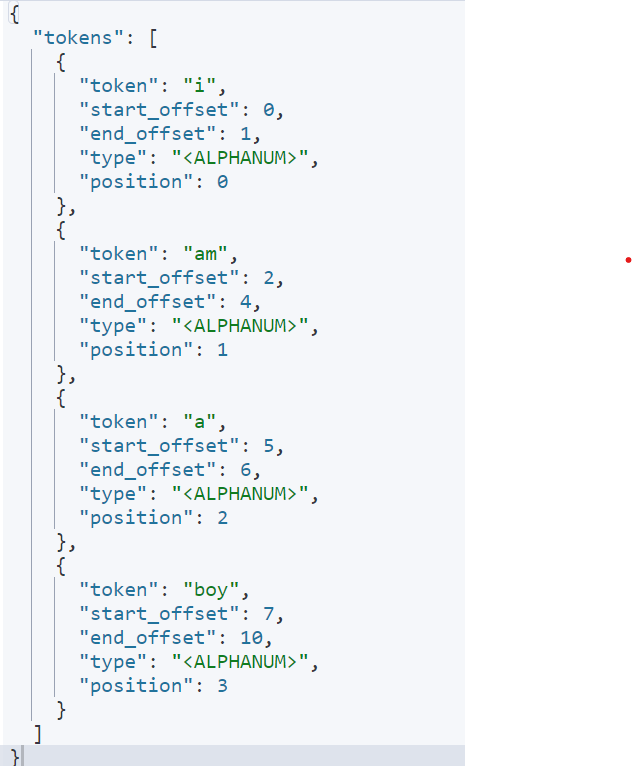

# Elastic Search 동작
## 색인 (indexing)
- 문서를 분석하고 저장하는 과정
    - ES 안에 문서를 입력할 떄 이 문서를 분석하고 storage에 저장하는 이 모든 과정을 색인이라 함

<br>
<br>

### 색인 과정
- 전체적인 색인 과정

    <br>

    <p align=center></p>

    <br>

    - 인덱스를 생성하고, 매핑을 확인하고 inverted index를 생성하고 문서를 저장하는 일련의 과정
    - 색인은 프라이머리 샤드에서 일어남


- 클러스터로서의 이점을 살리지 못하는 색인 과정

    <br>

    <p align=center></p>

    <br>

    - 문서 하나가 tests 인덱스에 색인이 되는 경우, 인덱스가 존재하지 않으면 인덱스를 생성
    - 이 인덱스의 데이터를 저장할 샤드가 생성
        - 첫 번째 데이터 노드에 프라이머리 샤드
        - 두 번째 데이터 노드에 레플리카 샤드가 만들어짐
    - 프라이머리 샤드에 저장되고 이 값이 래플리카 샤드에 복사

    <br>

    <p align=center></p>

    <br>

    - 두 번째 데이터 노드에 put 요청을 하면 이 데이터 노드는 문서를 저장하기 위한 프라이머리 샤드가 존재하지 않음
    - 자신이 받은 요청을 프라이머리 노드가 존재하는 첫 번째 노드에 전달
    - 첫 번째 데이터 노드가 가지고 있는 0번 프라이머리 샤드에 저장되고 레플리카로 복사
    - 프라이머리 샤드가 하나이기 때문에 색인이 하나의 데이터 노드에서만 일어남
        - 데이터 노드가 3데, 이지만 색인에 있어서는 사실상 1대
    - 색인 작업에 분석을 통해 inverted index를 만드는 과정이 CPU와 메모리를 가장 많이 사용하는 과정인데 이를 데이터 노드 1대가 감당
    - 적절한 샤드 갯수를 설정하는 것이 성능에 큰 영향을 줌 


<br>

- 클러스터로서의 이점 이용한 색인 과정

    <br>

    <p align=center></p>

    <br>

    - 3개의 프라이머리 샤드가 만들어짐
    - 첫 번째 문서는 1번 노드의 0번 프라이머리 샤드에 저장이 되고 해당 래플리카 노드에 복사 
        - 1번 데이터 노드가 작업을 함    
    - 그 다음 문서는 2번 데이터 노드의 1번 프라이머리 샤드에 들어가고 해당 래플리카 노드에 복사
    - 그 다음 문서는 3번 데이터 노드의 2번 프라이머리 샤드에 들어가고 해당 래플리카 노드에 복사
    - 프라이머리 샤드가 3개이기 때문에 3대의 데이터 노드 모두 참여

    <br>

    - 데이터 노드를 늘려도 색인에 들어갈 수  있는 데이터 노드는 여전히 3대 밖에 없음
    - 하지만 데이터 노드가 하나 더 추가 되면 문제 발생
        - 샤드의 개수가 고르게 분배되지 않기 때문에 용량 불균형 발생
            - 샤드 한 개가 10G의 데이터 용량을 가지고 있다면 첫 번째 데이터 노드는 10G, 두 번째는 20G, 세 번째는 10G, 네 번째는 20G

<br>

- 적절한 샤드의 개수는? 
    - 처음부터 완벽한 샤드 배치 계획을 세울 수는 없음
    - 배치 계획을 세운 테스트를 하여 우리 사비스에 맞는 방식을 찾아야 함
    - 성능에 문제가 있다면 샤드의 수를 늘리거나 데이터 노드를 제거 또는 추가하면서 최적의 수를 찾음

<br>
<br>

## Inverted index
- 문자열을 분석한 결과를 저장하고 있는 구조체
- Token
    - 문자열을 구성하고 있는 단어들을 분석기를 통해 생성해 낸 것
- Document
    - Document id


<br>
<br>

### 애널라이저 Analyzer

<br>

<p align=center></p>

<br>

- 문자열을 분석해서 inverted index 구성을 위한 토큰을 만들어 내는 과정 
- Character filter, tokenizer, token filter 를 의미
- Character filter
    - 특수 문자 제거 등의 과정
- Tokenizer
    - 공백을 기준으로 나누는 등
- Token filter
    - 대, 소문자 가리지 않도록 모두 소문자로 바꾸는 등의 과정

<br>
    
- 적용

    <br>

    ```
    GET /_analyzer
    {
        "analyzer" : "standard",
        "text" : "linux kernel"
    }
    ```

    <br>

    - "linux kernel" 이라는 text를 standard analyzer로 분석

<br>
<br>

## 검색 
- 검색 요청은 프라이머리 샤드와 래플리카 샤드 모두 처리 가능

<br>
<br>


### 검색 과정
- 전체적인 검색 과정

    <br>

    <p align=center></p>

    <br>

    - 검색어 분석한다는 것은 analyzer를 이용하여 token을 만드는 과정
    - 생성된 토큰을 사용하여 inverted index 에서 검색
    - 그 결과를 표시


<br>

- CRUD
    
    <br>

    ```
    GET /_search
    {
        "query" : {
            "query_string" : {
                "query" : "linux book"
            }
        }
    }
    ```
    
    <br>

    - 위와 같이 검색을 진행
    - 제대로 된 결과가 나오지 않는 경우 

<br>


- 클러스터로서의 이점을 살리지 못하는 검색

    <br>

    <p align=center></p>

    <br>

    - 검색 query들이 오면 Node1의 샤드들과 Node3의 샤드들로 분배가 됨
    - 두 번째 데이터 노드는 검색을 할 수 없음
    - 프라이머리 샤드의 수를 늘려 두 번째 데이터 노드에 배치시킬 수 있겠지만 프라이머리 샤드 2개만으로 색인 성능이 충분
        - 프라이머라 샤드를 늘려 리소스를 더 사용할 필요가 없음
    - 니즈는 검색 성능을 높이는 것
        - 아래와 같이 진행


<br>


- 클러스터로서의 이점을 이용하는 검색

    
    <br>

    <p align=center></p>

    <br>

    - 래플리카 샤드를 늘려 검색 요청의 성능을 늘림
    - 모든 노드에 검색 query가 감
    - 검색의 성능을 더 증가시켜야 한다면 데이터 노드 수를 늘리고 래플리카 샤드의 수를 늘림
        - number_of_replicas 는 동적이기 때문에 가능


<br>
<br>

## text & keyword

<br>

<p align=center></p>

<br>

- text는 일반적으로 사용하는 검색을 위해 문자열을 토큰을 생성
- keyword는 전문 검색이 아닌 정확하게 일치하는 것을 찾기 위해서 토큰을 생성
- 문자열 필드 동적 생성되면 text와 keyword 둘 다 생성
- 문자열 특성에 따라 text, keyword 정적 매핑해주는 것이 성능에 좋음
    - 분류 기준
        - text : 주소, 이름, 상세 정보 등등
        - keyword : 성별, 카테고리 등등 

<br>

### Full-text searching

<br>

```
GET /_analyze
{
  "analyzer": "standard",
  "text": "I am a boy"
}
```

<br>

- 결과

    <br>

    <p align=left></p>

    <br>

    - i, am, a, boy 는 하나하나 inverted index가 됨
    - am 이나 i 라는 단어를 입력하면 이 text 문서가 검색 됨

<br>
<br>

### Exact matching

<br>

```
GET /_analyze
{
  "analyzer": "keyword",
  "text": "I am a boy"
}
```

<br>

- 결과

    <br>

    <p align=left></p>

    <br>

    - 입력된 문자 그대로 토큰 생성
    - text 보다 cpu 덜 사용하고 색인 속도 더 빠름


