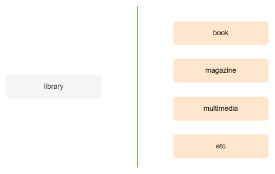
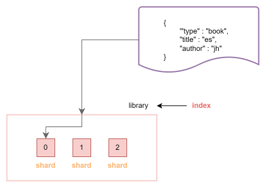
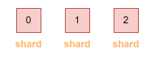

# ElasticSearch 기본
## ElasticSearch
- 루씬 (Lucene) 기반의 오픈소스 검색 엔진
    - 루씬 : 색인, 검색이 가능한 java  library
- Json 기반의 문서를 저장, 검색, 분석 할 수 있도록 함

<br>
<br>

### ElasticSearch 특징
1. 준실시간 검색 시스템
    - 색인된 데이터가 빠르게 검색
    - ElasticSearch 안에 문서가 색인이되면 색인된 결과가 ES 메모리에 올라가서 검색을 할 수 있게 됨
        - refresh-interval 는 default 1초, 즉 색인이 되고 1초면 검색이 가능

<br>

2. 고가용성을 위한 클러스터 구성
    - 한 대 이상의 노드로 클러스터를 구성하여 높은 수준의 안정성을 달성하고 부하 분산이 가능
        - 여러 대의 노드로 구성하면 노드 하나가 죽었을 때도 나머지 노드들이 그 역할을 할 우 있어서 안정성이 높아짐
        - 노드가 추가되면 트래픽을 나누어 받기 때문에 부하 분산이 가능해짐

<br>

3. 동적 스티마 생성
    - 입력될 데이터들에 대해 미리 스키마를 정의하지 않아도 동적으로 생성 가능 
    - RDBMS는 DB를 만들고 table을 만들 때 스키마를 정의 (ID(INT), Name(varchar), .. )

<br>

4. Rest API 기반의 인터페이스 제공
    - 특별한 client를 필요로 하지 않고 Rest API로 elasticsearch의 기능을 충분히 사용할 수 있음 
        - 사용을 위한 진입 장벽이 낮음 

<br>
<br>

## 클러스터 (Cluster)
- 컴퓨터 클러스터는 **여러 대의 컴퓨터들** 이 연결되어 **하나의 컴퓨터**처럼 동작하는 컴퓨터들의 집합
- ElasticSearch에서는 클러스터는  **여러 대의 노드들** 이 각자의 역할을 바탕으로 연결되어 **하나의 시스템** 처럼 동작
- 클러스터의 성능이 부족하면 노드를 늘려 대응할 수 있음
    - 하지만 노드를 늘린다고 모두 성능을 늘릴 수 있는 것은 아님

<br>
<br>

### 클러스터의 특징
- 여러 대의 노드들이 각자의 역할을 바탕으로 연결되어 하나의 시스템처럼 동작하기 때문에 어떤 노드에 어떤 요청을 해도 동일한 응답을 줌
    - 아래 두 예시가 동일한 응답 제공

    <br>

    <p align=center></p>

    <br>

    - 하지만 불필요한 경로를 거치므로 역할에 맞는 노드에 요청하는 것 중요! 

<br>

- 각자의 **역할을 잘 할 수 있도록 노드 설정** 하는 것 중요
- 데이터 노드들에 대한 직접적인 접근을 차단하고 load balancer를 통해 통신하도록 하는 것이 이상적

    <br>
    <p align=center></p>
    <br>


<br>
<br>


## 노드 (Node)
### 기본적인 노드의 종류
1. 마스터 노드
    - 클러스트의 상태나 메타 데이터를 관리
2. 데이터 노드
    - 직접적인 문서 색인과 검색 요청
3. 코디네이팅 노드
    - 보통 검색 요청을 처리
4. 인제스트 노드
    - 색인되는 문서들의 데이터를 전처리
        - 문서가 ES 안에 저장되기 전에 수정한다는 의미
- 위의 4가지 노드들이 가장 기본적인 노드들
- 이 외에도 다양한 노드들이 존재
- ML

<br>

### 마스터 노드
- 마스터 노드는 마스터 노드와 마스터 후보 노드 (Master-eligible) 나눌 수 있음
    - 마스터 노드
        - 지금 클러스터에서 마스터 노드의 역할을 하고 있는 노드
        - 딱 한대! 
    - 마스터 후보 노드
        - 마스터 노드에 문제가 생겼을 때 마스터 노드가 될 수 있는 노드
        -  config에서 master: true 로 설정하면 마스터 후보 노드가 되고 이 중 하나가 마스터 노드가 됨
        - 마스터 노드가 죽으면 마스터 노드 중 하나가 마스터 노드가 됨

<br>
<br>

## 인덱스 (Index)

<br>

<p align=left></p>

<br>

- 문서가 저장되는 논리적인 공간
    - 문서가 저장되기 위해서는 반드시 인덱스가 존재해야 함
- 인덱스를 설계하는 것이 ElasticSearch를 사용하기 위해 고려해야하는 첫 단계!
    -  로그를 수집 또는 검색 엔진으로 사용하던 문서들을 어떤 인덱스에 어떻게 저장을 할 것인지에 대한 설계가 가장 먼저!

<br>
<br>

### 인덱스 설계
- 도서관 자료 검색 시스템도 다양한 방법으로 설계 가능
    - library라는 이름의 인덱스에 모든 자료 저장
    - 각 자료 별로 인덱스를 만들어 따로 저장

    <br>
    
    <p align=center></p>

    <br>

- 인덱스 설계에 따라 문서의 구조 및 검색 쿼리가 달라짐
- **사용 패턴**과 **문서의 특성**에 따라 설계해야 함

<br>
<br>

- 인덱스 수에 따른 설계
    1. 하나의 인덱스 사용
        - 관리해야 할 인덱스의 수가 적어 리소스가 적게 발생
        - 쿼리의 문서와 구조가 복잡해짐
    2. 여러 개의 인덱스 사용 
        - 각각의 경우에 최적화된 쿼리와 문서 구조를 사용 할 수 있음
        - 과리해야 할 인덱스의 수가 많아 관리 리소스 발생

<br>

- 하나의 인덱스로 단순하게 시작하다 사용 패턴에 따라 인덱스를 별도로 운영하는 것이 좋음
    - 시스템이 얼마나 커지고 복잡해질 것인지 모르기 때문에 인덱스를 하나로 시작
    - 특정 타입의 유저가 많아지거나 사용량이 많아져 성능을 끌어올릴 필요가 있다면 확장!

<br>
<br>

## 샤드 (Shard)
- 인덱스에 색인되는 문서가 저장되는 공간
    - 하나의 인덱스는 반드시 하나 이상의 샤드를 가짐

<br>

<p align=center></p>

<br>

<br>

### 샤드의 종류
- **프라이머리 샤드**
    - 문서가 저장되는 원본 샤드
    - 색인과 검색 성능에 모두 영향
- **레플리카 샤드**
    - 프라이머리 샤드의 복제 샤드
    - 검색 성능에 영향을 줌
    - 프라이머리 샤드에 문제가 생기면 레플리카 샤드가 프라이머리 샤드로 승격


<br>
<br>

### 샤드의 설정
- 인덱스 설정할 때 설정해야 함

<br>

```
PUT /library/_settings
{
    "index" : {
        "number_of_shards" : 3,
        "number_of_replicas" : 1
    }
}
```

<br>

- 위와 같이 셋팅
    - 프라이머리 샤드는 3개
    - 레플리카 샤드는 각 프라이머리 샤드 당 1개씩 존재하므로 총 3개
    - 인덱스의 총 샤드 개수는 6개


<br>
<br>

### 샤드의 라우팅
- 문서가 샤드에 저장되는 순서, 방법을 의미

<br>

<p align=left></p>

<br>

- 문서들은 0 ~ 2번 샤드에 고르게 저장
    - A, B, C, D 문서가 있을 때 순서대로 0, 1, 2, 0 번 샤드에 저장
- 샤드의 개수가 바뀐다면 문서가 저장되는 규칙이 완전히 바뀌게 됨!
    - 따라서 인덱스 생성할 때 프라이머리 샤드의 개수를 바꿀 수 없음
- **Rounting Rule = (문서의 ID) % (샤드의 개수)**
- 즉, 인덱스 생성 시, 프라이머리 샤드의 개수를 설정하는 것은 매우 중요
    - 바꿀수 없어!!
- number_of_shards의 기본값은 1
    - 이 기본값 그대로 사용하면 성능에 큰 영향을 줌


### 인덱스 템플릿
- 인덱스 생성 시의 샤드의 개수를 미리 설정 가능

<br>

```
PUT _index_template/base_template
{
    "index_patterns" : ["nginx-logs-*"],
    "template" : {
        "settings" : {
            "number_of_shards" : 3,
            "number_of_replicas" : 2
        }
    }
}
```

<br>

- nginx-logs- 로 시작하는 모든 인덱스는 프라이머리 샤드 3개, 레플리카 샤드 6개로 생성