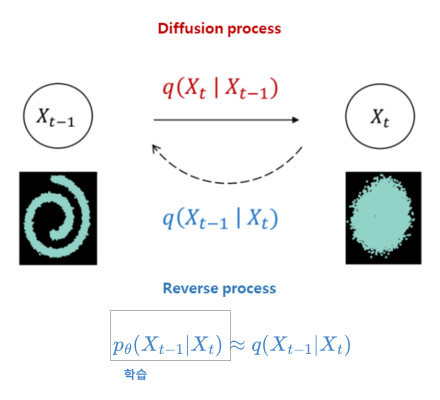
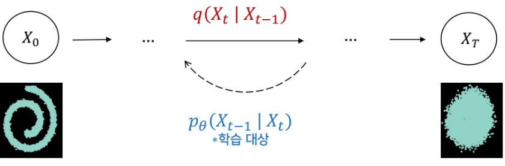
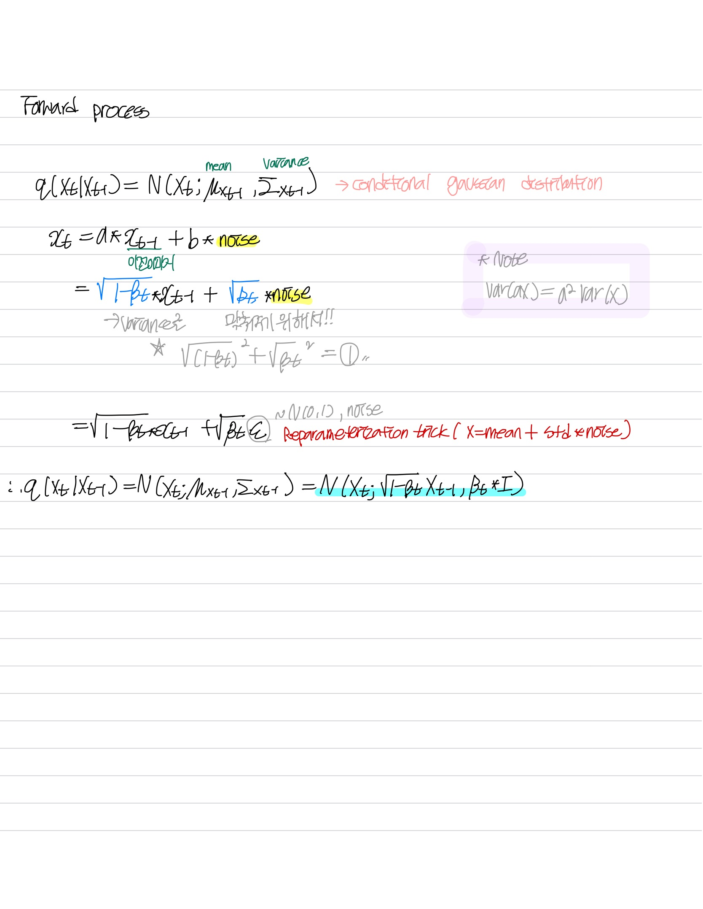

# Denoising Diffusion Probabilistic Models 
[논문](https://arxiv.org/pdf/2006.11239.pdf)
[참고](https://www.youtube.com/watch?v=_JQSMhqXw-4)
[참고2](https://lilianweng.github.io/posts/2021-07-11-diffusion-models/)
 
 

## Prequisite
### Diffusion

 

 

- 액체나 기체에 다른 물질이 섞이고, 그것이조금씩 번져가다가 마지막에는 같은 농도로 바뀌는 현상
    - 물질의 특정한 분포가 서서히 와해되는 과정
- 특정한 데이터의 패턴이 서서히 반복적인 과정을 거쳐 농도가 균일해지는 과정을 "Diffusion Process"라 함
- Deep Unsupervised Learning using Nonequilibrium Thermodynamics (2015, ICML)에서 처음으로 비지도학습을 위해 사용
 
 
 

### Markov Hain
- Markov 성질을 갖는 이산적인 확률 과정
    - Markov 성질 : 특정 상태의 확률 $t+1$ 은 오직 현재 상태 $t$ 에 의존
    - 이산 확률 과정 : 이산적인 시간에서의 확률적 현상

    
 

$$
P[s_{t+1}|s_{t}]=P[s_{t+1}|s_{1}, ..., s_{t}]
$$

 
 

## Diffusion model

 

 

- Prior를 특정한 패턴으로 변화시키는 모델이 필요
- 즉, 모델을 학습하여 조건부 확률 분포 $P_{\theta}(x|z)$ 를 통해 특정한 패턴의 분포 획득

 

 

- 생성에 활용되는 조건부 확률 분포 $P_{\theta}(x|z)$ 를 학습하기 위해 Diffusion process $q(z|x)$ 활용 
- 이런 조건부 분포를 획득하기 위해 Diffusion process는 VAE처럼 모델을 학습하지 않고 Markov chain으로 구함

### Overview
- 학습된 데이터의 패턴을 생성해내는 역할
- **패턴 생성을 학습** 하기 위해 고의적으로 노이즈를 추가하여 패턴을 무너트리고 (Diffusion process, Nosing)   이를  다시 복원하는 과정 (Reverse process, Denosing)  을 거침

 

 

-  Reverse process 인 $q(X_{t-1}|X_{t})$ 를 학습시키려고 함
-  Diffusion process 는 학습하지 않아도 알 수 있음 
    - $t-1$ 시점에서 사전에 정의한 noise의 값을 주입하여 $t$ 시점의 값 생성
- $q(X_{t}|X_{t-1})$ 으로부터 $q(X_{t-1}|X_{t})$ 을 추론 할 수 없음
- 다만 $q(X_{t}|X_{t-1})$ 가 gaussian 분포를 따르면 $q(X_{t-1}|X_{t})$ 도 gaussian 분포를 따른 다는 것은 증명됨
    - $\beta$ 가 매우 작은 경우

 
 

- $q(X_{t-1}|X_{t})$ 을 추론 할 수 없기 때문에 $p_{\theta}(X_{t-1}|X_{t})$ 를 만들어 approximation 함
- 따라서 diffusion model은 $p_{\theta}(X_{t-1}|X_{t}) \approx q(X_{t-1}|X_{t})$ 가 되도록 학습 진행

 

 

- 하지만 Noising, Denosing 과정을 하나의 단일 step transformation으로 학습하는 것을 매우 어려움
- 그렇게 때문에 변화 과정은 Markov Chain으로 매우 많은 step으로 쪼개어져서 구성됨
    - 큰 변화를 작은 변화로 쪼개서 학습을 쉽게 만듦

 
 

### Forward Process

 

 

$$
q(x_{t}|x_{t-1}) = N(x_{t};\mu_{x_{t-1}}, \Sigma_{x_{t-1}})=N(x_{t};\sqrt{1-\beta_{t}}x_{t-1}, \beta_{t}*I)
$$

 

 

- Markov chain에 의해서 점진적으로 noise를 추가하는 과정 
    - Conditional gaussian distribution
- 데이터에 noise를 추가할 때, variance schedule $\beta$ 를 이용하여 scaling 
    - 매 step 마다 gaussian distibution에서 reparameterize 과정을 통하여 noise 추가되는데 variance가 발산되는 것을 막기 위해 scaling
    - variance가 일정 수준으로 유지가 됨
    - learnable parameter로 설정할 수도 있지만, 상수로 두어도 큰 차이가 없음
    - 데이터가 이미지와 비슷할 때는 값을 작게 설정하고 gaussian 분포에 가까워질수록 값을 크게 설정
    - $0<\beta_{1}<\beta_{2}<...<\beta_{T}<1$
        - 0.0001 ~ 0.02 
 
 

- 매 step을 거쳐 $x_{0}$에서 $x_{t}$ 까지 만들수 있지만, 한 번에 적용하는 것도 가능
    - 재귀적으로 식 정리 가능

 

$$
\alpha_{t}=1-\beta_{t} \\
\bar{\alpha}_{t}= \prod_{s=1}^{t}\alpha_{s} \\
q(x_{t}|x_{t-1}) =N(x_{t};\sqrt{\alpha_{t}}x_{0}, (1-\bar{\alpha}_{t})I)
$$

 
 

#### $\beta$ Schduling
- 어떤 방식으로 $\beta$ 값을 키워나갈 것인지
    - 여러 방식이 있지만 보통 cosine scheduling 적용

 

 

### Reverse Process 
