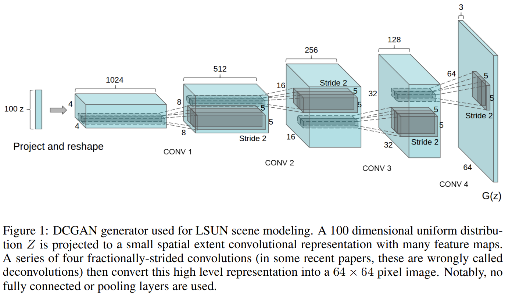
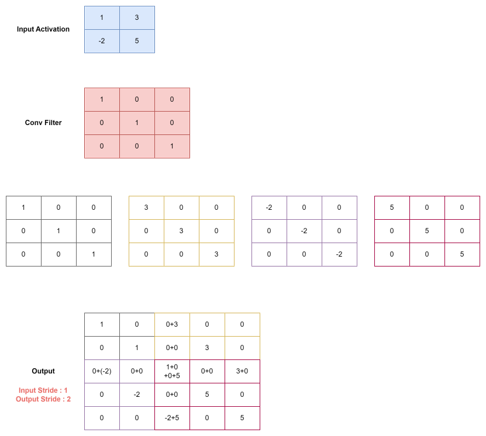
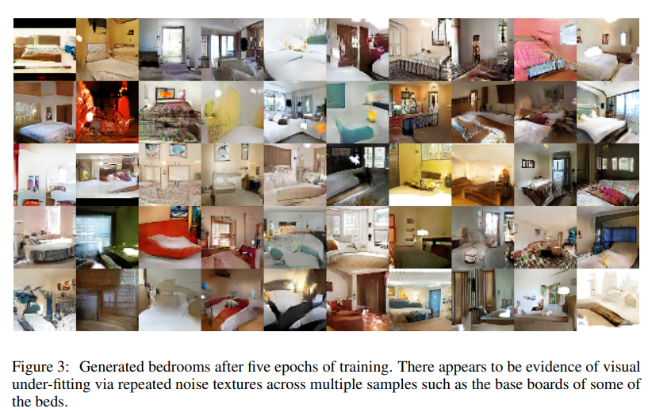
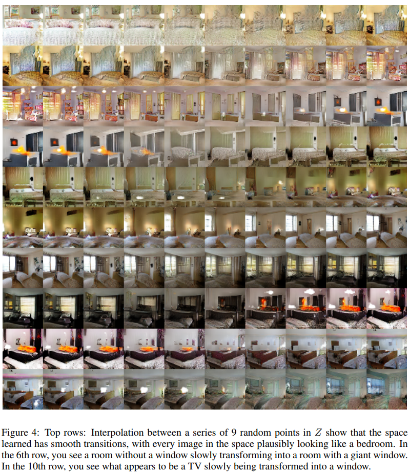
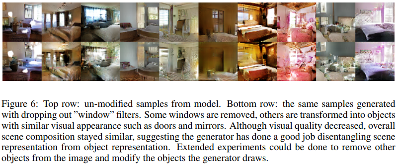
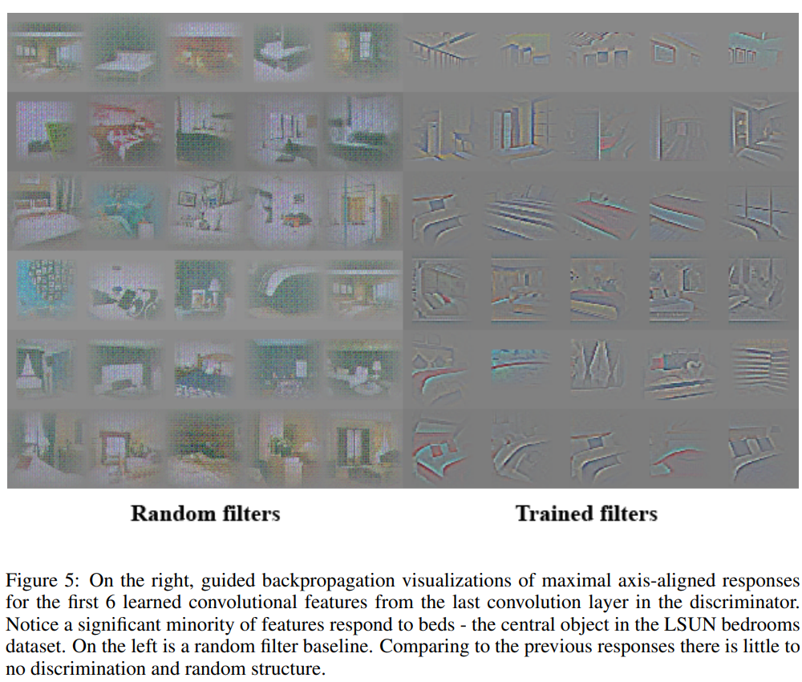
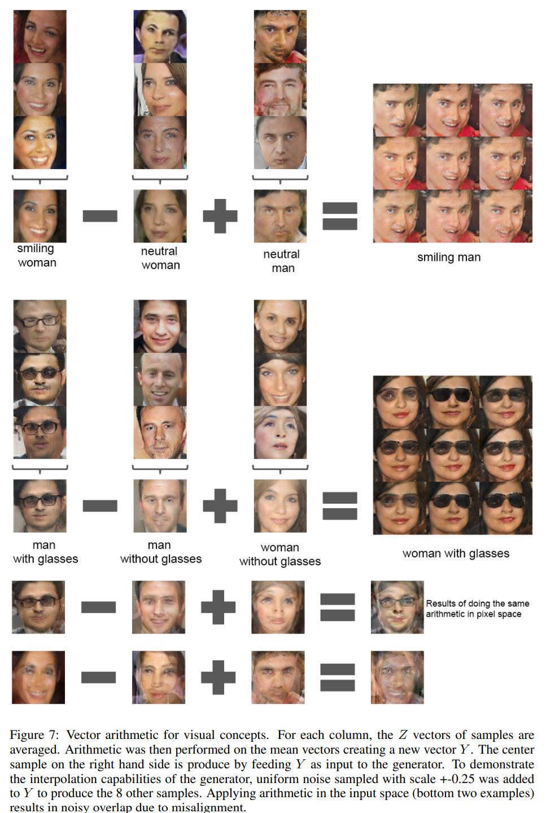

# DCGAN (Deep Convolution GAN) 
[Unsupervised Representation Learning with Deep Convolutional Generative Adversarial Networks (ICLR 2016)](https://arxiv.org/pdf/1511.06434.pdf)  

 
 

- 이 논문이 나왔을 당시 CNN을 활용한 비지도 학습(unsupervised learning) 은 잘 이루어지지 않음
- GAN에 CNN을 적용하여 GAN에 비해 
- 고해상도 이미지 획득 가능해짐 

 
 

## DCGAN 모델 구조 및 학습 
- 이미지 생성에 특화된 Convolution 기반의 generator 모델 구조 제안

 

 

- 100개의 표준분포로부터 sampling을 하고 4x4x1024 으로 project하여 만들고 reshape (4x4x1024)
- 그 이후에 원하는 size의 형태로 만드는 과정에서 "de-convolution" 적용

 
 

### Deconvolution (Upconvolution, Fractionally-strided convolution)
- 이미지에서 유의미한 특징을 추출하는 convoltuion의 반대 과정 수행하는 과정
 

     

    

         

    - 입력 activation map이 2x2로 되어있고 convolution filter가 위의 그림 처럼 3x3으로 구성
    - Conv filter의 패턴을 잘 변형시켜 생성하고자하는 이미지에 적용
    - Input의 각 값을 filter에 scaler 배 한 후 output의 stride 값에 따라 중첩되는 값을 더해주는 형태로 최종 output 결정

 
 

### Generator 
- Fractionally-strided convolution을 사용하여 Upsamplihng Network 구성
- 모든 Pooling layer는 fractional-strided convolution으로 대체
- Generator는 Tanh를 사용하는 출력단을 제외하고는 모든 layer에서의 ReLU 사용
- Batchnorm 사용 

 
 

### Discriminator
- Convolution layer로 Network 구성
- 모든 Pooling layer는 strided convolution으로 대체
- Discriminator의 모든 layer에서 Leaky ReLU 사용
- Batchnorm 사용

 
 

## DCGAN 결과
### 이미지 생성 결과

 

  

- GAN에 비교하면 비교적 고화질의 이미지를 얻을 수 있음

 
 

### Generator 학습 확인
- Generator가 입력 데이터를 외워서 만드는 것이 아닌 실제로 데이터를 학습했다는 것을 확인하기 위해 두 가지 실험 진행
    1. Walking in the latent space
    2. 기억의 망각

 
 

#### Walking in the latent space
- z 벡터가 변할때 z 벡터에 따라 1:1 매칭이 되어 memorization 현상이 일어난다면 급작스러운 변화 발생
- 입력의 두개의 z 벡터를 뽑아 그 사이에서 9번의 보간을 수행해며 G가 z 벡터에 따라 연속적으로 변화하는것을 확인
- Latent vector에서 random point 간의 interpolation 한 결과

     

    

     

    - latent space $z$에서interpolation을 하면 결과 이미지가 자연스럽게 변하 
        - Walking in the latent space라고 표현 
    - 6번째 행을 보면 칭이 없는 곳에 거대한 창이 생기는 것을 확인
    - 10번째 행을 보면 TV였던 곳이 창문으로 변하는 것을 확인

 
 

#### 기억 망각 
- Generator가 올바르게 학습을 했다면 특정 사물을 인식하는 필터를 가지고 있다고 가정
- 특정 물체에 대한 필터의 내용을 지운 다음 이미지를 생성하면 지운 물체가 생성된 이미지에서 사라짐

     

    

     

 
 

### Discriminator 학습 확인 
- 많은 수의 학습 영상을 통해 학습된 discriminator의 특징을 시각화 한 결과

 

     

    

     

 

### Interpretable Vector Math

 

 

- 무작위로 생성된 latent vector $z$로부터 이미지를 생성한 후, 공통된 특징을 가지는 이미지를 모음
- 공통의 특성을 가진 $z$들을 평균내어서 대표 vector 생성
- 다른 특성을 가진 대표 vector들을 연산하여 만든 vector를 generator의 입력으로 넣어 이미지를 생성 
- Latent vector $z$를 개별적으로 연산을 해서는 잘 안되고, 평균을 구해서 연산해야 잘 생성