# Generative Adversarial Networks
[논문](https://arxiv.org/pdf/1406.2661.pdf)

## prerequisite
### 확률 분포의 추정

<br>

<p align=center>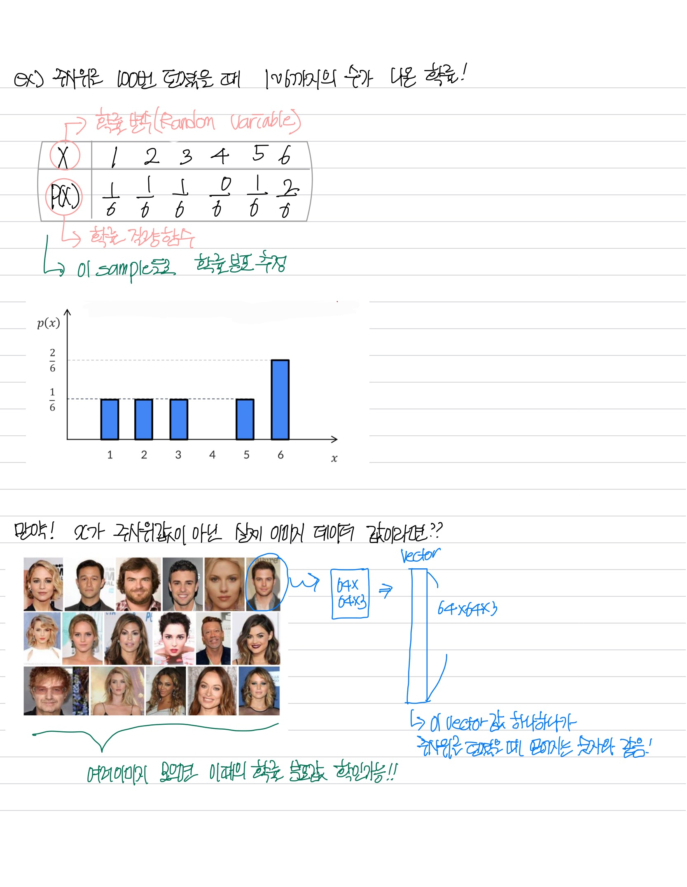</p>

<br>

- $x$가 학습 데이터의 내의 실제 이미지면 이는 (64 x 64 x 3) 과 같은 차원을 걎는 고차원 벡터로 표현 가능

<br>

<hr>


<br>

<p align=center>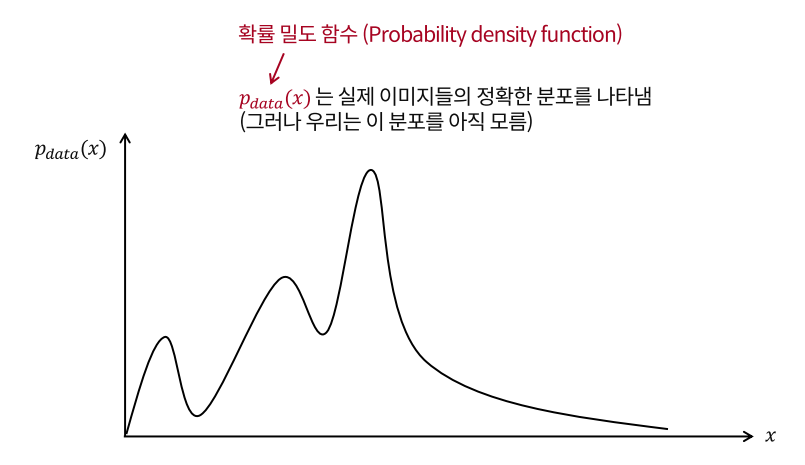</p>

<br>

- $x$ 값들은 하나하나가 각 이미지를 의미
- 우리는 실제 이미지들의 정확한 분포 필요

<br>

- 사람 얼굴 이미지 예시

    <br>

    <p align=left>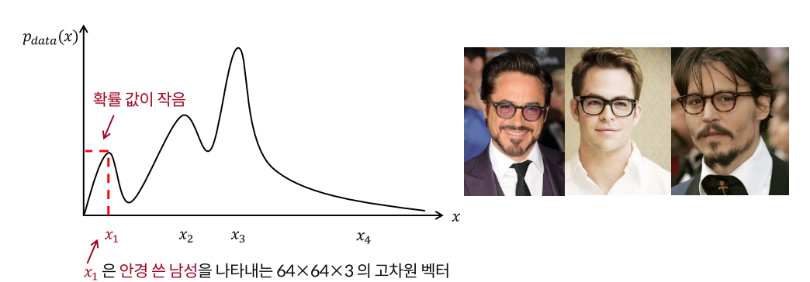</p>

    <br>

    - 이 데이터 셋은 안경을 쓴 남성 이미지들을 몇몇 포함하고 있을 수 있음
    
    <br>
    
    <p align=left>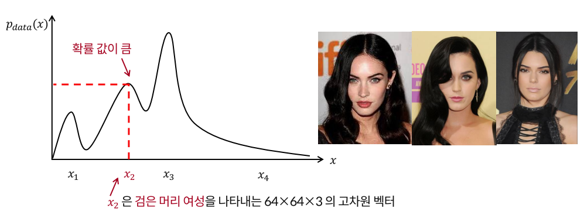</p>

    <br>
    
    - 이 데이터 셋은 검은 머리 여성의 이미지들을 포함할 수 있음

    <br>
    
    <p align=left>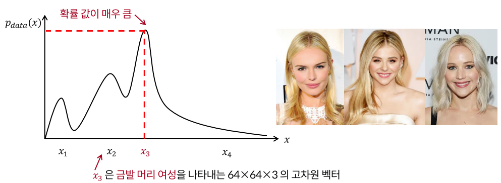</p>

    <br>
    
    - 이 데이터 셋은 금발 머리 여성의 이미지들을 다수 포함할 수 있음

    <br>
    
    <p align=left>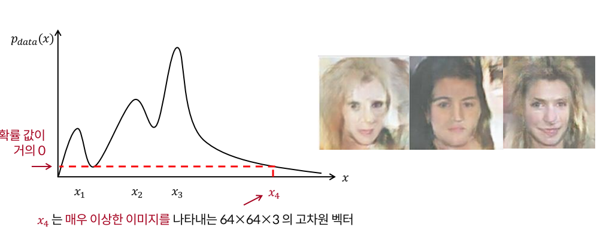</p>

    <br>
    
    - 이 데이터 셋은 이상한 이미지들을 포함하고 있을 수 있음

<br>

<hr>

<br>

- 생성 모델은 $p_{data}(x)$를 잘 근사하는 $p_{model}$ 을 찾는 것이 목표
    - $p_{data}(x)$ : 실제 이미지들의 분포
    - $p_{model}$ : 모델이 생성한 이미지들의 분포

    <br>

    <p align=center>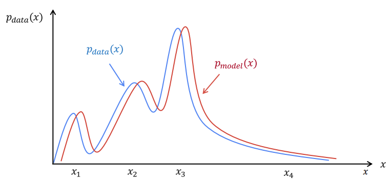</p>

    <br>

    - $p_{model}$를 실제 이미지들의 분포인 $p_{data}$와 비슷하게 추정해야 다양하고 정확한 sample 이미지를 얻을 수 있음
    - 잘못 추정을 하면 실제로 존재하지 않는 이미지나 이상한한 이미지가 나올 확률이 높음
    - 즉, 확률 분포 모델도 선정을 잘 해야함

<br>
<br>

## VAE와의 차이
- 복잡하고 고차원인 학습 분포로부터 데이터를 샘플링하고자 하는데 이를 직접적으로 하는 것은 불가능
    - 확률 분폰의 추정 자체가 고차원 공간에서는 불안정하고 힘듦
- 이를 해결하기 위해 쉽게 데이터를 샘플링하는 것이 간단한 분포를 이용
    - Gaussian distribution 과 같은
- 이 간단한 분포를 학습 분포로 변형 (Transfromation) 하는 방법을 학습

<br>

- VAE
    - 이미지를 학습한 encoder로부터 얻어진 $\mu, \sigma$ 를 통하여 latent vector $z$를 결정
    - latent vector가 decoder를 통과하여 입력으로 넣어준 이미지 데이터를 잘 복원하는 형태로 학습
- GAN
    - 학습 때 부터 표준정규분포에서 랜덤하게 얻은 vector $z$ 를 자유롭게 입력으로 넣어줌
    - $z$ 가 **Generator (Decoder)** 를 통과하여 나온 데이터는 학습 데이터에 한 이미지에 대응된다고 보기 어려움
    - 학습 이미지를 복원하는 방법으로 학습이 불가능
    - 이를 해결하기 위해 **Discriminator** 라는 네트워크를 하나 더 도입하여  생성된 이미지가 데이터 분포 내에 속하는지 판단하도록 함


<br>

## GAN 

<br>

<p align=center>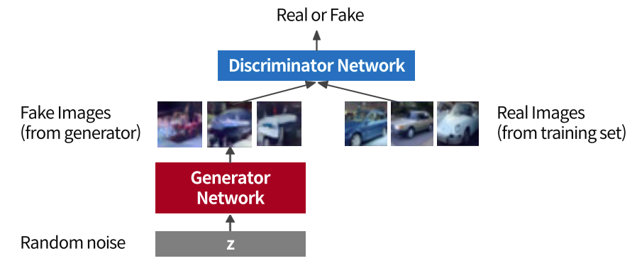</p>

<br>

- **Discriminator**
    - 진짜 이미지와 가짜 이미지를 구분
    - 즉, Generator로 생성된 데이터가 실제 데이터 (학습 데이터) 가 가지고있는 참값의 데이터 분포에 속하고 있는지 판단
- **Generator**
    - 진짜처럼 보이는 이미지를 생성하여 discriminator를 속임
    - 표준 정규분포로 random 하게 얻은 $z$ 값이 입력으로 들어감


<br>

- VAE와 다르게 생성된 이미지 각각의 pixel이 어떤 값이어야 한다는 기준 없기 때문에 loss를 구할 수 없음
- 이 문제를 해결하기 위해서 discriminator 통과하여 간접적으로 generator를 학습
- 학습이 끝나면 generator의 network를 이용하여 새로운 데이터 생성


<br>
<br>

### Discriminator 
Generator가 생성한 이미지와 real 이미지를 분류하는 모델


<br>

<p align=center>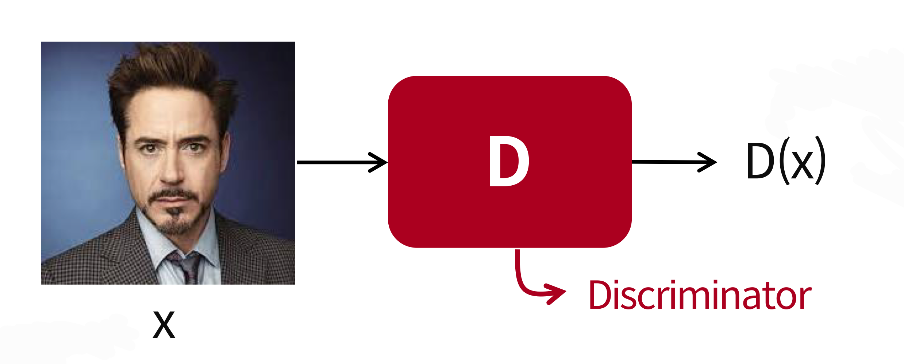</p>

<br>

- 진짜 이미지 $x$ 가 Discriminator의 입력으로 들어가면 이 이미지가 진짜인지 가짜인지 판단하는 binary classification 진행
    - Sigmoid 함수를 통과하여 하나의 scalar 값 생성
- 출력값이 1에 가까울 수록 real image, 0에 가까울수록 generator로 생성된 fake image 일 확률 높음
- 따라서 $D(x)$ 값이 최대한 1과 가까워야 함
    - 이렇게 학습

<br>
<br>

### Generator 
Discriminator를 속이기 위한 진짜와 구분하기 어려운 이미지를 생성하는 모델 

<br>

<p align=center>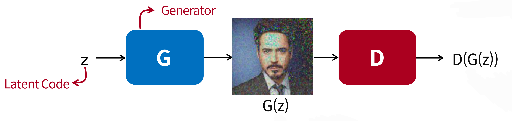</p>

<br>

- 표준 정규 분포에서 sampling 하여 latent vector (code)를 생성하여 generator의 입력으로 사용
- Generator는 이 값으로 입력 이미지와 같은 사이즈의 가짜 이미지 생성
- 생성된 이미지를 Discrimator의 입력으로 사용하여 진짜 이미지인지 가짜 이미지인지 판단
- Generator의 입장에서는 Discriminator가 1에 가깝게, 즉 진짜이미지로 판단하도록 학습

<br>
<br>

## GAN loss Function

<br>

$$
\underset{G}{max}\underset{D}{min} \ L(D, G)=E_{x\sim p_{data}(x)}[-logD(x)]+E_{z\sim p_{z}(z)}[-log(1-D(G(z)))]
$$

<br>

- Discriminator는 데이터를 real 이미지와 생성된 fake 이미지를 잘 분류하는 것이 좋으므로 loss function을 최소화 하는 형태로 학습을 진행
- Generator는 생성된 fake 이미지를 real 이미지로 분류하는 것이 좋으므로 loss function을 최대화 하도록 학습 진행 

<br>
<br>

#### Discriminator

<br>

$$
\underset{D}{min} \ L(D, G)=E_{x\sim p_{data}(x)}[-logD(x)]+E_{z\sim p_{z}(z)}[-log(1-D(G(z)))]
$$

<br>

- Discriminator는 실제 이미지 그릅(1), 생성된 가짜 이미지 그룹(0) 2개의 데이터를 받아 binary cross entropy 
- $x\sim p_{data}(x)$ :  실제 데이터 분포로부터 샘플링 한 $x$
    - 실제 이미지
- $z\sim p_{z}(z)$ : 정규분포로부터 샘플링한 latent vector $z$
    - Generator가 이미지를 생성하기 위한 latent vector

<br>

- $E_{x\sim p_{data}(x)}[-logD(x)]$
    - $D(x)$ 실제 데이터 분포로 부터 샘플링한 데이터가 학습에 사용되었기 때문에 이 값이 최대가 되도록 학습
    - Loss function은  최소화하는 형태로 학습 진행하기 위해 $-$ 를 곱해줌
    - 이런 방식을 negative log likelihood

<br>

- $E_{z\sim p_{z}(z)}[-log(1-D(G(z)))]$
    - $D(G(z))$ 정규분포로부터 샘플링한 데이터를 사용했기 때문에 이 값이 0에 가깝도록 학습
    - Discriminator의 output은 positive class가 될 확률로 해석
    - $1-D(G(z))$ 는 negative class 가 될 확률이기 때문에 이를 최대가 되도록 학습
        - 만약 0.7의 값을 가지고 있다면 negative class가 될 확률은 1-0.7 = 0.3
    - 위와 마찬가지로 최소화 하는 형태로 학습 진행하기 위해 $-$ 를 곱해줌
    - 이런 방식을 negative log likelihood

<br>
<br>

#### Generator

<br>

$$
\underset{G}{max} \ L(D, G)=E_{z\sim p_{z}(z)}[-log(1-D(G(z)))]
$$


<br>

- $z\sim p_{z}(z)$ : 정규분포로부터 샘플링한 latent vector $z$
    - Generator가 이미지를 생성하기 위한 latent vector


<br>
<br>

## GAN 학습
아래 두 과정을 번갈아 가면서 진행 <br>
1. **Gradient descent** on discriminator

    <br>

    $$
    \underset{D}{min} \ L(D, G)=E_{x\sim p_{data}(x)}[-logD(x)]+E_{z\sim p_{z}(z)}[-log(1-D(G(z)))]
    $$

    <br>

2. **Gradient ascent** on generator

    <br>

    $$
    \underset{G}{max} \ L(D, G)=E_{z\sim p_{z}(z)}[-log(1-D(G(z)))]
    $$

    <br>

    - 하지만 실제 상황에서는 이러한 generator 목적 함수가 잘 학습이 되지 않음
    - 처음 generator가 생성한 그림은 매우 이상하기 때문에 discriminator가 분류는 잘함
    - 즉, 학습 초기에 $D(G(x))$ 값이 매우 작게 나옴
    - Generator의 손실함수 그래프에서 $D(G(x))$ 값이 낮으면 gradient가 0에 가깝기 때문에 학습이 잘 진행되지 않음

        <br>

        <p align=center>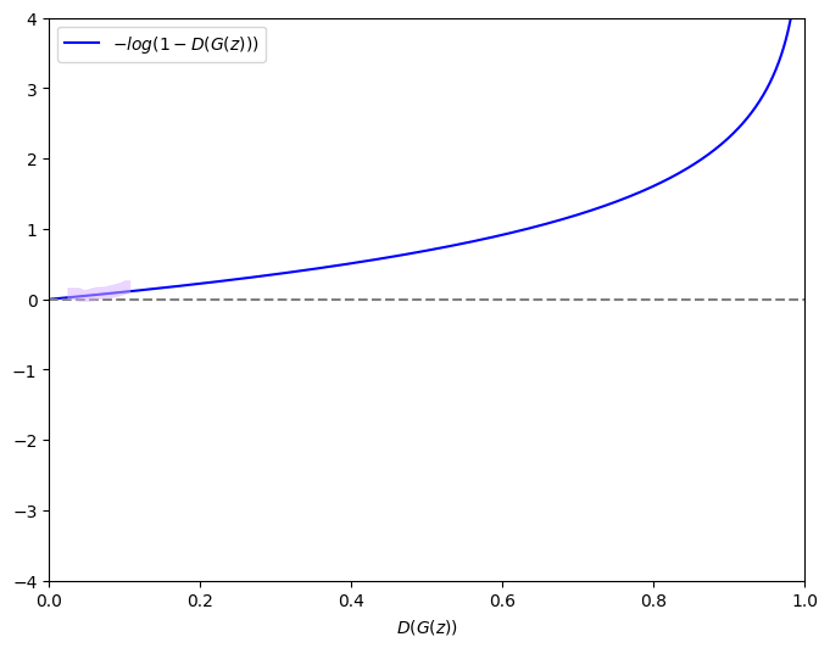</p>

        <br>

    - Generatrooor는 샘플들을 통해 $D(G(z))$의 값이 크게 나오게 학습하려고 하지만 위의 문제로 어려워짐
    - 일반적으로 generator의 학습이 더 오래 걸리고 어려운데 위의 문제 때문에 학습이 더 어려워짐


<br>

<hr>    

<br>


#### Different Loss function
아래 두 과정을 번갈아 가면서 진행 <br>
1. **Gradient descent** on discriminator

    <br>

    $$
    \underset{D}{min} \ L(D, G)=E_{x\sim p_{data}(x)}[-logD(x)]+E_{z\sim p_{z}(z)}[-log(1-D(G(z)))]
    $$

    <br>

2. **Gradient descent** on generator

    <br>

    $$
    \underset{G}{max} \ L(D, G)=E_{z\sim p_{z}(z)}[log(D(G(z)))] \\
    \underset{G}{min} \ L(D, G)=E_{z\sim p_{z}(z)}[-log(D(G(z)))]
    $$

    <br>

    - $1-D(G(x))$ 최소화 하는 방향으로 학습 진행
    - 즉,  $D(G(x))$ 을 최대화 하는 방향으로 학습을 진행
    - Discriminator와 같이 최소화하는 방향으로 학습을 진행하기 위해서 $-$ 곱해줌

        <br>

        <p align=center></p>

        <br>

    - 기존과 동일하게 discriminator를 속이기 위한 목적함수
    - 가짜같이 보이는 샘플들에 대한 gradient가 커짐
    - 그 결과 학습이 잘 됨


<br>
<br>

## GAN algorithm


<br>

<p align=center>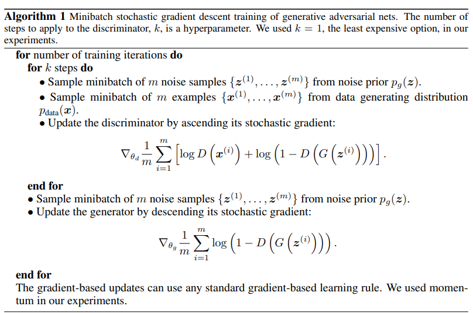</p>

<br>

- k=1 일 때 더 안정적으로 학습된다는 주장도 존재하고, x>1 을 사용하는 경우도 있음
    - 최적이라 판명된 방법론 없음

<br>
<br>


```python
import torch
import torch.nn as nn

D = nn.Sequential(
    nn.Linear(28*28, 128),
    nn.ReLU(),
    nn.Linear(128, 1),
    nn.Sigmoid()
)

G = nn.Sequential(
    nn.Linear(100, 128),
    nn.ReLU(),
    nn.Linear(128, 784),
    nn.Tanh() # -1 ~ 1 사이의 값
)

# 입력 이미지 0~255 값을 -1 ~ 1로 맞춰주어야 함
criterion = nn.BCELoss()

d_optimizer = torch.optim.Adam(D.parameters(), lr=0.01)
g_optimizer = torch.optim.Adam(G.parameters(), lr=0.01)


while True:
    # train D
    ## BCE(h(x), y) = -y * log(h(x)) - (1-y)log(1-h(x))
    loss = criterion(D(x), 1) + criterion(D(G(z)), 0)
    loss.backward()
    d_optimizer.step()

    # train G
    loss = criterion(D(G(z)), 1)
    loss.backward()
    g_optimizer.step()
    
```


<br>
<br>

## GAN을 통한 이미지 생성 예제
