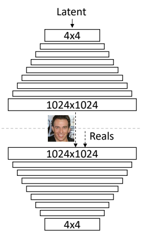
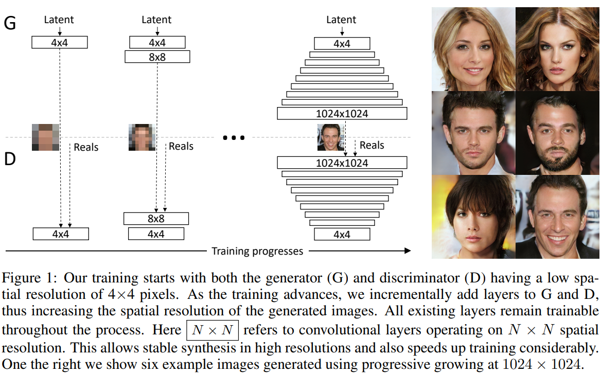
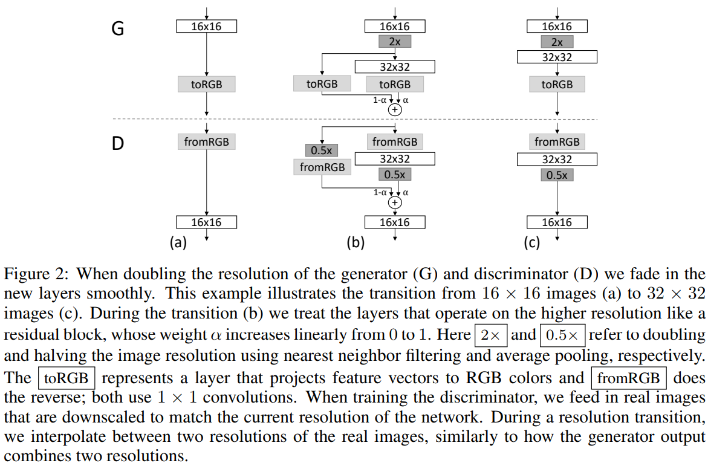
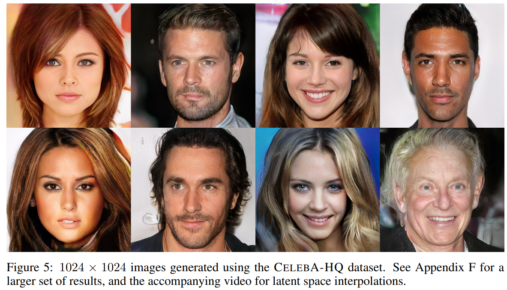

# PGGAN(Progressive Growing of GANs)
[Progressive Growing of GANs for Improved Quality, Stability, and Variation (ICLR 2018)](https://arxiv.org/pdf/1710.10196.pdf) 논문에서 제시한 구조 

 
 

- 1024 x 1024 고해상도 이미지 생성을 가능하게 한 GAN 모델 

 
 

- 고해상도 이미지를 만들기 어려운 이유는 표준 정규분포에서 굉장히 작은 차원의 vector를 입력으로 spatial size를 점점 늘려감

     

    

     

- 많은 layer들이 존재하고 여러 layer들이 학습도기 전에는 좋은 gradient signal을 제공하기 어려움
    - 즉, gradient signal이 존재하고 학습이 어렵기 때문에 고해상도 이미지 만들기 어려움

 
 

## PGGAN 학습 개요
- PGGAN은 이 문제를 해결하기 위해 점직적으로 학습을 진행

     

    

     
    
    - 4x4 이미지를 먼저 생성하는 모델 구성
        - Generator
            - 4x4x1024 생성
            - 1x1 convolution을 이용하여 4x4x3 으로 RGB 이미지 생성 (**ToRGB**)
            - tanh 함수를 통과하여 이미지 값들을 -1 ~ 1 사이의 값으로 변환
        - Discriminator
            - 4x4x3의 이미지를 1x1 convolution을 이용하여 channel수 변경(**FromRGB**)
                - discriminator의 입력 actimation map에 대응할 수 있도록 
    - 학습이 완료된 후 학습된 discriminator, generator의 파라미터를 초기값으로 사용하여 layer를 하나씩 추가하여 generator, discriminator의 2번째 layer의 학습 
    - 위의 방법을 통해 고해상도 이미지 생성이 안정화, 학습 시간 단축 가능

 
 

#### Smooth fade in 
- 위의 방법에서 8x8 layer를 추가할 떄, 단순하게 8x8 크기의 layer를 추가해서는 안됨
    - 4x4는 학습이 완료되어 진짜에 가까운 이미지를 생성
    - 그 이미지를 입력으로 받는 8x8 layer는 아직 학습되지 않은 가중치를 가지고 있기 때문에 잘 학습된 저해상도 레이어에 영향을 미칠 수 있기 때문

 

 

- (a) 16 x 16 layer 학습
- (b) 32 x 32 layer를 추가하는데 16 x 16 이미지를 단순하게 upscaling 한 이미지 A와 그 이미지를 32 x 32 layer에 넣은 이미지를 결합하여 이용
    - 결합할 떄, $\alpha$ 를 이용하여 두 이미지에 가중치를 주어 결합하고 출력
    - $\alpha$ 는 0에서 1까지 점차적으로 증가
- (c) 학습이 충분히 진행되면, 즉 alpha가 1이 되면 16 x 16 이미지를 이용하지 않고 32 x 32 layer의 이미지만으로 학습 진행

## PGGAN 결과

 

 