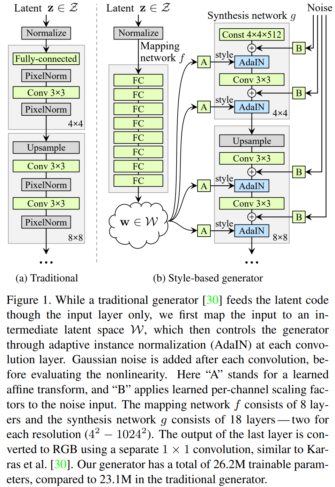
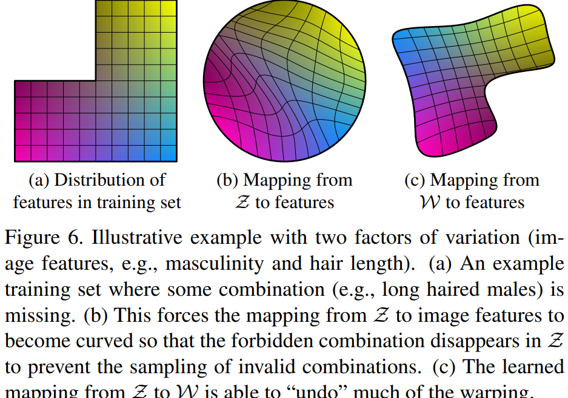
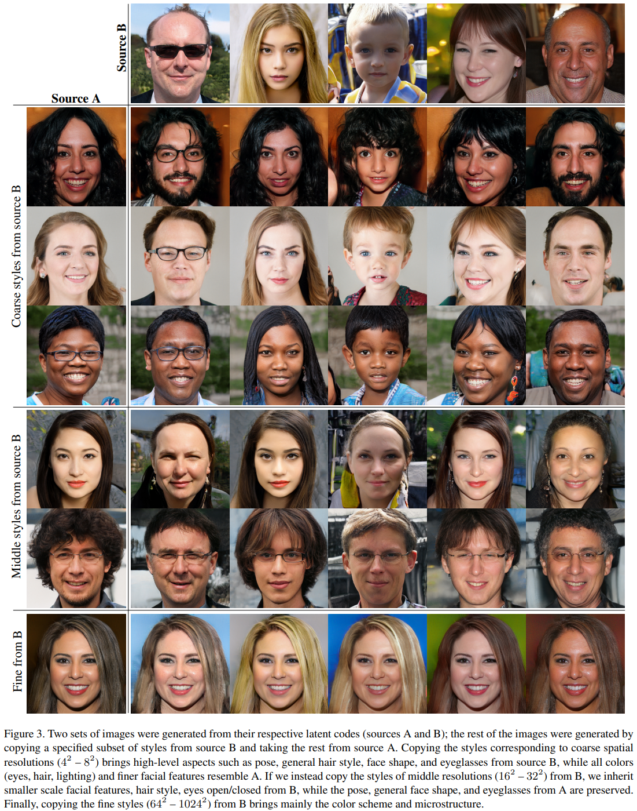

# StyleGAN 
[A Style-Based Generator Architecture for Generative Adversarial Networks (CVPR 2019)](https://arxiv.org/pdf/1812.04948.pdf) 논문에서 제시한 구조 

 
 

- 고화질 이미지 생성을 잘 하는 모델
- PGGAN 구조의 변형시켜 성능 향상
    - PGGAN을 사용하면 고해상도 이미지를 만들 수는 있지만 이미지를 잘 control 할 수 없음
- Disentanglement 특성 향상
    - 각 특성들이 잘 분리되어있는 것을 의미
    - 이 특성이 좋지 않다면 어떤 사람이 안경을 쓸 수 있도록 만들고 싶지만 특성이 얽혀있어 성별도 같이 변하는 등의 문제 발생
- 고해상도 얼굴 데이터셋 (FFHQ) 발표

 

- 즉, 이미지를 생성할 때, 각 이미지가 가지는 style이라는 정보를 잘 control 하여 우리가 원하는 이미지를 잘 생성해 낼 수 있도록 함

 
 

## SytleGAN Network

 

 

### Synthesis Network
- PGCAN은 표준 정규 분포로부터 샘플링된 vector가 convolution 기반 generator 통과하여 원하는 spatial resolution의 이미지 생성
- StyleGAN은 표준 정규 분포에서 샘플링한 값이 아닌 특정한 크기의 입력 activation을 입력으로 사용
    - 입력 activation의 크기는 (4x4x512)
    - 초기 입력을 상수로 대체
- 입력 activation의 값은 StyleGAN을 학습하는 과정을 통해 최적화된 값 도출
    - 즉, 이미지를 생성할 때 항상 동일한 입력 activation 값 사용

 
 

#### Noise 
- 아주 작은 Permutation (노이즈) 추가
- Stochastic Varitaion을 주는 단계
- 평균이 0이고 분산이 매우 작은 분포에서 값을 샘플링
- 다양한 확률적 측면 control 가능 
    -머리카락 배치, 주근깨, 모공 등 
- Noise vector도 별도의 Affine transformation인 **B**를 거침
- 각 feature마다 noise가 적용될 수 있도록 함
- Coase Noise
    - 앞 쪽 layer에 적용되는 noise
    - 큰 크기의 머리 곱슬거림, 배경 등
- Fine Noise
    - 세밀한 머리 곱슬거림 등 

 
 

### Mapping Network
특정 space에서의 vector를 다른 sapce 에서의 vector로 mapping 
- 이전에는 하나의 latent vector를 generator의 입력으로 이미지를 생성
    - 이런 방식이 특징이 잘 분리되지 않는 문제 발생 
- 위 문제를 해결하기 위해 512차원의 $z$ 도메인에서 $w$ 도메인으로 매핑한 것을 사용하자고 주장
- 가우시안 분포에서 샘플링항 $z$ 벡터를 직접 사용하지 않고 $w$를 사용했을 때 성능이 더 좋음

 

 

     

- (a) 실제 학습 이미지 분포라 가정
    - 예를 들어 세로축(남, 여), 가로 축(머리 길이)
    - 왼쪽 위의 데이터가 비어있다는 머리가 긴 남성 데이터가 현재 학습 데이터에 포함되어있지 않다는 것 
    - 존재하지 않는 데이터이기 때문에 네트워크는 상대적으로 이런 정보를 표현하기 어려움
- (b) 가우시안 분포를 따르는 latent vector $z$ 에서 샘플링을 진행하기 때문에 항상 이런 구의 형태의 분포에서 sampling 진행하는 것과 같음
    - 선형으로 되어있지 않음
        - entangle 되어있음 
    - 가우시안 분포에서 샘플링하는 것 자체가 entanglement 을 심화시킬 수 있음 
- (c) Mapping network를 통과하여 만든 vector $w$
    - 이 값을 이용하여 이미지를 생성하면 각각의 특징들에 대해서 interpolation을 할 때 linear space를 따라갈 확률이 높음
        - 즉, 특정 분포를 따라하는 제약이 사라지기 때문에 linear한 space에서 특징들이 분리 될 수 있음

- 즉, $w$ 공간에서 factor들은 더 linear한 특징을 가질 수 있음

 
 

#### AdapIN
- 하나의 이미지가 여러개의 sementic한 스타일 정보로 구성되는 형태로 생성할 수 있도록 architecture 구성
- AdaIN을 이용하면 다른 원하는 데이터로부터 스타일 정보를 가져와 적용할 수 있음 
- Style transfer 네트워크에 사용되어서 좋은 성능을 보였고, 이 아이디어를 차용
- 여러 개의 스타일 정보가 레이어를 지날 때 마다 입혀질 수 있도록 하는 방식으로 다채로운 이미지 만들 수 있도록 함

#### Process
- 가우시안 분포에서 생성된 latent vector $z$가 mapping network를 지나 
- Latent vector $w$ (1 x 512) 가 **A**ffine transformation을 거침
    - N 개의 channel을 가진 tensor에 적용이 되면 2xN 으로 변환
    - 각각의 channel 마다 2개의 스타일 정보를 만들겠다는 의미
        - 평균과 분산 값이라고 생각

 
 

## StyleGAN 결과
### Style 정보가 입력되는 layer에 위치에 따른 결과 

 

 

     

- Image A의 sementic한 스타일을 변화할 건데 image B로부터 그런 스타일을 가져와서 반영

