# VAE (Variational AutoEncoder)
[논문](https://arxiv.org/pdf/1312.6114.pdf)

<br>
<br>

- AutoEncoder는 manifold learning이 목적
    - Encoder를 self supervised learning으로 학습하기 위해 decoder를 이용
    - 주 목적은 encoder
- VAE는 generative model로 데이터 생성이 목적
    - Decoder로 데이터를 만들기 위해 앞단인 encoder가 붙인 것

<br>

## VAE Overview

<p align=center>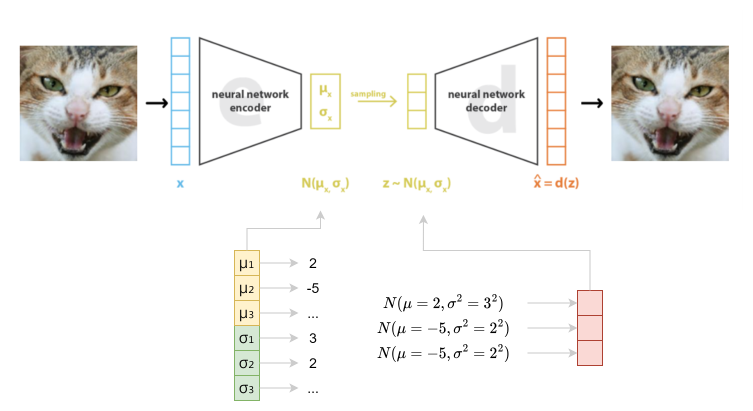</p>

- Autoencoder는 encoder를 통과한 후 바로 latent vector 생성
- VAE는 encoder를 통과하고 latent variable을 생성하기 전에 output으로 2개의 vector 생성
    - 평균, 표준편차
- 평균과 표준편차로 normal distribution을 생성하고 여기서 값을 sampling 하여 latenet variable (latent vector) 만듦

<br>

- 위의 과정으로 진행하면 backpropagation이 불가능
- Sampling 하는 과정에서 **reparameterization trick** 사용
    - 이 과정이 있어야 backpropagation이 가능
    - 미분이 가능하게 바꿔주는 과정

<br>
<br>


### Reparameterization Trick

<br>

<p align=center></p>
<p align=center><a href="https://taeu.github.io/paper/deeplearning-paper-vae/">출처</a></p>

<br>

```math
z^{i,l}\sim N(\mu_{i}, \sigma_{i}^{2}I)
```
<br>

- 단순히 평균과 표준편차만 이용하면 미분을 할 수 없어 backpropagation이 불가능


<br>

```math
\begin{matrix}z^{i,l}=\mu_{i}+\sigma_{i}\odot \epsilon \\\epsilon\sim N(0,I)\end{matrix}
```

<br>

- Normal distribution에서 sampling 한 후 표준편차에 더한 후 평균을 더하면 z에 관한 식이 나오고 위와 같은 결과를 얻게 됨
- z에 대한 식이 만들어지고 이를 미분 가능


<br>
<br>

## VAE 학습
### VAE Loss Function 유도 과정

<br>

<p align=center>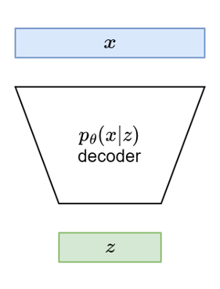</p>

<br>

- 얻고자 하는 것은 $x$ , 즉 $p_{\theta}(x)$
- $x$는 우리가 가지고 있는 데이터를 의미하고 우리는 학습 데이터의 likelihood를 최대화 해야 함
    - 가지고 있는 데이터를 바탕으로 $x$에 대한 확률 분포를 정한다면 가지고 있는 데이터 $x$가 나올 확률이 커지는 distribution을 만들어야 함
- 즉 $p_{\theta}(x)$ 을 maximize 해주어야 함

<br>

<p align=center>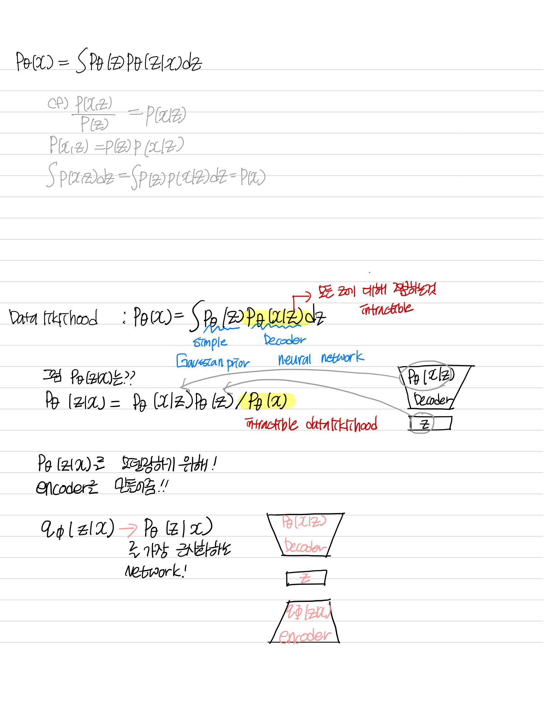</p>

<br>
<br>

$$
\frac{p_{\theta}(x,z)}{p_{\theta}(z)}=p_{\theta}(x|z)dz
$$

$$
\int p_{\theta}(x,z)dz=p_{\theta}(z)
$$

$$
p_{\theta}(x)=\int p_{\theta}(z)p_{\theta}(x|z)dz
$$

- $p_{\theta}(z)$ : Simple gaussian prior
- $p_{\theta}(x|z)$ : Decoder neural network


- $p_{\theta}(z)$ 는 gaussian 분포를 따른다고 가정하므로 알 수 있음
- $p_{\theta}(x|z)$ 는 decoder 이기 때문에 신경망으로 구성할 수 있음
- 하지만 모든 $z$에 대해서 $p_{\theta}(x|z)$ 를 적분하는 것은 어려움

<br>


```math
\begin{matrix}p_{\theta}(z|x)p_{\theta}(x)=p_{\theta}(x|z)p_{\theta}(z)\\p_{\theta}(z|x)=p_{\theta}(x|z)p_{\theta}(z)/p_{\theta}(x)\end{matrix}
```


- 반대의 경우를 생각해보아도 $p_{\theta}(x)$ 가 존재하기 때문에 불가능

<br>

- $p_{\theta}(x|z)$ 모델링 문제를 해결하기 위해서 **encoder**를 구성

<br>

<br>

<p align=center>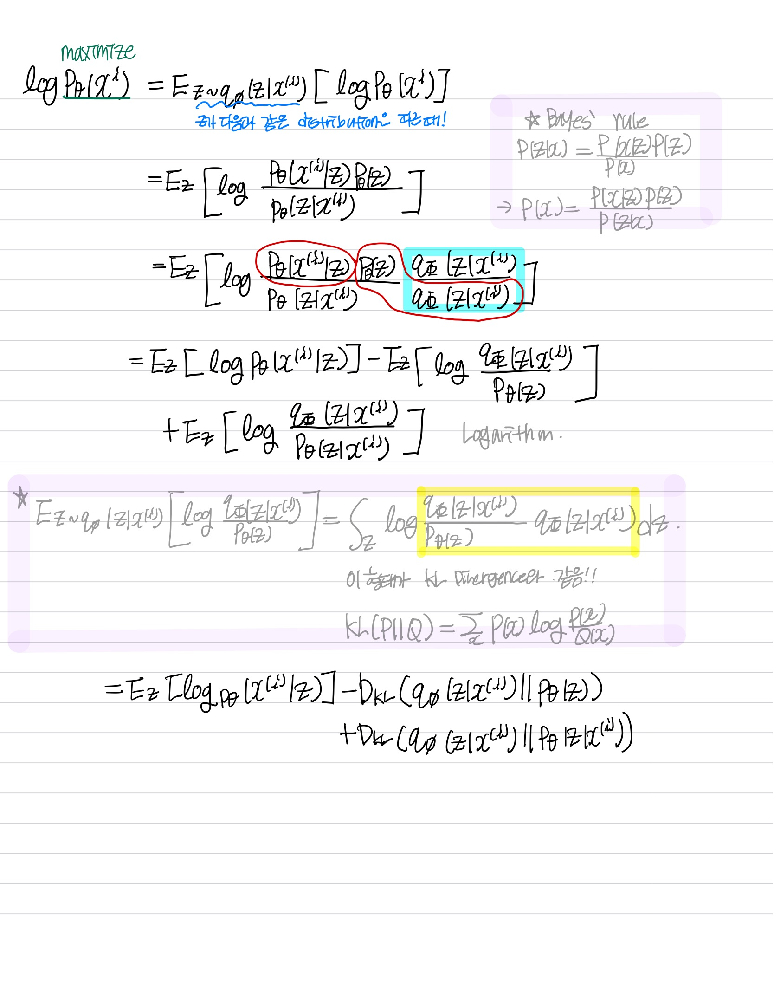</p>

<br>

<p align=center>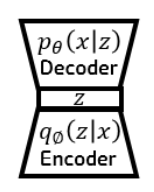</p>

<br>

- $q_{\phi}(z|x)$는 $p_{\theta}(z|x)$ 를 가장 근사화하는 네트워크 

<br>

- Encoder를 덧붙여 학습


$$log{p_{\theta}(x^{i})}=E_{z\sim q_{\phi}(z|x^{i})}[logp_{\theta}(x^{i})]$$

- $p_{\theta}(x)$ 를 최대화 시키는 것이 목적이기 때문에 이 값에 log를 씌움
- 그리고 기댓값의 형태로 나타냄

<br>

```math
\begin{matrix}log{p_{\theta}(x^{(i)})}=E_{z\sim q_{\phi}(z|x^{(i)})}[logp_{\theta}(x^{(i)})] \\= E_{z}[log\frac{p_{\theta}(x^{(i)}|z)p_{\theta}{(z)}}{p_{\theta}(z|x^{(i)})}] \\= E_{z}[log\frac{p_{\theta}(x^{(i)}|z)p_{\theta}{(z)}}{p_{\theta}(z|x^{(i)})} \frac{q_{\phi}(z|x^{(i)})}{q_{\phi}(z|x^{(i)})}] \\=E_{z}[log{p_{\theta}(x^{(i)}|z)}]-E_{z}[log\frac{q_{\phi}(z|x^{(i)})}{p_{\theta}{(z)}})]+E_{z}[log\frac{q_{\phi}(z|x^{(i)})}{p_{\theta}(z|x^{(i)})}]\\\end{matrix}
```


- Bayes' rule과 log 공식을 이용하여 식을 정리

<br>


```math
\begin{matrix}log{p_{\theta}(x^{(i)})}=E_{z}\begin{bmatrix}log{p_{\theta}(x^{(i)}|z)}\end{bmatrix}-D_{kL}\begin{pmatrix}q_{\phi}(z|x^{(i)})||p_{\theta}{(z)}\end{pmatrix}+D_{kL}\begin{pmatrix}q_{\phi}(z|x^{(i)})||p_{\theta}(z|x^{(i)})\end{pmatrix}\end{matrix}
```
<br>

- Expectation 개념을 이용해 적분으로 변환

```math
E_{z\sim q_{\phi}(z|x^{i})}\begin{bmatrix}{log\frac{q_{\phi}(z|x^{(i)})}{p_{\theta}(z)}}\end{bmatrix}=\int_{z}log\frac{q_{\phi}(z|x^{(i)})}{p_{\theta}(z)}q_{\phi}(z|x^{i})dz
```

- KL divergence를 이용하여 변환
    - $KL(P||Q)=\sum_{x} P(x)log\frac{P(x)}{Q(x)}$
    - KL divergence를 이용하면 두 확률분포의 차이(거리)를 계산
- 즉, 변형된 위의 식을 최대화 해야함

<br>

<p align=center>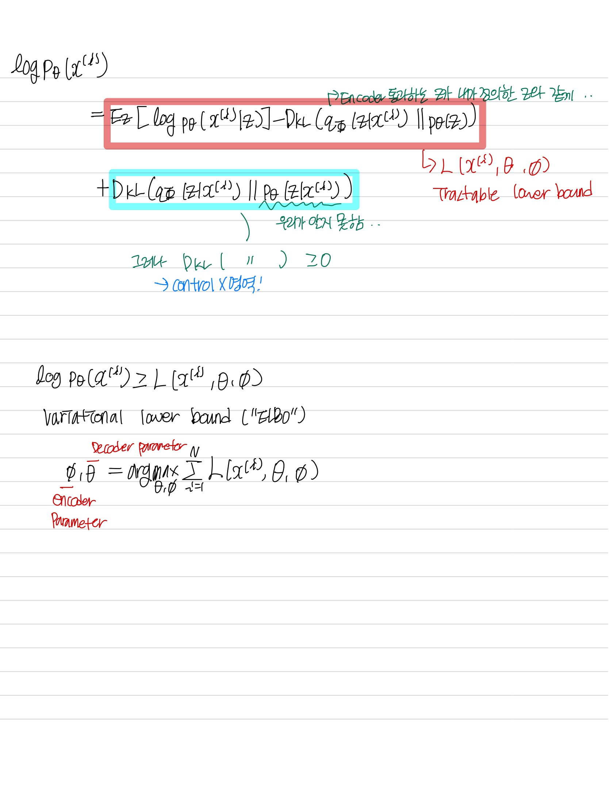</p>

<br>

```math
D_{kL}\begin{pmatrix}q_{\phi}(z|x^{(i)})||p_{\theta}{(z)}\end{pmatrix}
```

- Encoder를 통과한 확률분포가 $z$ 의 확률분포와 같아야 함


<br>

```math
D_{kL}\begin{pmatrix}q_{\phi}(z|x^{(i)})||p_{\theta}(z|x^{(i)})\end{pmatrix}
```

- $ p_{\theta}(z|x^{(i)})$ 는 우리가 알 수 없으므로 계산을 할 수 없음
- 다만 KL divergence는 차이이기 때문에 항상 0 보다 크거나 같음을 알 수 있음

<br>

```math
D_{kL}\begin{pmatrix}q_{\phi}(z|x^{(i)})||p_{\theta}(z|x^{(i)})\end{pmatrix}\geq 0
```
<br>

- Tractable lower bound

```math
L(x^{(i)},\theta,\phi)=E_{z}\begin{bmatrix}log{p_{\theta}(x^{(i)}|z)}\end{bmatrix}-D_{kL}\begin{pmatrix}q_{\phi}(z|x^{(i)})||p_{\theta}{(z)}\end{pmatrix}

```
- **ELBO (Evidence LowerBOund)**
    - Variational lower bound
    - 우리가 최적화 시켜야 하는 부분
        
    <br>

  ```math
  log{p_{\theta}\begin{pmatrix}x^{(i)}\end{pmatrix}}\geq L(x^{(i)},\theta,\phi)
  ```

<br>

```math
\theta^{*}, \phi^{*}=\underset{\theta,\phi}{argmax}\sum_{i=1}^{N}L(x^{(i)},\theta,\phi)

```

<br>


### VAE Loss Function

<br>

<p align=center>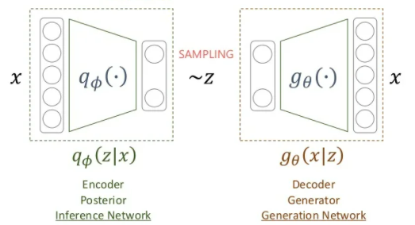</p>

<br>

```math
\underset{\theta,\phi}{argmin}\sum_{i=1}-E_{q_{\phi}(z|x_{i})}\begin{bmatrix}log\begin{pmatrix}{p(x_{i}|g_{\theta}(z)}\end{bmatrix}\end{bmatrix}+D_{kL}\begin{pmatrix}q_{\phi}(z|x_{i})||p{(z)}\end{pmatrix} \end{bmatrix}
```

- 보통은 Loss function 은 minimization 과정을 거치므로 변환

<br>

```math
cf:p\begin{pmatrix}x|g_{\theta}(z)\end{pmatrix}=p_{\theta}(x|z)
```

<br>

 <br>

#### Regularization
- 현재 샘플링 용 함수에 대한 추가 조건
- 샘플링의 용의성/ 생성 데이터에 대한 통제성을 위한 조건을 prior에 부여하고 이와 유사해야 한다는 조건 부여

- Assumption
    1. Encoder를 통과해서 나오면 diagonal covariance를 가지는 multivariate gaussian distribution을 가짐
    
    <br>

    ```math
    q_{\phi}(z|x_{i})\sim N(\mu_{i},\sigma_{i}^{2}I)
    ```

    <br>

    2. 실제 z에 대한 distribution은 normal distribution를 따른다고 가정
    
    <br>

    ```math
    p(z)\sim N(0,I)
    ```
 

    <br>

- 둘을 같게 만들어주어여 함
    - 즉, Encoder를 통과한 값이 항상 normal distribution을 따르도록 만듦 
    - Encoder를 통과하는 확률 분포와 정규분포와의 거리가 최소화되도록 함
    - KL divergence 를 최소화

<br>


- 식을 정리하면 다음과 같은 식으로 정리가 됨

<br>

<p align=center>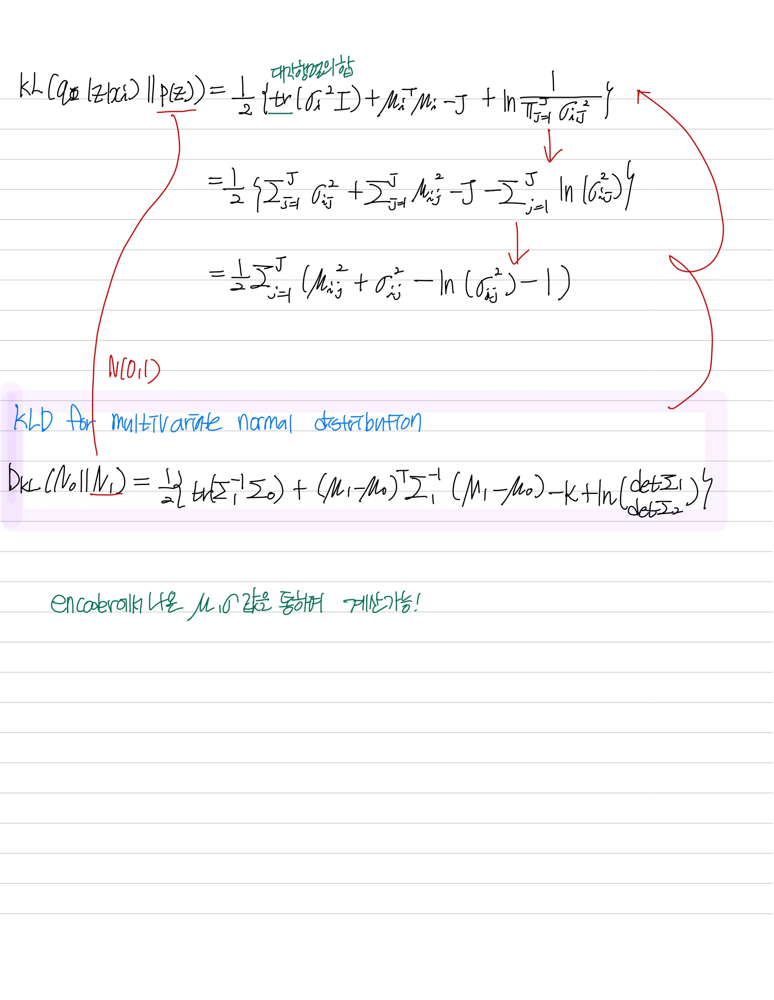</p>

<br>

- $\frac{1}{2}\sum_{j=1}^{J}(\mu_{i,j}^{2}+\sigma_{i,j}^2-ln(\sigma_{i,j}^2)-1)$

<br>
<br>


#### Reconstruction error
- 현재 샘플링용 함수에 대한 negative log likelihood
- Autoencoder 관점에서 $x_{i}$에 대한 복원 오차


<br>

<p align=center>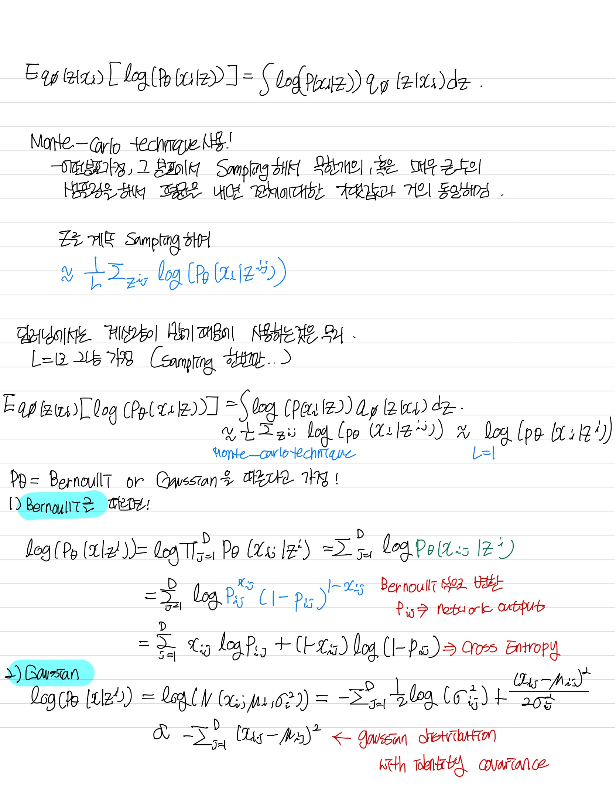</p>

<br>

<br>

```math
\begin{matrix}E_{q_{\phi}(z|x_{i})}\begin{bmatrix}log\begin{pmatrix}{p(x_{i}|z}\end{pmatrix}\end{bmatrix}=\int log\begin{pmatrix}{p(x_{i}|z}\end{pmatrix}q_{\phi}(z|x_{i})dz\\Monte-carlo technique \approx \frac{1}{L}\sum_{z^{i,l}}log\begin{pmatrix}{p(x_{i}|z^{i,l})}\end{pmatrix}\end{matrix}
```

<br>

- Monte-carlo technique 이용
    - 무한개, 혹은 무수히 많은 수의 sampling을 해서 평균을 내면 전체에 대한 기댓값과 거의 동일해짐
    
<br>

<p align=center>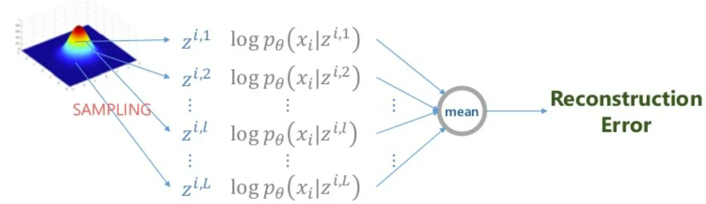</p>

<br>

- Deep learning에서   이 방법을 쓰기에는 계산량이 너무 많음
    - 그래서 L을 1로 가정
    - 또한, sampling을 reparameterization trick 방식으로 진행

$$
\begin{matrix}\frac{1}{L}\sum_{z^{i,l}}log\begin{pmatrix}{p(x_{i}|z^{i,l})}\end{pmatrix}\approx log\begin{pmatrix}{p(x_{i}|z^{i})}\end{pmatrix}\end{matrix}
$$

- Assumption 
    3. $p_{\theta}$ 가 bernoulli distribution나 gaussian distribution를 따른다고 가정
    - Bernoulli로 가정하면 Cross entropy 식으로 바뀜

    ```math
    \begin{matrix}log\begin{pmatrix}{p_{\theta}(x_{i}|z^{i})}\end{pmatrix}=log\prod_{j=1}^{D}p_{\theta}(x_{i,j}|z^{i})\\=\sum_{j=1}^{D}logp_{\theta}(x_{i,j}|z^{i})\\=\sum_{j=1}^{D}logp_{i,j}^{x_i,j}(q-p_{i,j})^{1-x_{i,j}}\\=\sum_{j=1}^{D}x_{i,j}logp_{i,j}+(1-x_{i,j})log(1-p_{i,j})\end{matrix}
    ```

    - Gaussian으로 가정하면 MSE로 바뀜


<br>

<br>

## Latent variable 차원 특징

<br>

<p align=center>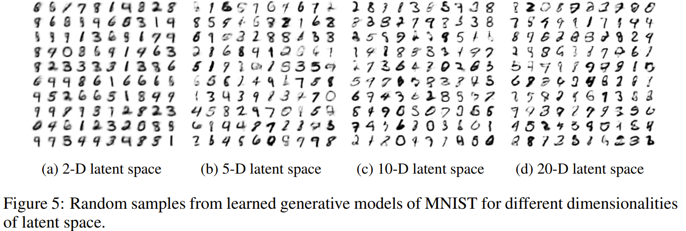</p>
<p align=center><a href="https://arxiv.org/pdf/1312.6114.pdf">출처</a></p>
<br>

- 너무 작은 차원으로 축소를 한 것보다 큰 차원으로 축소한 것이 의미는 있음 복원은 잘되긴 함

<br>

### VAE 특징
- Decoder가 최소한 학습 데이터는 생성해 낼 수 있음
    - 생성된 데이터가 학습 데이터와 유사
- Encoder가 최소한 학습 데이터는 잘 latent vector로 표현
    - 차원 축소를 위해 많이 사용됨 
- 종종 흐릿한 이미지 생성
    - L2 loss의 한계로 인해

<br>
