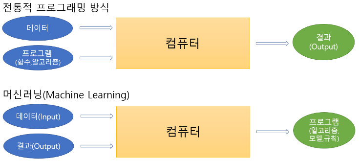
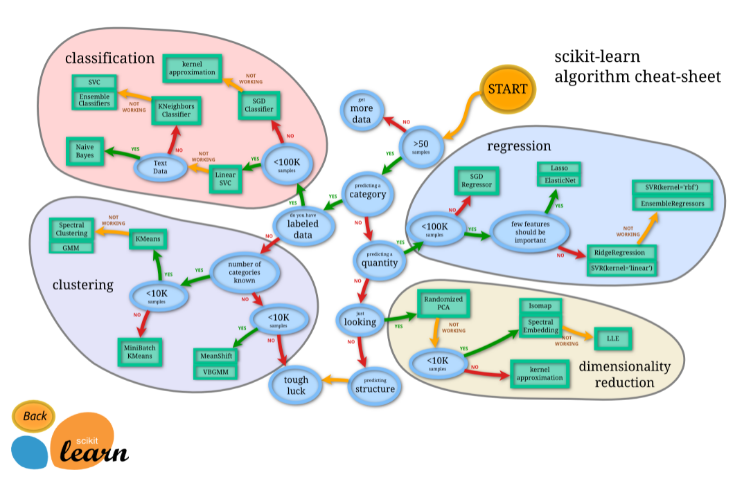
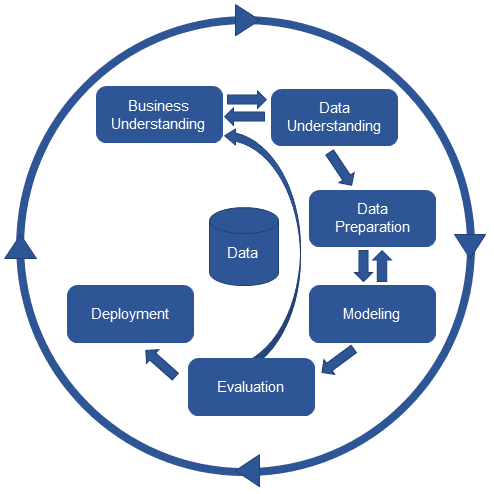
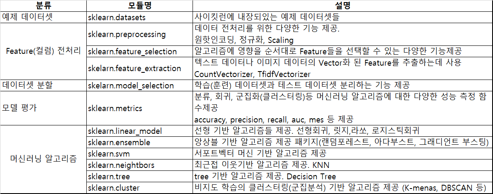

# 인공지능 개요

## 인공지능 (AI - Artificial Intelligence) 
### 정의
- 다트머스대학 수학과 교수인 존 매카시(John McCarthy)가 "지능이 있는 기계를 만들기 위한 과학과 공학" 이란 논문에서 처음으로 제안(1955년)
- 인간의 지능(인지, 추론, 학습 등)을 컴퓨터나 시스템 등으로 만든 것 또는, 만들 수 있는 방법론이나 실현 가능성 등을 연구하는 기술 또는 과학

- 지능: 어떤 문제를 해결하기 위한 지적 활동 능력
- 인공지능
    - 기계가 사람의 지능을 모방하게 하는 기술
    - 규칙기반, 데이터 학습 기반
        - 규칙기반
            - if/else 등 알고리즘으로 구현
            - 규칙이 변경이 될 때 알고리즘을 전체적으로 수정해야하는 문제 발생
            - 사람에게 영향을 받기 때문에 문제가 발생 (잘못알거나 정확히 알지 못하는 경우)
        
        - 데이터 학습 기반
            - 규칙 기반의 문제를 해결 할 수 있음
            - 존재하는 데이터를 이용

## Strong AI vs Weak AI
- **Artificial General Intelligence (AGI)**
    - 인간이 할 수 있는 모든 지적인 업무를 해낼 수 있는 (가상적인) 기계의 지능 - - 인공지능 연구의 주요 목표
    - 하나의 인공지능 시스템이 여러가지의 일을 수행해야함
        - 법률에 대한 인공지능, 분류에 대한 인공지능 이런 의미가 아니라 하나의 인공지능이 여러 역할을 가능하게 해주는 것

- **Strong AI (강 인공지능)**
    - AGI 성능을 가지는 인공지능
    - 인공지능 연구가 목표하는 방향
    
- **Weak AI (약 인공지능)**
    - 기존에 인간은 쉽게 해결할 수 있었지만 컴퓨터로 처리하기 어려웠던 일을 컴퓨터가 수행할 수 있도록 하는 것이 목적
    - 지각(知覺)을 가지고 있지 않으며 특정한 업무를 처리하는데 집중한다.
    - 우리가 해결해야하는 문제가 domain, 즉 우리가 구현해야하는 문제 영역

### 인공지능의 발전을 가능하게 만든 요소
- 데이터의 급격한 증가
    - 디지털사진, 동영상, IoT 기기, SNS 컨텐츠 등으로 인해 데이터가 폭발적으로 증가 
    - 전 세계 디지털데이터의 90%가 최근 몇년 동안 생성 
- 알고리즘의 발전
    - 급증한 데이터를 이용한 기존 알고리즘 개선 및 새로운 알고리즘들이 개발됨.
- 컴퓨터 하드웨어의 발전
    - CPU와 GPU의 발전
    - 특히 GPU의 발전은 딥러닝의 발전으로 이어짐
    - TPU(Tensor Processing Unit): 구글에서 개발한 딥러닝 전용 칩셋

## 머신러닝과 딥러닝

  
  
  출처: [nvida 블로그](https://blogs.nvidia.co.kr/2016/08/03/difference_ai_learning_machinelearning/)

### 머신러닝(Machine Learning)
> - 데이터 학습 기반의 인공 지능 분야
> - 기계에게 어떻게 동작할지 일일이 코드로 명시하지 않고 데이터를 이용해 학습할 수 있도록 하는 알고리즘과 기술을 개발하는 인공지능의 한분야

### 딥러닝 (Deep Learning)
> - 인공신경망 알고리즘을 기반으로 하는 머신러닝의 한 분야 
> - 대용량 데이터 학습에 뛰어난 성능을 나타낸다. 

  

## 머신러닝 모델(알고리즘, 모형)
- 모델이란 데이터의 패턴을 수식화 한 함수
    - 처음에는 방대한 데이터의 패턴을 알 수 없기 때문에 "이 데이터는 이런 패턴을 가졌을 것"이라고 가정한 함수를 정한뒤 데이터를 학습시켜 데이터 패턴을 잘 표현하는 함수를 만듦
    - 데이터에 맞추는 것을 fitting 한다고 함

### 모델을 만드는 과정
1. 모델을 정하여 수식화 
2. 모델을 데이터를 이용해 학습(Train) 
    - 모델을 데이터의 패턴에 맞춘다. (fit)
3. 학습된 모델이 얼마나 데이터 패턴을 잘 표현하는지 평가한다.(Test)

##### 모델을 만드는 과정 예시 - 이진분류
- 이진분류
    -   결과의 카테고리 A, B 둘 중 하나  
        - 종양이 악성인지 양성인지 
        - 의료데이터를 기반으로 환자인지 아닌지 
        - 메일 데이터를 기반으로 스팸인지 아닌지 
    
> 이진 분류 알고리즘은 존재하나 특정 분야나 데이터에 특정 된 알고리즘은 아님 
> C라는 이진 분류 알고리즘으로 스팸메일을 분류하고 싶음 
> 그런데 C라는 알고리즘은 범용적인 이진분류 알고리즘 
> 그 말은 성능이 떨어질 수 있다는 의미! 

> 즉, 머신러닝이라는 것은 범용적인 C라는 알고리즘을 사용하는데 완성된 알고리즘은 아님!  
> 실제 스팸메일분류라는 서비스를 하기 전에 C라는 알고리즘을 스팸 분류하는 알고리즘을 만들어줘야함! 

> 어떻게 스팸분류알고리즘으로 완성하는지? 
>   - 1 > 이메일 데이터 수집( ex > 스팸메일 1000개, 정상메일 1000개)
>   - 2 > 2000개의 데이터를 C라고 하는 이진 분류 알고리즘에 넣어줌(학습시킴)
>   - 3 > 알고리즘이 학습을 통해 스팸메일이 가지고 있는 특징, 일반메일이 가지고 있는 특징을 찾아
>   - 4 > 스팸메일을 분류하는 알고리즘을 완성
   
   
- 이진분류 여러가지 알고리즘이 존재! (A,B,C,D, ...)  
     - 데이터에 따라 성능 차이가 존재함 
     - 그것 중에 가장 만족스러운 결과가 나오는 알고리즘을 찾아 사용 
          
- 데이터를 학습한다라는 것은 데이터에서 패턴을 찾는 것  
    - 스팸메일의 패턴, 정상메일의 패턴  

## 데이터 Feature, Label
### Feature
- 예측하거나 분류해야 하는 데이터의 특성, 속성 값
- 입력 변수(Input) 또는 독립변수
- 일반적으로 X로 표현

### Label
- 예측하거나 분류해야 하는 값
- 출력 변수(Output) 또는 종속변수
- 일반적으로 y로 표현

 
 

# 머신러닝 알고리즘 분류

## 지도학습(Supervised Learning)
- 모델에게 데이터의 특징(Feature)와 정답(Label)을 알려주며 학습
- 대부분의 머신러닝은 지도학습

- ### 분류(Classification):
    - 두개 이상의 클래스(범주)에서 선택을 묻는 지도 학습방법
        - 이진 분류 : 분류 대상 클래스가 2개
        - 다중 분류 : 분류 대상 클래스가 여러개
   
     
   
    - 의사결정트리(Decision Tree)
    - 로지스틱 회귀(Logistic Regression)
    - K-최근접 이웃(K-Nearest Neighbors, KNN)
    - 나이브 베이즈(Naive Bayes)
    - 서포트 벡터 머신(Support Vector Machine, SVM)
    - 랜덤 포레스트(Random Forest)
    - 신경망(Neural Network)

 

- ### 회귀(Regression):
    - 숫자(연속된값)를 예측 하는 지도학습
        - 예측해야하는 대상이 무한대!
   
     
   
    - 의사결정트리(Decision Tree)
    - 선형 회귀(Linear Regression)
    - 릿지 회귀(Rige Regression)
    - 라쏘 회귀(Lasso Regression)
    - 엘라스틱 넷(Elastic Net)
    - K-최근접 이웃(K-Nearest Neighbors, KNN)
    - 나이브 베이즈(Naive Bayes)
    - 서포트 벡터 머신(Support Vector Machine, SVM)
    - 랜덤 포레스트(Random Forest)
    - 신경망(Neural Network)
    
 
 
- 분류는 정확도가 중요하지만 회귀는 정확도가 중요하지 않음
- 회귀는 오차가 어느정도인지가 중요하고 그 오차를 줄이는 것이 중요!

 
 

### 비지도학습 (Unsupervised Learning)
- 정답이 없이 데이터의 특징만 학습하여 데이터간의 관계를 찾는 학습방법
- 보통 중간 단계, 전처리 단계에서 쓰이는 경우가 많음

 

- **군집(Clustering)**
    - 비슷한 유형의 데이터 그룹을 찾음 
        - 주로 데이터 경향성을 파악하는 비지도 학습
    
     
    
    - K-평균 클러스터링(K-Means Clustering)
    - 평균점 이동 클러스터링(Mean-Shift Clustering) 
    - DBSCAN(DensityBased Spatial Clustering of Applications with Noise)

 

- **차원축소(Dimensionality Reduction)**
    - 예측에 영향을 최대한 주지 않으면서 변수(Feature)를 축소
    - 고차원 데이터를 저차원의 데이터로 변환하는 비지도 학습
    
     
    
    - 주성분 분석(Principal Component Analysis, PCA)
    
 

- ### 강화학습
    - 학습하는 시스템이 행동을 실행하고 그 결과에 따른 보상이나 벌점을 받는 방식으로 학습 
    - 학습이 계속되면서 가장 큰 보상을 얻기 위한 최상의 전략을 스스로 학습

     

    

        
    

    출처: [sckit-lean docs](https://scikit-learn.org/stable/tutorial/machine_learning_map/index.html)
    

 
 

# 머신러닝 개발 절차 (Machine Learning Process)
 

 

> 1. Business Understanding
>    - 머신러닝 개발을 통해 얻고자 하는 것 파악.
> 2. Data Understanding
>     - 데이터 수집
>     - 탐색을 통해 데이터 파악
> 3. Data Preparation  
>     - 데이터 전처리
> 4. Modeling
>     - 머신러닝 모델 선정
>     - 모델 학습
> 5. Evaluation
>     - 모델 평가
>     - 평가 결과에 따라 위 프로세스 반복
> 6. Deployment
>    - 평가 결과가 좋으면 실제 업무에 적용

 

- 수학적 모델이기 때문에 문자열 데이터를 다루지는 못하여 수학적 데이터로 변형 필요

 
 
 

# 파이썬 머신러닝,딥러닝 패키지
- ## [Scikit-learn](https://scikit-learn.org/stable)
    - 딥러닝을 제외한 머신러닝 주요 알고리즘 제공

    - 특징
        1. 파이썬 기반 다른 머신러닝 라이브러리가 사이킷런 스타일의 API를 지향할 정도로 쉽고 가장 파이썬스런 API 제공
        2. 머신러닝 관련 다양한 알고리즘을 제공하며 모든 알고리즘에 일관성있는 사용법을 제공
    
    - 설치
        - `conda install scikit-learn`
        - `pip install scikit-learn`

        - 아나콘다는 내장되어 있음

     

    - **Estimator와 Transformer**
        - Estimator (추정기)
            - 데이터를 학습하고 예측하는 알고리즘(모델)들을 구현한 클래스들

             

            - fit() 
                - 데이터를 학습하는 메소드
            - predict()
                - 예측을 하는 메소드

             

        - Transformer (변환기)
            - 데이터 전처리를 하는 클래스들. 
            - 데이터 셋의 값의 형태를 변환
            - 결측치처리, 문자열 데이터 숫자 변환 등
            
             
            
            - fit()
                - 어떻게 변환할지 학습하는 메소드
            - transform()
                - 변환을 처리 하는 메소드
            - fit_transform()
                - fit()과 transform()을 같이 처리하는 메소드

                 

    - **Scikit-learn 주요 모듈**
        
         

        

         
         

    - **scikit-learn 개발 패턴**

    1.  데이터 분할
        - 데이터셋을 모델을 학습시키기 위한 데이터셋(훈련 데이터)와 모델의 성능을 테스트하기 위한 데이터셋(테스트 데이터)으로 분리

     

    2.  모델 생성
        - 예측 목적에 맞는 모델생성
        - 하이퍼파라미터 설정

     
    
    3. 모델 학습
        - fit
        - 훈련데이터로 모델 학습 또는 특징 추출

     

    4. 예측
        - predict / predict_prob (예측),  transform (변환)
        - 테스트 데이터셋 예측 또는 변환

     

    5. 평가
        - 모델 성능 평가
        - 정확도, AUC, R2, MSE 등 목적에 맞는 적절한 평가 함수를 이용해 결과 확인

 

- ## Tensorflow
    - 구글 브레인 팀이 개발
    - 머신러닝 및 딥러닝 위한 오픈소스 라이브러리
    - Tensorflow 안에 sub로 keras 들어있음

 

- ## Keras
    - 딥러닝 모델을 쉽게 만들 수 있도록 다양한 딥러닝 플랫폼 위에서 실행되는 고수준 딥러닝 패키지
    - Tensorflow 2.0 부터 keras를 포함

 

- ## Pytorch
    - 토치(Torch) 및 카페2(Caffe2) 프레임워크를 기반으로한 페이스북에서 만든 딥러닝 프레임워크

