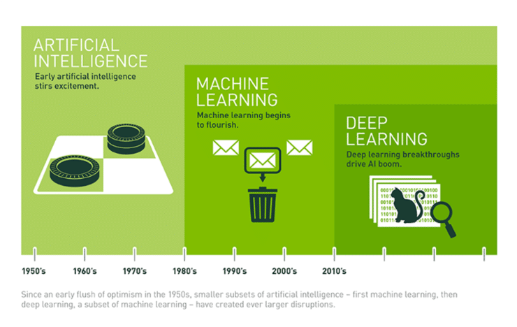

# 인공지능 개요

## 인공지능 (AI - Artificial Intelligence) 
### 정의
- 다트머스대학 수학과 교수인 존 매카시(John McCarthy)가 "지능이 있는 기계를 만들기 위한 과학과 공학" 이란 논문에서 처음으로 제안(1955년)
- 인간의 지능(인지, 추론, 학습 등)을 컴퓨터나 시스템 등으로 만든 것 또는, 만들 수 있는 방법론이나 실현 가능성 등을 연구하는 기술 또는 과학

- 지능: 어떤 문제를 해결하기 위한 지적 활동 능력
- 인공지능
    - 기계가 사람의 지능을 모방하게 하는 기술
    - 규칙기반, 데이터 학습 기반
        - 규칙기반
            - if/else 등 알고리즘으로 구현
            - 규칙이 변경이 될 때 알고리즘을 전체적으로 수정해야하는 문제 발생
            - 사람에게 영향을 받기 때문에 문제가 발생 (잘못알거나 정확히 알지 못하는 경우)
        
        - 데이터 학습 기반
            - 규칙 기반의 문제를 해결 할 수 있음
            - 존재하는 데이터를 이용

## Strong AI vs Weak AI
- **Artificial General Intelligence (AGI)**
    - 인간이 할 수 있는 모든 지적인 업무를 해낼 수 있는 (가상적인) 기계의 지능 - - 인공지능 연구의 주요 목표
    - 하나의 인공지능 시스템이 여러가지의 일을 수행해야함
        - 법률에 대한 인공지능, 분류에 대한 인공지능 이런 의미가 아니라 하나의 인공지능이 여러 역할을 가능하게 해주는 것

- **Strong AI (강 인공지능)**
    - AGI 성능을 가지는 인공지능
    - 인공지능 연구가 목표하는 방향
    
- **Weak AI (약 인공지능)**
    - 기존에 인간은 쉽게 해결할 수 있었지만 컴퓨터로 처리하기 어려웠던 일을 컴퓨터가 수행할 수 있도록 하는 것이 목적
    - 지각(知覺)을 가지고 있지 않으며 특정한 업무를 처리하는데 집중한다.
    - 우리가 해결해야하는 문제가 domain, 즉 우리가 구현해야하는 문제 영역

### 인공지능의 발전을 가능하게 만든 요소
- 데이터의 급격한 증가
    - 디지털사진, 동영상, IoT 기기, SNS 컨텐츠 등으로 인해 데이터가 폭발적으로 증가 
    - 전 세계 디지털데이터의 90%가 최근 몇년 동안 생성 
- 알고리즘의 발전
    - 급증한 데이터를 이용한 기존 알고리즘 개선 및 새로운 알고리즘들이 개발됨.
- 컴퓨터 하드웨어의 발전
    - CPU와 GPU의 발전
    - 특히 GPU의 발전은 딥러닝의 발전으로 이어짐
    - TPU(Tensor Processing Unit): 구글에서 개발한 딥러닝 전용 칩셋

## 머신러닝과 딥러닝

  
  
  출처: [nvida 블로그](https://blogs.nvidia.co.kr/2016/08/03/difference_ai_learning_machinelearning/)

### 머신러닝(Machine Learning)
> - 데이터 학습 기반의 인공 지능 분야
> - 기계에게 어떻게 동작할지 일일이 코드로 명시하지 않고 데이터를 이용해 학습할 수 있도록 하는 알고리즘과 기술을 개발하는 인공지능의 한분야

### 딥러닝 (Deep Learning)
> - 인공신경망 알고리즘을 기반으로 하는 머신러닝의 한 분야 
> - 대용량 데이터 학습에 뛰어난 성능을 나타낸다. 

  

## 머신러닝 모델(알고리즘, 모형)
- 모델이란 데이터의 패턴을 수식화 한 함수
    - 처음에는 방대한 데이터의 패턴을 알 수 없기 때문에 "이 데이터는 이런 패턴을 가졌을 것"이라고 가정한 함수를 정한뒤 데이터를 학습시켜 데이터 패턴을 잘 표현하는 함수를 만듦
    - 데이터에 맞추는 것을 fitting 한다고 함

### 모델을 만드는 과정
1. 모델을 정하여 수식화 
2. 모델을 데이터를 이용해 학습(Train) 
    - 모델을 데이터의 패턴에 맞춘다. (fit)
3. 학습된 모델이 얼마나 데이터 패턴을 잘 표현하는지 평가한다.(Test)

##### 모델을 만드는 과정 예시 - 이진분류

- 이진분류
    -   결과의 카테고리 A, B 둘 중 하나  
        - 종양이 악성인지 양성인지 
        - 의료데이터를 기반으로 환자인지 아닌지 
        - 메일 데이터를 기반으로 스팸인지 아닌지 
    
> 이진 분류 알고리즘은 존재하나 특정 분야나 데이터에 특정 된 알고리즘은 아님 
> C라는 이진 분류 알고리즘으로 스팸메일을 분류하고 싶음 
> 그런데 C라는 알고리즘은 범용적인 이진분류 알고리즘 
> 그 말은 성능이 떨어질 수 있다는 의미! 

> 즉, 머신러닝이라는 것은 범용적인 C라는 알고리즘을 사용하는데 완성된 알고리즘은 아님!  
> 실제 스팸메일분류라는 서비스를 하기 전에 C라는 알고리즘을 스팸 분류하는 알고리즘을 만들어줘야함! 

> 어떻게 스팸분류알고리즘으로 완성하는지? 
>   - 1 > 이메일 데이터 수집( ex > 스팸메일 1000개, 정상메일 1000개)
>   - 2 > 2000개의 데이터를 C라고 하는 이진 분류 알고리즘에 넣어줌(학습시킴)
>   - 3 > 알고리즘이 학습을 통해 스팸메일이 가지고 있는 특징, 일반메일이 가지고 있는 특징을 찾아
>   - 4 > 스팸메일을 분류하는 알고리즘을 완성
   
   
   
- 이진분류 여러가지 알고리즘이 존재! (A,B,C,D, ...)  
     - 데이터에 따라 성능 차이가 존재함 
     - 그것 중에 가장 만족스러운 결과가 나오는 알고리즘을 찾아 사용 
     
     
     
- 데이터를 학습한다라는 것은 데이터에서 패턴을 찾는 것  
    - 스팸메일의 패턴, 정상메일의 패턴  
