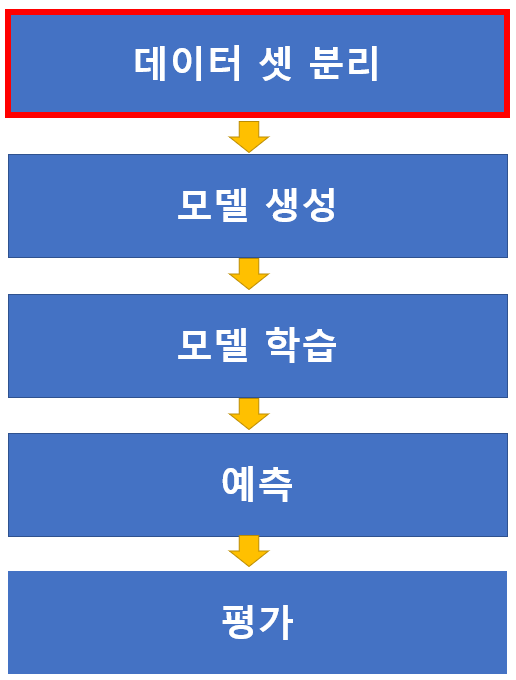
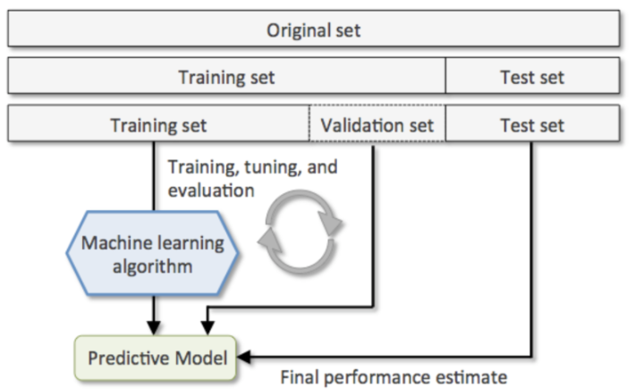
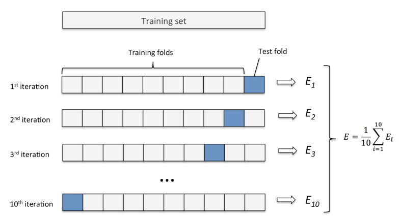

# 학습/테스트 데이터셋 분리



<br>
<br>


## 데이터셋
- ### Train 데이터셋 (훈련/학습 데이터셋)
    - 모델을 학습시킬 때 사용할 데이터셋.

<br>

- ### Validation 데이터셋 (검증 데이터셋)
    - Train set으로 학습한 모델의 성능을 측정하기 위한 데이터셋

<br>

- ### Test 데이터셋 (평가 데이터셋)
    - 모델의 성능을 최종적으로 측정하기 위한 데이터셋
    - **Test 데이터셋은 마지막에 모델의 성능을 측정하는 용도로 한번만 사용되어야 함!!**
        - 학습과 평가를 반복하다 보면 모델이 검증때 사용한 데이터셋에 과적합되어 새로운 데이터에 대한 성능이 떨어짐
        - 데이터셋을 train 세트, validation 세트, test 세트로 나눠 train 세트와 validation 세트로 모델을 최적화 한 뒤 마지막에 test 세트로 최종 평가

        <br>


        
>- 전체 데이터 X, y가 존재
>- Decision Tree라는 모델을 필요한 데이터에 맞게 fit하여 학습 후 예측

>- 전체 데이터로 train 데이터셋으로 하고 그 train 데이터 셋으로 모델을 평가한다는 의미는 문제를 푼 후에 정답을 맞추고 배운 문제를 가지고 다시 한번 평가한는 것!
>   - 학습할 때 이미 본 데이터이기 때문에 높은 정확도가 나옴 

>- 학습하지 않은 새로운 데이터를 사용해야 함
>- 새로운 데이터를 가지고 얼마만큼의 성능을 낼 것인지 확인을 해봐야하는데
나는 사실 지금은 새로운 데이터를 가지고 있지 않고 y값이 없다는 문제도 생김!
>   - 새로운 데이터에 역할을 하면서 정답(y)값도 있어야 하는 데이터가 필요
>- 지금 가진 데이터를 나누어 Train과 Test로 나눔!
>- 학습은 Train 데이터 셋으로만 이루어지고 학습할 때 사용하지 않은 Test Data는 성능을 파악할 때 사용


>- Train과 Test 데이터셋으로 나누어  
> 학습 <br>
> 예측 <br>
> 평가 (지표 : 정확도) 의 과정을 거침 <br>

>- 내가 만드는 모델은 목표한 정확도가 0.95 이상인데 평가를 해봤는데 0.85가 나옴
>   - 즉, 성능을 올려야함 
>- 데이터를 바꿀 수 없기 때문에 데이터 전처리나 하이퍼파라미터 수정 등을 통하여 학습과 예측 과정을 다시 반복!
>   - 두번째는 0.9 그럼 다시 수정해서 반복!
>   - 세번째에 0.95가 나오게 됨

>- 새로운 dataset으로 평가하고 싶은건데 이미 test set 여러번 사용, 
>   - 새로운 데이터라고 보기는 힘듦.
>- 모델을 수정하면서 test set에 맞추고 있고 이게 test/train 데이터를 나눈 목적이 없어지게 됨

>-  모델이 학습을 하는데 영향을 주지 않는 데이터여야하는데
수정을 하면서 test set의 정확도를 높이기 위해서 test set에 맞추는 경향이 생김!

>- 이 때, 수정한 모델을 평가하기 위하여 validation 데이터 셋을 만듦

  
<br>
<br>

## Hold Out
- 데이터셋을 Train set, Validation set, Test set으로 나눔

- sklearn.model_selection.train_test_split()  함수 사용



<br>

### Holdout 방식의 단점
- train/test 셋이 어떻게 나눠 지냐에 따라 결과가 달라짐
    - 데이터가 충분히 많을때는 변동성이 흡수되어 괜찮으나 수천건 정도로 적을 때는 문제가 발생 가능

- 데이테셋의 양이 적을 경우 학습을 위한 데이터 양이 너무 적어 학습이 제대로 안될 수 있음

- 운이 따를 수 있음 
    - 우연히 validation 데이터셋에 검증했을 때 결과가 잘 나오는 데이터들이 모여있을 수 있음

<br>


- **hold out 방식은 (다양한 패턴을 가진) 데이터의 양이 많을 경우에 사용**

<br>

- 코드 
    ```python
    from sklearn.datasets import load_iris
    from sklearn.model_selection import train_test_split


    X_train, X_test, y_train, y_test = train_test_split(X, y, test_size = 0.2, stratify=y, random_state=0)


    X_train, X_val, y_train, y_val = train_test_split(X_train, y_train, test_size=0.2, stratify=y_train, random_state = 0)

    ```


<br>
<br>

## K-겹 교차검증 (K-Fold Cross Validation)
- 데이터셋을 K 개로 나눈 뒤 하나를 검증세트로 나머지를 훈련세트로 하여 모델을 학습시키고 평가 
- 나뉜 K개의 데이터셋이 한번씩 검증세트가 되도록 K번 반복하여 모델을 학습시킨 뒤 나온 평가지표들을 평균내서 모델의 성능을 평가

    <br>

    

<br>

- 종류
    - K-Fold
        - 회귀문제
            - 원 데이터셋의 row 순서대로 분할하기 때문에 불균형 문제가 발생하여 분류에 적합하지 않음
    
    <br>
    
    - Stratified K-Fold
        - 분류문제
            - 나뉜 fold 들에 label들이 같은(또는 거의 같은) 비율로 구성 되도록 나눔

    <br>

    
- 코드 (KFold)
    ```python
    from sklearn.datasets import load_iris
    from sklearn.model_selection import KFold
    from sklearn.tree import DecisionTreeClassifier
    from sklearn.metrics import accuracy_score

    X, y = load_iris(return_X_y=True)

    # 데이터 분리
    # kfold = KFold(n_splits = 5) # 5개 fold로 나눠라
    kfold = KFold(n_splits = 3) # 3개 fold로 나눠라

    # KFold 객체.split(데이터셋) : argument로 전달한 데이터셋을 지정한 n_split 개수로 나눠 train/test 폴드 별 index를 제공하는 generator 반환
    kfold_gen = kfold.split(X) 
    print(type(kfold_gen)) # <class 'generator'>
    print(kfold_gen) # <generator object _BaseKFold.split at 0x000001D3A696BF90>

    #################################################
    # 교차검증
    #################################################

    # 각 fold 별로 평가한 정확도 점수를 지정할 리스트
    acc_train_list = []
    acc_test_list = []

    for train_index, test_index in kfold_gen: # index 제공
    
    # 1. generator가 제공하는 inddex를 이용해 train / test dataset 나눔
    X_train, y_train = X[train_index], y[train_index]
    X_test, y_test = X[test_index], y[test_index]
    
    # 2. 모델 새성
    tree = DecisionTreeClassifier(random_state=0)
    
    # 3. 모델 학습
    tree.fit(X_train, y_train)
    
    # 4. 모델 평기
    pred_train = tree.predict(X_train)
    pred_test = tree.predict(X_test)
    
    acc_train = accuracy_score(y_train, pred_train)
    acc_test = accuracy_score(y_test, pred_test)
    
    # 평가 결과를 list에 추가 
    acc_train_list.append(acc_train)
    acc_test_list.append(acc_test)
    
    train_acc = np.mean(acc_train_list) 
    test_acc = np.mean(acc_test_list)
    print(train_acc, test_acc)

    ```


    <br>

    - 코드 (StratifiedKFold)
    ```python
    from sklearn.datasets import load_iris
    from sklearn.model_selection import StratifiedKFold
    from sklearn.tree import DecisionTreeClassifier
    from sklearn.metrics import accuracy_score

    s_kfold = StratifiedKFold(n_splits=3) # 객체 생성 -> 몇 개의 fold로 나눌지 지정
    s_kfold_gen = s_kfold.split(X, y) # index를 반환하는 generator를 반환
    # y Label clas의 비율을 알아야 하므로 argument로 X(input), y(output)을 전달


    #################################################
    # 교차검증
    #################################################

    # 각 fold 별로 평가한 정확도 점수를 지정할 리스트
    acc_train_list = []
    acc_test_list = []

    for train_index, test_index in s_kfold_gen: # index 제공
    
    # 1. generator가 제공하는 inddex를 이용해 train / test dataset 나눔
    X_train, y_train = X[train_index], y[train_index]
    X_test, y_test = X[test_index], y[test_index]
    
    # 2. 모델 새성
    tree = DecisionTreeClassifier(random_state=0)
    
    # 3. 모델 학습
    tree.fit(X_train, y_train)
    
    # 4. 모델 평기
    pred_train = tree.predict(X_train)
    pred_test = tree.predict(X_test)
    
    acc_train = accuracy_score(y_train, pred_train)
    acc_test = accuracy_score(y_test, pred_test)
    
    # 평가 결과를 list에 추가 
    acc_train_list.append(acc_train)
    acc_test_list.append(acc_test)
    
    train_acc = np.mean(acc_train_list) 
    test_acc = np.mean(acc_test_list)
    print(train_acc, test_acc)

    ```

    <br>


    - 코드 (KFold)
    ```python
    from sklearn.model_selection import cross_val_score
    
    X, y = load_iris(return_X_y = True)

    tree = DecisionTreeClassifier(random_state = 0)

    score_list = cross_val_score(tree, # 학습시킬모델
                                X, # Feature(input data)
                                y, # Label (output data)
                                scoring = "accuracy", # 평가지표
                                cv = 3, # 몇개로 나눌지
                                n_jobs = -1 # CPU 몇 개를사용할지 지정 , -1 : 모든 CPU 사용
                                )


    # - 데이터셋을 K개로 나누고 K번 반복하면서 평가하는 작업을 처리해 주는 함수
    # - 주요매개변수
    #     - estimator: 학습할 평가모델객체
    #     - X: feature
    #     - y: label
    #     - scoring: 평가지표
    #     - cv: 나눌 개수 (K)
    # - 반환값: array - 각 반복마다의 평가점수    

    # - 위에서 진행한 교차검증을 한번에 실행시켜주는 함수
    ```
    